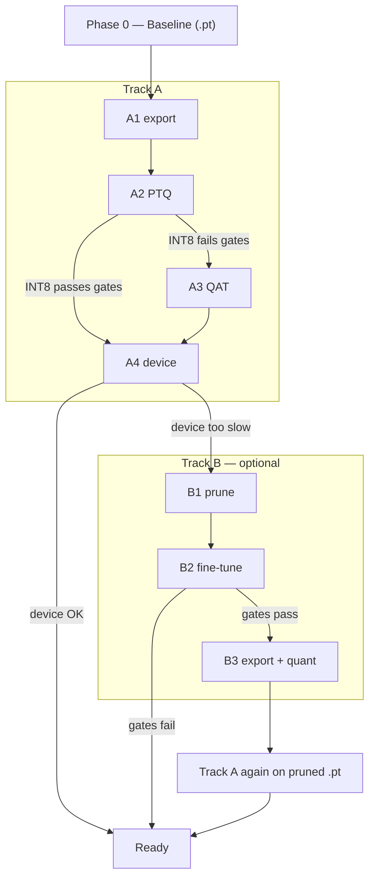

# Optimisation

This doc runs a **full DS optimisation curriculum** (prune variants, export formats, PTQ/QAT, device benches). **Production** for this project is the short path: locked `.pt` → export → INT8 PTQ → device bench — prune and QAT are included to show **when they matter**, not because this model needs them.

A “tile” = one pack image, not a full UHD frame. Code: `src/optimisation/` · config: `config/experiments/optimisation.yaml` · eval reused from `src/training/`.

Default = **full holdout eval** on every exported/quantised cell. `--skip-eval` is smoke only (bench + parity, no mAP).




---

## Prerequisites

```bash
pip install -r requirements.txt
ls checkpoints/yolo11s_prototype_best.pt
ls data/datasets/eval_manual/data.yaml
ls data/datasets/strided_clip_balanced/data.yaml
```

---

## Run — Track A (production path)

### A1 Export (~25 min all · ~3 min ONNX+OpenVINO · ~20 min TFLite)

Compatibility gate on locked `.pt`. Fail → stop, [PoC.md](PoC.md) / [EVALUATION.md](EVALUATION.md).

```bash
python src/optimisation/run_export.py
python src/optimisation/run_export.py --platform android   # TFLite only
```

→ `outputs/experiments/optimisation/export/prototype/summary.md`  
→ `checkpoints/opt/export/prototype/{onnx,openvino,tflite}/`

### A2 Quantise (~20 min all · ~3 min OpenVINO · ~15 min TFLite INT8)

PTQ: FP16 + INT8 (OpenVINO + TFLite). Summary includes **Δ vs** `ov_fp32`.

```bash
python src/optimisation/run_quantize.py
python src/optimisation/run_quantize.py --platform raspberry   # OpenVINO FP32/FP16/INT8 only
```

→ `outputs/experiments/optimisation/quantize/prototype/summary.md`  
→ ship: `checkpoints/opt/quantize/prototype/ov_int8/` (legacy: `checkpoints/opt/precision/ov_int8/`)

### A3 Quantise QAT (~2–3 h · ~20 min finetune · ~1–2 h TFLite export · ~30–60 min holdout eval; if A2 PTQ fails)

Ultralytics has no native QAT export — `run_qat.py` runs a **short recovery fine-tune** on the train pack, then INT8 re-export with **train-split** calib (~152 images vs 26 val).

```bash
python src/optimisation/run_qat.py                  # TFLite — Android (A2 tflite_int8 failed)
python src/optimisation/run_qat.py --platform android
python src/optimisation/run_qat.py --skip-finetune  # re-export and re-score, after finetune done
```

→ `outputs/experiments/optimisation/quantize_qat/prototype/summary.md`  
→ `checkpoints/yolo11s_prototype_qat.pt` · `checkpoints/opt/quantize_qat/prototype/tflite_int8_qat/`  
→ if gates pass → **A4** Android with QAT artifact; else **A1 FP32 TFLite** for A4 (A3 failed on this run)

### A4 Device validation

Quality from holdout eval (Track A1/A2/A3 on Mac). **Deploy FPS and latency from target hardware only** — Mac bench is smoke, not cited for ship decisions.

**Mac artifacts to copy** (after Track A on Mac — see A1–A3 above):


| Target | Copy to device | Path on Mac |
| ------ | -------------- | ----------- |
| Raspberry Pi | OpenVINO INT8 dir (`.xml` + `.bin`) | `checkpoints/opt/quantize/prototype/ov_int8/yolo11s_prototype_best_int8_openvino_model/` |
| Android | **`vehicle-bench.apk`** + A1 `.tflite` + **tile video** on phone (letterbox, no stretch) |
| Jetson / Colab mock | A1 `.onnx` (TRT FP16 built on GPU) | `checkpoints/opt/export/prototype/onnx/yolo11s_prototype_best.onnx` |

Legacy Pi path: `checkpoints/opt/precision/ov_int8/…` (Aug-20 run).

**Run guides** (device steps only):


| Target | Guide |
| ------ | ----- |
| Raspberry Pi 5 | [raspberry/README.md](src/optimisation/raspberry/README.md) |
| Android phone | [android/README.md](src/optimisation/android/README.md) |
| Jetson (Colab mock) | [jetson/README.md](src/optimisation/jetson/README.md) |

Record device metrics in **[Track A4 — Device validation](#track-a4--device-validation)** (Results).

---

## Run — Track B (compression lab)

Only after Track A is understood. Enter only if A4 shows device too slow **and** quality margin remains above gates.  
**Exit:** see [Where Track B ends](#where-track-b-ends) — fail → stay on prototype A2+A4; pass → rejoin Track A at A1.

### B1 Prune & B2 Fine-tune

```bash
# curriculum: 20% then 40% structured; compare unstructured at 40%
python src/optimisation/run_prune.py --methods structured --ratio 0.20
python src/optimisation/run_finetune.py --method structured
# eval in summary — repeat at 0.40 or switch method:

python src/optimisation/run_prune.py --methods structured --ratio 0.40
python src/optimisation/run_finetune.py --method structured

python src/optimisation/run_prune.py --methods unstructured --ratio 0.40
python src/optimisation/run_finetune.py --method unstructured
```

→ `outputs/experiments/optimisation/prune/{method}/`  
→ `outputs/experiments/optimisation/finetune/{method}/`

### B3 Export + quantise (if gates pass)

```bash
python src/optimisation/run_export.py --weights checkpoints/yolo11s_pruned_structured_recovered.pt
python src/optimisation/run_quantize.py --weights checkpoints/yolo11s_pruned_structured_recovered.pt
```

→ `export/pruned_structured/`, `quantize/pruned_structured/` — **does not overwrite** prototype.

### Where Track B ends

Track B is **B1 → B2 → B3**. There is no B4 — speed truth is always **Track A4** (device bench).


| Outcome after B2 eval (or B3 after export/quant)        | What to do next                                                                                                                                       |
| ------------------------------------------------------- | ----------------------------------------------------------------------------------------------------------------------------------------------------- |
| **Gates fail** (mean mAP or band-B Det below threshold) | **Stop Track B.** Do not ship pruned weights. Stay on prototype: **A2** `ov_int8` **→ A4**.                                                           |
| **Gates pass**                                          | **Rejoin Track A** on the recovered pruned `.pt`: **A1 export** → **A2 quantise PTQ** → **A4 device bench** (`export/pruned_`*, `quantize/pruned_`*). |


**This project:** B2 failed at structured 40% → Track B ended at B2. No B3. Continue from prototype **A2 → A4** only.

---

## Metrics (every cell)

**Decision:** mean A+B [mAP@0.5](mailto:mAP@0.5) ≥ 86.2% (locked − 1.5 pp) **and** band-B Det ≥ 70%.

**Real-world:** Det, P, FA/min, TTFF, TP/FP/FN per band; cold / p50 / p95 ms per tile; artifact MB; parity vs locked FP32.


| Metric                        | Use for                                    |
| ----------------------------- | ------------------------------------------ |
| Det, P, FA/min, TP/FP/FN      | Behaviour on holdout clips                 |
| cold / p50 / p95 ms, tile FPS | Local bench ≈ smoke; device = deploy truth |
| artifact MB                   | File shipped to device                     |
| parity                        | Box drift vs locked FP32                   |
| RSS                           | Optional local RAM hint                    |


---

## Results

### Phase 0 — Baseline

Teacher metrics and lock-in live in **[EVALUATION.md §6 Lock-in](EVALUATION.md#6-lock-in)**.


| Weights                                 | mean A+B [mAP@0.5](mailto:mAP@0.5) | Det A / B     |
| --------------------------------------- | ---------------------------------- | ------------- |
| `checkpoints/yolo11s_prototype_best.pt` | **87.7%** (85.6% A / 89.7% B)      | 98.0% / 92.9% |


---

### Track A1 — Export

Source: `outputs/experiments/optimisation/export/prototype/summary.md`

**All pass.** Artifacts: ONNX 36.7 MB · OpenVINO 36.6 MB · TFLite FP32 36.8 MB.

#### Decision


| cell           | mean [mAP@0.5](mailto:mAP@0.5) | A     | B     | pass? |
| -------------- | ------------------------------ | ----- | ----- | ----- |
| `.pt` (locked) | 87.7%                          | 85.6% | 89.7% | yes   |
| ONNX           | 87.4%                          | 85.2% | 89.7% | yes   |
| OpenVINO       | 87.5%                          | 85.3% | 89.7% | yes   |
| TFLite FP32    | 87.4%                          | 85.2% | 89.7% | yes   |


#### Real-world (holdout @ conf 0.25)


| cell     | Det A / B     | P A / B       | FA/min A / B | TP/FP/FN A | TP/FP/FN B |
| -------- | ------------- | ------------- | ------------ | ---------- | ---------- |
| ONNX     | 94.9% / 91.1% | 67.4% / 98.1% | 2025 / 42    | 93/45/5    | 51/1/5     |
| OpenVINO | 95.9% / 91.1% | 66.7% / 98.1% | 2115 / 42    | 94/47/4    | 51/1/5     |
| TFLite   | 94.9% / 91.1% | 67.4% / 98.1% | 2025 / 42    | 93/45/5    | 51/1/5     |


#### Speed / size (local bench, ms per tile)


| cell     | device | p50 ms | tile FPS | artifact MB |
| -------- | ------ | ------ | -------- | ----------- |
| `.pt`    | mps    | 91     | 10.9     | 18.4        |
| ONNX     | cpu    | 393    | 2.5      | 36.7        |
| OpenVINO | cpu    | 147    | 6.8      | 36.6        |
| TFLite   | cpu    | 1427   | 0.7      | 36.8        |


#### Parity vs locked FP32 (32 train tiles)


| cell     | [agreement@0.5](mailto:agreement@0.5) | mean IoU |
| -------- | ------------------------------------- | -------- |
| ONNX     | 0.923                                 | 0.958    |
| OpenVINO | 0.920                                 | 0.951    |
| TFLite   | 0.923                                 | 0.958    |


Export drift is tiny. TFLite FP32 matches ONNX on holdout and parity; local p50 is smoke only — Android A4 is deploy FPS.

---

### Track A2 — Quantise PTQ

Source: `outputs/experiments/optimisation/quantize/prototype/summary.md`

INT8 calib: `strided_clip_balanced` val (26 images — Ultralytics warns <300; OpenVINO PTQ still passes gates).

#### What PTQ changed (vs `ov_fp32`)


| cell          | Δ mean [mAP@0.5](mailto:mAP@0.5) | Δ p50 ms | Δ artifact MB | Δ parity | note                                 |
| ------------- | -------------------------------- | -------- | ------------- | -------- | ------------------------------------ |
| `ov_fp32`     | —                                | —        | —             | —        | baseline                             |
| `ov_fp16`     | 0.0 pp                           | +6       | **−18.0**     | 0.000    | same quality, half size              |
| `ov_int8`     | +0.3 pp                          | +24      | **−26.5**     | −0.021   | **ship (Pi / OpenVINO)**; FA↑ band A |
| `tflite_int8` | **−4.4 pp**                      | +370     | **−26.5**     | −0.007   | **fail gates** — B mAP collapse      |


#### Decision


| cell          | mean [mAP@0.5](mailto:mAP@0.5) | A     | B     | pass?   |
| ------------- | ------------------------------ | ----- | ----- | ------- |
| `ov_fp32`     | 87.5%                          | 85.3% | 89.7% | yes     |
| `ov_fp16`     | 87.5%                          | 85.3% | 89.7% | yes     |
| `ov_int8`     | **87.7%**                      | 84.5% | 90.9% | **yes** |
| `tflite_int8` | 83.1%                          | 85.3% | 80.9% | **no**  |


#### Real-world (holdout @ conf 0.25)


| cell          | Det A / B     | P A / B        | FA/min A / B | TP/FP/FN A | TP/FP/FN B |
| ------------- | ------------- | -------------- | ------------ | ---------- | ---------- |
| `ov_int8`     | 95.9% / 92.9% | 63.5% / 100.0% | 2430 / 0     | 94/54/4    | 52/0/4     |
| `tflite_int8` | 94.9% / 89.3% | 66.4% / 98.0%  | 2115 / 42    | 93/47/5    | 50/1/6     |


#### Speed / size (local bench)


| cell          | device | p50 ms | tile FPS | artifact MB |
| ------------- | ------ | ------ | -------- | ----------- |
| `ov_fp32`     | cpu    | 137    | 7.3      | 36.6        |
| `ov_fp16`     | cpu    | 143    | 7.0      | 18.5        |
| `ov_int8`     | cpu    | 161    | 6.2      | **10.1**    |
| `tflite_int8` | cpu    | 507    | 2.0      | 10.0        |


**Production ship (OpenVINO):** `checkpoints/opt/quantize/prototype/ov_int8/yolo11s_prototype_best_int8_openvino_model/`  
**Do not ship:** `tflite_int8` PTQ — band B 80.9% mAP. A3 QAT also **failed** (band B 42.5%) — Android: A1 FP32 TFLite for A4.

---

### Track A3 — Quantise QAT

Source: `outputs/experiments/optimisation/quantize_qat/prototype/summary.md` · wall time **~195 min** (finetune 3.2 min · TFLite export 189 min · holdout eval 51 s).

**Completed.** OpenVINO: skip (`ov_int8` PTQ passes). **TFLite QAT: fail gates** — band B collapsed vs A2 PTQ; do **not** ship.

#### vs A2 `tflite_int8` PTQ


| cell | mean [mAP@0.5](mailto:mAP@0.5) | A | B | pass? |
| ---- | ------------------------------ | - | - | ----- |
| `tflite_int8` (A2 PTQ) | 83.1% | 85.3% | 80.9% | no |
| `tflite_int8_qat` (A3) | **68.7%** | 94.9% | **42.5%** | **no** |


Recovery fine-tune + train-split calib **hurt** band B (80.9% → 42.5% mAP). Parity 0.352 vs locked FP32.

#### Decision


| cell | mean [mAP@0.5](mailto:mAP@0.5) | A | B | pass? |
| ---- | ------------------------------ | - | - | ----- |
| `tflite_int8_qat` | 68.7% | 94.9% | 42.5% | **no** |


#### Real-world (holdout @ conf 0.25)


| cell | Det A / B | P A / B | FA/min A / B | TP/FP/FN A | TP/FP/FN B |
| ---- | --------- | ------- | ------------ | ---------- | ---------- |
| `tflite_int8_qat` | 100.0% / 51.8% | 73.1% / 53.7% | 1620 / 1046 | 98/36/0 | 29/25/27 |


#### Speed / size (local bench)


| cell | device | p50 ms | tile FPS | artifact MB |
| ---- | ------ | ------ | -------- | ----------- |
| `tflite_int8_qat` | cpu | 581 | 1.7 | 10.0 |


**Do not ship:** `checkpoints/opt/quantize_qat/prototype/tflite_int8_qat/` — Android A4: **A1 FP32 TFLite** only unless you re-tune (`qat_epochs`, `qat_lr0`) and re-run.

| cell | status | note |
| ---- | ------ | ---- |
| `ov_int8_qat` | skip | A2 passes; `--platform raspberry --force` for curriculum only |
| `tflite_int8_qat` | **fail** | `python src/optimisation/run_qat.py --platform android` — completed 2026-08-26 |

---

### Track A4 — Device validation

Source: device bench JSON / Colab notebook · quality from Track A1 holdout (not re-measured on device).

#### Cross-target comparison


| target | runtime | cold ms | p50 ms | p95 ms | tile FPS | artifact MB | source |
| ------ | ------- | ------- | ------ | ------ | -------- | ----------- | ------ |
| Mac smoke `ov_int8` | OpenVINO CPU | — | 161 | — | 6.2 | 10.1 | Track A2 (not deploy) |
| Mac smoke TFLite INT8 | TFLite CPU | — | 507 | — | 2.0 | 10.0 | Track A2 (not deploy) |
| **Raspberry Pi 5** | OpenVINO CPU | _pending_ | _pending_ | _pending_ | _pending_ | ~10.1 | A4 bench |
| **Android** | TFLite CPU | 3393 | 3332 | 3378 | 0.30 | 36.8 | A4 bench, Xiaomi mt6886, 113 tiles |
| **Jetson (Colab mock)** | TensorRT FP16 | 26.2 | 22.0 | 24.8 | 45.5 | 36.7 ONNX | Colab T4, 83 eval_manual tiles |


#### Android

A1 FP32 TFLite @ 1280 · `vehicle-bench.apk` · `266987.mp4` pack tile · `pack_tile` · conf **0.25** · warmup 20 · **113** post-warmup tiles (2026-08-27, decode fix).

Device: Xiaomi 23090RA98G (mt6886, Android 16) · delegate **CPU** · log: `src/optimisation/android/logs/vehicle_bench_2026-08-27T11-24-07.091209Z.json`

Earlier CPU run (`vehicle_bench_2026-08-27T10-27-39.423013Z.json`): p50 **3311 ms** — within noise. NNAPI same video (`vehicle_bench_with_npu.json`): p50 **3297 ms** — not cited.

**Quality vs labels** (`compare_bench_to_labels.py` · band B clip `266987` · frame_step subsample · **29** scored frames where bench overlapped labeled frames — partial video, not full 64-frame eval pack):

| | A1 TFLite holdout @ 0.25 (Mac) | Android A4 @ 0.25 (label compare) |
| -- | ------------------------------ | --------------------------------- |
| Band B Det | 91.1% | **93.1%** |
| Band B P | 98.1% | **100.0%** |
| Band B FA/min | 42 | **0.0** |
| Band B mAP@0.5 | 89.7% | **90.9%** |
| TP / FP / FN (B) | 51 / 1 / 5 | **54 / 0 / 4** |

NMS IoU **0.45** in-app (same as Mac tile NMS). Overlay may show **double boxes**: green ≥ conf plus orange [0.05, conf), or nested part/whole pairs NMS does not merge (Mac holdout uses nested suppression; bench app does not). Label compare had **0 FP** — extras are visual-only on this run.

#### Jetson (Colab mock)

A1 ONNX → AutoCast mixed FP16 → TRT 11.2 (Tesla T4, 2026-08-26). Cite **pack tiles**, not dummy. Engine-only (no letterbox/NMS). Colab T4 ≠ Jetson — rebuild `.engine` on device.


| source | cold ms | p50 ms | p95 ms | tile FPS | notes |
| ------ | ------- | ------ | ------ | -------- | ----- |
| dummy zeros | 19.9 | 12.6 | 13.4 | 79.2 | kernel floor |
| **83 eval_manual tiles** | **26.2** | **22.0** | **24.8** | **45.5** | **table row** |


A1 ONNX **36.7 MB** → AutoCast **18.5 MB** (316/318 nodes FP16, 9.5 s) → engine **317.5 MB** (build 165 s). Dummy understates p50 (~13 vs 22 ms).

Mac A2 p50 (`ov_int8` 161 ms, `tflite_int8` 507 ms, both CPU) is smoke only — not deploy FPS.

---

### Track B — Prune + fine-tune (research)

**Skip for deploy.** Recorded run: structured **40%** + 5 ep fine-tune (legacy combined step before B1/B2 split).

#### Structured vs unstructured


|                            | Structured                 | Unstructured                    |
| -------------------------- | -------------------------- | ------------------------------- |
| Removes                    | Whole channels             | Individual weights              |
| Dense runtime (Pi/Android) | Can shrink graph           | Zeros ≠ speed without sparse HW |
| In production              | If device slow after quant | Research row only               |


#### B structured 40% + fine-tune (completed)

Source: `outputs/experiments/optimisation/prune/summary.md` · `checkpoints/yolo11s_pruned_recovered.pt`


| cell                 | mean [mAP@0.5](mailto:mAP@0.5) | B [mAP@0.5](mailto:mAP@0.5) | pass?  |
| -------------------- | ------------------------------ | --------------------------- | ------ |
| locked `.pt`         | 87.7%                          | 89.7%                       | yes    |
| `ov_int8` (ship)     | 87.7%                          | 90.9%                       | yes    |
| structured finetuned | **62.4%**                      | **39.7%**                   | **no** |


Band B collapsed (Det 92.9%→57.1%). p50 ≈ locked MPS — **no speed win**. Parity 0.565 vs 0.899 (`ov_int8`).

**Lesson:** aggressive one-shot prune is a negative example; curriculum should also run **20% structured** and **40% unstructured** for contrast.

#### B unstructured 40%

**Not run.** Commands in [Run — Track B](#run--track-b-compression-lab).

#### B3 export + quant on pruned weights (optional)

Only if B2 passes gates. **Skipped here** — B2 failed gates, so Track B ended before B3.

Research reruns that did run B3 confirmed failure (mean ~62–66% mAP). Summaries: `export/pruned/`, `precision/pruned/` — do not merge into Track A tables. **Next step would have been:** prototype-style **A4** on pruned INT8; never reached for deploy.

---

## Production decision (this model)

1. **Baseline** — [EVALUATION.md §6](EVALUATION.md#6-lock-in) locked prototype.
2. **Ship (Pi / OpenVINO)** — Track A: **INT8 PTQ** `ov_int8` (10.1 MB, 87.7% mean [mAP@0.5](mailto:mAP@0.5)).
3. **Android** — do **not** ship A2 `tflite_int8` PTQ (83.1% mean, B 80.9%) or A3 `tflite_int8_qat` (68.7% mean, B 42.5%); **A1 FP32 TFLite** for A4 bench.
4. **Validate speed** — Track A4 ([Results](#track-a4--device-validation)): Colab T4 **22 ms p50 / 45 tile FPS**; Android **3332 ms p50 / 0.30 tile FPS** (CPU); Pi pending.
5. **Do not ship** — Track B pruned weights; A2/A3 TFLite INT8.

