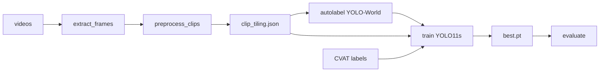

# Aerial Vehicle Detection

Single-class detector for **cars, vans, trucks, and buses** on top-down drone video.

Python 3.12 · `pip install -r requirements.txt` · clips in `data/train/` and `data/eval/`. Ultralytics weights download on first run.

## Task

Detect powered road vehicles in nadir / near-nadir drone footage. One class: `0 = vehicle`. Eval is split by inferred range (0–200 m vs 200–400 m); **decision metric** is mean A+B mAP@0.5 on held-out eval clips — finding a car matters more here than a tight bbox (that would be mAP@0.5:0.95).

### What counts as a vehicle

A **car, van, truck, or bus** (powered road unit). Two-wheelers, trailers, and other non-powered attachments are **not** vehicles.

| Label as `vehicle`                      | Do **not** label as `vehicle`                        |
| --------------------------------------- | ---------------------------------------------------- |
| Cars, SUVs, pickups, vans, taxis        | Motorcycles, scooters, mopeds                        |
| Trucks, lorries — **powered unit only** | Cyclists / bicycle riders; standalone bicycles       |
| Buses, minibuses                        | Trailers, semi-trailers, caravans (alone or hitched) |
|                                         | Pedestrians, animals, strollers, hand carts          |
|                                         | Aircraft, drones, boats, trains (out of scope)       |

If a truck tows a trailer: box the **tractor only**. Leave non-vehicles unlabeled.

### Data & operating range

| Split | Role | Notes |
| ----- | ---- | ----- |
| `data/train/` | Train clips | 4 UHD/HD clips; one far clip (`8968356…`) is skipped (median car < 32 px) |
| `data/eval/` | Held-out eval | Band A `13722965…` (~95 m) · Band B `266987` (~295 m) |

There is no altimeter on these stock clips. Range is inferred from bbox size assuming a **4.5 m** passenger-car length. Clips ≥400 m (tiny cars) are out of scope for this run.

Frames live under `data/frames/{clip}/`. Manual GT: `labels/{train|eval}/{clip}/*.txt` (YOLO txt; empty file = no vehicles).

## Docs

| Doc | What |
| --- | ---- |
| **[PoC.md](PoC.md)** | Bootstrap: preprocess, YOLO-World autolabel, first YOLO11s train/eval (autolabel GT, imgsz 640) |
| **[EVALUATION.md](EVALUATION.md)** | CVAT GT, pack / imgsz / model rounds, locked recipe |
| **[OPTIMISATION.md](OPTIMISATION.md)** | Export locked model (OpenVINO / ONNX, then FP16/INT8) on this Mac |

PoC uses autolabel boxes as GT. EVALUATION switches training and scoring to manual CVAT labels.

## Locked recipe

YOLO11s on pack `strided_clip_balanced`, letterbox **1280**, 2 ep frozen head + 5 ep full model. Manual eval: **87.7%** mean A+B mAP@0.5 (85.6% A / 89.7% B).

Weights (local, not committed): `checkpoints/yolo11s_prototype_best.pt`. Reproduce: [EVALUATION.md §6](EVALUATION.md#6-lock-in).
