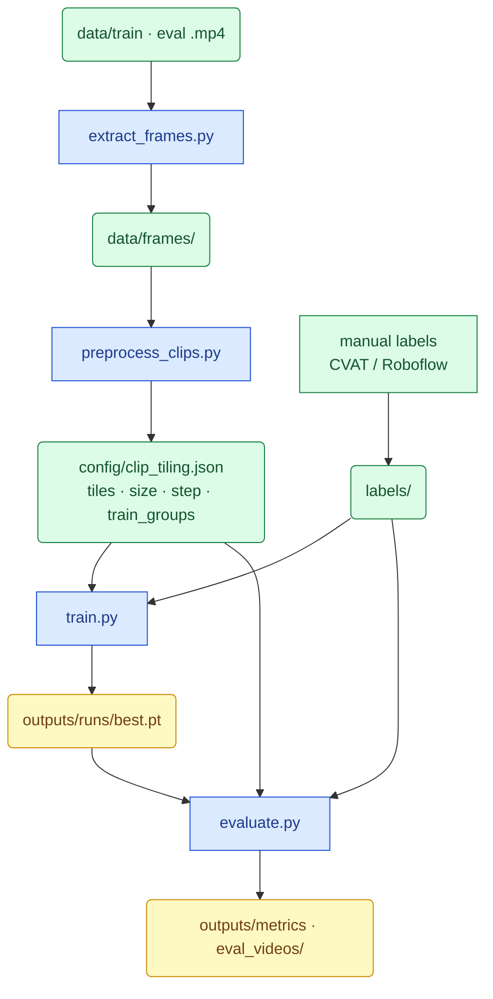

# Aerial Vehicle Detection — PoC Pipeline

End-to-end pipeline for aerial vehicle detection: preprocess (tiling/size), **manual** YOLO labels, and fine-tuning a lightweight detector. Written as a working report: what was built, why, and where the trade-offs are.

```
vehicle_detection/
├── README.md
├── requirements.txt
├── .gitignore
├── .gitattributes                  # Git LFS rules for videos
├── yolov8x-worldv2.pt              # gitignored — download locally (probe + autolabel)
├── config/
│   └── clip_tiling.json            # preprocess tiles/size/step + train_groups
├── checkpoints/
│   └── yolov8n_vehicle_best.pt     # git-tracked (≈23 MB, copied by train.py)
├── data/
│   ├── train/*.mp4                 # Git LFS
│   ├── eval/*.mp4                  # Git LFS
│   └── frames/                     # gitignored — extract_frames.py
├── labels/                         # gitignored — autolabel_yworld.py
│   ├── train/{clip}/*.txt
│   └── eval/{clip}/*.txt
├── labelling/                      # manual labeling (CVAT + Roboflow)
│   ├── cvat/                       # label_man/, coco_export/, compare_labels.py
│   └── roboflow/                   # scripts + Vehicle_roboflow/, upload packs
├── debug/                          # gitignored — preprocess, autolabel
│   ├── tile_probe.json
│   ├── preprocess_probe.json       # preprocess_clips.py report
│   ├── train_tile_samples/         # sample_train_tiles.py
│   ├── label_stats.json
│   ├── compare_labels_report.txt   # labelling/cvat/compare_labels.py
│   └── {clip}/                     # cache/, labels_debug.mp4, confidence_hist.png
├── outputs/                        # mostly gitignored
│   ├── dataset/                    # gitignored — SAHI train/val slices
│   ├── eval_videos/*_predictions.mp4  # Git LFS — evaluate.py overlays
│   ├── eval_metrics.json           # evaluate.py metrics (JSON)
│   └── metrics_table.md            # evaluate.py metrics (table)
└── src/
    ├── extract_frames.py           # 1. video → frames
    ├── preprocess_clips.py         # 2. start/mid/end car probe → clip_tiling.json
    ├── probe_clips.py              # alias → preprocess_clips.py
    ├── image_enhance.py            # optional CLAHE (--enhance) for YOLO-World experiments
    ├── sample_train_tiles.py       # optional: sample car tiles at label slice size
    ├── label_box_stats.py          # optional post-label size QA (+ legacy scale_coeff)
    ├── autolabel_yworld.py         # legacy optional pseudo-labels
    ├── aug_config.py               # HSV / flip / rotate (mosaic off); experiment presets
    ├── train.py                    # 4. fine-tune YOLO11s
    ├── evaluate.py                 # 5. metrics + prediction videos
    ├── config.py                   # paths, split map, tiling helpers
    └── detect.py                   # YOLO-World, SAHI, distance
```

**Legend:** plain paths = committed to git · `Git LFS` = large videos · `gitignored` = local only, regenerate from scripts.

---


## 1. Task

**Goal:** detect vehicles on top-down drone frames at different ranges (close / mid / far) and produce a model that can be evaluated per distance band.

**Input:** `.mp4` clips in `data/train/` and `data/eval/`.

**Output:**

- **Manual** YOLO labels (CVAT / Roboflow → `labelling/`, synced into `labels/` for train/eval)
- fine-tuned detector weights in `outputs/runs/` / `checkpoints/`
- per-band metrics in `outputs/` (after training)

**Labeling policy:** we do **not** auto-label every frame with YOLO-World anymore. GT for train/eval comes from **human labels** for the clips that matter. YOLO-World remains only as a **preprocess probe** (tiles, car size, distance drift, `frame_step`) and an optional experiment (`--enhance`).

**What counts as `vehicle` (single class `0`):** a **self-propelled unit with an engine** (самохідна одиниця з двигуном). A trailer / other non-powered attachment is **not** a vehicle.

| Label as `vehicle` | Do **not** label as `vehicle` |
| ------------------ | ----------------------------- |
| Cars, SUVs, pickups, vans | Trailers, semi-trailers, caravans (alone or hitched) |
| Trucks, lorries — **powered unit only** | Cyclists / bicycle riders (person + bicycle; no engine) |
| Buses, minibuses | Standalone bicycles |
| Motorcycles, scooters, mopeds | Pedestrians, animals, strollers, hand carts |
| Similar self-propelled road units (taxi, etc.) | Aircraft, drones, boats, trains (out of scope) |

If a truck tows a trailer: box the **tractor / powered unit only**, not the trailer. Leave non-vehicles unlabeled / treat as background.

The hard part is still the **domain gap**. Off-the-shelf models are trained mostly on ground-level imagery; here a car is a tiny top-down rectangle.

---


## 2. Pipeline overview

Blue rectangles = **scripts** (actions). Green / amber rounded = **files** (results).



**Tile sizing has two layers:** `preprocess_clips.py` (YOLO-World **probe only**) sets car size / distance / `frame_step` / suggested tiles; **`train_groups`** set **train/eval** crops. GT boxes for training come from **manual** labels in `labels/`, not from `autolabel_yworld.py`.

### How to run (defaults vs options)

Run from the repo root. For clip-scoped scripts, `NAME` is the video stem (e.g. `266987`) or a `.mp4` filename.


| Script                  | No extra args                                                                                                     | `--clip NAME` | Other useful flags                                                                                                       |
| ----------------------- | ----------------------------------------------------------------------------------------------------------------- | ------------- | ------------------------------------------------------------------------------------------------------------------------ |
| `extract_frames.py`     | All `.mp4` in `data/train/` and `data/eval/` → `data/frames/{clip}/`                                              | One clip only | —                                                                                                                        |
| `preprocess_clips.py`   | Start/middle/end car probe → `clip_tiling.json` (tiles, size, distance drift, frame_step) + `debug/preprocess_probe.json` | One clip only | `--per-segment N` (default 3); `--step-fraction 0.5`; `--enhance` (CLAHE); `probe_clips.py` is an alias |
| `sample_train_tiles.py` | Sample car tiles at label slice size → `debug/train_tile_samples/` + size summary                                 | One clip only | `--per-clip N` (default 2); needs existing `labels/`                                                                     |
| `label_box_stats.py`    | Optional post-label bbox QA (+ legacy `scale_coeff`) → `debug/label_box_stats.json` | One clip only | `--no-write-scale-coeff`; `--imgsz N`; `--target-px 64` |
| `autolabel_yworld.py`   | **Legacy / optional** — full pseudo-label pass (not the default GT path)                                          | One clip only | `--enhance` (experimental CLAHE)                                                                                         |
| `compare_labels.py`     | Compare `labelling/cvat/label_man/` vs `labels/` → console + `debug/compare_labels_report.txt`                     | One clip only | run: `python labelling/cvat/compare_labels.py`; `--iou 0.5`; `--out PATH`                                               |
| `train.py`              | Build dataset if missing, train, copy `best.pt` → `checkpoints/` | —             | `--prepare-only`; `--recreate-dataset`; `--batch N`; aug: HSV+flips+180° rotate (`aug_config.py`, mosaic off) |


Online aug (for sparse `frame_step` labels): `hsv_h/s/v`, `fliplr`/`flipud`, `degrees=180`. Mosaic is **off** in main train. Short mosaic A/B lives in local `experiments/train_aug_probe.py` (gitignored):

```bash
python experiments/train_aug_probe.py          # 1+3 epochs, mosaic=1.0
python experiments/train_aug_probe.py --epochs 5
```
| `evaluate.py`           | Eval clips per band, metrics + prediction videos                 | —             | `--no-video`; `--weights PATH`; `--clips A B`; `--conf FLOAT` |


### Wall time (Apple Silicon MPS, this PoC)

| Stage | Typical wall time | Notes |
| ----- | ----------------- | ----- |
| Legacy auto-label (`autolabel_yworld.py`, 6 clips) | **1 h 2 m 44 s** | Historical; not required when GT is manual |
| Train (`train.py`, 15 epochs) | **≈12.3 h** training loop (**≈13 h** wall) | imgsz=1280, batch=12, MPS; Ultralytics `results.csv` epoch-15 cumulative time ≈ 44390 s |
| Eval (`evaluate.py`, 2 clips + videos) | **≈7 m 17 s** | Measured 2026-07-14: ≈6.1 frame/s infer on MPS; video encode ≈1–1.5 min/clip. `--no-video` ≈ infer only (≈5 min). |

Frame extraction + preprocess are short (minutes). With **manual** labels, end-to-end is dominated by **train** (and labeling time outside this repo).

**Typical run** (manual GT):

```bash
python src/extract_frames.py
python src/preprocess_clips.py          # tiles / size / frame_step only
# put human YOLO labels into labels/{train|eval}/{clip}/*.txt
#   (from labelling/cvat/label_man or Roboflow export)
python src/train.py --recreate-dataset
python src/evaluate.py
```

**Single-clip iteration:**

```bash
python src/extract_frames.py --clip NAME
python src/preprocess_clips.py --clip NAME
# add/update manual labels under labels/.../NAME/
python src/train.py --recreate-dataset   # when ready to retrain
```

---


## 3. Preprocess: tiles, car size, distance drift, frame_step

`preprocess_clips.py` (alias: `probe_clips.py`) runs after frame extraction and before labeling. One pass writes everything needed for tiling / labeling density into `config/clip_tiling.json`.

### How it works

1. Sample **3 frames from start, 3 from middle, 3 from end** (evenly spaced inside each third of the clip).
2. Try tile candidates: `1 → 2 → 3 → 4 → 6 → 8 → 12`. Stop at the **first** level with a **car** hit (`person` counts as `car` during preprocess only — **not** truck/bus/bike). That hit is `probe_min_tiles`.
3. Set `target_tiles` to the **next** candidate (+1 headroom). Threshold and overlap follow `target_tiles`.
4. Detail pass at `target_tiles`: collect **car-only** long-side sizes and distances on all 9 frames; aggregate **per segment** (start / middle / end).
5. Flag `distance_varies` if segment **bands differ** or start↔end car size changes by ≥30%.
6. Estimate motion: for each probe frame with cars, detect the **next consecutive** frame and match boxes (IoU ≥ 0.3) → `speed_px_per_frame`.
7. `frame_step = floor(object_size_px_median × 0.5 / speed)` (min 1). Also suggests `train_groups` band from size (`C_far` &lt;32 px, `B_medium` &lt;80 px, else `A_close`).

Writes per clip into `config/clip_tiling.json`: `target_tiles`, `probe_min_tiles`, overlap, threshold, `distance_m` / band, **`distance_varies`**, **`distance_by_segment`**, **`object_size_px_*`**, **`speed_px_per_frame_median`**, **`frame_step`** (+ `frame_step_fraction`), **`suggested_train_group`**, `frames_probed_by_segment`. Report: `debug/preprocess_probe.json`.

If no tile level finds a car: **fallback** to 12 tiles @ threshold 0.1.

Why headroom: the ladder stops when the **largest** car is visible. Smaller/farther cars often need the next tile step.

`label_box_stats.py` remains an **optional post-label QA** (all vehicle boxes after full autolabel); it is no longer required to decide tiles / step / size for preprocess.

### Distance

Pinhole model with **assumed passenger-car length (4.5 m)** — only detections tagged `car` or `person` (→ car):

```
distance_m = 4.5 m × focal_px / bbox_long_side_px
```

- `focal_px` from inferred camera model (resolution tier → sensor size, 24 mm focal default — common for DJI)
- Optional per-clip override: `calibration/{clip_name}.json`

Clip-level `distance_m` still comes from the **largest** car among probe hits; segments expose how range changes along the video.

### Tiles

More tiles → smaller slices → larger objects per tile. Far / small cars need more tiles.


| Tiles | Typical band | Overlap |
| ----- | ------------ | ------- |
| 1     | <200 m       | 0       |
| 2–7   | >200 m       | 0.10    |
| ≥8    | >400 m       | 0.05    |


### Confidence threshold

```
tiles = 1   →  0.50
tiles > 1   →  max(0.05, 0.50 / tiles)
```

Examples: 2 tiles → 0.25, 3 → 0.1667, 4 → 0.125, 12 → 0.05 (floor). Applied to `target_tiles` (after headroom).

### Probe-only alias

YOLO-World often tags top-down cars as `person` (known COCO quirk). During **preprocess only**, `person → car` is accepted for tile search, size, and the 4.5 m distance estimate. At autolabel time all vehicle types (`truck`, `bus`, …) are detected, but preprocess size/distance/step still come from **car** only.

### Preprocess results per clip (legacy table from 2026-07-13 middle-only probe)

Re-run `python src/preprocess_clips.py` to refresh sizes / `frame_step` / `distance_varies` with the start–middle–end sampler. Older values:


| Split | Clip                          | Probe min | Label tiles | Threshold | Est. distance (probe) | Band   |
| ----- | ----------------------------- | --------- | ----------- | --------- | --------------------- | ------ |
| eval  | `13722965_2160_3840_30fps`    | 1         | 2           | 0.25      | ≈118 m                | <200 m |
| eval  | `266987` *                    | 2         | 3           | 0.1667    | ≈379 m                | >200 m |
| train | `3405804-uhd_3840_2160_30fps` | 1         | 2           | 0.25      | ≈134 m                | <200 m |
| train | `8457857-uhd_3840_2160_24fps` | 1         | 2           | 0.25      | ≈203 m                | >200 m |
| train | `8968356-hd_1920_1080_30fps`  | 2         | 3           | 0.1667    | ≈371 m                | >200 m |
| train | `5382494-uhd_3840_2160_24fps` | 2         | 3           | 0.1667    | ≈729 m                | >400 m |


 `266987.mp4` added to eval manually — original spec had only one eval clip at <200 m.

### Sample tiles at label size

After preprocess (and once labels exist), inspect what cars look like at the labeling slice size:

```bash
python src/sample_train_tiles.py
```

Writes a few car tiles per clip under `debug/train_tile_samples/` and a `manifest.json` with per-clip `slice_size` plus mean / suggested shared tile side — useful when deciding whether 1080p-far and 4K-mid tiles are close enough to share one train `imgsz`.

---


## 5. Why YOLO-World (preprocess probe only)

YOLO-World (`yolov8x-worldv2.pt`) is **not** the source of training GT anymore. It is used in `preprocess_clips.py` to estimate tiles / car size / distance / `frame_step` on a handful of frames (start–middle–end).

`autolabel_yworld.py` (full-clip pseudo-labels) is kept as **legacy / optional** for experiments and old comparisons — default training assumes **manual** boxes in `labels/`.

**Caveat if you still run autolabel:** quality on top-down drone footage is limited; treat outputs as noisy suggestions, not GT.

---


## 6. Labeling workflow (manual GT)

**Default path:** human labels (CVAT under `labelling/cvat/label_man/`, Roboflow under `labelling/roboflow/`, etc.) exported as YOLO `class xc yc w h`, then placed at:

```
labels/{train|eval}/{clip}/{frame_stem}.txt
```

matching `data/frames/{clip}/{frame_stem}.jpg`. Use `frame_step` from preprocess as a guide for how densely to annotate; empty `.txt` = no vehicles on that frame.

`train.py` / `evaluate.py` read **`labels/`** only — keep that tree in sync with your manual exports.

### Legacy: `autolabel_yworld.py` (optional)

Full-clip YOLO-World pass with SAHI / ByteTrack and track post-processing. Historical runtime on 6 clips: **~1 h** (MPS). Outputs under `labels/` and `debug/{clip}/`. Prefer manual GT for training; use this only for ablation or bootstrap.

### Outputs (either source)


| Path                               | Content                          |
| ---------------------------------- | -------------------------------- |
| `labels/{split}/{clip}/*.txt`      | YOLO format, class `0` (train/eval GT) |
| `labelling/cvat/label_man/`        | CVAT exports (source of truth for manual) |
| `debug/{clip}/…`                   | Only if legacy autolabel / debug video ran |


### Historical auto-label counts (legacy)

After the old full `autolabel_yworld.py` pass (not required now):


| Split | Clips | Labeled frames |
| ----- | ----- | -------------- |
| train | 4     | ≈2465          |
| eval  | 2     | ≈1830          |


### Mean object size per video (after labeling)

From `label_box_stats.py` → `debug/label_box_stats.json` (2026-07-13 labels).  
**Size** = long side of the bbox in **full-frame pixels**: `max(w, h)` after converting YOLO-normalized boxes to the original frame resolution.

| Split | Video | Resolution | Boxes | Mean size (px) | Median (p50) |
| ----- | ----- | ---------- | ----: | -------------: | -----------: |
| train | `3405804-uhd_3840_2160_30fps` | 3840×2160 | 16638 | **152.2** | 137.2 |
| train | `5382494-uhd_3840_2160_24fps` | 3840×2160 | 5284 | **64.8** | 53.1 |
| train | `8457857-uhd_3840_2160_24fps` | 3840×2160 | 11173 | **161.3** | 107.6 |
| train | `8968356-hd_1920_1080_30fps` | 1920×1080 | 9378 | **22.2** | 17.2 |
| eval | `13722965_2160_3840_30fps` | 2160×3840 | 2996 | **347.7** | 368.8 |
| eval | `266987` | 2160×3840 | 863 | **135.0** | 133.2 |

Train aggregate mean ≈ **115 px**; eval aggregate mean ≈ **300 px**. Far/HD clip `8968356` is the smallest (~22 px); close eval `13722965` is the largest (~348 px). Recompute anytime with:

```bash
python src/label_box_stats.py --no-write-scale-coeff
```

### Suggested label `frame_step` (per clip)

Computed by **`preprocess_clips.py`** (car-only size + consecutive-frame speed) and stored on each clip in `clip_tiling.json` as `frame_step`:

\[
\texttt{frame\_step} = \left\lfloor \frac{\texttt{object\_size\_px} \times \texttt{fraction}}{\texttt{speed\_px\_per\_frame}} \right\rfloor
\quad (\min 1,\ \texttt{fraction}=0.5)
\]

- `object_size_px` — median **car** long side from start/middle/end probe hits  
- `speed_px_per_frame` — median centroid shift of IoU-matched cars between a probe frame and the next extracted frame  

Historical table (from full autolabels, before preprocess wrote `frame_step`):

| Split | Clip | fps | size_med (px) | speed_med (px/frame) | step @0.25 | **@0.5** | @1.0 |
| ----- | ---- | --: | ------------: | -------------------: | ---------: | -------: | ---: |
| train | `3405804-uhd_3840_2160_30fps` | 30 | 137.2 | 3.8 | 9 | **18** | 36 |
| train | `5382494-uhd_3840_2160_24fps` | 24 | 53.1 | 2.8 | 4 | **9** | 18 |
| train | `8457857-uhd_3840_2160_24fps` | 24 | 107.6 | 9.5 | 2 | **5** | 11 |
| train | `8968356-hd_1920_1080_30fps` | 30 | 17.2 | 3.3 | 1 | **2** | 5 |
| eval | `13722965_2160_3840_30fps` | 30 | 368.7 | 9.4 | 9 | **19** | 39 |
| eval | `266987` | 30 | 133.3 | 18.3 | 1 | **3** | 7 |

Recompute with: `python src/preprocess_clips.py`. Pipeline still extracts/labels every frame by default; `frame_step` guides thinner manual labeling or future subsampled extract.

### Manual QA (CVAT + Roboflow) vs autolabel

#### Unusable train video: `8968356-hd_1920_1080_30fps`

This HD clip (1920×1080) is **not usable for normal full-frame YOLO training**. Cars are too small on screen: autolabel mean long-side ≈ **22 px**; after letterbox to imgsz 640 they shrink further (~5–10 px). YOLO needs roughly **≳16–32 px** at model input (comfortable **≳32–64 px**).

**Tiling does not fix missing pixels.** A crop + upsample (e.g. `C_far`: 640-tile → imgsz 960) only changes how large the blob appears at the model input (~18 px → ~27 px). It does **not** invent wheels/edges that were never resolved in the original ~15–20 px car. So tiling avoids the worst full-frame *downsampling*, but for `8968356` the native object resolution is still too low — treat the clip as **unusable**, not “saveable with tiles.”

**Frame `000001` autolabel size — every clip** (long side = `max(w,h)` in full-frame pixels; `@640` = same after letterbox scale `640/max(W,H)`):

| Split | Clip | Res | Boxes | Min–max (px) | Median (px) | @640 median | Full-frame train? |
| ----- | ---- | --- | ----: | ------------ | ----------: | ----------: | ----------------- |
| train | `3405804…` | 3840×2160 | 18 | 74–307 | **175** | 29 | OK |
| train | `8457857…` | 3840×2160 | 11 | 103–507 | **272** | 45 | OK |
| train | `5382494…` | 3840×2160 | 5 | 30–81 | **59** | **10** | needs tiling (`B_medium`) |
| train | `8968356…` | 1920×1080 | 14 | 14–23 | **18** | **6** | **unusable** (even with care) |
| eval | `13722965…` | 2160×3840 | 5 | 152–546 | **370** | 62 | OK |
| eval | `266987` | 2160×3840 | 1 | 159 | **159** | 27 | OK |

Only `8968356` has all boxes under 32 px on the native frame. `5382494` looks OK on 4K but collapses under letterbox to 640 — hence tile training, not full-frame.

#### Roboflow: 1 frame labeled

`labelling/roboflow/Vehicle_roboflow/` is a Roboflow export of **frame `000001`** from `8968356-hd_1920_1080_30fps` (exact pixel match to `data/frames/.../000001.jpg`). Export must be **YOLO Object Detection** (`class xc yc w h`), not OBB/segmentation.

Same frame’s **autolabel** (`labels/train/8968356-hd_1920_1080_30fps/000001.txt`) shows the **same tiny size regime** — so this is not a Roboflow-only artifact:

| Source (frame `000001`, 1920×1080) | Boxes | Long side (px) | Median long | After letterbox → 640 |
| --------------------------------- | ----: | -------------- | ----------: | --------------------: |
| Roboflow (manual) | **42** | 7–23 | **≈14.5** | median ≈ **4.8 px** |
| Autolabel (YOLO-World) | **14** | 14–23 | **≈17.5** | median ≈ **5.8 px** |

Autolabel finds fewer cars (14 vs 42) but the ones it keeps are equally small — none reach 32 px on the full frame. Both confirm the clip is too far/small for full-frame train.

#### CVAT: `labelling/cvat/label_man/` (3 clips)

Manual YOLO labels from CVAT:

| Split | Clip | Manual folder |
| ----- | ---- | ------------- |
| **eval** | `13722965_2160_3840_30fps` | `labelling/cvat/label_man/.../obj_Test_data/` |
| **eval** | `266987` | `labelling/cvat/label_man/.../obj_Test_data/` |
| **train** | `8457857-uhd_3840_2160_24fps` | `labelling/cvat/label_man/.../obj_Train_data/` |

#### Autolabel vs manual (IoU ≥ 0.5)

Manual = GT, auto = pred. Greedy best-IoU matching. Regenerated with:

```bash
python labelling/cvat/compare_labels.py
# → debug/compare_labels_report.txt
```

**Eval** (2 clips)

| Clip | Frames | Manual boxes | Auto boxes | Δ (auto−man) | Mean IoU | Precision | Recall |
| ---- | -----: | -----------: | ---------: | -----------: | -------: | --------: | -----: |
| `13722965…` (~118 m) | 918 | 2306 | 2996 | **+690** | 0.887 | 74.8% | **97.2%** |
| `266987` (~379 m) | 912 | 939 | 863 | −76 | 0.804 | **87.6%** | 80.5% |
| **eval total** | **1830** | **3245** | **3859** | **+614** | — | **77.7%** | **92.4%** |

**Train** (1 clip labeled by hand)

| Clip | Frames | Manual boxes | Auto boxes | Δ (auto−man) | Mean IoU | Precision | Recall |
| ---- | -----: | -----------: | ---------: | -----------: | -------: | --------: | -----: |
| `8457857…` (~203 m) | 405 | 8220 | 11173 | **+2953** | 0.715 | **56.2%** | 76.4% |

**How to read this**

- **Eval:** autolabel is usable as a stand-in. Close clip almost never misses cars (97% recall) but adds FPs (~30% extra boxes). Mid/sparse clip is cleaner on precision; modest miss rate.
- **Train (`8457857`):** larger gap — auto over-labels densely (**+36%** boxes, precision only **56%**). Matched-box geometry is still OK (mean IoU ≈0.72), so the main noise is **false positives**, not bad box shape.
- Prefer training on CVAT labels where they exist; for remaining train clips, expect similar FP inflation on busy scenes.

---


## 7. Training

`train.py` fine-tunes **YOLO11s** on **manual** labels in `labels/` (YOLO `vehicle` class) with **staged** head-then-full fine-tuning.


| Setting     | Value                                                                              |
| ----------- | ---------------------------------------------------------------------------------- |
| Base model  | `yolo11s.pt`                                                                       |
| Epochs      | Stage1 warmup 5 (frozen backbone) + Stage2 ~20 (full, lower LR); early-stop patience |
| YOLO imgsz  | **640** default model input (`--imgsz`); C_far predict prefers **960**             |
| Train crop  | **Per-group** `tile_size` from `train_groups` in `clip_tiling.json` (from object size) |
| Negatives   | Train: up to 2 empty tiles/frame; val: labeled tiles only                          |
| Augment     | HSV + fliplr/flipud + degrees=180 (`src/aug_config.py`); **mosaic off** (see `experiments/`) |
| Class       | `vehicle` (single class)                                                           |
| Weights     | `outputs/runs/yolo11s_vehicle/.../best.pt` → `checkpoints/yolo11s_vehicle_best.pt` |


### Train groups (object-size banding)

Crops are **not** from the old `scale_coeff` formula. They come from explicit groups tuned to mean object size after labeling:

| Group | Videos | tile_size | overlap | train_imgsz | Why |
| ----- | ------ | --------: | ------: | ----------: | --- |
| `C_far` | `8968356` | **640** | 0.20 | **960** | tiny (~22 px) → tile + upsample |
| `B_medium` | `5382494` | **960** | 0.18 | **640** | mid (~65 px) → tile then down to 640 |
| `A_close` | `266987`, `3405804`, `8457857`, `13722965` | **null** (full frame) | — | **640** | large cars → letterbox full frame |

Approx object long-side **at model input** with this scheme: ~33 px (far), ~43 px (medium), ~40–48 px (close train), ~103 px (very close eval).

One Ultralytics run uses a **single** `--imgsz` (default **640**). Group `train_imgsz` is used at **eval/predict** time (so C_far still predicts at 960). Rebuild the dataset after changing groups:

```bash
python -u src/train.py --recreate-dataset
python src/train.py --prepare-only
```

**Train / val / eval alignment**


| Stage                            | Input                                                                 |
| -------------------------------- | --------------------------------------------------------------------- |
| Train (`train.py`)               | group tile (or full frame) → letterbox to `--imgsz` (default 640)     |
| Val (`train.py`)                 | **holdout from train videos** (default 15% frames/clip); eval clips excluded |
| Reported metrics (`evaluate.py`) | **eval clips only**; same group tiling → merge to full frame          |


```bash
python -u src/train.py                    # reuse dataset; auto batch/cache for MPS
python -u src/train.py --recreate-dataset # rebuild tiles + train
python src/train.py --prepare-only        # dataset only
```

On Apple Silicon, `train.py` applies an MPS `unique()` workaround, uses `cache=disk`, modest dataloader workers, and auto batch (e.g. 4 @640 on 16GB for YOLO11s). If MPS OOMs it halves batch and retries.

---


## 8. Evaluation & metrics

`evaluate.py` compares the fine-tuned detector against GT in `labels/eval/` (**manual** labels preferred), **one clip per distance band**.

**Inference:** each frame uses the clip’s **`train_groups` tiling** (or full frame for `A_close`), run at the group’s **`train_imgsz`** (640, or 960 for `C_far`), detections mapped to full-frame coordinates, NMS-merged, matched at IoU 0.5.


Each eval video is treated as a **single fixed band** from probe (`clip_tiling.json`) — e.g. the whole `13722965…` clip is 0–200 m, the whole `266987` clip is 200–400 m. Metrics do **not** recompute distance per frame or per car.

**Reference clips:**


| Band      | Clip                       | Probe band |
| --------- | -------------------------- | ---------- |
| 0–200 m   | `13722965_2160_3840_30fps` | <200 m     |
| 200–400 m | `266987` *(see §3)*        | >200 m     |


Matching at IoU 0.5. With manual GT, metrics measure real detector quality. Historical numbers below used YOLO-World pseudo-labels as GT — treat them as agreement-with-autolabel, not absolute accuracy.

**Prediction videos:** for each eval clip, `evaluate.py` writes an overlay to `outputs/eval_videos/{clip}_predictions.mp4` (**Git LFS**, committed with the repo). Metrics use only labeled frames; the video runs over all extracted frames. See **§2** for `--no-video`, `--weights`, `--clips`, `--conf`.

```bash
python src/evaluate.py              # metrics + videos (default clips & weights)
python src/evaluate.py --no-video   # metrics only, faster
```

**Runtime:** measured **7 m 17 s** wall for the two default clips with prediction videos (MPS, 2026-07-14): ≈**6.1 frame/s** infer each; video writing ≈53 s / ≈85 s. Without videos (`--no-video`) expect roughly the infer total (≈5 min). Timer output is also in `outputs/eval_metrics.json` → `timing`.

Offline PoC eval staying in the **minutes** range is fine vs ≈13 h train. For a **live drone**, ≈6 frame/s tiled @1280 is **not** real-time 30 fps — you’d need smaller imgsz, fewer tiles, or a faster device/model.


### Results

Fine-tuned `yolov8n_vehicle` on Apple Silicon (MPS), **2026-07-14**. Train/eval use per-clip `scale_coeff` crops → **imgsz=1280** (see §7).


| Metric                      | 0–200 m | 200–400 m |
| --------------------------- | ------- | --------- |
| Detection rate TP/(TP+FN)   | **65.6%** | **42.4%** |
| Precision TP/(TP+FP)        | **64.5%** | **84.3%** |
| False alarms / min          | 2119.61 | 202.31    |
| Time to first detection (s) | 0.03    | 0.03      |
| mAP@0.5                     | **51.3%** | **42.5%** |


**How to read this**

- **Detection rate (recall):** share of GT cars we find. Close band (≈118 m) is strongest - cars are large on screen. Mid band (≈379 m) is harder; ≈42% recall was solid for small aerial objects with a nano model under the old pseudo-GT.
- **Precision:** share of predictions that match a GT box. Mid band is cleaner (84%); close band has more FPs (duplicates on overlapping tiles + busy scene).
- **mAP@0.5:** ranking quality over confidence thresholds — ≈50% / ≈43% means the model ranks true cars well, not only at one conf cutoff.
- **False alarms/min:** high on 0–200 m in absolute terms (dense traffic + tile overlap); further NMS / conf tuning can cut this without killing recall.
- **Time to first det:** first TP almost immediately on both clips — useful for “alert as soon as a vehicle appears” demos.

**Caveat (historical table):** those metrics used YOLO-World pseudo-labels as GT. After switching to manual labels, re-run `evaluate.py` — absolute numbers will change.

Full report: `outputs/metrics_table.md`, `outputs/eval_metrics.json`. Prediction overlays: `outputs/eval_videos/`.

## 9. Ideas for improvement

- **CLAHE A/B (`--enhance`)** — Optional contrast boost before YOLO-World (`src/image_enhance.py`). Off by default. Compare preprocess/autolabel with vs without on one clip before adopting.
- **Cut close-band false alarms** — Stronger tile NMS, slightly higher conf on `<200m`, or suppress duplicate boxes across overlap.
- **Confirmed-only train tiles** — Keep empty tiles (negatives) and tiles where every label is confirmed via cache confidence + stable track; drop borderline / slice-boundary boxes.
- **Confidence-weighted training** — Keep uncertain tiles but down-weight loss by confidence / track metadata instead of dropping them.

