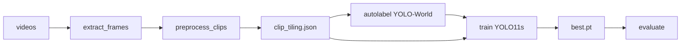

# Aerial Vehicle Detection

PoC: detect vehicles on top-down drone video — **config → autolabel → train YOLO11s → evaluate**.

Experiments, ablations, and manual-label QA → **[GUIDELINE.md](GUIDELINE.md)**.

## What counts as a vehicle

Single class `0 = vehicle`: a **self-propelled unit with an engine**. Trailers and other non-powered attachments are **not** vehicles.

| Label as `vehicle` | Do **not** label as `vehicle` |
| ------------------ | ----------------------------- |
| Cars, SUVs, pickups, vans | Trailers, semi-trailers, caravans (alone or hitched) |
| Trucks, lorries — **powered unit only** | Cyclists / bicycle riders (person + bicycle; no engine) |
| Buses, minibuses | Standalone bicycles |
| Motorcycles, scooters, mopeds | Pedestrians, animals, strollers, hand carts |
| Similar self-propelled road units (taxi, etc.) | Aircraft, drones, boats, trains (out of scope) |

If a truck tows a trailer: box the **tractor only**. Leave non-vehicles unlabeled.

Autolabel prompts follow the same rule (no trailer / bike / pedestrian prompts).

## Setup

```bash
python3 -m venv .venv && source .venv/bin/activate
pip install -r requirements.txt
```

Python **3.12**. Run from the repo root.

## Pipeline



| Step | Command |
| ---- | ------- |
| 1. Frames | `python src/data/extract_frames.py` |
| 2. Config | `python src/data/preprocess_clips.py` → `config/clip_tiling.json` |
| 3. Autolabel | `python src/labeling/autolabel.py` → `outputs/autolabel/` |
| 4. Dataset | `python src/training/prepare_baseline.py --from-autolabel` → `data/datasets/baseline_v0/` |
| 4b. Eval pack (optional, once) | `python src/training/prepare_eval.py --from-autolabel` → `data/datasets/eval_autolabel/` |
| 5. Train | `python -u src/training/train.py --dataset-dir data/datasets/baseline_v0 --prototype` |
| 6. Eval | `python src/training/evaluate.py` |

Single clip: add `--clip NAME` where supported.

## Where things are saved

| Artifact | Path |
| -------- | ---- |
| Source videos | `data/train/*.mp4`, `data/eval/*.mp4` |
| Extracted frames | `data/frames/{clip}/*.jpg` (+ `metadata.json`) |
| Preprocess config | `config/clip_tiling.json` |
| Preprocess probe report | `debug/preprocess_probe.json` |
| Autolabel YOLO txt | `outputs/autolabel/labels/{train\|eval}/{clip}/*.txt` |
| Autolabel images / debug | `outputs/autolabel/` (+ `debug/label_stats.json`) |
| Dataset packs | `data/datasets/baseline_v0/`, `eval_autolabel/`, `eval_autolabel_adapted/` |
| Train runs | `outputs/runs/…/weights/best.pt` |
| Deliverable weights | `checkpoints/` (copy when ready) |
| Eval metrics | `outputs/eval_autolabel/`, `outputs/eval_autolabel_adapted/` |

Manual / CVAT paths → **[GUIDELINE.md](GUIDELINE.md)**.

---

## 1. Config generation (`clip_tiling.json`)

`python src/data/preprocess_clips.py` (alias: `probe_clips.py`) probes each clip with **YOLO-World** and writes `config/clip_tiling.json`. Autolabel, train, and eval all read that file (tiles, `frame_step`, distance band, skip).

### How it works

1. Sample **3 frames from start, middle, end** of each clip (9 frames total).
2. Try tile candidates `1 → 2 → 3 → 4 → 6 → 8 → 12`. First **car** hit (`person` → car during probe only) = `probe_min_tiles`.
3. `target_tiles` = next candidate (+1 headroom). Threshold / overlap follow `target_tiles`.
4. Detail pass: car-only sizes & distances per segment; `distance_varies` if bands differ or start↔end size changes ≥30%.
5. Motion: match cars on consecutive frames → `speed_px_per_frame`.
6. `frame_step = floor(object_size_px_median × 0.5 / speed)` (min 1). Suggests `train_groups` from size.

Fallback if no car: **12 tiles** @ threshold 0.1.

### Distance (metres from a standard car)

There is no altimeter on these stock clips. Range is inferred from **bbox size** under a pinhole camera, assuming a **standard passenger-car length of 4.5 m** (the long side of the box ≈ that length in top-down view):

```
distance_m = 4.5 m × focal_px / bbox_long_side_px
```

`focal_px` comes from an assumed **24 mm** lens. Sensor defaults: 1-inch (4K / 1080p) or 1/2.3″ (SD). Override per clip with `calibration/{clip}.json` (`focal_length_mm`, sensor size, or `vertical_fov_deg`).

Clip-level `distance_m` is the **largest** probed car (else the median of all car boxes). That value is then binned:

| `distance_m` | Stored band | Eval column |
| -----------: | ----------- | ----------- |
| &lt; 200 | `<200m` | **0–200 m** |
| 200–400 | `>200m` | **200–400 m** |
| ≥ 400 | `>400m` | (no eval clip in this PoC) |

So the 200 m / 400 m cuts are **not** GPS altitude — they are “how far would this box be if it were a 4.5 m car.” Eval uses one clip per band (`13722965…` ≈ 95 m, `266987` ≈ 295 m).

### Tiles & confidence

| Tiles | Typical band | Overlap |
| ----- | ------------ | ------- |
| 1     | &lt;200 m    | 0       |
| 2–7   | &gt;200 m    | 0.10    |
| ≥8    | &gt;400 m    | 0.05    |

```
tiles = 1   →  conf 0.50
tiles > 1   →  conf max(0.05, 0.50 / tiles)
```

Autolabel uses these `target_tiles` / overlap / conf. Train/eval crops use `train_groups` (object-size bands), not the probe tile count:

| Median car long-side | Group | Crop |
| -------------------- | ----- | ---- |
| ≥ 80 px | `A_close` | full frame, letterbox to 1024 |
| 32–80 px | `B_medium` | tile 1024 @ 0.2 overlap |
| &lt; 32 px | `C_far` | skipped (`MIN_USABLE_OBJECT_PX`) |

### Probe-only alias

During **preprocess only**, `person → car` for tile search / size / distance (aerial YOLO-World often tags top-down cars as people). Autolabel does **not** use that alias — it uses vehicle text prompts.

```bash
python src/data/preprocess_clips.py
```

Rough object sizes from preprocess (also drive `frame_step` and the skip):

| Clip (short) | Median px | Typical `frame_step` | Band |
| ------------ | --------: | -------------------: | ---- |
| `13722965…` (eval, close) | ~369 | 19 | 0–200 m |
| `3405804…` | ~137 | 18 | &lt;200 m |
| `266987` (eval, mid) | ~133 | 3 | 200–400 m |
| `8457857…` | ~108 | 5 | &lt;200 m |
| `5382494…` | ~53 | 9–14 | &lt;200 m |
| `8968356…` (**skipped**) | ~17 | — | — |

### Rejected video (decision after probe)

Preprocess **always probes every clip**. If median car size is **&lt; 32 px** (`MIN_USABLE_OBJECT_PX`), it writes `"skip": true` into `clip_tiling.json`. Downstream steps (autolabel / train / eval) then honor that flag.

**Why we skip instead of training a far band:** under limited PoC time we do not want to spend labeling and training budget on a domain that matches **neither** the rest of train nor eval. Clip **`8968356-hd_1920_1080_30fps`** (~17 px on 1080p) is that case — tiny blobs, different scale from close/mid clips, and tiling cannot invent missing pixels. Far group `C_far` stays empty on purpose. Force a skipped clip later with `--include-skipped` on autolabel/train if needed.

---

## 2. Autolabel (YOLO-World)

### Why YOLO-World

Open-vocabulary detector (`yolov8x-worldv2.pt`) with **vehicle text prompts** (car, truck, bus, … — no trailers / bikes / pedestrians). It fits this PoC because:

1. **Same model** already drives preprocess (tiles / size / `frame_step`).
2. No labeled data needed up front — bootstrap boxes for every `frame_step` frame.
3. Single class `0 = vehicle` after collapsing prompts.

Output: `outputs/autolabel/` (labels + images). Used as training labels for this PoC.

```bash
python src/labeling/autolabel.py                  # all non-skipped clips
python src/labeling/autolabel.py --clip 266987   # one clip
```

Example wall time (full run): **Done in 10m 45s.** Stats: `outputs/autolabel/debug/label_stats.json`.

---

## 3. Train YOLO11s & metrics

Fine-tune **YOLO11s** (`yolo11s.pt`) in two stages. Crops follow `train_groups` in `clip_tiling.json` (letterbox to `train_imgsz`, typically 1024). Aug: HSV + flips + degrees=180; mosaic off for the main run.

| Stage | What trains | Default (full) | `--prototype` (fast PoC) |
| ----- | ----------- | -------------: | -----------------------: |
| 1 | Detect **head** only (backbone frozen, `freeze=11`) | 5 epochs | **2** epochs |
| 2 | **Full model** (backbone + head unfrozen, lower LR) | 20 epochs | **5** epochs |
| | Early-stop patience on val | 7 | **3** |

PoC uses `--prototype`: short run, but Stage 2 still fine-tunes the **backbone**.

**PoC path (autolabel):**

```bash
python src/training/prepare_baseline.py --from-autolabel   # → data/datasets/baseline_v0/
python -u src/training/train.py --dataset-dir data/datasets/baseline_v0 --prototype
# runs → outputs/runs/yolo11s_vehicle_stage1/ then …/yolo11s_vehicle/
# best → outputs/runs/yolo11s_vehicle/weights/best.pt (also copied to checkpoints/)
```

Override any schedule piece with `--warmup-epochs`, `--epochs`, `--patience` (omit `--prototype` for the longer 5+20 default).

`prepare_baseline.py` tiles with `frame_step` + `train_groups`, no prepare-time balance/rotations.

### Prototype run (2026-08-12, MPS M1 Pro)

Command: `--dataset-dir data/datasets/baseline_v0 --prototype`  
Pack: 403 train / 71 val images (holdout from train videos; autolabel GT), imgsz 1024, batch 8.

| Stage | Wall time | Val (best / end) |
| ----- | --------: | ---------------- |
| 1 — head only, 2 ep | ~2.7 min (0.045 h) | mAP50 **0.537**, P 0.61, R 0.57 |
| 2 — full (backbone), 5 ep | ~10 min (0.167 h) | best @ ep4: mAP50 **0.748**, mAP50-95 **0.398**, P 0.75, R 0.67 |
| **Total** | **~13 min** | deliverable: `checkpoints/yolo11s_vehicle_best.pt` |

Stage 2 per-epoch val mAP50: 0.72 → 0.70 → 0.60 → **0.75** → 0.77 (best checkpoint is ep4 by Ultralytics fitness / mAP50-95).

**Fixed eval pack** (same tiling, eval clips only — reuse for every experiment):

```bash
python src/training/prepare_eval.py --from-autolabel   # → data/datasets/eval_autolabel/
```

After `frame_step`, each clip is capped at **64** evenly spaced frames by default (`--max-frames-per-clip`). That thins long/fast clips (e.g. `266987` step=3 → hundreds of near-duplicates) without changing preprocess or other videos under the cap. Use `--max-frames-per-clip 0` for no cap.

**Scale-adapted eval pack** (diagnostic — make close cars *look* smaller to the model): native close-band cars are ~49 px in-network after letterbox vs ~23–30 px on train. Whole-image resize does **not** help (letterbox cancels it). Instead we **pad** onto a larger gray canvas so letterbox actually shrinks cars toward the train band median:

```bash
python src/training/prepare_eval.py --from-autolabel              # native first
python src/training/prepare_eval.py --from-autolabel --scale-adapt  # copy native, pad only oversized clips
# → data/datasets/eval_autolabel_adapted/ (same stems; mid-band unchanged)
```

What `--scale-adapt` does:

| Step | Detail |
| ---- | ------ |
| Source | **Copies** `eval_autolabel/` (or `eval_manual/`) — same frames/stems |
| Reference | Median vehicle short-side **after letterbox to imgsz** from `baseline_v0/train` (per distance band) |
| Per clip | `shrink = clamp(train_net_px / eval_net_px, 0.25, 1.0)` — **only shrink** |
| Changed clips | Center-paste onto larger canvas (pad 114); labels remapped |
| Unchanged clips | Byte-copied (e.g. mid-range `266987`) → **identical mid-band scores** |

### Evaluate

Scores the prepared pack (not live re-tiling). Default GT = native autolabel pack:

```bash
python src/training/evaluate.py                          # → outputs/eval_autolabel/
python src/training/evaluate.py --gt autolabel           # same (native scale)
python src/training/evaluate.py --gt autolabel_adapted   # scale-matched diagnostic
```

IoU 0.5 match on pack images (already tiled/cropped). Bands are the preprocess distance bins (4.5 m car → metres; see §1):

| Band | Clip | Probe `distance_m` |
| ---- | ---- | -----------------: |
| 0–200 m | `13722965_2160_3840_30fps` | ~95 m |
| 200–400 m | `266987` | ~295 m |

### Eval runs (2026-08-12, MPS — after prototype train)

Weights: `outputs/runs/yolo11s_vehicle/weights/best.pt`. Autolabel GT. Both packs share the **same 85 stems** (frame_step + cap 64); adapt only pads the close clip.

**Native** (`eval_autolabel/`). Wall time **~16 s**.

| Metric | 0–200 m | 200–400 m |
| ------ | ------- | --------- |
| Detection rate | 50.0% | 67.9% |
| Precision | 21.7% | 66.7% |
| False alarms / min | 5179.59 | 899.97 |
| Time to first det (s) | 0.03 | 0.03 |
| mAP@0.5 | 12.2% | 48.2% |
| mAP@0.5:0.95 | 6.9% | 10.7% |

**Scale-adapted** (`eval_autolabel_adapted/`, pad close clip only). Wall time **~20 s**.

| Metric | 0–200 m | 200–400 m |
| ------ | ------- | --------- |
| Detection rate | 87.2% | 67.9% |
| Precision | 31.8% | 66.7% |
| False alarms / min | 5363.27 | 899.97 |
| Time to first det (s) | 0.03 | 0.03 |
| mAP@0.5 | 42.5% | 48.2% |
| mAP@0.5:0.95 | 24.7% | 10.7% |

Mid-band matches exactly (unchanged video). Close-band gains are from scale pad. Reports: `outputs/eval_autolabel/`, `outputs/eval_autolabel_adapted/`.

---

## Further reading

**[GUIDELINE.md](GUIDELINE.md)** — CVAT labels, dataset ablations, experiment rounds.
