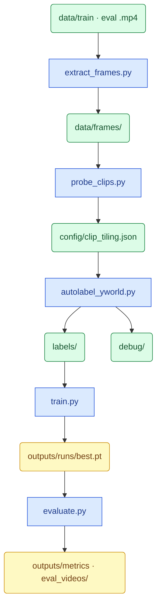

# Aerial Vehicle Detection — PoC Pipeline

End-to-end pipeline for pseudo-labeling drone footage and fine-tuning a lightweight detector. Written as a working report: what was built, why, and where the trade-offs are.

```
vehicle_detection/
├── README.md
├── requirements.txt
├── .gitignore
├── .gitattributes                  # Git LFS rules for videos
├── yolov8x-worldv2.pt              # gitignored — download locally (probe + autolabel)
├── config/
│   └── clip_tiling.json            # per-clip tiles, overlap, threshold (from probe)
├── checkpoints/
│   └── yolov8n_vehicle_best.pt     # git-tracked (~23 MB, copied by train.py)
├── data/
│   ├── train/*.mp4                 # Git LFS
│   ├── eval/*.mp4                  # Git LFS
│   └── frames/                     # gitignored — extract_frames.py
├── labels/                         # gitignored — autolabel_yworld.py
│   ├── train/{clip}/*.txt
│   └── eval/{clip}/*.txt
├── debug/                          # gitignored — probe_clips.py, autolabel
│   ├── tile_probe.json
│   ├── label_stats.json
│   └── {clip}/                     # cache/, labels_debug.mp4, confidence_hist.png
├── outputs/                        # mostly gitignored
│   ├── dataset/                    # gitignored — SAHI train/val slices
│   ├── eval_videos/*_predictions.mp4  # Git LFS — evaluate.py overlays
│   ├── eval_metrics.json           # evaluate.py metrics (JSON)
│   └── metrics_table.md            # evaluate.py metrics (table)
└── src/
    ├── extract_frames.py           # 1. video → frames
    ├── probe_clips.py              # 2. probe tiles → clip_tiling.json
    ├── autolabel_yworld.py         # 3. pseudo-labels + debug outputs
    ├── train.py                    # 4. fine-tune YOLOv8n
    ├── evaluate.py                 # 5. metrics + prediction videos
    ├── config.py                   # paths, split map, tiling helpers
    └── detect.py                   # YOLO-World, SAHI, distance
```

**Legend:** plain paths = committed to git · `Git LFS` = large videos · `gitignored` = local only, regenerate from scripts.

---


## 1. Task

**Goal:** detect vehicles on top-down drone frames at different ranges (close / mid / far) and produce a model that can be evaluated per distance band.

**Input:** `.mp4` clips in `data/train/` and `data/eval/`.

**Output:**

- YOLO pseudo-labels in `labels/`
- fine-tuned YOLOv8n weights in `outputs/runs/`
- per-band metrics in `outputs/` (after training)

The hard part is not “finding a detector” — it is the **domain gap**. Off-the-shelf models (including YOLO-World) are trained mostly on ground-level imagery. Here, a car is a tiny rectangle from above and is sometimes tagged as `person`.

---


## 2. Pipeline overview

Blue rectangles = **scripts** (actions). Green / amber rounded = **files** (results).




Probe decides tiles + confidence per clip. Autolabel uses that config. Train fits YOLOv8n on pseudo-labels. Evaluate reports metrics and writes prediction videos.

### How to run (defaults vs options)

Run from the repo root. For clip-scoped scripts, `NAME` is the video stem (e.g. `266987`) or a `.mp4` filename.


| Script                | No extra args                                                                                                     | `--clip NAME` | Other useful flags                                                                                                       |
| --------------------- | ----------------------------------------------------------------------------------------------------------------- | ------------- | ------------------------------------------------------------------------------------------------------------------------ |
| `extract_frames.py`   | All `.mp4` in `data/train/` and `data/eval/` → `data/frames/{clip}/`                                              | One clip only | —                                                                                                                        |
| `probe_clips.py`      | All frame folders under `data/frames/` → updates `config/clip_tiling.json`                                        | One clip only | `--frames N` (default 5 middle frames)                                                                                   |
| `autolabel_yworld.py` | All clips with frames **and** a matching `.mp4` in `data/train` or `data/eval`                                    | One clip only | —                                                                                                                        |
| `train.py`            | Build dataset if missing, train 15 epochs, full-frame val, copy `best.pt` → `checkpoints/yolov8n_vehicle_best.pt` | —             | `--prepare-only` (dataset only, no training); `--recreate-dataset` (force rebuild `outputs/dataset/`)                    |
| `evaluate.py`         | Default eval clips per band (`13722965…`, `266987`), default weights, metrics + prediction videos                 | —             | `--no-video` (metrics only); `--weights PATH`; `--clips A B`; `--conf FLOAT` (else per-clip threshold from probe config) |


**Typical full run** (all clips, end to end):

```bash
python src/extract_frames.py
python src/probe_clips.py
python src/autolabel_yworld.py
python src/train.py
python src/evaluate.py
```

**Single-clip iteration** (to re-label one video):

```bash
python src/extract_frames.py --clip NAME
python src/probe_clips.py --clip NAME
python src/autolabel_yworld.py --clip NAME
```

---


## 3. Probe: distance, tiles & confidence

`probe_clips.py` runs after frame extraction and before labeling. For each clip it finds the **minimum SAHI tile count** that detects a car, estimates **distance**, and sets the **label confidence threshold**. Output: `config/clip_tiling.json`.

### How it works

1. Take 5 middle frames from the clip.
2. Try tile candidates: `1 → 2 → 3 → 4 → 6 → 8 → 12`. Stop at the **first** level with a `car` hit (`person` counts as `car` during probe only).
3. On the hit frame, take the **largest** `car`/`person` detection and estimate distance from it.
4. Write per-clip config (tiles, overlap, threshold, `distance_m`, band).

If no tile level finds a car: **fallback** to 12 tiles @ threshold 0.1. Detailed log: `debug/tile_probe.json`.

### Distance

Pinhole model with **assumed passenger-car length (4.5 m)** — only detections tagged `car` or `person` are used:

```
distance_m = 4.5 m × focal_px / bbox_long_side_px
```

Probe accepts only `car` and `person` (aliased to `car`). A `truck`, `bus`, or other class is **not** used for this estimate even if YOLO-World sees it elsewhere in the pipeline.

- `focal_px` from inferred camera model (resolution tier → sensor size, 24 mm focal default — common for DJI)
- Optional per-clip override: `calibration/{clip_name}.json`

One estimate per clip from the largest `car`/`person` box on the probe hit frame. Approximate — useful for band assignment, not precise geolocation. A clip can span different ranges across its duration.

Distance assigns a **band** and is stored as `distance_m`; it is not a hard filter during labeling.

### Tiles

More tiles → smaller slices → larger objects per tile. Far / small cars need more tiles.


| Tiles | Typical band | Overlap |
| ----- | ------------ | ------- |
| 1     | <200 m       | 0       |
| 2–7   | >200 m       | 0.10    |
| ≥8    | >400 m       | 0.05    |


### Confidence threshold

```
tiles = 1   →  0.50
tiles > 1   →  max(0.05, 0.50 / tiles)
```

Examples: 2 tiles → 0.25, 4 → 0.125, 12 → 0.05 (floor).

### Probe-only alias

YOLO-World often tags top-down cars as `person` (known COCO quirk). During **probe only**, `person → car` is accepted for tile search and the 4.5 m distance estimate. At autolabel time all vehicle types (`truck`, `bus`, …) are detected, but probe distance/bands still come from `car`/`person` only.

### Probe results per clip


| Split | Clip                          | Tiles | Threshold | Est. distance (probe) | Band   |
| ----- | ----------------------------- | ----- | --------- | --------------------- | ------ |
| eval  | `13722965_2160_3840_30fps`    | 1     | 0.50      | ~118 m                | <200 m |
| eval  | `266987` *                    | 2     | 0.25      | ~379 m                | >200 m |
| train | `3405804-uhd_3840_2160_30fps` | 1     | 0.50      | ~134 m                | <200 m |
| train | `8457857-uhd_3840_2160_24fps` | 1     | 0.50      | ~203 m                | >200 m |
| train | `8968356-hd_1920_1080_30fps`  | 2     | 0.25      | ~371 m                | >200 m |
| train | `5382494-uhd_3840_2160_24fps` | 2     | 0.25      | ~729 m                | >400 m |


 `266987.mp4` added to eval manually — original spec had only one eval clip at <200 m.

---


## 5. Why YOLO-World for pseudo-labeling

YOLO-World (`yolov8x-worldv2.pt`) is the pseudo-labeler for probe and autolabel.

**Why not a plain YOLO or a VLM detector?**


| Option               | Issue for this task                                                       |
| -------------------- | ------------------------------------------------------------------------- |
| Fixed-class YOLO     | Needs labeled aerial data upfront                                         |
| Grounding DINO / OWL | Slower; heavier for thousands of frames                                   |
| **YOLO-World**       | Open-vocabulary, works on aerials out of the box, faster than DINO or OWL |


Vehicle classes queried at label time: `car`, `truck`, `pickup`, `bus`, `van`, `motorcycle`. Final YOLO labels are a single class `vehicle` (id=0); subclass name is kept only in the debug cache.

**Caveat:** quality on top-down drone footage is still limited. Fine-tuning YOLOv8n on these pseudo-labels is the step that adapts the model to our domain.

---


## 6. Labeling workflow

`autolabel_yworld.py` reads `config/clip_tiling.json` and processes every frame in the clip.

**Runtime:** full labeling pass on all 6 clips — **51 min 30 sec** (wall time, MPS).

### Detection mode (from probe)


| `target_tiles` | Mode                                                                              |
| -------------- | --------------------------------------------------------------------------------- |
| 1              | Full-frame `model.track` + ByteTrack                                              |
| >1             | SAHI sliced inference (slice size from `compute_slice_size`, overlap from config) |


Raw detections are cached per frame in `debug/{clip}/cache/`.

### Label post-processing

Post-processing is track-based — confidence alone is not enough on noisy aerial footage.


| Step                    | What it does                                                                                                       |
| ----------------------- | ------------------------------------------------------------------------------------------------------------------ |
| **Per-frame dedup**     | Drop overlapping boxes on the same frame (IoU ≥ 0.99 or ≤2 px tolerance)                                           |
| **IoU tracking**        | Link detections across frames (`TRACK_IOU_THRESHOLD = 0.3`)                                                        |
| **Stable track filter** | Keep only tracks seen on ≥3 frames (`MIN_TRACK_FRAMES`)                                                            |
| **Dip fill**            | Short runs below threshold inside a stable track are **filled** back in (≤2 frames)                                |
| **Spike removal**       | Short above-threshold blips on otherwise empty tracks are **removed** (≤2 frames)                                  |
| **Gap fill**            | Missing frames between two labeled frames on the same track are **filled** by copying the left bbox (≤2 frame gap) |
| **Final dedup**         | Remove overlapping labels after gap fill                                                                           |
| **Confidence cut**      | Apply per-clip threshold from `clip_tiling.json`                                                                   |


### Outputs


| Path                               | Content                          |
| ---------------------------------- | -------------------------------- |
| `labels/{split}/{clip}/*.txt`      | YOLO format, class `0`           |
| `debug/{clip}/cache/*.json`        | Raw detections + tiling metadata |
| `debug/{clip}/labels_debug.mp4`    | Visual QA video                  |
| `debug/{clip}/confidence_hist.png` | Confidence distribution          |
| `debug/label_stats.json`           | Aggregated stats across clips    |


### Label counts

After running `autolabel_yworld.py`:


| Split | Clips | Labeled frames |
| ----- | ----- | -------------- |
| train | 4     | ~2465          |
| eval  | 2     | ~1830          |


---


## 7. Training

`train.py` fine-tunes **YOLOv8n** on pseudo-labels — a straightforward fit, no custom architecture.


| Setting     | Value                                                                              |
| ----------- | ---------------------------------------------------------------------------------- |
| Base model  | `yolov8n.pt`                                                                       |
| Epochs      | 15 (PoC)                                                                           |
| Train input | SAHI slices 512×512, overlap 0.2                                                   |
| Val input   | Same 512×512 tiles (dataset only; `val=False` during train)                        |
| Negatives   | Train: up to 2 empty tiles/frame; val: labeled tiles only                          |
| Class       | `vehicle` (single class)                                                           |
| Weights     | `outputs/runs/.../best.pt` → copied to `checkpoints/yolov8n_vehicle_best.pt` (git) |


**Known limitation — fixed 512×512 tiles:** train and eval use one grid size for all clips. Autolabel did **not** use this: `target_tiles=1` clips were labeled **full-frame**; `target_tiles=2` used **~1018×1018** (1080p) or **~2036×2036** (4K). We kept 512 for **speed**, uniform YOLO `imgsz`, and disk — a deliberate shortcut, not matched to probe tiling. Better follow-up: per-clip `compute_slice_size` or a single size closer to labeling (~1024).

**Observed run (M1 Pro, MPS, 512 tiles):** 15 epochs in **~1 h 34 min** (1.56 h wall time). Fused model: **73 layers**, **~3.0M parameters**, **8.1 GFLOPs**.

**Train / val / eval alignment**


| Stage                            | Input                                                      |
| -------------------------------- | ---------------------------------------------------------- |
| Train (`train.py`)               | fixed 512×512 tiles                                        |
| Val (`train.py`)                 | tiled val set on disk; **per-epoch val off** (`val=False`) |
| Reported metrics (`evaluate.py`) | 512×512 tiles → merged to full frame                       |


`best.pt` is the last epoch checkpoint when `val=False`. Use `evaluate.py` for reported band metrics.

See **§2** for `train.py` flags (`--prepare-only`, `--recreate-dataset`).

---


## 8. Evaluation & metrics

`evaluate.py` compares the fine-tuned detector against pseudo-labels in `labels/eval/`, **one clip per distance band**.

**Inference:** each frame is sliced into **512×512 tiles with 0.2 overlap** (same as `train.py`), detections mapped back to full-frame coordinates, NMS-merged, matched at IoU 0.5. Same **512 mismatch vs autolabel** as training (see §7).

Each eval video is treated as a **single fixed band** from probe (`clip_tiling.json`) — e.g. the whole `13722965…` clip is 0–200 m, the whole `266987` clip is 200–400 m. Metrics do **not** recompute distance per frame or per car.

**Reference clips:**


| Band      | Clip                       | Probe band |
| --------- | -------------------------- | ---------- |
| 0–200 m   | `13722965_2160_3840_30fps` | <200 m     |
| 200–400 m | `266987` *(see §3)*        | >200 m     |


Matching at IoU 0.5. GT is pseudo-labels, not human annotation — metrics measure agreement with the YOLO-World labeling pipeline, not absolute ground truth.

**Prediction videos:** for each eval clip, `evaluate.py` writes an overlay to `outputs/eval_videos/{clip}_predictions.mp4` (**Git LFS**, committed with the repo). Metrics use only labeled frames; the video runs over all extracted frames. See **§2** for `--no-video`, `--weights`, `--clips`, `--conf`.

```bash
python src/evaluate.py              # metrics + videos (default clips & weights)
python src/evaluate.py --no-video   # metrics only, faster
```


### Results

Fine-tuned `yolov8n_vehicle` on M1 Pro (MPS). **512×512** tiled train + eval (`evaluate.py`, 2026-07-09). Known tile-size mismatch vs autolabel (§7).


| Metric                      | 0–200 m | 200–400 m |
| --------------------------- | ------- | --------- |
| Detection rate TP/(TP+FN)   | 12.1%   | 19.4%     |
| Precision TP/(TP+FP)        | 7.7%    | 58.6%     |
| False alarms / min          | 6137.25 | 311.53    |
| Time to first detection (s) | 0.03    | 2.20      |
| [mAP@0.5](mailto:mAP@0.5)   | 3.3%    | 12.7%     |


0–200 m band: higher recall than full-frame eval (~2.6%) but very low precision (many duplicate FPs across overlapping 512 tiles). 200–400 m band: more balanced. GT = pseudo-labels only.

Full report: `outputs/metrics_table.md`, `outputs/eval_metrics.json`.

## 9. Ideas for improvement

- **Probe-aligned tile size** — Replace fixed 512×512 with  common size ~1024 so train/eval match autolabel SAHI/grid. Or improve validation as validation videos are bigger on pixels-per-car than our train videos.
- **Confirmed-only train tiles** — Keep empty tiles (negatives) and tiles where every label is confirmed via cache confidence + stable track; drop tiles with borderline or slice-boundary boxes.
- **Confidence-weighted training** — Keep uncertain tiles but down-weight their loss by confidence and track metadata instead of dropping them outright.

