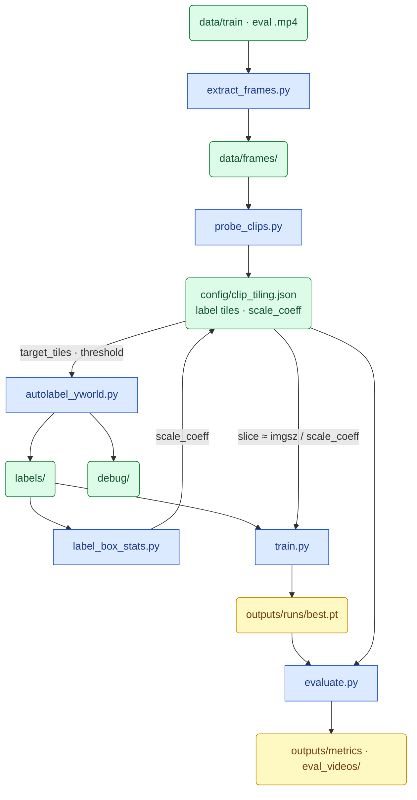

# Aerial Vehicle Detection — PoC Pipeline

End-to-end pipeline for pseudo-labeling drone footage and fine-tuning a lightweight detector. Written as a working report: what was built, why, and where the trade-offs are.

```
vehicle_detection/
├── README.md
├── requirements.txt
├── .gitignore
├── .gitattributes                  # Git LFS rules for videos
├── yolov8x-worldv2.pt              # gitignored — download locally (probe + autolabel)
├── config/
│   └── clip_tiling.json            # label tiles (probe) + scale_coeff (label_box_stats)
├── checkpoints/
│   └── yolov8n_vehicle_best.pt     # git-tracked (≈23 MB, copied by train.py)
├── data/
│   ├── train/*.mp4                 # Git LFS
│   ├── eval/*.mp4                  # Git LFS
│   └── frames/                     # gitignored — extract_frames.py
├── labels/                         # gitignored — autolabel_yworld.py
│   ├── train/{clip}/*.txt
│   └── eval/{clip}/*.txt
├── debug/                          # gitignored — probe_clips.py, autolabel
│   ├── tile_probe.json
│   ├── train_tile_samples/         # sample_train_tiles.py
│   ├── label_stats.json
│   └── {clip}/                     # cache/, labels_debug.mp4, confidence_hist.png
├── outputs/                        # mostly gitignored
│   ├── dataset/                    # gitignored — SAHI train/val slices
│   ├── eval_videos/*_predictions.mp4  # Git LFS — evaluate.py overlays
│   ├── eval_metrics.json           # evaluate.py metrics (JSON)
│   └── metrics_table.md            # evaluate.py metrics (table)
└── src/
    ├── extract_frames.py           # 1. video → frames
    ├── probe_clips.py              # 2. probe tiles → clip_tiling.json (+1 headroom)
    ├── sample_train_tiles.py       # optional: sample car tiles at label slice size
    ├── label_box_stats.py          # bbox size stats + write scale_coeff
    ├── autolabel_yworld.py         # 3. pseudo-labels + debug outputs
    ├── train.py                    # 4. fine-tune YOLOv8n
    ├── evaluate.py                 # 5. metrics + prediction videos
    ├── config.py                   # paths, split map, tiling helpers
    └── detect.py                   # YOLO-World, SAHI, distance
```

**Legend:** plain paths = committed to git · `Git LFS` = large videos · `gitignored` = local only, regenerate from scripts.

---


## 1. Task

**Goal:** detect vehicles on top-down drone frames at different ranges (close / mid / far) and produce a model that can be evaluated per distance band.

**Input:** `.mp4` clips in `data/train/` and `data/eval/`.

**Output:**

- YOLO pseudo-labels in `labels/`
- fine-tuned YOLOv8n weights in `outputs/runs/`
- per-band metrics in `outputs/` (after training)

The hard part is not “finding a detector” — it is the **domain gap**. Off-the-shelf models (including YOLO-World) are trained mostly on ground-level imagery. Here, a car is a tiny rectangle from above and is sometimes tagged as `person`.

---


## 2. Pipeline overview

Blue rectangles = **scripts** (actions). Green / amber rounded = **files** (results).



**Tile sizing has two layers:** probe sets **label** resolution (`target_tiles` + headroom); after labels exist, `label_box_stats.py` sets **train/eval** crop scale (`scale_coeff`). Both live in `clip_tiling.json`. Autolabel uses tiles/threshold; train and evaluate use `scale_coeff` → slice size at imgsz=1280.

### How to run (defaults vs options)

Run from the repo root. For clip-scoped scripts, `NAME` is the video stem (e.g. `266987`) or a `.mp4` filename.


| Script                  | No extra args                                                                                                     | `--clip NAME` | Other useful flags                                                                                                       |
| ----------------------- | ----------------------------------------------------------------------------------------------------------------- | ------------- | ------------------------------------------------------------------------------------------------------------------------ |
| `extract_frames.py`     | All `.mp4` in `data/train/` and `data/eval/` → `data/frames/{clip}/`                                              | One clip only | —                                                                                                                        |
| `probe_clips.py`        | All frame folders under `data/frames/` → updates `config/clip_tiling.json`                                        | One clip only | `--frames N` (default 5 middle frames)                                                                                   |
| `sample_train_tiles.py` | Sample car tiles at label slice size → `debug/train_tile_samples/` + size summary                                 | One clip only | `--per-clip N` (default 2); needs existing `labels/`                                                                     |
| `label_box_stats.py`    | Per-clip bbox stats + **writes `scale_coeff`** → `clip_tiling.json` + `debug/label_box_stats.json` | One clip only | `--no-write-scale-coeff`; `--imgsz N` (default 1280); `--target-px 64` |
| `autolabel_yworld.py`   | All clips with frames **and** a matching `.mp4` in `data/train` or `data/eval`                                    | One clip only | —                                                                                                                        |
| `train.py`              | Build dataset if missing, train 15 epochs (`val=False`), copy `best.pt` → `checkpoints/` | —             | `--prepare-only`; `--recreate-dataset`; `--batch N`                                                                      |
| `evaluate.py`           | Default eval clips per band (`13722965…`, `266987`), default weights, metrics + prediction videos                 | —             | `--no-video` (metrics only); `--weights PATH`; `--clips A B`; `--conf FLOAT` (else per-clip threshold from probe config) |


### Wall time (Apple Silicon MPS, this PoC)

| Stage | Typical wall time | Notes |
| ----- | ----------------- | ----- |
| Label (`autolabel_yworld.py`, 6 clips) | **1 h 2 m 44 s** | From `debug/label_stats.json` (2026-07-13) |
| Train (`train.py`, 15 epochs) | **≈12.3 h** training loop (**≈13 h** wall) | imgsz=1280, batch=12, MPS; Ultralytics `results.csv` epoch-15 cumulative time ≈ 44390 s |
| Eval (`evaluate.py`, 2 clips + videos) | **≈7 m 17 s** | Measured 2026-07-14: ≈6.1 frame/s infer on MPS; video encode ≈1–1.5 min/clip. `--no-video` ≈ infer only (≈5 min). |

Probe and frame extraction are short (minutes). End-to-end is dominated by **train**, then **label**.

**Typical full run** (all clips, end to end):

```bash
python src/extract_frames.py
python src/probe_clips.py
python src/autolabel_yworld.py
python src/train.py
python src/evaluate.py
```

**Single-clip iteration** (to re-label one video):

```bash
python src/extract_frames.py --clip NAME
python src/probe_clips.py --clip NAME
python src/autolabel_yworld.py --clip NAME
```

---


## 3. Probe: distance, tiles & confidence

`probe_clips.py` runs after frame extraction and before labeling. For each clip it finds the **minimum SAHI tile count** that detects a car (largest/nearest case), then writes **one ladder step higher** as `target_tiles` for labeling headroom on smaller/farther cars. Also estimates **distance** and sets the **label confidence threshold**. Output: `config/clip_tiling.json`.

### How it works

1. Take 5 middle frames from the clip.
2. Try tile candidates: `1 → 2 → 3 → 4 → 6 → 8 → 12`. Stop at the **first** level with a `car` hit (`person` counts as `car` during probe only). That hit is `probe_min_tiles`.
3. Set `target_tiles` to the **next** candidate (+1 headroom). Threshold and overlap follow `target_tiles`, not the raw probe hit. Example: probe hit at 2 → label with 3 tiles.
4. On the hit frame, take the **largest** `car`/`person` detection and estimate distance from it.
5. Write per-clip config (`target_tiles`, `probe_min_tiles`, overlap, threshold, `distance_m`, band).

If no tile level finds a car: **fallback** to 12 tiles @ threshold 0.1 (no further bump). Detailed log: `debug/tile_probe.json`.

Why headroom: the probe stops when the **largest** car is visible. Smaller cars in the same frame often need the next tile step to be large enough for the detector.

### Distance

Pinhole model with **assumed passenger-car length (4.5 m)** — only detections tagged `car` or `person` are used:

```
distance_m = 4.5 m × focal_px / bbox_long_side_px
```

Probe accepts only `car` and `person` (aliased to `car`). A `truck`, `bus`, or other class is **not** used for this estimate even if YOLO-World sees it elsewhere in the pipeline.

- `focal_px` from inferred camera model (resolution tier → sensor size, 24 mm focal default — common for DJI)
- Optional per-clip override: `calibration/{clip_name}.json`

One estimate per clip from the largest `car`/`person` box on the probe hit frame. Approximate — useful for band assignment, not precise geolocation. A clip can span different ranges across its duration.

Distance assigns a **band** and is stored as `distance_m`; it is not a hard filter during labeling.

### Tiles

More tiles → smaller slices → larger objects per tile. Far / small cars need more tiles.


| Tiles | Typical band | Overlap |
| ----- | ------------ | ------- |
| 1     | <200 m       | 0       |
| 2–7   | >200 m       | 0.10    |
| ≥8    | >400 m       | 0.05    |


### Confidence threshold

```
tiles = 1   →  0.50
tiles > 1   →  max(0.05, 0.50 / tiles)
```

Examples: 2 tiles → 0.25, 3 → 0.1667, 4 → 0.125, 12 → 0.05 (floor). Applied to `target_tiles` (after headroom).

### Probe-only alias

YOLO-World often tags top-down cars as `person` (known COCO quirk). During **probe only**, `person → car` is accepted for tile search and the 4.5 m distance estimate. At autolabel time all vehicle types (`truck`, `bus`, …) are detected, but probe distance/bands still come from `car`/`person` only.

### Probe results per clip


| Split | Clip                          | Probe min | Label tiles | Threshold | Est. distance (probe) | Band   |
| ----- | ----------------------------- | --------- | ----------- | --------- | --------------------- | ------ |
| eval  | `13722965_2160_3840_30fps`    | 1         | 2           | 0.25      | ≈118 m                | <200 m |
| eval  | `266987` *                    | 2         | 3           | 0.1667    | ≈379 m                | >200 m |
| train | `3405804-uhd_3840_2160_30fps` | 1         | 2           | 0.25      | ≈134 m                | <200 m |
| train | `8457857-uhd_3840_2160_24fps` | 1         | 2           | 0.25      | ≈203 m                | >200 m |
| train | `8968356-hd_1920_1080_30fps`  | 2         | 3           | 0.1667    | ≈371 m                | >200 m |
| train | `5382494-uhd_3840_2160_24fps` | 2         | 3           | 0.1667    | ≈729 m                | >400 m |


 `266987.mp4` added to eval manually — original spec had only one eval clip at <200 m.

### Sample tiles at label size

After probe (and once labels exist), inspect what cars look like at the labeling slice size:

```bash
python src/sample_train_tiles.py
```

Writes a few car tiles per clip under `debug/train_tile_samples/` and a `manifest.json` with per-clip `slice_size` plus mean / suggested shared tile side — useful when deciding whether 1080p-far and 4K-mid tiles are close enough to share one train `imgsz`.

---


## 5. Why YOLO-World for pseudo-labeling

YOLO-World (`yolov8x-worldv2.pt`) is the pseudo-labeler for probe and autolabel.

**Why not a plain YOLO or a VLM detector?**


| Option               | Issue for this task                                                       |
| -------------------- | ------------------------------------------------------------------------- |
| Fixed-class YOLO     | Needs labeled aerial data upfront                                         |
| Grounding DINO / OWL | Slower; heavier for thousands of frames                                   |
| **YOLO-World**       | Open-vocabulary, works on aerials out of the box, faster than DINO or OWL |


Vehicle classes queried at label time: `car`, `truck`, `pickup`, `bus`, `van`, `motorcycle`. Final YOLO labels are a single class `vehicle` (id=0); subclass name is kept only in the debug cache.

**Caveat:** quality on top-down drone footage is still limited. Fine-tuning YOLOv8n on these pseudo-labels is the step that adapts the model to our domain.

---


## 6. Labeling workflow

`autolabel_yworld.py` reads `config/clip_tiling.json` and processes every frame in the clip.

**Runtime:** full labeling pass on all 6 clips — **1 h 2 m 44 s** wall time (MPS, 2026-07-13; see `debug/label_stats.json`).

### Detection mode (from probe)


| `target_tiles` | Mode                                                                              |
| -------------- | --------------------------------------------------------------------------------- |
| 1              | Full-frame `model.track` + ByteTrack                                              |
| >1             | SAHI sliced inference (slice size from `compute_slice_size`, overlap from config) |


Raw detections are cached per frame in `debug/{clip}/cache/`.

### Label post-processing

Post-processing is track-based — confidence alone is not enough on noisy aerial footage.


| Step                    | What it does                                                                                                       |
| ----------------------- | ------------------------------------------------------------------------------------------------------------------ |
| **Per-frame dedup**     | Drop overlapping boxes on the same frame (IoU ≥ 0.99 or ≤2 px tolerance)                                           |
| **IoU tracking**        | Link detections across frames (`TRACK_IOU_THRESHOLD = 0.3`)                                                        |
| **Stable track filter** | Keep only tracks seen on ≥3 frames (`MIN_TRACK_FRAMES`)                                                            |
| **Dip fill**            | Short runs below threshold inside a stable track are **filled** back in (≤2 frames)                                |
| **Spike removal**       | Short above-threshold blips on otherwise empty tracks are **removed** (≤2 frames)                                  |
| **Gap fill**            | Missing frames between two labeled frames on the same track are **filled** by copying the left bbox (≤2 frame gap) |
| **Final dedup**         | Remove overlapping labels after gap fill                                                                           |
| **Confidence cut**      | Apply per-clip threshold from `clip_tiling.json`                                                                   |


### Outputs


| Path                               | Content                          |
| ---------------------------------- | -------------------------------- |
| `labels/{split}/{clip}/*.txt`      | YOLO format, class `0`           |
| `debug/{clip}/cache/*.json`        | Raw detections + tiling metadata |
| `debug/{clip}/labels_debug.mp4`    | Visual QA video                  |
| `debug/{clip}/confidence_hist.png` | Confidence distribution          |
| `debug/label_stats.json`           | Aggregated stats across clips    |


### Label counts

After running `autolabel_yworld.py`:


| Split | Clips | Labeled frames |
| ----- | ----- | -------------- |
| train | 4     | ≈2465          |
| eval  | 2     | ≈1830          |


---


## 7. Training

`train.py` fine-tunes **YOLOv8n** on pseudo-labels — a straightforward fit, no custom architecture.


| Setting     | Value                                                                              |
| ----------- | ---------------------------------------------------------------------------------- |
| Base model  | `yolov8n.pt`                                                                       |
| Epochs      | 15 (PoC)                                                                           |
| YOLO imgsz  | **1280** (global)                                                                  |
| Train crop  | **Per-clip** from `scale_coeff` in `clip_tiling.json` (`slice ≈ imgsz / coeff`)    |
| Overlap     | 0.2                                                                                |
| Negatives   | Train: up to 2 empty tiles/frame; val: labeled tiles only                          |
| Class       | `vehicle` (single class)                                                           |
| Weights     | `outputs/runs/.../best.pt` → copied to `checkpoints/yolov8n_vehicle_best.pt` (git) |


**Per-clip `scale_coeff`:** object long-side after resize ≈ `fullframe_long × scale_coeff`. Far/small clips get high coeff (small crops, e.g. 416); close/large clips get low coeff (large crops, capped to frame short side ≈2144). Re-probe **keeps** existing `scale_coeff`. Same coeffs drive **train dataset**, **val tiles**, and **`evaluate.py` inference**.

#### How `scale_coeff` is set

Automated by `label_box_stats.py` (needs existing `labels/`):

```bash
python src/label_box_stats.py              # stats + write scale_coeff
python src/label_box_stats.py --no-write-scale-coeff   # report only
```

1. Per-clip median box long-side in **full-frame pixels** (`ff_p50`).
2. `scale_coeff = clamp(target_px / ff_p50, 0.4, 3.0)` with `target_px=64` (middle of YOLO 32–96 sweet spot).
3. `slice_size = floor32(min(imgsz / scale_coeff, frame_short_side))` (`imgsz=1280`).
4. Writes `scale_coeff` + `scale_coeff_note` into `config/clip_tiling.json` (and top-level `train_imgsz` / formula metadata). Re-probe keeps these fields.

| Clip | scale_coeff | slice @1280 | ≈p50 after imgsz |
| ---- | ----------: | ----------: | ---------------: |
| `8968356` (train, small) | 3.0 | 416 | ≈52 |
| `5382494` (train, far) | 1.2 | 1056 | ≈64 |
| `8457857` / `3405804` / `266987` | 0.47–0.59 | 2144 | ≈64–82 |
| `13722965` (eval, close) | 0.4 | 2144 | ≈220 (frame-capped) |

**Train / val / eval alignment**


| Stage                            | Input                                                                 |
| -------------------------------- | --------------------------------------------------------------------- |
| Train (`train.py`)               | per-clip slice → letterbox to imgsz 1280                              |
| Val (`train.py`)                 | same per-clip scale; **per-epoch val off** (`val=False`)              |
| Reported metrics (`evaluate.py`) | same per-clip slice + imgsz 1280 → merge to full frame                |


`best.pt` is the last epoch checkpoint when `val=False`. Use `evaluate.py` for reported band metrics.

```bash
python -u src/train.py                    # reuse dataset; auto batch/cache for MPS
python -u src/train.py --recreate-dataset # rebuild tiles + train
python src/train.py --prepare-only        # dataset only
```

On Apple Silicon, `train.py` applies an MPS `unique()` workaround, uses `cache=disk`, modest dataloader workers, and auto batch (e.g. 8 @1280 on 16GB). If MPS OOMs it halves batch and retries.

**Observed train time (this PoC):** **≈12.3 h** for 15 epochs at imgsz=1280 / batch=12 on MPS (≈**13 h** wall including dataset prepare / overhead). See §2 wall-time table.

---


## 8. Evaluation & metrics

`evaluate.py` compares the fine-tuned detector against pseudo-labels in `labels/eval/`, **one clip per distance band**.

**Inference:** each frame is sliced with the clip’s **`scale_coeff` → slice size**, run at **imgsz=1280** (same as train), detections mapped to full-frame coordinates, NMS-merged, matched at IoU 0.5.


Each eval video is treated as a **single fixed band** from probe (`clip_tiling.json`) — e.g. the whole `13722965…` clip is 0–200 m, the whole `266987` clip is 200–400 m. Metrics do **not** recompute distance per frame or per car.

**Reference clips:**


| Band      | Clip                       | Probe band |
| --------- | -------------------------- | ---------- |
| 0–200 m   | `13722965_2160_3840_30fps` | <200 m     |
| 200–400 m | `266987` *(see §3)*        | >200 m     |


Matching at IoU 0.5. GT is pseudo-labels, not human annotation — metrics measure agreement with the YOLO-World labeling pipeline, not absolute ground truth.

**Prediction videos:** for each eval clip, `evaluate.py` writes an overlay to `outputs/eval_videos/{clip}_predictions.mp4` (**Git LFS**, committed with the repo). Metrics use only labeled frames; the video runs over all extracted frames. See **§2** for `--no-video`, `--weights`, `--clips`, `--conf`.

```bash
python src/evaluate.py              # metrics + videos (default clips & weights)
python src/evaluate.py --no-video   # metrics only, faster
```

**Runtime:** measured **7 m 17 s** wall for the two default clips with prediction videos (MPS, 2026-07-14): ≈**6.1 frame/s** infer each; video writing ≈53 s / ≈85 s. Without videos (`--no-video`) expect roughly the infer total (≈5 min). Timer output is also in `outputs/eval_metrics.json` → `timing`.

Offline PoC eval staying in the **minutes** range is fine vs ≈13 h train. For a **live drone**, ≈6 frame/s tiled @1280 is **not** real-time 30 fps — you’d need smaller imgsz, fewer tiles, or a faster device/model.


### Results

Fine-tuned `yolov8n_vehicle` on Apple Silicon (MPS), **2026-07-14**. Train/eval use per-clip `scale_coeff` crops → **imgsz=1280** (see §7).


| Metric                      | 0–200 m | 200–400 m |
| --------------------------- | ------- | --------- |
| Detection rate TP/(TP+FN)   | **65.6%** | **42.4%** |
| Precision TP/(TP+FP)        | **64.5%** | **84.3%** |
| False alarms / min          | 2119.61 | 202.31    |
| Time to first detection (s) | 0.03    | 0.03      |
| mAP@0.5                     | **51.3%** | **42.5%** |


**How to read this**

- **Detection rate (recall):** share of pseudo-label cars we find. Close band (≈118 m) is strongest - cars are large on screen. Mid band (≈379 m) is harder; ≈42% recall is solid for small aerial objects with a nano model.
- **Precision:** share of predictions that match a GT box. Mid band is cleaner (84%); close band has more FPs (duplicates on overlapping tiles + busy scene).
- **mAP@0.5:** ranking quality over confidence thresholds — ≈50% / ≈43% means the model ranks true cars well, not only at one conf cutoff.
- **False alarms/min:** high on 0–200 m in absolute terms (dense traffic + tile overlap); further NMS / conf tuning can cut this without killing recall.
- **Time to first det:** first TP almost immediately on both clips — useful for “alert as soon as a vehicle appears” demos.

**Caveat:** GT = YOLO-World pseudo-labels, not human labels. Metrics measure agreement with the labeling pipeline. Absolute numbers will shift if GT is cleaned by hand.

Full report: `outputs/metrics_table.md`, `outputs/eval_metrics.json`. Prediction overlays: `outputs/eval_videos/`.

## 9. Ideas for improvement

- **Staged backbone fine-tuning** — Freeze `yolov8n.pt` backbone for a few warmup epochs, then unfreeze and fine-tune full network at lower LR, instead of full-network fine-tune from epoch 1 on a small pseudo-labeled set.
- **Tuned data augmentation for small objects** — Review/adjust Ultralytics default augmentation policy (scale, mosaic, color, blur) to preserve small top-down vehicle signal.
- **Threshold from PR curve** — Replace the `0.5/tiles` heuristic with a confidence threshold fit on a held-out precision/recall curve.
- **Human-verified eval set** — Current GT is YOLO-World pseudo-labels; eval metrics measure agreement with the labeler, not real accuracy.
