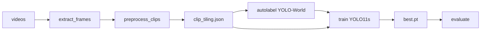

# Aerial Vehicle Detection

PoC: detect vehicles on top-down drone video.

## What counts as a vehicle

Single class `0 = vehicle`: a **car, van, truck, or bus** (powered road unit). Two-wheelers, trailers, and other non-powered attachments are **not** vehicles.


| Label as `vehicle`                      | Do **not** label as `vehicle`                        |
| --------------------------------------- | ---------------------------------------------------- |
| Cars, SUVs, pickups, vans, taxis        | Motorcycles, scooters, mopeds                        |
| Trucks, lorries — **powered unit only** | Cyclists / bicycle riders; standalone bicycles       |
| Buses, minibuses                        | Trailers, semi-trailers, caravans (alone or hitched) |
|                                         | Pedestrians, animals, strollers, hand carts          |
|                                         | Aircraft, drones, boats, trains (out of scope)       |


If a truck tows a trailer: box the **tractor only**. Leave non-vehicles unlabeled.

Both probe and autolabel use **YOLO-World**, an open-vocabulary detector: **keep** and **drop** lists are text prompts, so we can search for vehicles before any hand labels or fine-tuned model. **Drop** classes (e.g. `motorcycle`, `bicycle`, `person`) are prompted too — the model finds them as their own class instead of tagging them as `car`. Those drop boxes are never saved as labels; they only block a keep box (IoU ≥ 0.5) so a bike does not become a vehicle label.

**Autolabel** (training boxes) follows the table: truck/bus stay keep.

**Probe** (tiles / size / metres) is stricter: only `car` is measured — truck and bus are drop so a lorry is not treated as a 4.5 m car.

## Pipeline

Python 3.12, `pip install -r requirements.txt`. Clips in `data/train/` and `data/eval/`. Ultralytics weights download on first run. Runtimes below are MPS.



| Step                           | Command                                                                                                                      | Runtime |
| ------------------------------ | ---------------------------------------------------------------------------------------------------------------------------- | ------- |
| 1. Frames                      | `python src/data/extract_frames.py`                                                                                          | —       |
| 2. Config                      | `python src/data/preprocess_clips.py` → `config/clip_tiling.json` (optional `--save-probe-frames` → `outputs/probe_frames/`) | 100.71s |
| 3. Autolabel                   | `python src/labeling/autolabel.py` → `outputs/autolabel/`                                                                    | 23m 0s  |
| 4. Dataset                     | `python src/training/prepare_baseline.py --from-autolabel` → `data/datasets/baseline_v0/`                                    | —       |
| 4b. Eval pack (optional, once) | `python src/training/prepare_eval.py --from-autolabel` → `data/datasets/eval_autolabel/`                                     | —       |
| 5. Train                       | `python -u src/training/train.py --dataset-dir data/datasets/baseline_v0 --prototype`                                        | ~17 min |
| 6. Eval                        | `python src/training/evaluate.py`                                                                                            | —  |


Single clip: add `--clip NAME` where supported.

Generated frames, autolabel boxes, dataset packs, and run folders stay on disk (gitignored). In the repo: `config/clip_tiling.json`, `outputs/probe_frames/` (if saved), and `checkpoints/yolo11s_vehicle_best.pt`.

### Inference sizes (`src/common/config.py`)


| Stage                | Model      | `imgsz`  | Notes                                                 |
| -------------------- | ---------- | -------- | ----------------------------------------------------- |
| Preprocess probe     | YOLO-World | **640**  | `ULTRALYTICS_DEFAULT_IMGSZ` — coarse tiles / distance |
| Autolabel            | YOLO-World | **1280** | `AUTOLABEL_IMGSZ` — label quality                     |
| Train / eval YOLO11s | YOLO11s    | **640**  | `TRAIN_IMGSZ` — PoC default; override `--imgsz`       |


Native **tile crops** stay **1024 px** on the frame for `B_medium` (`train_groups.tile_size`); only the letterbox into the model uses `train_imgsz` (640).

---

## 1. Config generation (`clip_tiling.json`)

`python src/data/preprocess_clips.py` probes each clip with **YOLO-World** (`yolov8x-worldv2.pt`): open-vocabulary detection via text prompts (`set_classes`, not COCO ids). Output is `config/clip_tiling.json` — per-clip tiles, `frame_step`, distance band, skip. Autolabel, train, and eval read that file.
Probe prompts:

| Role | Prompts                                                      | Used for tiles / size / metres?  |
| ---- | ------------------------------------------------------------ | -------------------------------- |
| Keep | `car`                                                        | yes                              |
| Drop | `truck`, `bus`, `trailer`, `motorcycle`, `bicycle`, `person` | no (neutralize false `car` tags) |

### How it works

1. Sample **3 frames from start, middle, end** of each clip (9 frames total).
2. Try tile candidates `1 → 2 → 3 → 4 → 6 → 8 → 12`. First **car** hit = `probe_min_tiles`.
3. `target_tiles` = next candidate (+1 headroom). Threshold / overlap follow `target_tiles`.
4. Detail pass: **car-only** sizes & distances per segment; `distance_varies` if bands differ or start↔end size changes ≥30%.
5. Motion: match cars on consecutive frames → `speed_px_per_frame`.
6. `frame_step = floor(object_size_px_median × 0.5 / speed)` (min 1). Suggests `train_groups` from size.

Fallback if no car: **12 tiles** @ threshold 0.1.

### Distance (metres from a standard car)

There is no altimeter on these stock clips. Range is inferred from **bbox size** under a pinhole camera, assuming a **standard passenger-car length of 4.5 m** (the long side of the box ≈ that length in top-down view):

```
distance_m = 4.5 m × focal_px / bbox_long_side_px
```

`focal_px` comes from an assumed **24 mm** lens. Sensor defaults: 1-inch (4K / 1080p) or 1/2.3″ (SD). Override per clip with `calibration/{clip}.json` (`focal_length_mm`, sensor size, or `vertical_fov_deg`).

Clip-level `distance_m` is the **largest** probed **car** (else the median of car boxes), binned to `<200m`, `>200m`, or `>400m` (eval uses the first two; ≥400 m clips are skipped). The 200 m / 400 m cuts are **not** GPS altitude — they are “how far would this box be if it were a 4.5 m car.”

### Tiles & confidence


| Tiles | Typical band | Overlap |
| ----- | ------------ | ------- |
| 1     | <200 m       | 0       |
| 2–7   | >200 m       | 0.10    |
| ≥8    | >400 m       | 0.05    |


```
tiles = 1   →  conf 0.20
tiles > 1   →  conf max(0.05, 0.20 / tiles)
```

Autolabel uses these `target_tiles` / overlap / conf. Train/eval crops use `train_groups` (object-size bands), not the probe tile count:


| Median car long-side | Group      | Crop                                            |
| -------------------- | ---------- | ----------------------------------------------- |
| ≥ 80 px              | `A_close`  | full frame, letterbox to **640**                |
| 32–80 px             | `B_medium` | tile **1024** @ 0.2 overlap → letterbox **640** |
| < 32 px              | `C_far`    | skipped (`MIN_USABLE_OBJECT_PX`)                |


```bash
python src/data/preprocess_clips.py
python src/data/preprocess_clips.py --save-probe-frames
# → outputs/probe_frames/{clip}/{start|middle|end}_{frame}.jpg
#    car boxes used for metres; git-tracked; off by default
```

Rough object sizes from preprocess (also drive `frame_step` and the skip):


| Clip (short)              | Median px | Typical `frame_step` | Band      |
| ------------------------- | --------- | -------------------- | --------- |
| `13722965…` (eval, close) | ~299      | 23                   | 0–200 m   |
| `3405804…`                | ~89       | 9                    | <200 m    |
| `266987` (eval, mid)      | ~142      | 4                    | 200–400 m |
| `8457857…`                | ~51       | 2                    | <200 m    |
| `5382494…`                | ~53       | 8                    | <200 m    |
| `8968356…` (**skipped**)  | ~18       | —                    | —         |


### Rejected video (decision after probe)

Preprocess **always probes every clip**. If median car size is **< 32 px** (`MIN_USABLE_OBJECT_PX`), it writes `"skip": true` into `clip_tiling.json`. Downstream steps (autolabel / train / eval) then honor that flag.

**Why we skip instead of training a far band:** under limited PoC time we do not want to spend labeling and training budget on a domain that matches **neither** the rest of train nor eval. Clip `8968356-hd_1920_1080_30fps` (~17 px on 1080p) is that case — tiny blobs, different scale from close/mid clips, and tiling cannot invent missing pixels. Far group `C_far` stays empty on purpose. Force a skipped clip later with `--include-skipped` on autolabel/train if needed.

---

## 2. Autolabel

Same **YOLO-World** weights as the config probe — reused to bootstrap training labels:

1. **No manual boxes first** — write labels on every `frame_step` frame from preprocess.
2. **Prompts = vehicle definition** — wider keep list than probe (truck/bus stay keep); all keeps collapse to class `0 = vehicle`; drop list suppresses confounders only.
3. **Per-clip infer settings** — `target_tiles`, overlap, and conf from `clip_tiling.json`; imgsz **1280** (`AUTOLABEL_IMGSZ`).

**Keep** (written as `vehicle`): `car`, `suv`, `pickup`, `van`, `truck`, `bus`, `minibus`, `taxi`  
**Drop** (prompted, not labeled): `motorcycle`, `scooter`, `moped`, `trailer`, `caravan`, `bicycle`, `cyclist`, `person`

Labels are **per subsampled frame only**: conf threshold + dedupe, no temporal tracking. Full-frame and SAHI tiles. On a dense whole-clip run, IoU/ByteTrack plus dip/spike smoothing would help; with `frame_step` we pick unique looks on purpose, so tracks rarely span ≥3 processed frames and the old stable-track gate mostly dropped real cars.

Output: `outputs/autolabel/` (labels + images). Used as training labels for this PoC. Gitignored.

```bash
python src/labeling/autolabel.py                  # all non-skipped clips
python src/labeling/autolabel.py --clip 266987   # one clip
```

Example wall time (full run): **Done in 23m 0s.** Stats: `outputs/autolabel/debug/label_stats.json`.

---

## 3. Train YOLO11s & metrics

Fine-tune **YOLO11s** (`yolo11s.pt`) in two stages. Crops follow `train_groups` in `clip_tiling.json` (native tiles up to 1024 px, letterbox to **`train_imgsz` 640**). Aug: HSV + flips + degrees=180.


| Stage | What trains                                         | Default (full) | `--prototype` (fast PoC) |
| ----- | --------------------------------------------------- | -------------- | ------------------------ |
| 1     | Detect **head** only (backbone frozen, `freeze=11`) | 5 epochs       | **2** epochs             |
| 2     | **Full model** (backbone + head unfrozen, lower LR) | 20 epochs      | **5** epochs             |
|       | Early-stop patience on val                          | 7              | **3**                    |


PoC uses `--prototype`: short run, but Stage 2 still fine-tunes the **backbone**.

**PoC path (autolabel):**

```bash
python src/training/prepare_baseline.py --from-autolabel   # → data/datasets/baseline_v0/
python -u src/training/train.py --dataset-dir data/datasets/baseline_v0 --prototype
# runs → outputs/runs/yolo11s_vehicle_stage1/ then …/yolo11s_vehicle/
# best → outputs/runs/yolo11s_vehicle/weights/best.pt (also copied to checkpoints/)
```

Override any schedule piece with `--warmup-epochs`, `--epochs`, `--patience` (omit `--prototype` for the longer 5+20 default).

`prepare_baseline.py` tiles with `frame_step` + `train_groups`, no prepare-time balance/rotations.

### Prototype run (MPS, 32 GB unified RAM)

Command: `--dataset-dir data/datasets/baseline_v0 --prototype`  
Pack: 403 train / 71 val images (holdout from train videos; autolabel GT), **imgsz 640**, batch 8.


| Stage                     | Wall time             | Val (`best.pt`)                                                 |
| ------------------------- | --------------------- | --------------------------------------------------------------- |
| 1 — head only, 2 ep       | 3m 36s (0.060 h)      | mAP50 **0.374**, P 0.56, R 0.34                                 |
| 2 — full (backbone), 5 ep | 12m 54s (0.215 h)     | mAP50 **0.410**, mAP50-95 **0.184**, P 0.62, R 0.38             |
| **Total**                 | **16m 31s (0.275 h)** | deliverable: `checkpoints/yolo11s_vehicle_best.pt`              |


Stage 2 per-epoch val mAP50: 0.34 → 0.29 → 0.36 → **0.41** → 0.39 (`best.pt` = ep4; Ultralytics fitness, not max mAP50).

**Fixed eval pack** (same tiling, eval clips only — reuse for every experiment):

```bash
python src/training/prepare_eval.py --from-autolabel   # → data/datasets/eval_autolabel/
```

After `frame_step`, each clip is capped at **64** evenly spaced frames by default (`--max-frames-per-clip`). That thins long/fast clips (e.g. `266987` step=4 → hundreds of near-duplicates) without changing preprocess or other videos under the cap. Use `--max-frames-per-clip 0` for no cap.

### Evaluate

Scores the prepared pack (not live re-tiling). Default GT = autolabel pack. YOLO11s infer **imgsz 640** (same as train). Confidence defaults to **0.25** (Ultralytics YOLO default), same for all clips — not the autolabel per-tile thresholds.

```bash
# Standard eval (conf 0.25), metrics only
python src/training/evaluate.py --gt autolabel --no-video

# Stricter operating point (conf 0.5), metrics only
python src/training/evaluate.py --gt autolabel --conf 0.5 --no-video --output-dir outputs/eval_autolabel_conf05

# With overlay videos (conf 0.25; green box = conf > 0.5, orange otherwise)
python src/training/evaluate.py --gt autolabel
```

IoU 0.5 match on pack images (already tiled/cropped). Distance bands from preprocess:


| Band      | Clip                       | Probe `distance_m` |
| --------- | -------------------------- | ------------------ |
| 0–200 m   | `13722965_2160_3840_30fps` | ~95 m              |
| 200–400 m | `266987`                   | ~295 m             |


### Eval runs (MPS — after prototype train)

Weights: `outputs/runs/yolo11s_vehicle/weights/best.pt`. Autolabel GT. Pack: **88 images** (frame_step + cap 64). No overlay videos (`--no-video`).

**conf 0.25** (default). Wall time **9.4 s**. Report: `outputs/eval_autolabel/`.

| Metric                         | 0–200 m | 200–400 m |
| ------------------------------ | ------- | --------- |
| Detection rate                 | 65.7%   | 74.2%     |
| Precision                      | 59.0%   | 89.1%     |
| False alarms / min             | 3130.43 | 257.13    |
| Time to first det (s)          | 0.03    | 0.03      |
| mAP@0.5                        | 50.0%   | 69.0%     |
| mAP@0.5:0.95                   | 22.9%   | 15.0%     |

### Prediction postprocess (nested boxes)

Cars often enter the frame from the edge, so only half the vehicle is visible. The model then predicts both a full-car box and a half-car box nested inside it. IoU-NMS keeps both (inner/outer IoU is too low). After NMS we drop a box if ≥80% of its area sits inside a larger one. PoC tables above include this step. Overlay videos: `outputs/eval_videos/`.