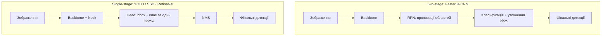
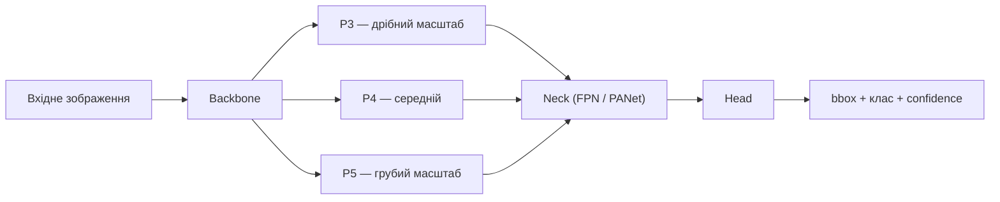
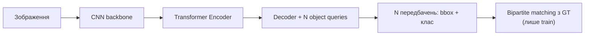
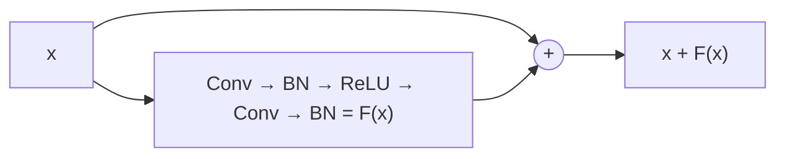
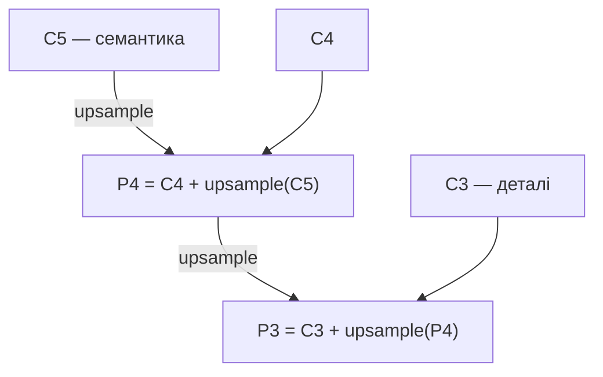

# Object Detection: практичний гайд від метрик до edge-деплою

Alisa Chupakhina

## Зміст

1. [Метрики оцінки детекції: IoU, Precision/Recall, mAP](#1-метрики-оцінки-детекції-iou-precisionrecall-map)
2. [NMS та боротьба з дублікатами детекцій](#2-nms-та-боротьба-з-дублікатами-детекцій)
3. [Архітектури детекції](#3-архітектури-детекції)
4. [Backbone'и (feature extractors)](#4-backboneи-feature-extractors)
5. [Практичний вибір моделі](#5-практичний-вибір-моделі)
6. [PyTorch: тензори і вихід детектора](#6-pytorch-тензори-і-вихід-детектора)
7. [PyTorch: шари (layers)](#7-pytorch-шари-layers)
8. [Loss-функції детекції](#8-loss-функції-детекції)
9. [Регуляризація та bias-variance trade-off](#9-регуляризація-та-bias-variance-trade-off)
10. [Оптимізатори (torch.optim)](#10-оптимізатори-torchoptim)
11. [Гіперпараметри тренування YOLO](#11-гіперпараметри-тренування-yolo)
12. [Дрібні об'єкти і тайлінг зображень](#12-дрібні-обєкти-і-тайлінг-зображень)
13. [Скільки даних потрібно та стратегії fine-tuning](#13-скільки-даних-потрібно-та-стратегії-fine-tuning)
14. [Якість даних, робастність і діагностика моделі в проді](#14-якість-даних-робастність-і-діагностика-моделі-в-проді)
15. [Розмітка bbox у CVAT](#15-розмітка-bbox-у-cvat)
16. [Огляд інструментів дата саєнтиста та лейблінг-платформ](#16-огляд-інструментів-дата-саєнтиста-та-лейблінг-платформ)
17. [Оптимізація моделі та edge-деплой](#17-оптимізація-моделі-та-edge-деплой)
18. [MLOps-практики для детекторів](#18-mlops-практики-для-детекторів)
19. [Процесні стандарти: PoC, Prototype, lock-in](#19-процесні-стандарти-poc-prototype-lock-in)
20. [A/B тестування і статистична значущість](#20-ab-тестування-і-статистична-значущість)
21. [Робочі звички: логи, прогрес-бари, як читати тренування](#21-робочі-звички-логи-прогрес-бари-як-читати-тренування)
22. [Глосарій абревіатур](#22-глосарій-абревіатур)

---

## 1. Метрики оцінки детекції: IoU, Precision/Recall, mAP

**IoU (Intersection over Union)** — площа перетину двох боксів, поділена на площу обʼєднання. На практиці це відповідь на питання «наскільки коробка моделі збігається з розміткою». IoU = 0.5: коробка перекриває обʼєкт більше ніж наполовину — грубо, але вже «влучила». IoU = 0.9: майже калька розмітки; зсув на кілька пікселів у дрібному обʼєкті вже провал. Той самий IoU стоїть і в eval (чи предикт = TP), і всередині NMS (чи два предикти — дублікати).

**Precision** — з усіх коробок, які модель намалювала, яка частка справді цільовий обʼєкт. Низька precision = оператор тоне в порожніх рамках.

**Recall (detection rate)** — з усіх обʼєктів у розмітці, яку частку взагалі знайшли. Низький recall = обʼєкти є на кадрі, модель їх пропускає. Для продукту «чи знайшли ціль» це часто ближче до задачі, ніж тісний бокс.

**Precision/Recall trade-off.** Це не дві незалежні характеристики моделі, а результат одного вибору — **порогу confidence**, вище якого детекція вважається достатньо впевненою, щоб її показати. Підняти поріг → лишаються тільки найвпевненіші детекції → менше false positives → **precision росте**, але частина реальних, менш впевнено передбачених об'єктів відсікається → **recall падає**. Опустити поріг → навпаки. Немає порогу, який максимізує обидві метрики одночасно — вибір залежить від задачі: якщо пропустити об'єкт дорожче, ніж отримати хибне спрацювання — нижчий поріг (пріоритет recall); якщо хибні спрацювання дорого коштують (багато ручної перевірки) — вищий поріг (пріоритет precision). Саме тому AP/mAP (нижче) — усереднення по **всіх** порогах, а не число при одному довільно обраному порозі: це дає оцінку якості моделі незалежно від того, який поріг для неї згодом оберуть у проді.

**Confusion matrix для детекції — чому це складніше, ніж для класифікації.** У класифікації confusion matrix — таблиця «справжній клас × передбачений клас», включно з true negatives. У детекції **немає природного поняття true negative** — не можна перелічити всі місця, де «об'єкта немає і модель правильно нічого не знайшла» (фон не є скінченним переліком кандидатів). Тому detection confusion matrix (напр. те, що будує Ultralytics після `val()`) будується інакше:

- Кожна GT-рамка й кожна передбачена рамка зіставляються за IoU (тим самим порогом, що і для TP/FP).
- Клітинки «справжній клас × передбачений клас» — випадки, коли модель знайшла обʼєкт, але приписала йому не той клас.
- Окремий рядок/стовпець **background** замінює «true negative»: стовпець `background` у рядку класу X — це **false negative** (реальний обʼєкт класу X, якого модель не знайшла), рядок `background` у стовпці класу X — це **false positive** (модель «побачила» обʼєкт класу X там, де нічого немає).
- Діагональ (клас X передбачений як клас X) — true positives.

Практична цінність: подивитись, який клас найчастіше плутається з іншим (недостатньо відмінних ознак у розмітці/даних) і який клас частіше «провалюється в background» (найбільше FN — типово дрібні/далекі обʼєкти) — це матеріал для аналізу помилок, а не абстрактне число mAP.

**Приклад для детекції одного класу.** Коли клас всього один, матриця вироджується в 2×2 (`object` vs `background`). Ілюстративні числа (IoU-поріг TP = 0.5):

| Predicted \ Actual | object (GT) | background |
|---|---|---|
| **object** (predicted) | TP = 120 | FP = 30 |
| **background** (не задетектовано) | FN = 380 | — (не визначено) |

Клітинка «background × background» **не заповнюється**: не можна порахувати, «скільки разів модель правильно нічого не знайшла», бо кількість порожніх місць у кадрі нескінченна.

З матриці:

- **Precision** = 120 / 150 ≈ **80%**
- **Recall** = 120 / 500 ≈ **24%**

Патерн «precision ок, recall провал» — типовий для дрібних/далеких обʼєктів: діагностика через TP/FP/FN одразу показує, куди дивитись (imgsz/тайли, confidence, якість GT).

**Приклад з кількома класами.** Ілюстративні числа — типовий патерн Ultralytics `confusion_matrix.png`:

| Predicted \ Actual | car | truck | bus | background |
|---|---|---|---|---|
| **car** | 850 | 40 | 5 | 120 |
| **truck** | 30 | 210 | 8 | 25 |
| **bus** | 3 | 12 | 95 | 8 |
| **background** | 90 | 35 | 10 | — |

Як читати (рядок = що передбачила модель, стовпець = що було за GT):

- **Діагональ** (850, 210, 95) — TP кожного класу.
- **Стовпець `background`** (120, 25, 8) — FN: реальні обʼєкти, яких модель не знайшла.
- **Рядок `background`** (90, 35, 10) — FP: модель намалювала обʼєкт там, де за GT нічого немає.
- **Клітинки поза діагоналлю, не в background** — плутанина класів. Найпомітніша тут **car ↔ truck** (40 + 30) — типово, коли легкий комерційний фургон на дрібному плані згори візуально схожий на легковик. **Bus** плутається менше, бо силует інший навіть на малій роздільності.

Практичний висновок з багатокласового патерну: проблема часто не в архітектурі, а в **межі між схожими класами на цьому датасеті** — або переглянути guideline розмітки (розділ [15](#15-розмітка-bbox-у-cvat)), або обʼєднати схожі класи в один, якщо продукту різниця не потрібна.

**AP (Average Precision)** для одного класу — площа під precision-recall кривою: для кожного порогу confidence рахуєш precision і recall, будуєш криву, інтегруєш. Одна цифра, яка не залежить від того, який саме confidence стоїть у проді.

**mAP (mean Average Precision)** — усереднення AP по всіх класах. Для однокласової задачі mAP = AP.

**mAP@0.5** рахує середню точність, коли предикт вважається влучанням лише якщо IoU з GT ≥ 0.5. Коробка може бути досить грубою — головне, що вона перекриває обʼєкт більше ніж наполовину.

**mAP@0.5:0.95** — те саме, але середнє по 10 порогах IoU: 0.50, 0.55, …, 0.95. Щоб не впасти на 0.75–0.95, бокс має майже збігатися з розміткою.

**mAP@0.5 vs mAP@0.5:0.95 — різні питання.** Перший відповідає «чи знайшли обʼєкт»; другий — «наскільки тісний бокс». На практиці різні налаштування (аугментації, stride, imgsz) можуть покращити один і погіршити інший: більше грубих детекцій піднімає 0.5, але знижує 0.5:0.95 через FP і неточну геометрію. Обидві метрики варто тримати в таблиці порівнянь; рішення про winner — за попередньо обраною продуктовою метрикою.

**Чому один загальний mAP може брехати.** Якщо 90% обʼєктів — великі/близькі, а 10% — дрібні далекі, загальний mAP домінує легкою більшістю. Тому eval варто **розбивати по групах розміру** (close / medium / far), а не однією цифрою — аналог COCO AP-small/medium/large. Групи можна будувати за площею бокса або за оціненою дальністю (проксі через відому фізичну довжину об'єкта і розмір бокса в пікселях).

**Операційні метрики при фіксованому confidence** (на відміну від mAP, який усереднює по порогах):

| Що в таблиці | Простими словами | Коли дивитись |
|---|---|---|
| **Det** (detection rate) | З усіх GT-обʼєктів яку частку спіймали. Не карає за зайві коробки. | «Чи пропускаємо цілі?» — пріоритет, якщо пропуск дорожчий за сміття. |
| **P** (precision) | З усіх намальованих коробок яка частка справді ціль. | «Чи тоне оператор у FP?» Високий mAP@0.5 при низькій P = знаходить, але сипле сміттям. |
| **FA/min** | Скільки зайвих коробок на хвилину відео. | Операційна гучність — та сама detection rate, але інше навантаження на людину. |
| **Time to first det** | Через скільки секунд зʼявляється перший правильний бокс. | «Як швидко помітили», не «наскільки точно обвели». |

**Confidence vs mAP.** Det / P / FA рахуються при одному обраному порозі confidence. Підняти поріг → менше сміття, більше пропусків. mAP навмисно усереднює по **всіх** порогах. У проді все одно доведеться вибрати один поріг — тоді дивляться Det/P/FA саме на ньому.

**Data drift** — розподіл даних у проді відрізняється від того, на чому тренували модель (інше освітлення, кут камери, нові типи об'єктів). Діагностика ситуації «valid добре, прод погано» — розділ [14](#14-якість-даних-робастність-і-діагностика-моделі-в-проді).

### Практичний зразок

Для однокласової детекції транспорту на відео з повітря **decision metric = mAP@0.5**, а не mAP@0.5:0.95. «Машину знайшли» важливіше за тісний бокс: з розміру рамки можна грубо оцінити дальність (відома фізична довжина типового авто ≈ кілька метрів), але ця оцінка вторинна відносно факту присутності. Тримати обидві колонки в таблиці; winner ablation — по 0.5.

Eval обовʼязково **розбити на ближню і дальню групи** (напр. за площею бокса або за проксі-даллю), інакше близькі великі обʼєкти маскують провал на далеких. Precision і FA/min — діагностика навантаження на оператора, не заміна mAP. Якщо mAP@0.5 високий, а precision низький — модель знаходить цілі, але сипле рамками по фону; це інша проблема, ніж «не бачить далеких».

---

## 2. NMS та боротьба з дублікатами детекцій

**NMS (Non-Maximum Suppression)** — прибирає дублікати детекцій одного обʼєкта. Якщо дві коробки сильно перекриваються, лишаємо лише впевненішу. Поріг IoU NMS = 0.5 означає «перекриття більше ніж наполовину = це той самий обʼєкт». На щільній парковці дві різні машини можуть перетнутись сильніше — тоді NMS зʼїсть другу (пропуск), або навпаки лишить дубль, якщо поріг зависокий.

1. Сортуєш усі бокси за confidence, найвищий — перший.
2. Береш найвпевненіший бокс, прибираєш усі інші бокси того ж класу з IoU вище порогу (типово 0.45–0.5) відносно нього.
3. Повторюєш для наступного найвпевненішого серед тих, що лишились.

**Проблема NMS для щільних сцен:** якщо два реальні об'єкти стоять впритул і їхні GT-бокси перетинаються з IoU вище порогу — NMS може помилково прибрати правильну детекцію другого об'єкта, вважаючи її дублем першого. Це типово для кадрів згори зі щільним паркуванням.

**Soft-NMS** — замість повного видалення бокса з високим IoU до найкращого, його confidence **знижується пропорційно** до IoU (чим більше перекриття — тим сильніше падає score), а не обнуляється. Бокс лишається в списку з нижчим пріоритетом — і якщо це реально окремий обʼєкт, він усе ще пройде фінальний поріг confidence. Типове рішення в small-object форках YOLO для густих aerial-сцен.

**Повна відмова від NMS — DETR-родина.** Transformer-based детектори (DETR, RT-DETR) використовують bipartite matching між передбаченнями і GT під час тренування і не потребують NMS на inference. Детальніше — розділ [3](#3-архітектури-детекції).

**Практичний вибір порогу IoU для NMS на inference:** вище значення → менше рамок відсіюється як дублікати (ризик залишити дублікати), нижче → агресивніше прибирання (ризик видалити сусідні окремі об'єкти). Для густих сцен згори це значення варто підбирати окремо, а не лишати дефолтним.

Окремий випадок після тайлінгу: один обʼєкт потрапляє в зону overlap двох тайлів і зʼявляється двічі — фінальний NMS по **всьому кадру** (не всередині тайлу) прибирає цей дубль. Розділ [12](#12-дрібні-обєкти-і-тайлінг-зображень).

**Вкладені бокси.** Детектор інколи малює великий бокс навколо зчеплення (тягач + причіп) і менший навколо самого тягача. Якщо за guideline ціль — тільки силова одиниця, внутрішній бокс правильний, зовнішній — FP. Стандартний NMS за IoU може лишити обидва (вкладення дає помірний IoU при великій різниці площ). Тоді потрібне окреме правило: якщо один бокс майже повністю міститься в іншому — лишити менший (або той, що ближче до очікуваного aspect ratio класу).

### Практичний зразок

На відео згори зі щільним рядом авто стандартний NMS з IoU 0.5 губить сусіда. Підібрати поріг на holdout з парковкою; якщо дублікати дорожчі за пропуски сусіда — мʼякший NMS або Soft-NMS. Окремо: після зшивання тайлів завжди ганяти NMS по повних координатах кадру. Якщо клас визначений як «силова одиниця, не причіп» — додати відсіювання вкладених рамок, інакше precision падає на вантажівках, хоча mAP@0.5 може виглядати стерпно.

---

## 3. Архітектури детекції

### Ландшафт родин object detection

1. **R-CNN родина (two-stage)** — R-CNN → Fast R-CNN → Faster R-CNN → Cascade R-CNN. Спільна ідея: **два окремі кроки**. Спочатку Region Proposal Network пропонує кандидатські області, де ймовірно є обʼєкт, не знаючи ще клас. Другий крок бере кожен кандидат, класифікує його і уточнює координати bbox. Cascade R-CNN повторює уточнення кілька разів зі зростаючим порогом IoU. Найточніша лінія і найповільніша.
2. **SSD / YOLO v1–v5 родина (single-stage, anchor-based)** — мережа за **один прохід** передбачає зміщення відносно наперед заданих якорів і клас у кожній точці сітки ознак. Значно швидше за R-CNN, ціною точності на дрібних/щільних об'єктах — компроміс, який зробив YOLO стандартом для real-time.
3. **RetinaNet** — теж single-stage anchor-based, але закриває дисбаланс «фон vs обʼєкт» через **Focal Loss** (розділ [8](#8-loss-функції-детекції)) і наближається до точності two-stage, лишаючись single-stage за швидкістю.
4. **Anchor-free / keypoint-based** (CenterNet, FCOS, YOLOv8+) — мережа передбачає **ключову точку** (типово центр bbox) і розміри від цієї точки, без набору якорів. **CenterNet** — об'єкт як точка-центр на heatmap. **FCOS** — для кожного пікселя всередині GT bbox передбачає відстані до чотирьох країв; «centerness» пригнічує передбачення з периферії. Менше гіперпараметрів, краща генералізація на нетипові aspect ratio.
5. **EfficientDet** — compound scaling (глибина/ширина/роздільність разом) + **BiFPN** (двонаправлене злиття рівнів ознак з навченими вагами). Вища точність на FLOP у теорії; на практиці часто програє YOLO за реальною latency на edge через складніші звʼязки BiFPN.
6. **DETR-родина** (DETR, RT-DETR, RF-DETR) — не CNN-еволюція, а transformer: self-attention і set prediction замість сітки + NMS.



У two-stage є явний крок «кандидати»; у single-stage мережа йде від зображення до bbox+клас за один прохід — тому single-stage швидший.

### Anchor-based vs anchor-free

**Anchor-based** (YOLOv5 і раніше, Faster R-CNN, SSD): модель має набір «якорів» — прямокутників фіксованих розмірів/пропорцій у кожній точці сітки. Передбачає **зміщення й масштаб відносно найближчого якоря**. Мінус: якорі треба підбирати під датасет (k-means по GT-боксах); погано генералізується, якщо реальні обʼєкти сильно відрізняються за формою від якорів.

**Anchor-free** (YOLOv8+, FCOS, CenterNet): напряму передбачає центр і розміри, без якорів. Простіше конфігурувати, менше гіперпараметрів, зазвичай кращий на нетиповому aspect ratio.

### Три частини детектора: Backbone → Neck → Head

1. **Backbone** — витягує ознаки на кількох рівнях: краї → текстури → форми. На виході **кілька** карт різного розміру (P3 — вища роздільність / дрібніший масштаб, P5 — нижча роздільність / грубіший масштаб).
2. **Neck** — змішує інформацію між масштабами. Типово **FPN/PANet**: глибокі карти (мало деталей, багато семантики) підвищуються в роздільності й зливаються з неглибокими (багато деталей, мало семантики). Без neck детектор або не бачить дрібні об'єкти, або бачить їх без семантики для класу. Механізм FPN — розділ [7](#7-pytorch-шари-layers).
3. **Head** — перетворює збагачені карти на bbox, клас, confidence окремо на кожному рівні масштабу (тому YOLO детектує і дрібні, і великі об'єкти одночасно).



У YAML Ultralytics neck (Upsample/Concat) технічно лежить у секції `head`, хоча за роллю це neck.

### YOLO — сімейство, не одна архітектура

Вибір версії й розміру залежить від чотирьох осей: розмір об'єктів, hardware inference, бюджет на латентність, ліцензія.

Спочатку перевірити, чи це взагалі задача детекції:

- Потрібно лише «є об'єкт у кадрі чи нема» без локалізації — достатня **класифікація**, вона легша за YOLO.
- Об'єкти дуже дрібні й густі (натовп, рій) — інколи ефективніше density estimation / counting, бо bbox на 3 пікселі вже шум.
- Координати кожного окремого об'єкта потрібні — тоді детекція.

**Вибір версії YOLO:**

| Версія | Коли обирають | Застереження |
|---|---|---|
| YOLOv5 | Стабільність, легасі-інтеграції | Застаріла; на aerial/small-object бенчмарках (VisDrone) сильно відстає від v8 по mAP50 |
| YOLOv8 | Баланс точність/швидкість, найбільше small-object форків | Великі літери (l/x) дають приріст на дрібних, але на малих датасетах ризик нестабільності тренування |
| YOLOv11 / YOLOv12 | Легші й точніші за v8 при тому самому розмірі, anchor-free | Менше готових small-object форків, ніж у v8 |
| YOLO26 | NMS-free (end-to-end, як RT-DETR) | Найменше нішевого досвіду (thermal/aerial) |

Практичне правило: якщо є час на експерименти — v8 як baseline (найбільше літератури під small-object aerial) і v11 як другий кандидат. Не гнатись за найновішою версією «бо новіша» — для нішевого домену вирішує наявність напрацювань спільноти. Якщо кастомних модифікацій немає — v11 нормальний дефолт: C2PSA уже вбудований, менше параметрів при порівнянному mAP, той самий `model.train()` / `model.export()`.

**Навіщо attention в детекторі.** Self-attention (Query/Key/Value, розділ [7](#7-pytorch-шари-layers)) дає прямий звʼязок між будь-якими двома точками карти ознак за один крок. Згортка бачить лише локальне вікно. Attention не малює bbox сам, а **підсвічує** релевантні канали/позиції на карті, яку потім читає neck/head. Для слабкого сигналу дрібного обʼєкта на шумному фоні згори це корисно. Ціна: менше inductive bias, ніж у CNN, тому чистий transformer потребує більше даних. YOLO вбудовує attention точково поверх CNN (C2PSA у v11, Area Attention у v12), а не замінює згортки цілком.

**Decoupled head.** У YOLOv3–v5 один шар передбачав і клас, і bbox з тієї самої карти — класифікації вигідні семантичні ознаки, регресії — просторові. **Decoupled head** (YOLOX, далі стандарт Ultralytics) розділяє дві гілки. Точніше тренування, трохи більше параметрів.

**Архітектурна різниця v8 → v11 → v12 → v26** (за документацією Ultralytics):

| | YOLOv8 | YOLOv11 | YOLOv12 | YOLO26 |
|---|---|---|---|---|
| Блок backbone/neck | C2f | C3k2 (ефективніший за C2f) | C3k2 + R-ELAN | C3k2 **як у v11**, не як у v12 |
| Attention | немає | C2PSA | Area Attention | C2PSA **як у v11** |
| Head | Anchor-free, decoupled | те саме + depthwise conv | як v8/v11 | **NMS-free** (`end2end`), DFL прибрано (`reg_max=1`) |
| Відносно v8 (COCO, орієнтир Ultralytics) | baseline | L: −42% параметрів при порівнянному mAP | L: −40% параметрів, невеликий плюс mAP50-95 | N: менше параметрів, вищий mAP50-95, суттєво нижча CPU ONNX latency |

**Спадковість:** YOLO26 архітектурно продовжує **YOLO11** (C3k2 + C2PSA), а не v12. YOLOv12 — окрема дослідницька гілка. Новизна v26 — head без NMS і без DFL, не новий backbone.

C2PSA не є фіксованою привʼязкою до кута кадру: attention-мапа рахується заново на кожному зображенні. Ризик генералізації на нові ракурси — брак різноманітності даних (розділ [13](#13-скільки-даних-потрібно-та-стратегії-fine-tuning)), не сам attention.

Чому v8 часто беруть як baseline: найбільше small-object літератури (P2, GAM, Soft-NMS); новіше не завжди швидше на реальному чипі; v11 — другий кандидат саме через C2PSA на шумному aerial-фоні.

### Модифікації під small objects

Форки, не «інші моделі»:

- **Додатковий шар P2** — вища роздільність до сильного downsampling.
- **Attention у backbone/neck** (GAM, SE) — не загубити слабкий сигнал.
- **Soft-NMS** замість жорсткого NMS — розділ [2](#2-nms-та-боротьба-з-дублікатами-детекцій).

На VisDrone / TinyPerson такі модифікації дають кілька відсотків mAP понад baseline.

### Розмір моделі: n / s / m / l / x

Множники ширини (канали) і глибини (повтори блоків) тієї самої архітектури. Визначають параметри, FLOPs, точність, швидкість, пам'ять.

Орієнтир (YOLOv12, той самий патерн для v8/v11), T4 GPU, TensorRT FP16, batch=1 — **без** pre/post-processing і без тайлінгу:

| Модель | Параметри | FLOPs | mAP (COCO) | Latency | FPS ≈ 1000/latency |
|---|---|---|---|---|---|
| N | 2.6M | 6.5G | 40.6 | 1.64 мс | ~610 |
| S | 9.3M | 21.4G | 48.0 | 2.61 мс | ~383 |
| M | 20.2M | 67.5G | 52.5 | 4.86 мс | ~206 |
| L | 26.4M | 88.9G | 53.7 | 6.77 мс | ~148 |
| X | 59.1M | 199.0G | 55.2 | 11.79 мс | ~85 |

Якщо кадр ріжеться на N тайлів, реальний FPS пайплайна ділиться приблизно на N. На слабшому edge абсолютні числа нижчі — міряти на цільовому залізі.

Від N до X параметри ростуть ~23×, mAP — лише ~14 в.п. (diminishing returns). Для дрібних об'єктів більший бекбон (l) часто дає реальний приріст — до межі; x на малому датасеті може деградувати через нестабільність тренування.

**Як обирати літеру:**

1. **Пам'ять пристрою.** Jetson Nano 4 ГБ → реалістично n, інколи s при малому imgsz. Xavier NX / Orin Nano 8 ГБ → n/s, m при imgsz≤640 і batch=1. AGX Orin 32–64 ГБ → m/l. Десктоп 8–24+ ГБ — будь-який. Вага файлу моделі — мала частина; основне зʼїдають activation-буфери (imgsz × batch).
2. **Latency-бюджет.** 30 FPS = 33 мс/кадр, 15 FPS = 67 мс/кадр. Відняти pre/post (3–10 мс); якщо тайлінг — поділити залишок на кількість тайлів. Це ліміт на inference моделі.
3. **Розмір датасету** і стратегія fine-tuning (розділ [13](#13-скільки-даних-потрібно-та-стратегії-fine-tuning)):

   | Літера | Full fine-tuning | Frozen-backbone (тільки head/neck) |
   |---|---|---|
   | n | від ~200–300 зображень | від ~50–100 |
   | s | від ~500 | від ~100–200 |
   | m | ~1000–1500 | ~200–300 |
   | l | ~2000+ | ~300–500 |
   | x | 5000+; менше — ризик деградації vs l | ~500–1000 |

   На ~500 зображеннях/клас full fine-tuning x/l ризикований, frozen-backbone x/l — робочий. Frozen лишає «COCO-зір»: якщо домен сильно нетиповий (надир згори, thermal), стеля точності нижча. На 5000+ зображеннях n/s впираються у власну місткість — сигнал іти в m/l, якщо памʼять/latency дозволяють.
4. **Густина і розмір об'єктів.** Дрібні й щільні — аргумент підняти на одну літеру вище мінімуму з пп. 1–2.

### Fine-tuning vs from scratch

**From scratch** — модель вчить усе від країв до форм. Потрібен масштаб COCO (~118k зображень). На практиці майже ніколи.

**Fine-tuning** — backbone уже вміє краї/текстури/форми; довчити ваші класи. На порядки менше даних.

Спрощена структура YAML (числа каналів варіюються):

```yaml
backbone:
  - [-1, 1, Conv, [64, 3, 2]]       # 0 — краї
  - [-1, 1, Conv, [128, 3, 2]]      # 1
  - [-1, 3, C2f, [128, True]]       # 2
  - [-1, 1, Conv, [256, 3, 2]]      # 3
  - [-1, 6, C2f, [256, True]]       # 4
  - [-1, 1, Conv, [512, 3, 2]]      # 5
  - [-1, 6, C2f, [512, True]]       # 6
  - [-1, 1, Conv, [1024, 3, 2]]     # 7
  - [-1, 3, C2f, [1024, True]]      # 8
  - [-1, 1, SPPF, [1024, 5]]        # 9 — кінець backbone

head:
  - [-1, 1, nn.Upsample, [None, 2, "nearest"]]  # 10 — далі neck+head
  - [[-1, 6], 1, Concat, [1]]
```

`.pt` у `YOLO(...)` — архітектура + pretrained ваги. `.yaml` — порожня структура, ваги випадкові.

```python
from ultralytics import YOLO

model = YOLO("yolo11s.pt")
model.train(data="data.yaml", epochs=50)

model_scratch = YOLO("yolo11s.yaml")
model_scratch.train(data="data.yaml", epochs=300)
```

`freeze=N` заморожує перші N шарів (індекси як у YAML):

```python
model = YOLO("yolo11s.pt")
model.train(data="data.yaml", epochs=50, freeze=10)  # backbone 0–9, вчиться head
```

Список шарів: `for i, layer in enumerate(model.model.model): print(i, layer.__class__.__name__)`. Staged fine-tuning — розділ [13](#13-скільки-даних-потрібно-та-стратегії-fine-tuning).

### DETR-родина: детекція без NMS

Transformer: self-attention, кожен елемент порівнюється з усіма іншими за один крок. У CV «послідовність» = патчі або клітинки карти ознак. DETR: CNN-backbone → encoder self-attention → decoder з фіксованим набором object queries → N передбачень (set prediction), без NMS. Matching з GT — лише на тренуванні (bipartite matching).



**Плюси:** глобальний контекст; немає NMS, який зʼїдає сусідів. RT-DETR інтегрований в Ultralytics.

**Мінуси:** довше сходиться на малих датасетах; історично слабший на дрібних обʼєктах (Deformable DETR / RF-DETR частково лікують). Attention часто **погано квантизується** на нішевих edge-чипах (Hailo, частина TensorRT-шляхів).

Практичний баланс: CNN-детектор (YOLO) — типовий вибір для борту; RT-DETR — коли є GPU-сервер, достатньо даних, і густота сцени реально ламає NMS.

### Коли YOLO — не найкращий вибір

- **RT-DETR** — див. вище.
- **Infrared/thermal.** Пряме донавчання RGB-YOLO на IR — робоче, але не оптимальне: низький контраст, мало текстури. Спочатку перевірити preprocessing (контраст, псевдо-колоризація), перш ніж будувати IR-специфічну архітектуру.
- **Two-stage (Faster R-CNN).** Коли real-time не потрібен і кожен пропуск дорогий (offline-архів) — свідомо жертвують швидкістю заради recall.
- **SSD.** Майже завжди програє сучасним YOLO n/s за точністю/швидкістю; лишається з причин legacy.
- **RetinaNet.** Важча за YOLO при порівнянній точності; FPN бʼє по latency на слабких чипах.

| Архітектура | Тип | Обмеження |
|---|---|---|
| YOLO (v5/v8/v11) | Single-stage | Слабша точність на дуже дрібних/щільних; геометрія бокса зазвичай гірша за two-stage |
| SSD | Single-stage | Слабкі малі об'єкти без FPN-надбудови |
| Faster / Cascade R-CNN | Two-stage | Повільний; складніший експорт/квантизація |
| RetinaNet | Single-stage + Focal Loss | Важча за YOLO при тій самій точності |
| CenterNet / FCOS | Anchor-free | Менше tooling для edge; heatmap CenterNet зливає близькі центри одного класу |
| EfficientDet | Compound scaling + BiFPN | Теоретичні FLOP ≠ реальна latency на edge |
| DETR / RT-DETR | Transformer, без NMS | Довге навчання; attention погано на частини edge-компіляторів |

### Чек-лист вибору

1. Задача справді потребує bbox, а не класифікацію чи підрахунок?
2. Де inference? Борт з обмеженим compute → n/s YOLO, сумісність з цільовим рантаймом критична. Сервер GPU → можна m/l або RT-DETR.
3. Густота: впритул і перекриваються → RT-DETR або Soft-NMS.
4. Домен RGB vs thermal/IR — окремий preprocessing, не «той самий YOLO на нових файлах».
5. Малий датасет → обережно з l/x.
6. Ліцензія Ultralytics (AGPL-3.0 за замовчуванням) — реальний фактор для закритого продукту.

### Практичний зразок

Однокласова детекція авто з надиру, inference near-edge, сотні–низькі тисячі кадрів: **YOLO 11s (або 8s) як baseline**, не DETR і не x. C2PSA у v11 корисний на шумному фоні згори; якщо є час — другий кандидат v8s на тому самому pack, щоб порівняти, а не «взяти найновіше». Two-stage лишити для offline, якщо колись знадобиться максимум recall без FPS. Ліцензію перевірити до lock-in архітектури, не після.

---

## 4. Backbone'и (feature extractors)

| Backbone | Профіль | Обмеження для детекції |
|---|---|---|
| ResNet (18/34/50) | Класичний, стабільний | Для real-time edge часто завеликий без прунінгу; ResNet-50+ рідко влазить у жорсткий latency-бюджет |
| MobileNet (v2/v3) | Легкий, depthwise separable convs | Нижча стеля точності; depthwise не завжди добре оптимізовані на конкретному чипі |
| EfficientNet | Compound scaling | Swish / SE не завжди добре квантизуються «з коробки» |
| ViT / гібриди | Self-attention, глобальний контекст | Більше даних для навчання з нуля; attention — типова причина проблем ONNX/edge |

У готовому YOLO backbone уже вибраний. Міняти його має сенс, лише якщо цільовий чип погано їсть поточні операції або є доведена потреба в іншому inductive bias.

**FPN/PANet** у YOLOv8+ критичні для дрібних об'єктів. Backbone з надмірним downsampling (багато stride-2 підряд) губить дрібні обʼєкти ще до head, незалежно від «потужності» моделі. Механізм — розділ [7](#7-pytorch-шари-layers).

### Практичний зразок

Не замінювати backbone YOLO «на ResNet-50 бо він точніший у класифікації» — для детекції з повітря вирішує **піраміда ознак і stride**, не ImageNet-top1. Якщо далекі авто зникають після downsampling, лікувати imgsz, P2 або тайлінг, а не міняти ResNet на EfficientNet усередині детектора без вимірювання на far-групі.

---

## 5. Практичний вибір моделі

Фактори в порядку перевірки:

1. **Бюджет latency/compute на inference** — часто раніше за точність. Якщо цільовий FPS не витримується, +5% mAP непридатні. Спочатку hard constraint (максимальна latency / розмір під hardware), усередині нього — найточніша модель.
2. **Обсяг і якість даних.** Складна модель потребує більше даних, інакше overfitting. Сотні–тисячі прикладів — аргумент за простішу літеру або freeze backbone, не за тренування з нуля.
3. **Складність задачі.** Добре розділені класи простими ознаками не конвертують зайву ємність у точність. Дрібні обʼєкти на різноманітному фоні виправдовують складнішу архітектуру **за умови** даних під неї.
4. **Час і навички команди.** Модель, яку вміють дебажити й експортувати, цінніша за +2% mAP, які ніхто не може вивезти в ONNX.

Для **зображень/відео** вибір — CNN-детектор vs transformer-детектор (розділ [3](#3-архітектури-детекції)): YOLO швидший і стабільніший на малих даних; DETR краще ловить глобальний контекст, коли даних багато. Для **малих обʼєктів** multi-scale pyramid обовʼязкова (розділ [4](#4-backboneи-feature-extractors)). Якщо ракурс і освітлення фіксовані, інколи класичний CV (фон, контури) виграє в DL — тоді DL overkill.

**Завжди починай з baseline.** Найменша адекватна версія тієї ж родини: перевірити, що пайплайн працює, і мати число для порівняння. Без baseline незрозуміло, чи +3% mAP варті 5× latency.

**«Проста модель краща за складну» — пастка.** Правильний висновок: «на цьому датасеті, цього розміру, з цією розміткою проста показала краще/рівно». Неправильний: «проста фундаментально краща для задачі».

Що може ховатись:

- Датасету замало для складної моделі (не збіглась або overfit).
- Стеля в якості розмітки, не в моделі.
- Задача простіша, ніж здавалось.
- Несправедливе порівняння гіперпараметрів / довжини тренування.

Перевірка: **learning curve** (25/50/75/100% train) — якщо крива складної ще росте на 100%, їй бракує даних. **Train vs val gap** — великий розрив = overfitting. **Error analysis** — якщо обидві моделі падають на тих самих неоднозначних кадрах, стеля в даних.

### Практичний зразок

На кількох сотнях тайлів з повітря s-модель часто дорівнює або обганяє m/l при full fine-tuning. Не робити висновок «s завжди краща»: побудувати learning curve і train/val gap. Якщо m ще росте з обсягом даних — збирати розмітку, а не лочити s назавжди. Якщо обидві сплощились на одних і тих самих промахах (тінь, схожий дах) — стеля в guideline і різноманітності кліпів, не в літері.

---

## 6. PyTorch: тензори і вихід детектора

**Тензор** — багатовимірний масив. У PyTorch вхід, ваги і вихід кожного шару — тензори.

- 0D скаляр — одне число.
- 1D вектор — напр. логіти класів.
- 2D — ч/б зображення (H, W).
- 3D — RGB (C, H, W).
- 4D — батч зображень (B, C, H, W).

Запис «вхід (64, 112, 112)» нижче — канали × H × W без batch.

**Детекція і суміжні виходи.** Задачі відрізняються тим, що саме мережа повертає:

| Задача | Вихід |
|---|---|
| Класифікація | Один вектор ймовірностей на **весь** кадр — локалізації немає |
| **Object detection** | Список bbox + клас + confidence |
| Instance / semantic segmentation | Маска по пікселях; bbox її не замінює, якщо потрібен контур |
| Трекінг | Стабільний ID обʼєкта між кадрами — надбудова над детектором, не заміна його метрик |
| Depth / pose / OCR | Інший тип виходу (карта глибини, ключові точки, текст) |

Типовий батч для YOLO: `(B, 3, imgsz, imgsz)` після letterbox. Сирий вихід head — тензор(и) по рівнях P3/P4/P5; після decode + NMS — список рамок у пікселях вихідного кадру (з урахуванням padding letterbox і, якщо був тайлінг, offset тайлу).

Letterbox зберігає aspect ratio: додає поля, а не розтягує. Координати GT і предиктів треба переводити тією самою формулою, інакше IoU на eval бреше.

### Практичний зразок

На UHD-кадрі з дрона в мережу йде не 3840×2160, а letterbox до `imgsz` (напр. 1280) або кроп тайлу, потім letterbox. Bug «модель малює бокси зі зсувом» майже завжди = різний pad/scale між train, val і продом, а не «поганий backbone». Перевіряти decode на одному кадрі з відомою GT-рамкою, перш ніж ганяти mAP.

---

## 7. PyTorch: шари (layers)

Форма тензора: `(B, C, H, W)`. Нижче для простоти `(C, H, W)`.

**Conv2d.** Вікно (kernel, напр. 3×3) ковзає по зображенню; у кожній позиції ваги × пікселі, сума = локальний патерн. Кожен вихідний канал — свій фільтр.

`Conv2d(in_channels=3, out_channels=64, kernel_size=3, stride=1, padding=1)`: (3, 224, 224) → (64, 224, 224). stride=2 стискає H і W вдвічі.

**BatchNorm2d.** По кожному каналу: нормалізація по батчу, потім навчені γ, β. Розмір не змінюється. Без цього активації «розповзаються», навчання нестабільне.

**MaxPool2d / AvgPool2d.** З вікна 2×2 — max або середнє. (64, 112, 112) → (64, 56, 56). Менше даних далі; невеликий зсув об'єкта менше впливає.

**ReLU / LeakyReLU / GELU.** Поелементна нелінійність. Без неї стек згорток = одна лінійна функція. LeakyReLU не занулює відʼємні повністю — менше «мертвих» нейронів.

**Skip / Residual.** `output = x + F(x)` — блок вчить поправку, не весь вихід з нуля. Градієнт тече по `x` в обхід глибокого F — захист від vanishing gradient.



**ConvTranspose2d / Upsampling.** Розширює карту ознак (обернене до stride>1). У **шийці детектора** (FPN): підняти глибоку карту до розміру дрібнішої і злити. Це не сегментаційний decoder «піксель у піксель маски», а multi-scale fusion перед detection head.

**FPN.** Глибокі карти (мало деталей, багато семантики) upsample + сума з неглибокими (багато деталей). Дрібний обʼєкт непомітний на 7×7 карті — FPN дає детектору кілька масштабів одночасно.



**Self-Attention.** Query × Key усіх позицій → ваги; зважена сума Value. Кожна позиція «бачить» усі інші за один крок. У детекції — C2PSA / Area Attention в YOLO11/12 (розділ [3](#3-архітектури-детекції)).

**Dropout.** Під час train випадково занулює частку нейронів; на inference вимкнений. Зменшує overfitting. У сучасних YOLO на згортках використовується помірно; сильніше — на fully-connected хвостах, яких у детекторі майже немає.

### Практичний зразок

Далекий автомобіль — задача для **P3 (і за потреби P2)**, не для найглибшої карти. Якщо на far-групі recall провал, перевірити, на якому stride «помирає» обʼєкт (20 px на кадрі після /32 ≈ нічого), а не додавати ще Residual-блоків у backbone. Upsample в neck YOLO — щоб повернути роздільність для дрібних рамок, не щоб зібрати маску.

---

## 8. Loss-функції детекції

| Loss | Для чого в детекції | Ідея |
|---|---|---|
| Cross-Entropy / BCE | Клас (і objectness у старих YOLO) | Сильніше штрафує впевнену помилку: `-log(p_правильного)` |
| Focal Loss | Дисбаланс фон vs обʼєкт | CE × `(1−p)^γ` — легкі (фон) майже не тягнуть градієнт |
| IoU / GIoU / DIoU / CIoU | Регресія bbox | Оптимізує перетин рамок, не координати окремо; CIoU ще центр і аспект |
| Smooth L1 (Huber) | Класична bbox-регресія (Faster R-CNN / SSD) | Як L2 біля нуля, як L1 на викидах |

Dice і boundary-band loss — інструменти **сегментації**; у чистому bbox-пайплайні їх немає.

### L1 vs L2 vs Huber для координат bbox

**L1 (MAE):** `|y − ŷ|`. Стійкий до викидів; градієнт ±1 навіть коли помилка вже мала — важко «доточити».

**L2 (MSE):** `(y − ŷ)²`. Гладкий біля нуля; один великий промах координат на ранніх епохах може потягнути весь backbone.

**Huber / Smooth L1:** L2 для `|a| ≤ δ`, L1 для більших. У Faster R-CNN δ=1 на (dx, dy, dw, dh) відносно якоря. Стабільний старт і точне доведення наприкінці.

Сучасний YOLO (v8+) для бокса зазвичай бере **CIoU** (або варіант), не Smooth L1: напряму оптимізує IoU-подібну величину, плюс відстань центрів і узгодженість аспекту.

### Ваги YOLO: box / cls / dfl

YOLO вчиться одночасно: де рамка (**box**, типово 7.5), який клас (**cls**, типово 0.5), наскільки точна межа (**dfl** — Distribution Focal Loss, типово 1.5).

Якщо клас **один** — класифікаційна частина спрощена; інколи піднімають box відносно cls, щоб фокус ішов на локалізацію дрібних обʼєктів. Не обовʼязково: при одному класі мережа все одно вчиться «обʼєкт vs фон» через cls/objectness.

**Focal Loss ≠ DFL.** Focal Loss — дисбаланс класів/фону. DFL — регресія **розподілу** позиції краю рамки в anchor-free head (біни вздовж осі), не боротьба з фоном.

### Objectness в anchor-based YOLO (v5 і раніше)

Три компоненти: box (зміщення відносно якоря), **objectness** (чи є в цій комірці/якорі взагалі обʼєкт, BCE), classification (який клас, якщо обʼєкт є). Фінальний score на виході = `objectness × class_probability`. Без objectness мережа мусила б для тисяч порожніх якорів видавати розподіл по всіх класах.

В **anchor-free** (v8+) окремого objectness як терміна немає: роль частково в class score на кожній позиції сітки.

### Focal Loss

Звичайний CE однаково дивиться на легкі й важкі приклади. При 95% фону модель «ледачить» і завжди передбачає фон. Множник `(1−p)^γ` (γ≈2) приглушує легкі. У RetinaNet це ключовий трюк; у YOLO дисбаланс частково закритий призначенням позитивних клітин сітки і вагами loss.

```text
FL = −(1 − p)^γ · log(p)
```

У коді — кілька рядків поверх `binary_cross_entropy_with_logits` з ручним множником.

### Практичний зразок

Один клас «транспорт» на кадрах згори: не роздувати `cls` — фон і так домінує, а продукт питає «чи знайшли», не «легковик vs фургон». Лишити дефолтні box/dfl; чіпати cls униз лише якщо train cls_loss уже ≈0, а рамки все ще плавають. Decision metric mAP@0.5 узгоджується з CIoU/box: грубе влучання важливіше за ідеальний контур. Якщо пізніше знадобиться дальність з розміру бокса як **окрема** фіча продукту — тоді вже дивитись mAP@0.5:0.95 і не знижувати dfl.

---

## 9. Регуляризація та bias-variance trade-off

**Bias** — систематична помилка через занадто прості припущення (underfitting): модель не ловить реальну складність.

**Variance** — чутливість до конкретного train-набору (overfitting): модель запамʼятовує шум і специфіку кліпів замість закономірності.

**Trade-off:** складніша модель → нижчий bias, вищий variance. Простіша — навпаки.

### L1/L2 регуляризація ваг (не плутати з L1/L2 loss)

L1/L2 **loss** порівнює передбачення з GT (розділ [8](#8-loss-функції-детекції)). L1/L2 **регуляризація** штрафує **величину ваг** моделі, додану до loss, щоб зменшити overfitting. Математика схожа, обʼєкт інший.

- **L2 (weight decay, Ridge):** `loss_total = loss + λ·Σw²`. Ваги плавно стягуються, жодна не стає точно нулем. У PyTorch — `weight_decay` в оптимізаторі, окремий доданок у loss писати не треба.
- **L1 (Lasso):** `loss_total = loss + λ·Σ|w|`. Частина ваг стає рівно 0 — розрідженість. У детекторі як основний інструмент рідко; для стиснення частіше structured pruning (розділ [17](#17-оптимізація-моделі-та-edge-деплой)).
- **Коли яку:** L2/weight decay — дефолт (у YOLO типово 5e-4). L1 — коли явно потрібна sparse модель.

### Dropout

Під час тренування випадково вимикає частину нейронів → мережа не покладається на один шлях. Деталі шару — розділ [7](#7-pytorch-шари-layers). У YOLO сильний dropout на згортках зазвичай не головний важіль; сильніші регуляризатори для детекції — аугментації, weight decay, early stopping, і **не класти майже однакові сусідні кадри** в train (розділ [14](#14-якість-даних-робастність-і-діагностика-моделі-в-проді)).

### Практичний зразок

На відео з повітря легко «вивчити кліп», а не клас: один довгий проліт дає тисячі майже однакових рамок. Високий train mAP і провал на іншому прольоті — variance, не «потрібен більший backbone». Лікувати: temporal stride (не кожен кадр), баланс кліпів у pack, weight decay як є, mosaic обережно. Зменшувати модель (n замість s) — лише якщо learning curve показує, що ємності забагато відносно різноманітності сцен.

---

## 10. Оптимізатори (torch.optim)

Loss показує помилку зараз. Оптимізатор за градієнтом вирішує, як змінити ваги. Патерн: `optimizer = torch.optim.AdamW(model.parameters(), lr=1e-3)` → `loss.backward()` → `optimizer.step()` → `optimizer.zero_grad()`.

**SGD.** `w ← w − lr · ∇w`. Просто; легко застрягає; чутливий до lr.

**SGD + Momentum.** Інерція попередніх кроків (типово 0.9–0.937). Швидше проходить пологі ділянки.

**Adagrad.** Окремий ефективний lr на вагу; накопичена сума квадратів градієнтів лише росте → з часом крок майже нуль.

**RMSprop.** Ковзне середнє квадратів замість вічної суми — Adagrad без «засихання».

**Adam.** Momentum + адаптивний lr на вагу (як RMSprop). Швидко сходиться без тонкого підбору lr. На дуже довгих прогонах інколи узагальнює гірше за добре підібраний SGD+momentum.

**AdamW.** Той самий Adam, але weight decay відділений від адаптації lr (в оригінальному Adam вони змішувались некоректно). Якщо `weight_decay > 0` — брати AdamW.

**weight_decay** — L2-штраф на ваги (розділ [9](#9-регуляризація-та-bias-variance-trade-off)). Типово 5e-4. Важливо на малому датасеті.

### Коли який

- **Короткий fine-tune, невеликий датасет (типовий детектор на своїх кадрах):** AdamW, стартовий lr порядку 1e-3 (у Ultralytics YOLO дефолт часто ближче до 1e-2 для SGD і нижчий для Adam — дивитись `lr0` у args). Не підбирати оптимізатор і lr одночасно з imgsz.
- **Довге навчання з нуля або фінальний довгий прогін на великому датасеті:** SGD + momentum + cosine/linear decay. Вищий стартовий lr0 (~0.01), більше уваги до warmup.

Конкретні `lr0`, `lrf`, `cos_lr`, `warmup_epochs` — розділ [11](#11-гіперпараметри-тренування-yolo).

### Практичний зразок

Staged fine-tune на кількох сотнях–тисячах тайлів (спочатку freeze backbone, потім короткий full): **AdamW як є в Ultralytics**, не SGD «бо так у старих паперах Faster R-CNN». SGD має сенс, якщо пізніше є десятки тисяч різноманітних кадрів і сотні епох. Не міняти оптимізатор у тому самому раунді, де вже змінюють imgsz або pack.

---

## 11. Гіперпараметри тренування YOLO

Групи впорядковано за тим, як часто їх реально чіпають у `model.train(...)`.

### Learning rate: lr0, lrf, cos_lr, warmup_epochs

- **lr0** — стартовий lr.
- **lrf** — фінальний lr як частка від lr0 (0.01 → в кінці 1% від старту).
- **cos_lr** — cosine annealing замість лінійного спаду.
- **warmup_epochs** — розгін від майже нуля до lr0. На старті градієнти шумні (особливо після розморозки head); повний крок одразу псує ще не усталені ваги.

### Оптимізатор

`optimizer`, `momentum`, `weight_decay` — розділ [10](#10-оптимізатори-torchoptim). Типово momentum 0.9–0.937, weight_decay 5e-4.

### Ваги loss: box, cls, dfl

Розділ [8](#8-loss-функції-детекції).

### Аугментації

Мають імітувати **реальну** варіативність зйомки, не «стандартний набір». Сліпа аугментація шкодить, якщо ламає фізику сцени.

| Параметр | Що робить | Коли релевантно для детекції з повітря |
|---|---|---|
| `hsv_h`, `hsv_s`, `hsv_v` | Відтінок / насиченість / яскравість | Різна пора доби, погода |
| `degrees` | Поворот | Камера без фіксованого горизонту |
| `scale` | Зум | Змінна висота → інший видимий розмір обʼєкта |
| `fliplr` / `flipud` | Дзеркало | fliplr зазвичай ок; flipud — лише якщо перевернутий кадр буває в проді |
| `mosaic` | 4 зображення в одне | Дрібні обʼєкти, щільніший контекст на кадр |
| `mixup` | Змішування двох зображень і міток | Регуляризація; на дуже дрібних обʼєктах може розмити і так слабкий сигнал |
| `copy_paste` | Вставка обʼєкта в інший кадр | Рідкісні ракурси/класи без нового збору |
| `label_smoothing` | Мітка 0.9 замість 1.0 | Шумна розмітка |

### batch і imgsz

- **batch** — зображень на крок. Більший = стабільніший градієнт, більше VRAM.
- **imgsz** — розмір letterbox у мережу. Зменшення «зʼїдає» дрібні обʼєкти: 20×20 на 1920 після ресайзу до 640 ≈ 6×6 — на межі.

**Чому imgsz кратний 32.** Пʼять stride-2 в backbone (2⁵=32); фінальна сітка має ділити вхід націло. 640, 768, 1024, 1280 — валідні; 800 — ні (найближчі 768 або 832).

| imgsz | Роль |
|---|---|
| 320 | Швидкий edge, жертва дрібних |
| 640 | Дефолт COCO, точка порівняння статей |
| 1280 | Дрібні обʼєкти / high-res джерело; ~4× compute vs 640 |
| 512, 768, 896, 960, 1024 | Між стандартами під GPU-бюджет |

**Тайл vs letterbox.** Кроп на кадрі (напр. 1024 px) і `imgsz` моделі — різні речі. Тайл ріжеться з оригіналу, потім letterbox до imgsz. Якщо пайплайн уже тайлить, розмір тайлу задає, скільки пікселів обʼєкта доживає до мережі.

Практичне спостереження на aerial: різати **backbone** (l→s) зазвичай дешевше для дрібних обʼєктів, ніж різати **imgsz** (1920→640). Latency-бюджет спочатку забирати в літери моделі, не в роздільності, якщо ціль — far-група. Тайлінг (розділ [12](#12-дрібні-обєкти-і-тайлінг-зображень)) зберігає ефективну роздільність без 4× на весь UHD-кадр.

### epochs, patience

- **epochs** — стеля проходів по train.
- **patience** — зупинка, якщо val не росте N епох. Орієнтири довжини — розділ [13](#13-скільки-даних-потрібно-та-стратегії-fine-tuning).

### iou (поріг NMS/val у циклі тренування)

Не плутати з IoU-loss. Наслідки порогу на густих сценах — розділ [2](#2-nms-та-боротьба-з-дублікатами-детекцій).

### Як тюнити

1. Старт з дефолтів Ultralytics.
2. Одна група за раз: спочатку аугментації під домен, потім lr, потім loss weights.
3. Порівняння на **фіксованому** val і **окремо по size buckets**, не лише загальний mAP.
4. `model.tune()` — старт для великого простору; фінал завжди з урахуванням домену (aerial, thermal), якого тюнер не знає.

### Практичний зразок

Раунд 1 на фіксованому pack: тільки **imgsz** 640 / 768 / 1024 / 1280. Для далеких авто з літери ~20–40 px на UHD 640 часто недостатньо; 1280 дорожчий, але це той важіль, який лікує far-recall. Mosaic увімкнути; mixup — вимкнути або мінімум, поки обʼєкти дрібні. HSV і scale — так (висота й освітлення пливуть). flipud — ні, якщо прод ніколи не літає «вгору ногами». Winner — mean mAP@0.5 по ближній/дальній групі, не train loss.

---

## 12. Дрібні об'єкти і тайлінг зображень

Стандартний детектор downsample-ить вхід (stride 8/16/32) до head. Обʼєкт 20×20 на оригіналі після /32 — менше пікселя ознак. «Просто натренувати YOLO на full frame 640» для 4K з повітря часто фізично не бачить дальню групу.

### Таксономія розміру

Зручно ділити не за абсолютними px, а за часткою кадру і/або дальністю (для надиру це майже одне й те саме):

| Група | Орієнтир | Стратегія |
|---|---|---|
| Близькі / великі | >5% площі кадру | Звичайний детектор |
| Середні | 1–5% | P2 / attention, помірний виграш від тайлів |
| Дрібні / далекі | <1% | Тайлінг майже обовʼязковий |

Ту саму нарізку використати в **eval** (розділ [1](#1-метрики-оцінки-детекції-iou-precisionrecall-map)), інакше провал далекої групи розчиняється в середньому mAP.

### Що таке тайлінг

Великий кадр ріжеться на перекривні шматки **до** мережі, кожен інфериться на близькому до нативного масштабі, бокси зводяться в координати повного кадру. Обʼєкт, який після ресайзу всього 4K став би 1–2 px, на тайлі лишається впізнаваним.

### Overlap

Типово 10–20% сторони тайлу: інакше обʼєкт на шві розрізаний навпіл і не детектується ніде. Після зшивання — NMS по всьому кадру (розділ [2](#2-nms-та-боротьба-з-дублікатами-детекцій)).

### Фіксована сітка vs адаптивний тайлінг

- **Сітка** — завжди N×M однакових тайлів. Просто, передбачувана latency. Платите за порожнє небо.
- **Адаптивний** — густіші тайли там, де легкий прохід знайшов кандидатів. Економія compute, але друга точка відмови: промах легкого проходу = сліпа зона.

На старті — сітка з overlap. Адаптивний — коли latency вже стеля.

### Порядок кроків

1. Розмір тайлу: кратний 32 як imgsz (640/768/1024/1280). Тайл має бути досить малим, щоб далекий обʼєкт займав помітну частку після letterbox.
2. Overlap 10–20%, потім тюнити на швах.
3. Inference кожного тайлу незалежно.
4. Додати offset тайлу до xyxy.
5. NMS по всіх детекціях кадру.

SAHI — типова обгортка для inference; розмір кропа і letterbox `imgsz` задаються окремо.

### Узгодженість train / val / prod

Якщо train на тайлах — val і прод на **тих самих** розмірі й overlap. Інакше метрики не про прод. Модель, навчена на тайлах 1024, погано узагальнюється на full-frame 640 і навпаки.

Окремо: кліпи, де медіанний обʼєкт уже менший за ~30 px навіть на повному кадрі, часто **поза операційним діапазоном** — тайлінг не відновить сигнал, якого немає. Краще явно виключити з train/eval і задокументувати max дальність, ніж тягнути їх у середній mAP.

### Практичний зразок

UHD з дрона: не гнати 3840×2160 у YOLO. Пробний прохід легким детектором по кількох кадрах початку/середини/кінця кліпу — скільки тайлів потрібно, щоб типовий автомобіль став достатнім у px. Ближній кліп може йти full-frame або 1–2 тайли; дальній — дрібніша сітка. Overlap обовʼязковий на швах рядів машин. Train pack збирати з **тих самих** правил нарізки, що eval. Кліп, де медіана бокса вже десятки px на межі шуму — skip, не «ще один imgsz».

---

## 13. Скільки даних потрібно та стратегії fine-tuning

| Термін | Обсяг |
|---|---|
| Zero-shot | 0 прикладів цільового класу (open-vocabulary / foundation) |
| Few-shot | одиниці–десятки на клас |
| Fine-tune на малому сеті | сотні–тисячі зображень |
| Повноцінний fine-tune | десятки тисяч+ |

| Сценарій | Орієнтир | Коментар |
|---|---|---|
| 1–3 класи, домен близький до COCO | Сотні–тисячі на клас | Backbone уже вміє патерни, вчиться head |
| Домен далеко від COCO (надир, thermal) | Тисячі–десятки тисяч | Треба чіпати середні шари, не тільки head |
| З нуля | Масштаб COCO | Майже ніколи в продуктовій детекції |
| PoC feasibility | Сотні кадрів | Не контракт якості |

### Стратегії freeze

| Стратегія | Що заморожено | Коли |
|---|---|---|
| Full fine-tuning | Нічого | Тисячі+ кадрів, домен не екстремальний |
| Frozen backbone | Backbone | Сотні кадрів — не зіпсувати pretrained ознаки |
| Staged | Спочатку backbone, потім розморозка | Середній обсяг: кілька епох freeze, далі все з нижчим lr |
| Discriminative LR | Нічого, різний lr по глибині | Коли є ресурс на тонкий тюнінг |

У Ultralytics: `freeze=N` (розділ [3](#3-архітектури-детекції)), потім повторний `train` без freeze і з меншим `lr0`.

| Сценарій | Епохи (стеля) |
|---|---|
| Малий сет, pretrained | 50–150 (часто менше з patience) |
| Великий свій домен | 150–300 |
| З нуля | 300+ |

Малий batch через VRAM → шумніший градієнт → інколи більше епох. Рідкісний клас — довше і/або Focal / class weight / oversample.

**PoC vs продакшн.** PoC: чи задача взагалі береться існуючим детектором і даними. Продакшн: стабільна якість на реальному розподілі, edge cases, оптимізація під чип (розділ [17](#17-оптимізація-моделі-та-edge-деплой)). Перехід зазвичай = на порядок більше різноманітних кадрів, жорсткіший guideline розмітки і **окремий** holdout, не in-train val. Детальніше — розділ [19](#19-процесні-стандарти-poc-prototype-lock-in).

### Практичний зразок

Open-vocabulary детектор (текстові промпти класів) як **чернетка боксів** на необробленому відео — нормальний PoC без ручної розмітки. Для lock-in — ручний GT. Тренування: 2 епохи з freeze backbone + 5 повних на s-моделі — достатньо, щоб порівняти imgsz і pack; це не фінальний розклад на роки. Якщо один кліп дає 70% усіх боксів — **балансувати кліпи** в pack (ліміт кадрів/боксів на кліп), інакше модель вчить одну сцену. Не порівнювати mAP PoC (автолейбли як GT) з mAP prototype (ручний GT) — різні шкали.

---

## 14. Якість даних, робастність і діагностика моделі в проді

### Data leakage

Інформація з val/test просочилась у train → val виглядає добре, прод — ні.

Для **відео**: випадковий спліт по кадрах кладе сусідні фрейми одного проїзду і в train, і в val — майже дублікати. Модель запамʼятовує сцену, не узагальнює.

Правило: спліт **по відео / сесії / локації цілком**, не по кадрах. Ідеально — різні місця й умови в val.

Інші джерела:

- Дублікати кадрів з кількох джерел без дедуплікації.
- Нормалізація mean/std, порахована на train+test разом.
- Метадані, яких не буде на inference (майбутній GPS, «істинна» висота з логу, якого немає на борту).

### Інші проблеми якості

- **Domain shift.** Train влітку вдень з однієї висоти; прод — зима, сутінки, інша висота. Не баг спліту, а непокритий розподіл.
- **Label noise.** Кривий клас, кривий бокс, пропуск дрібних. Сильний **систематичний** шум стає «правилом» для мережі; архітектура стелю не пробʼє (розділ [5](#5-практичний-вибір-моделі)).
- **Дисбаланс класів.** Рідкісний клас ігнорується без Focal / weights / oversample.

### Шумна розмітка на великому сеті

1. Не ревʼюити все — оцінити рівень і характер шуму на підвибірці.
2. Випадковий шум кілька відсотків — сучасні мережі терплять; інколи label smoothing.
3. Систематичний (автолейблер завжди плутає два класи або завжди роздуває бокс) — правити або викидати **цю** підмножину.
4. Модель на «брудних» даних → кадри з високим disagreement з міткою = черга на ручну перевірку (active learning).

**Автолейбл vs ручний GT.** Типово автолейбл дає більше рамок (recall ок, precision слабкий): тіні, люки, причепи, мото як «машина». Mean IoU на спільних влучаннях може бути високим, а набір множин — ні. Тренувати фінальну модель на автолейблах = вчити ті самі FP. Порівняння авто vs manual на IoU≥0.5 показує, чи можна взагалі лишати авто як GT.

**Guideline класу.** Одне імʼя класу («vehicle») потребує таблиці включень/виключень: легковик/фургон/вантажівка/автобус так; двоколісні, причепи окремо, пішоходи — ні. Інакше два розмічальники і автолейблер малюють різну задачу, а mAP стрибає без зміни моделі.

### Domain shift і аугментації

Найкраще — зняти реальну варіативність. Якщо ні — аугментації **під очікуваний прод** (розділ [11](#11-гіперпараметри-тренування-yolo)), не дефолтний зоопарк.

### Синтетика

Рендер рідкісних сцен → sim-to-real gap. CycleGAN-подібні методи переносять стиль без парних кадрів. Domain randomization: навмисно широкий шум текстур/світла в синтетиці, щоб реальність була «ще одним варіантом». Для однокласової aerial-детекції синтетика рідко перший важіль: дешевше доробити guideline і кліпи, ніж симулятор.

### Val добре, прод погано — порядок гіпотез

1. Leakage спліту (кадри одного відео в обох).
2. Drift: освітлення, кут, розмір обʼєктів, сезон vs val.
3. Інший preprocess у проді (imgsz, нормалізація, тайлінг).
4. Edge cases, яких не було у val.
5. Метрика не та: середній mAP живий, far-група мертва.

### Практичний зразок

Holdout — **інші кліпи**, не кожен n-й кадр тих самих прольотів. Автолейбл залишити для PoC і для чернетки в CVAT; train/eval lock-in — тільки ручні рамки. Якщо авто дає вдвічі більше боксів при precision ~0.5 — це не «більше даних», це шум. У guideline: боксувати силову одиницю, не причіп; мото не в клас. Порожній txt = на кадрі транспорту немає (негатив), а не «файл забули». Діагностика прод-провалу: спочатку порівняти гістограму площі боксів val vs прод, потім архітектуру.

---

## 15. Розмітка bbox у CVAT

CVAT (Computer Vision Annotation Tool) — self-hosted розмітка зображень і відео.

```bash
git clone https://github.com/opencv/cvat
cd cvat
docker compose up -d
docker exec -it cvat_server bash -c 'python3 ~/manage.py createsuperuser'
```

Інтерфейс: `localhost:8080`.

### Project → Task → Job

- **Project** — спільна label schema.
- **Task** — набір кадрів/відео.
- **Job** — шматок task для одного розмічальника (in progress / completed / rejected).

### Створення Task

Назва, класи, images або video, опційно `segment size` (скільки кадрів у job).

Для відео **frame step** — розмічати не кожен кадр. Крок можна оцінити з руху: обʼєкт має зміститись приблизно на половину своєї довжини в пікселях між сусідніми розміченими кадрами, інакше мережа вчить майже дублікати (розділ [14](#14-якість-даних-робастність-і-діагностика-моделі-в-проді)).

### Інтерфейс для детекції

Основний інструмент — **Rectangle** (bbox). Polygon і SAM дають маски, не рамки. Cuboid — орієнтований 3D-подібний бокс; для надиру зазвичай вистачає axis-aligned rectangle.

**Keyframe і Track mode** (відео):

- **Keyframe** — кадр, де позицію задали вручну.
- **Track / інтерполяція** — між двома keyframe CVAT лінійно веде bbox. Правите там, де розʼїхалось (поворот, оклюзія).
- **TrackerMIL** — класичний трекер веде рамку, поки не зірветься; далі ручне.

Це інструменти **розмітки**, не прод-трекінг і не метрика детектора.

### Гарячі клавіші (треки bbox)

Навігація: `F`/`D` кадр ±1; `V`/`C` кадр з кроком; стрілки — наступний кадр **з** анотацією; `Space` play; `G` перехід на номер.

Обʼєкт: `N` нова фігура; `Del` видалити (`Fn+Delete` на Mac); `O` Outside (обʼєкт покинув кадр — коректне завершення треку); `K` keyframe; `R`/`E` наступний/попередній keyframe; `L` lock; `H` hide; `Ctrl+B` Propagate; `Tab` цикл по обʼєктах, що перекрились.

**Propagate vs Track.** Propagate копіює **незалежний** бокс на N кадрів. Якщо обʼєкт рухається — правити доведеться кожен кадр. Для статики (паркінг) — ок на короткому діапазоні; для руху — Track з інтерполяцією.

Продовжити трек: пізніший кадр → вибрати **той самий** трек → посунути рамку (новий keyframe). Якщо обʼєкт зник і зʼявився: `O` на зникненні, зняти Outside на появі, інакше інтерполяція потягне рамку крізь порожнечу.

**Merge (`M`)** — два треки одного обʼєкта (трекер зірвався) зшити в один ID. Join — для фрагментів **без** перетину в часі. Після merge перевірити кадри «внахлист» на подвійні keyframe.

### AI-чернетка для bbox

- Прогін своєї YOLO або **open-vocabulary** моделі (текстові промпти keep/drop класів) по task → розмічальник править, не малює з нуля.
- Трекери на кшталт TransT — вести вже вибрану рамку по кадрах (заміна TrackerMIL).
- Маскові моделі (SAM, IOG) для чистої bbox-задачі не потрібні.

Деплой serverless у CVAT йде через Nuclio (`nuctl`). Після деплою модель зʼявляється в AI tools task.

```bash
nuctl deploy pth-my-yolo --path serverless/pytorch/ultralytics/my_yolo/nuclio/ --project-name cvat --platform local
nuctl deploy yolo-world --path serverless/pytorch/ultralytics/yolov8x-worldv2/nuclio/ --project-name cvat --platform local
nuctl get functions --platform local
```

Оновлення коду функції = повторний `nuctl deploy` (не `redeploy` — той не перезбирає образ). На local docker окремої pause немає: `docker stop` контейнера `nuclio-nuclio-<імʼя>`, щоб звільнити VRAM. Тримати одночасно кілька GPU-функцій — типовий OOM.

### Експорт

YOLO txt (нормалізовані cx, cy, w, h) — Ultralytics. COCO json — Detectron2 / COCO API. Порожній файл на кадр = немає обʼєктів, валідний негатив.

### Типові проблеми

- **Inter-annotator disagreement** — різні межі бокса при оклюзії. Письмовий guideline з фото «так/ні», review job.
- **Пропуск дрібних** — авто-чернетка знижує miss; людина все одно ревʼюить far.
- **Зрив треку** — правити keyframe одразу, не в кінці кліпу.

### Чекліст циклу розмітки

1. Зафіксувати schema і крайні випадки **до** першого job.
2. Project → Task, frame step, jobs.
3. Авто-чернетка, якщо модель/промпти вже щось бачать.
4. Розмітка треками.
5. Review (issues на кадрі, не в чаті).
6. Експорт YOLO + скрипт валідації координат і відповідності stem кадру.
7. Лише потім — `data.yaml` і train.

### Практичний зразок

Один клас, відео згори: Rectangle + tracks, не полігони. Frame step з оцінки швидкості в px/кадр, щоб між лейблами обʼєкт змістився ~на половину довжини кузова. Чернетка open-vocabulary: keep-промпт «car/van/truck/bus», drop — «motorcycle, bicycle, person, trailer», щоб двоколісні не ставали GT. Після експорту: порожні txt на кадрах без транспорту лишити. Не ставити SAM «бо є в CVAT» — маски не входять у loss детектора і не прискорюють bbox-ревʼю.

---

## 16. Огляд інструментів дата саєнтиста та лейблінг-платформ

### Платформи розмітки bbox

| Інструмент | Профіль | Коли обирати |
|---|---|---|
| CVAT | Self-hosted, безкоштовний, відео-треки | Дані не виходять з периметра, потрібен контроль |
| Roboflow | Хмара: розмітка, версії датасету, автолейбл, експорт | Швидкий PoC, мала команда без DevOps |
| Labelbox | Enterprise review/аналітика якості | Велика команда розмічальників, звітність |
| Scale AI | Аутсорс розмітки, у т.ч. складні сенсори | Немає внутрішніх розмічальників |
| Supervisely | Відео/3D, плагіни моделей | Багато відео, готові інтеграції без свого коду |
| Label Studio | Open-source, кастомні інтерфейси | Нестандартна схема (не лише xyxy) |

Self-hosted (CVAT, Label Studio) — контроль даних. Хмара «все в одному» (Roboflow) — швидкість старту. Enterprise/аутсорс — обсяг або вузька експертиза.

### Інші інструменти навколо детектора

- **FiftyOne** — перегляд датасету й предиктів: FP, дублікати, діри в класах, hard examples. Не розмітка з нуля.
- **DVC** — версії packʼів і ваг поруч із git. Розділ [18](#18-mlops-практики-для-детекторів).
- **MLflow / W&B** — tracking прогонів. Там само.
- **Prodigy** — скриптована розмітка + active learning; ближче до коду, ніж GUI CVAT.
- Хмарна розмітка (SageMaker Ground Truth тощо) — якщо train/deploy уже в тій хмарі.

### Практичний зразок

Розмітка bbox на відео — CVAT (треки, frame step, YOLO export). Після кожного eval — **FiftyOne або превʼю FP** по far-групі: дах, тінь, причіп. Не тягнути Labelbox «для серйозності» на одному розмічальнику. Pack тайлів версіонувати DVC, коли зʼявляється друга машина для train; до того — `.gitignore` + фіксований шлях у yaml.

---

## 17. Оптимізація моделі та edge-деплой

Модель у FP32 на тренувальному GPU зазвичай занадто важка для борту. Оптимізація — окремий етап після lock-in рецепту, не «квантизувати замість тренування».

Не починати prune/QAT, доки **немає** стабільного FP32 з відомим mAP по size buckets. Оптимізація не лікує погану розмітку.

### Квантизація

Зменшення розрядності чисел: FP32 → FP16 або INT8. Менше памʼяті, швидші матриці на чипах з INT8, ціна — точність.

- **FP16** — зазвичай майже без втрати mAP; є майже скрізь.
- **INT8** — потрібна **калібрувальна вибірка**: прогін репрезентативних кадрів, щоб оцінити діапазони активацій по шарах і масштаби float→int8. Без репрезентативності (напр. калибрували лише близькі великі авто) INT8 тихо вбиває far-групу.

Два сімейства:

- **PTQ (post-training quantization)** — без донавчання, лише калибрування. Швидко. На дрібних обʼєктах часто падає.
- **QAT** — fake-quant під час fine-tune, мережа вчиться жити з INT8. Довше. Короткий «recovery fine-tune» на малому train pack після невдалого PTQ — **не** справжній QAT: легко перезаписати фільтри далекої групи.

Орієнтир порядку величин (не цифри вашого чипа): на слабкому edge різниця FP32→INT8 часто = «не встигає» vs «встигає»; на серверному GPU вже FP16 дає запас. Міряти **на пристрої**.

### Pruning

Видалення ваг/каналів з малим впливом.

- **Unstructured** — окремі нулі. Високе стиснення на папері; на звичайному GPU **немає** прискорення (множиться щільна матриця з нулями).
- **Structured** — цілі канали/фільтри. Мережа фізично вужча → реальний speedup.

Після prune майже завжди потрібен короткий fine-tune. На малому aerial-сеті structured prune легко зрізає саме канали, які тримали слабкий far-сигнал — тому prune **після** того, як INT8 не пройшов гейт, і лише з eval по buckets, не «бо так у curriculum».

Knowledge distillation (велика teacher → менша student) комбінується з prune; на малих даних teacher може просто передати свої FP, включно з помилками автолейбла.

### Компілятори і рантайми

| Формат / рантайм | Профіль | Для детектора |
|---|---|---|
| ONNX | Обмінний граф | Перший тест: чи всі ops існують поза PyTorch |
| TensorRT | NVIDIA Jetson / GPU | Типовий борт NVIDIA; FP16/INT8 |
| OpenVINO | Intel CPU / iGPU / VPU | Дешевий x86 без дискретної GPU |
| CoreML | Apple Neural Engine | iOS/macOS |
| TFLite | Android / embedded | Повний INT8 YOLO на великому imgsz часто болючий; far страждає сильніше |
| NCNN | Дуже легкий C++ | Обмежений Linux без важких SDK |
| SNPE | Qualcomm | Тільки Snapdragon |
| Hailo | NPU | Добре на чистих CNN; **погано** на нестандартному attention — перевірити **до** вибору YOLO11 vs DETR |

### Порядок робіт

1. Цільовий чип відомий **до** фіналу архітектури (розділ [3](#3-архітектури-детекції)).
2. Експорт ONNX (або нативний export Ultralytics у цільовий формат) — сумісність графа.
3. Конвертація в TensorRT / OpenVINO IR / TFLite.
4. FP16, потім INT8 з калибруванням, якщо треба швидкість.
5. Prune/distill — лише якщо latency все ще поза бюджетом **і** mAP-гейт після quant пройдено або майже пройдено.
6. Замір на фізичному пристрої.

Production-шлях часто короткий: locked `.pt` → export → PTQ INT8 → bench на пристрої. Довгий curriculum (усі prune × усі формати × QAT) — щоб **знати, коли техніка взагалі рухає голку**, не тому що кожен детектор її потребує.

### Перевірка після оптимізації

- **Numeric parity** — виходи FP32 vs оптимізована на тих самих кадрах (не лише «конвертер сказав OK»).
- **mAP до/після по size buckets.** INT8 частіше бʼє дрібні: мало пікселів, вузький динамічний діапазон активацій.
- **Latency на пристрої** в реалістичних умовах (температура, інші процеси), не лише на десктопі розробки.
- **Cold start** — перший кадр після завантаження engine.
- **Dynamic shapes** — різні тайли / imgsz: або фіксований набір розмірів, або підтверджена підтримка динаміки.
- **Fallback ops** — шар відвалився на CPU; лог конвертера, не тільки exit 0.

Калибрувальний сет: ті самі умови, що прод, **включно з далекими кадрами**. Два десятки лише близьких тайлів ставлять масштаби INT8 під великі активації — far кліпує.

Гейт якості: не котити, якщо впала лише far-група, навіть коли середній mAP «ще ок». FA/min після quant теж перевірити: INT8 інколи сипле FP на текстурі даху.

Версії ONNX opset, TensorRT, CUDA/cuDNN, драйвера чипа мають збігатися між машиною експорту і бортом. Розʼїзд версій дає тиху чисельну розбіжність.

### Практичний зразок

Locked YOLO s, imgsz 1280, однокласові авто з повітря: спочатку OpenVINO/ONNX **FP32** як тест графа (ще не швидкість). Далі FP16, потім INT8 PTQ. Калибрувати **змішаним** набором ближніх і дальніх тайлів; якщо в калибрі лише вал з 20 близьких картинок — чекати провал far mAP@0.5. TFLite full-integer на 1280 для YOLO часто не проходить far-гейт — це обмеження масштабу/калибру, не «треба інший backbone». Structured prune і QAT не відкривати, поки FP32 не відтворюється і INT8 не виміряний. Бенч FPS — на цільовому NPU/CPU, не по `s/it` з Mac під час train.

---

## 18. MLOps-практики для детекторів

MLOps — домовленість, **який код + які дані + яка вага** в проді, і як повторити через місяць.

Спочатку відтворюваний скрипт і зафіксована метрика, потім трекер, потім реєстр, потім автодеплой. Обернений порядок дає платформу без моделей.

| Стадія | Достатньо | Вже болить |
|---|---|---|
| 1 людина, тижні, PoC | git + `outputs/` + markdown | MLflow — шум |
| 2–5 DS, десятки прогонів | MLflow Tracking або W&B | «який lr0 був у вдалому запуску?» |
| Спільні packʼи на гігабайти | DVC + remote | у кожного свій `data/datasets/` |
| Ваги їдуть на сервіс / борт | Model Registry + CI/CD | «який `best.pt` на пристрої?» |
| Регулярний ретрейн | пайплайн + drift-моніторинг | якість тихо впала зі сезоном |

### Типові контури інфраструктури

Схема одна: **сховище кадрів/pack → GPU train → трекер → реєстр → рантайм інференсу**. Назви сервісів різні.

- Продуктова хмара: object storage + GitHub/GitLab Actions + GPU job + MLflow або W&B.
- Корпоративний клієнт: Azure (Blob + Azure ML або MLflow) / AWS (S3 + SageMaker або EKS) / GCP (GCS + Vertex).
- Дані не виходять з периметра: self-hosted GitLab, MinIO, MLflow за VPN, GPU у своїй стійці.

Мінімальна бойова звʼязка: **Git + DVC remote + MLflow Tracking/Registry + CI, який не тренує повний YOLO на кожен PR**.

### MLflow

| Модуль | Навіщо | Коли |
|---|---|---|
| Tracking | run = параметри + метрики + артефакти | >~10 прогонів, порівнюють удвох |
| Model Registry | Staging → Production → Archived | інференс бере ваги не з ноутбука |
| Projects | `mlflow run` з репо | рідко потрібно для CV |

**Що логувати в детекції:** id датасету (і hash DVC), літера моделі, `imgsz`, `lr0`, `epochs`, `freeze`, `seed`; метрики **окремо close/far** (або AP-s/m/l), не один mAP; FA/min і precision при фіксованому conf як діагностика. Артефакти: `best.pt`, eval JSON, таблиця, превʼю FP.

```python
import mlflow

mlflow.set_tracking_uri("http://127.0.0.1:5000")
mlflow.set_experiment("detection_ablation")

with mlflow.start_run(run_name="yolo11s_imgsz1280"):
    mlflow.log_params({"model": "yolo11s.pt", "dataset": "pack_v2", "imgsz": 1280, "lr0": 0.01})
    mlflow.log_metrics({"map50_close": 0.86, "map50_far": 0.80, "map50_mean": 0.83, "fa_per_min_close": 12.0})
    mlflow.log_artifact("runs/eval/metrics.json")
```

Цифри в прикладі — ілюстрація формату логу, не бенчмарк.

Спільний сервер: PostgreSQL як backend store, S3/MinIO як artifacts, `MLFLOW_TRACKING_URI` у CI. Registry: версія → Staging (eval pack) → Production. Відкат = перемкнути Production, не копіювати файл руками.

Поки один дослідник і <15 прогонів з таблицею в markdown — MLflow не ставити. W&B vs MLflow — політика даних (SaaS vs self-host), не якість трекера.

### DVC

Git не для відео. DVC тримає хеш у git, блоби на remote.

```bash
pip install dvc dvc-s3
dvc init
dvc remote add -d storage s3://ml-data/detection_project
dvc add data/datasets/train_v2
git add data/datasets/train_v2.dvc .gitignore
dvc push
```

У MLflow логувати md5 зі `.dvc`. Повний `dvc repro` з YOLO train на кожен коміт — ні; DVC фіксує **вхідний pack і вихідний `best.pt`**. Поки дані на одній машині — `.gitignore` достатньо.

### Registry, «фічі», drift

Картка моделі: dataset hash, mAP по buckets, `imgsz`, NMS/conf, формат експорту. Без картки в прод їде не той файл.

**Feature store** (Feast тощо) закриває training–serving skew табличних фіч. У чистому детекторі вхід — пікселі (+ letterbox). Store не потрібен, доки на борт не підуть **не-піксельні** входи (висота, час доби, модель камери) — тоді той самий код має писати їх і в train, і на inference.

Drift у проді: розподіл площі боксів, нічний прогін holdout, алерт якщо far mAP впав. Реєстр без моніторингу лише архівує застарілі ваги.

### CI/CD

Повний train **не** в PR (дорого, GPU-черга, недетерміновано).

| Контур | Тригер | Робить | Не робить |
|---|---|---|---|
| Швидкий CI | PR | лінт, тести IoU/тайлів/парсера YOLO-txt, smoke eval на 2–3 кадрах CPU | повний train |
| Training job | merge / nightly / кнопка | `dvc pull` → train → holdout eval → MLflow → Staging | автопрод |
| Release | tag / manual | Staging → Production; зібрати engine; викат | тренувати ще раз «бо YAML» |

Гейт: mAP@0.5 по buckets ≥ порогу **і** FA/min ≤ порогу. Падіння лише far — блок.

Ескіз стадій:

```yaml
stages: [lint, test, train, register]
lint:
  script: [ruff check src]
test:
  script: [pytest tests/ -q --ignore=tests/gpu]
train:
  tags: [gpu]
  rules: [{if: $CI_COMMIT_BRANCH == "main"}]
  script:
    - dvc pull
    - python train.py --config configs/locked_recipe.yaml
register:
  when: manual
  script: [python scripts/promote_model.py --stage Staging]
```

Дефолтні хмарні CPU-раннери для YOLO train не підходять.

### Практичний зразок

Поки йдуть раунди imgsz/pack на одній машині — yaml + `summary.md` з колонками close/far mAP@0.5. Коли зʼявляється другий тренер або борт забирає ваги — DVC на train pack + MLflow з тими ж колонками. CI на PR: парсинг txt і IoU-юніти, не 5 епох. Кандидат у Production лише якщо far не просів після INT8. Не логувати «середній mAP» без buckets — це той самий самообман, що в розділі 1.

---

## 19. Процесні стандарти: PoC, Prototype, lock-in

Два етапи з **різними цілями**. Не порівнювати їх метрики, якщо GT різний (автолейбл vs ручний).

### PoC — чи задача взагалі береться

| | Типовий вибір |
|---|---|
| Мета | Feasibility за дні/тижні |
| Модель | Pretrained YOLO **s** (або **n** на дуже слабкому чипі) |
| Розмітка | Автолейбл / weak supervision допустимі |
| Train | Короткий staged (порядок: кілька епох freeze + кілька full), imgsz 640 як старт |
| Eval | In-train val + маленький smoke holdout — орієнтир, не контракт |
| Інфра | git + `outputs/` + markdown |

### Prototype — зафіксувати рецепт

| | Типовий вибір |
|---|---|
| Мета | Lock-in ablation: **один фактор за раз** |
| Розмітка | Ручний GT. Рішення — по **окремому** eval holdout |
| Раунд 1 | `imgsz` (640 / 768 / 1024 / 1280) на фіксованому pack |
| Раунд 2 | Як з GT роблять train pack: тайли vs full frame, temporal stride, порожні тайли (hard negatives), баланс джерел/кліпів |
| Раунд 3 | Протокол freeze, родина (v8 vs v11), літера (n/s/m), довжина |
| Winner | Одна метрика, обрана **до** свіпу (типово mean mAP@0.5 по size buckets) |
| Інфра | yaml + таблиці; MLflow коли >15 прогонів або >1 людина |

FA/min і precision при фіксованому conf — діагностика, не заміна mAP.

**Один важіль на експеримент.** Змінили imgsz — pack і lr як були. Інакше невідомо, що зрушило метрику.

Після lock-in ваг — оптимізація (розділ [17](#17-оптимізація-моделі-та-edge-деплой)), не новий свіп архітектури «заодно».

### CRISP-подібні цикли (коротко)

ML-проєкт ітеративно повертається до даних частіше, ніж звичайний SDLC.

| Фреймворк | На що дивитись у детекції |
|---|---|
| CRISP-DM | Business → data → prepare → model → eval → deploy |
| TDSP | Те саме + ролі й структура репо |
| CRISP-ML(Q) | Явно **monitoring** після деплою: far-група, drift розміру боксів |

Для детектора «business understanding» = яка помилка дорожча (пропуск vs FA) і який IoU-поріг відповідає продукту (розділ [1](#1-метрики-оцінки-детекції-iou-precisionrecall-map)).

### Практичний зразок

Не лочити літературу v12 і INT8 на автолейблах. PoC: open-vocabulary чернетка + короткий 2+5 на s, imgsz 640, зрозуміти, чи взагалі видно транспорт з цієї висоти. Prototype: ручний GT, holdout з інших кліпів, раунд imgsz → раунд pack (stride, empty tiles, щоб один двір не домінував) → раунд моделі. Winner — mean mAP@0.5 ближня/дальня, зафіксований у yaml **до** першого прогону. PoC mAP і prototype mAP не ставити в одну таблицю «прогресу».

---

## 20. A/B тестування і статистична значущість

Офлайн holdout відповідає на «чи нова вага краща на зафіксованому розподілі». A/B — чи вона краща на **живому** потоці, де змінюються сцена, оператор, сезон.

Правила, які ламають більшість «плюс два відсотки»:

- Метрику успіху фіксують **до** старту, не обирають постфактум ту, що виграла.
- Рахунок n (power analysis) до старту — інакше шум кліпів стає «перемогою».
- Тривалість покриває природну варіацію (день тижня, погода); занадто довгий тест забруднюється зовнішніми змінами.

Для детектора «користувач» часто = оператор або рейс, не клієнт у UI. Безпечний перший крок — **shadow mode**: нова модель рахує паралельно, в UI йде стара; рішення по офлайн buckets + FA/min на живих кліпах. Спліт по борту / по рейсу — коли вже є парк і люди в контурі.

Живий A/B, поки far-holdout гірший за контроль — ганяти шум в операторів.

### Інструменти

Платформи flags/експериментів: GrowthBook (self-host), Statsig, LaunchDarkly, Optimizely (частіше web), Eppo (метрики з warehouse), Firebase/Amplitude (якщо продукт уже там).

Спліт на інференсі: weighted route на два деплої (Envoy/Istio/nginx); у хмарах — production variants / traffic split на managed endpoint. На парку бортових чипів A/B рідко «50/50 кадрів»; частіше canary: 10% пристроїв отримують новий engine.

Статистика: `scipy.stats` / `statsmodels` (t-test, пропорції, `TTestIndPower`); sequential / CUPED — щоб не peek-ати p-value щодня. Після викату — той самий holdout + drift площі боксів (Evidently або свій скрипт).

### Практичний зразок

Новий INT8 vs FP32 на відео з повітря: спочатку shadow на холдауті close/far mAP@0.5 і FA/min при тому самому conf. Якщо far просів — не сплітити живий трафік. Якщо офлайн гейт пройдено — canary на частці бортів, метрика зупинки зафіксована заздалегідь (напр. far mAP не нижче контролю мінус заздалегідь заданий margin, FA/min не вище). Не оголошувати перемогу по загальному mAP за один сонячний день.

---

## 21. Робочі звички: логи, прогрес-бари, як читати тренування

Під час `model.train()` Ultralytics пише три шари. Рішення — з другого й третього.

| Шар | Що | Де |
|---|---|---|
| tqdm по батчах | Процес живий: епоха, батч, loss на батчі, GPU | термінал / `*.log` |
| Рядок епохи | Train/val loss і mAP за епоху | `results.csv` |
| Eval holdout | Метрики на фіксованому pack по buckets | JSON / markdown |

### Рядок tqdm

```
17/20  9.63G  box_loss  cls_loss  dfl_loss  Instances  Size
17/20  9.63G  1.182     0.858     1.006     8          1280:   7%  1/14  5.7s/it
```

| Поле | Значення |
|---|---|
| `17/20` | Епоха / усього |
| `9.63G` | Оцінка памʼяті (на MPS скаче, це не CUDA VRAM) |
| `box/cls/dfl_loss` | Біжуче середнє **цієї** епохи. Стрибок, коли в батч потрапили інші тайли (близькі vs далекі) — норма для мішаного pack |
| `Instances` | GT-обʼєктів у батчі. Серія нулів = порожні тайли або зламаний шлях лейблів |
| `Size` | letterbox imgsz |
| `1/14` | Батч / батчів в епосі |
| `s/it` | Час батча. Перший батч епохи довший (кеш, компіляція) |

Бар через `\r`; у файлі лога — уламки рядків. Живий перегляд: `tail -f`. Рішення по mAP з бара не приймають.

### `results.csv`

Колонки: `epoch`; `train/box_loss` тощо; `metrics/mAP50(B)` — це **in-train val** (кадри з train-відео), не eval-пак раунду; `val/*_loss`; `lr/pg*`.

Winner ablation — **окремий** holdout (mAP@0.5 по buckets). CSV відповідає: чи модель учиться, чи val стоїть при падінні train (overfit), чи спрацював `patience`.

### Свіпи

Повний stdout варіанта — `logs/run_<id>.log`. Зведення — `summary.md` / `results.json`. У пайпах: `python -u`.

```bash
tail -f logs/run_<id>.log
grep -E "^\s+[0-9]+/" logs/run_<id>.log
```

### Гучність

Ставити env **до** імпорту Ultralytics.

| Важіль | Ефект |
|---|---|
| `TQDM_DISABLE=1` | Немає смужки; таблиця епох лишається |
| `YOLO_VERBOSE=False` | Тихіший логер |
| `model.train(..., verbose=False)` | Ховає таблицю епох |
| `model.predict(..., verbose=False)` | Немає per-image логів inference |
| `LOGGER.setLevel(40)` | Лише ERROR |

Redirect у `/dev/null` ховає OOM і early-stop. Практичний свіп: бар вимкнений, лог у файл, у терміналі старт/кінець.

### Звички, якими читають тренування детектора

1. Один важіль на експеримент (розділ [19](#19-процесні-стандарти-poc-prototype-lock-in)).
2. Рішення з артефакту, не зі скролу термінала.
3. Loss усередині епохи — шум батча; сигнал — val mAP N епох або train↓ val→ (overfit).
4. `Instances=0` кілька батчів — шлях до лейблів/тайлів.
5. OOM — зменшити `batch` або `imgsz`.
6. Один запуск — бар увімкнений (чи не зависло на val). Свіп — `TQDM_DISABLE` + session-log.
7. Відтворюваність: yaml + seed + git sha.

### Практичний зразок

Не обирати imgsz 1280 «бо box_loss на барі нижчий». Після кожної клітинки свіпу ганяти **той самий** eval pack (інші кліпи, close/far). Якщо `mAP50(B)` у CSV високий, а holdout far слабкий — типовий leakage або val з тих самих прольотів. Серія `Instances=0` після зміни pack — спочатку `data.yaml` і порожні txt, не lr.

---

## 22. Глосарій абревіатур

### Детекція, метрики, архітектури

| Абревіатура | Суть |
|---|---|
| IoU | Intersection over Union; 0.5 ≈ «більше ніж наполовину» |
| NMS | Non-Maximum Suppression — лишити впевненіший з пари, що перекривається |
| AP / mAP | Average Precision / середнє AP по класах (один клас → mAP = AP) |
| mAP@0.5 | Влучання при IoU ≥ 0.5: обʼєкт знайшли, бокс може бути грубим |
| mAP@0.5:0.95 | Середнє по IoU 0.50…0.95: карає неточну геометрію |
| Det | Detection rate = TP/(TP+FN) |
| P | Precision = TP/(TP+FP) |
| FA/min | False alarms per minute — зайві рамки на хвилину відео |
| TTFF | Time to first detection |
| GT / TP / FP / FN | Ground truth; true/false positive; false negative |
| FPN / PANet / BiFPN | Піраміди ознак (змішування масштабів) |
| DFL | Distribution Focal Loss — краї bbox в anchor-free YOLO, **не** Focal Loss |
| CE / BCE | Cross-Entropy / Binary CE — класифікація / objectness |
| Smooth L1 / Huber | Регресія координат, стійка до викидів |
| CIoU / GIoU / DIoU | IoU-подібні loss для рамки |
| RPN | Region Proposal Network (Faster R-CNN) |
| DETR / RT-DETR | Transformer-детектор без NMS |
| CNN | Convolutional Neural Network |
| ViT | Vision Transformer |
| FLOPs / FPS | Складність / кадри на секунду |
| imgsz | Letterbox-розмір входу мережі (кратний 32) |

### Дані, розмітка, тренування

| Абревіатура | Суть |
|---|---|
| CVAT | Computer Vision Annotation Tool |
| YOLO txt | Нормовані `class cx cy w h` на кадр; порожній файл = немає обʼєктів |
| SAHI | Тайлінг на inference з overlap і зшиванням |
| PTQ / QAT | Post-training quantization / quantization-aware training |
| PoC | Proof of Concept — feasibility, не контракт якості |

### Експорт і залізо

| Абревіатура | Суть |
|---|---|
| ONNX | Обмінний граф моделі |
| TensorRT | Компілятор NVIDIA |
| OpenVINO | Рантайм Intel |
| TFLite | Легкий рантайм (часто Android) |
| FP32 / FP16 / INT8 | Розрядність чисел |
| CUDA / cuDNN | NVIDIA runtime / згортки; версії мають збігатися з TensorRT |
| MPS | GPU-бекенд PyTorch на Apple Silicon |
| NPU | Neural Processing Unit на edge-чипі |

### MLOps і експерименти

| Абревіатура | Суть |
|---|---|
| MLOps | Код + дані + ваги в проді, відтворювано |
| MLflow | Tracking + Registry |
| W&B | Weights & Biases — SaaS-трекер |
| DVC | Хеші великих датасетів у git, блоби на remote |
| CI/CD (ML) | CI = тести коду; CD = GPU-train + реєстр + деплой артефакту |
| CUPED / SPRT | Зменшення дисперсії / sequential тест в A/B |
| CRISP-DM / CRISP-ML(Q) | Цикл DS-проєкту; у ML(Q) явний monitoring |
| SDLC | Звичайний цикл ПЗ; у ML частіші повернення до даних |

---
