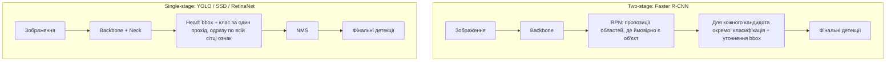
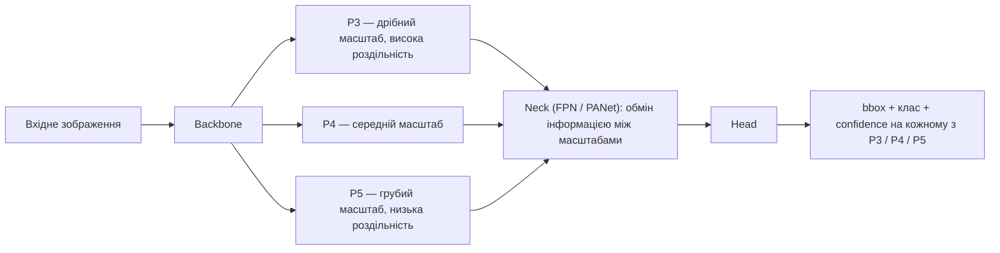
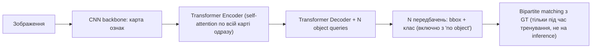
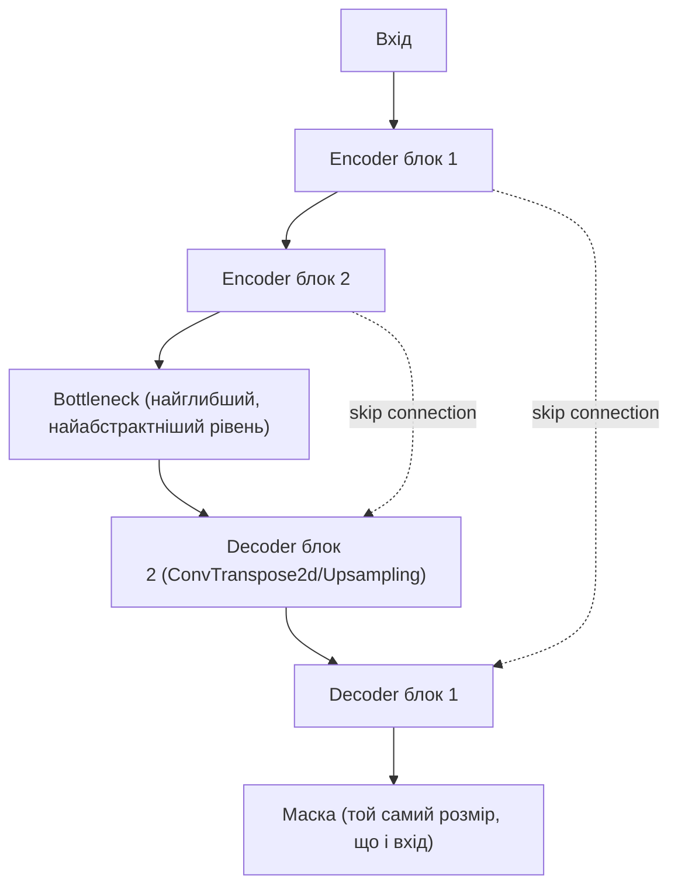
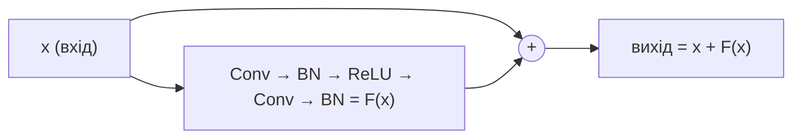
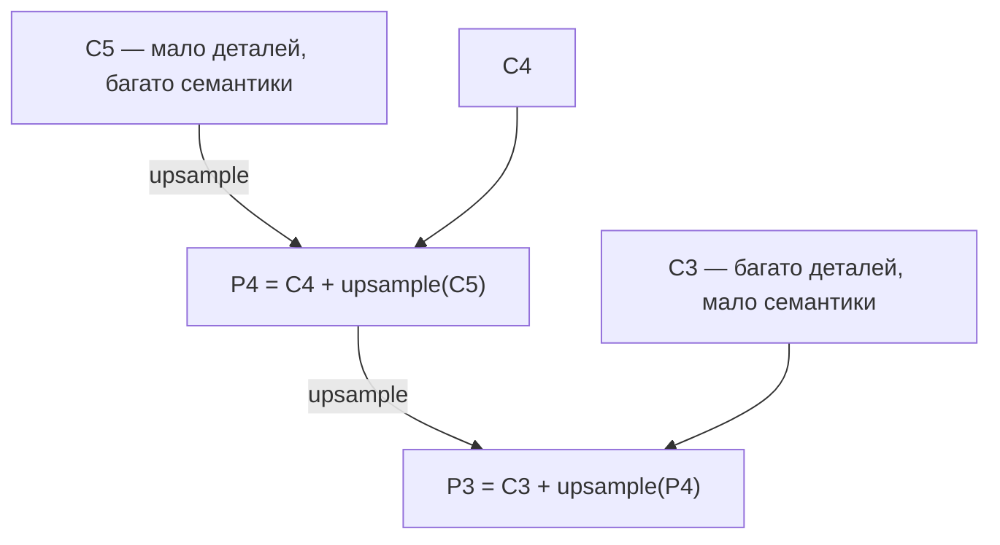
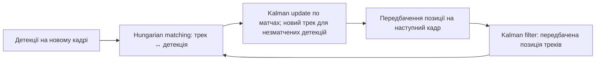

# Гайд для Middle CV/DS Engineer: метрики, архітектури, тренування, розмітка даних, MLOps і edge-деплой

Комплексний практичний гайд для middle Computer Vision / Data Science інженера: від базових метрик і архітектур детекції, через PyTorch (шари, loss-функції, оптимізатори), гіперпараметри тренування YOLO, роботу з дрібними об'єктами і тайлінгом, якість даних і fine-tuning-стратегії, розмітку в CVAT — до оптимізації моделі під edge-пристрої та MLOps-практик.

## Зміст

1. [Метрики оцінки детекції: IoU, Precision/Recall, mAP](#1-метрики-оцінки-детекції-iou-precisionrecall-map)
2. [NMS та боротьба з дублікатами детекцій](#2-nms-та-боротьба-з-дублікатами-детекцій)
3. [Архітектури детекції та сегментації](#3-архітектури-детекції-та-сегментації)
4. [Backbone'и (feature extractors)](#4-backboneи-feature-extractors)
5. [Практичний вибір моделі](#5-практичний-вибір-моделі)
6. [PyTorch: тензори і типи задач Computer Vision](#6-pytorch-тензори-і-типи-задач-computer-vision)
7. [PyTorch: шари (layers)](#7-pytorch-шари-layers)
8. [Loss-функції](#8-loss-функції)
9. [Регуляризація та bias-variance trade-off](#9-регуляризація-та-bias-variance-trade-off)
10. [Оптимізатори (torch.optim)](#10-оптимізатори-torchoptim)
11. [Гіперпараметри тренування YOLO](#11-гіперпараметри-тренування-yolo)
12. [Дрібні об'єкти і тайлінг зображень](#12-дрібні-обєкти-і-тайлінг-зображень)
13. [Скільки даних потрібно та стратегії fine-tuning](#13-скільки-даних-потрібно-та-стратегії-fine-tuning)
14. [Якість даних, робастність і діагностика моделі в проді](#14-якість-даних-робастність-і-діагностика-моделі-в-проді)
15. [Трекінг об'єктів: SORT / DeepSORT / ByteTrack](#15-трекінг-обєктів-sort--deepsort--bytetrack)
16. [Тонкі структури і точні межі в сегментації](#16-тонкі-структури-і-точні-межі-в-сегментації)
17. [Розмітка даних у CVAT](#17-розмітка-даних-у-cvat)
18. [Огляд інструментів дата саєнтиста та лейблінг-платформ](#18-огляд-інструментів-дата-саєнтиста-та-лейблінг-платформ)
19. [Оптимізація моделі та edge-деплой](#19-оптимізація-моделі-та-edge-деплой)
20. [MLOps-практики](#20-mlops-практики)
21. [Процесні стандарти для DS/ML-проєктів](#21-процесні-стандарти-для-dsml-проєктів) — [PoC vs Prototype](#poc-і-prototype-що-обирати-і-що-порівнювати)
22. [A/B тестування і статистична значущість](#22-ab-тестування-і-статистична-значущість)
23. [Робочі звички: логи, прогрес-бари, як читати тренування](#23-робочі-звички-логи-прогрес-бари-як-читати-тренування)
24. [Глосарій абревіатур](#24-глосарій-абревіатур)

---

## 1. Метрики оцінки детекції: IoU, Precision/Recall, mAP

**IoU (Intersection over Union)** — площа перетину двох боксів поділена на площу обʼєднання. На практиці це відповідь на питання «наскільки коробка моделі збігається з розміткою». IoU = 0.5: коробка перекриває обʼєкт більше ніж наполовину — грубо, але вже «влучила». IoU = 0.9: майже калька розмітки; зсув на кілька пікселів у дрібній машині вже провал. Той самий IoU стоїть і в eval (чи предикт = TP), і всередині NMS (чи два предикти — дублікати).

**Precision** — з усіх коробок, які модель намалювала, яка частка справді машина. Низька precision = оператор тоне в порожніх рамках.

**Recall (detection rate)** — з усіх обʼєктів у розмітці, яку частку взагалі знайшли. Низький recall = обʼєкти є на кадрі, модель їх пропускає. Для продукту «чи знайшли ціль» це часто ближче до задачі, ніж тісний бокс.

**Precision/Recall trade-off.** Це не дві незалежні характеристики моделі, а результат одного й того самого вибору — **порогу confidence**, вище якого детекція вважається "достатньо впевненою", щоб її показати. Підняти поріг → лишаються тільки найвпевненіші детекції → менше false positives → **precision росте**, але частина реальних, менш впевнено передбачених об'єктів відсікається → **recall падає**. Опустити поріг → навпаки: recall росте (модель "намагається" знайти більше), precision падає (більше шумних/помилкових детекцій проходить). Немає порогу, який максимізує обидві метрики одночасно — вибір залежить від задачі: якщо пропустити об'єкт дорожче, ніж отримати хибне спрацювання (напр. безпекова система) — краще нижчий поріг (пріоритет recall); якщо хибні спрацювання дорого коштують (багато ручної перевірки помилкових детекцій) — вищий поріг (пріоритет precision). Саме тому AP/mAP (нижче) — усереднення по **всіх** порогах, а не число при одному довільно обраному порозі: це дає оцінку якості моделі незалежно від того, який поріг для неї згодом оберуть у проді.

**Confusion matrix для детекції — чому це складніше, ніж для класифікації.** У звичайній класифікації confusion matrix — таблиця "справжній клас × передбачений клас", включно з true negatives. У детекції **немає природного поняття true negative** — не можна перелічити всі місця, де "об'єкта немає і модель правильно нічого не знайшла" (фон не є скінченним переліком кандидатів). Тому detection confusion matrix (напр. те, що будує Ultralytics після `val()`) будується інакше:
- Кожна GT-рамка й кожна передбачена рамка зіставляються між собою за IoU (тим самим порогом, що і для TP/FP, розділ вище).
- Клітинки "справжній клас × передбачений клас" — це випадки, коли модель знайшла обʼєкт, але приписала йому не той клас (плутанина між класами, напр. "легковий автомобіль" переплутаний з "фургон").
- Окремий рядок/стовпець **"background"** замінює "true negative": стовпець `background` у рядку класу X — це **false negative** (реальний обʼєкт класу X, якого модель взагалі не знайшла), рядок `background` у стовпці класу X — це **false positive** (модель "побачила" обʼєкт класу X там, де насправді нічого немає).
- Діагональ (клас X передбачений як клас X) — true positives.

Практична цінність для роботи над проєктом: подивитись, який клас найчастіше плутається з іншим (недостатньо відмінних ознак у розмітці/даних) і який клас частіше за інших "провалюється в background" (найбільше false negatives — типово дрібні/далекі обʼєкти цього класу) — це готовий, конкретний matеріал для аналізу помилок, а не абстрактне число mAP.

**Приклад для детекції одного класу.** Коли клас всього один, матриця вироджується в 2×2 (`object` vs `background`). Ілюстративні числа (IoU-поріг TP = 0.5):

| Predicted \ Actual | object (GT) | background |
|---|---|---|
| **object** (predicted) | TP = 120 | FP = 30 |
| **background** (не задетектовано) | FN = 380 | — (не визначено) |

Клітинка "background × background" (правий нижній кут) **не заповнюється** — це і є той самий "немає true negative", про який ідеться вище: не можна порахувати "скільки разів модель правильно нічого не знайшла там, де справді нічого немає", бо кількість таких порожніх місць у кадрі не є скінченною величиною.

З матриці напряму:
- **Precision** = 120 / 150 ≈ **80%**
- **Recall** = 120 / 500 ≈ **24%**

Патерн «precision ок, recall провал» — типовий для дрібних/далеких обʼєктів: діагностика через TP/FP/FN одразу показує, куди дивитись (imgsz/тайли, confidence, якість GT).

**Приклад з кількома класами (теоретичний).** Ілюстративні числа — типовий патерн Ultralytics `confusion_matrix.png`:

| Predicted \ Actual | car | truck | bus | background |
|---|---|---|---|---|
| **car** | 850 | 40 | 5 | 120 |
| **truck** | 30 | 210 | 8 | 25 |
| **bus** | 3 | 12 | 95 | 8 |
| **background** | 90 | 35 | 10 | — |

Як читати цю матрицю (рядок = що передбачила модель, стовпець = що насправді було за GT):

- **Діагональ** (850, 210, 95) — правильні детекції (TP) кожного класу окремо.
- **Стовпець `background`** (120, 25, 8) — false negatives: реальні обʼєкти класу car/truck/bus, яких модель взагалі не задетектувала.
- **Рядок `background`** (90, 35, 10) — false positives: модель "побачила" обʼєкт там, де за GT нічого немає (галюцинації моделі).
- **Клітинки поза діагоналлю, що не в рядку/стовпці background** — саме та плутанина класів, якої не було в однокласовому прикладі: напр. клітинка [truck-рядок, car-стовпець] = 30 означає "30 разів реальний **car** (за GT) модель впевнено назвала **truck**". У наведеному прикладі найпомітніша плутанина — **car ↔ truck** (40 + 30 = 70 випадків) — типова ситуація, коли легкий комерційний фургон/пікап на дрібному/далекому плані аерофотозйомки візуально складно відрізнити від легкового авто за формою силуету; плутанина ж **bus** з іншими двома класами значно менша (5+3+12+8=28), бо автобус має відчутно інший силует навіть на невеликому дозволі.

**Практичний висновок з багатокласового паттерну:** проблема часто не в архітектурі, а в **межі між схожими класами на конкретному датасеті** — або (а) переглянути guideline і консистентність розмітки (розділ [17](#17-розмітка-даних-у-cvat)), або (б) обʼєднати схожі класи в один, якщо бізнесу різниця не критична.

**AP (Average Precision)** для одного класу — площа під precision-recall кривою: для кожного порогу confidence рахуєш precision і recall, будуєш криву, інтегруєш. Практичний сенс: одна цифра, яка не залежить від того, який саме confidence ви поставите в проді.

**mAP (mean Average Precision)** — усереднення AP по всіх класах. Для однокласової задачі mAP = AP.

**mAP@0.5** рахує середню точність, коли предикт вважається влучанням лише якщо IoU з GT ≥ 0.5. Коробка може бути досить грубою — головне, що вона перекриває обʼєкт більше ніж наполовину.

**mAP@0.5:0.95** — те саме, але середнє по 10 порогах IoU: 0.50, 0.55, …, 0.95. Щоб не впасти на 0.75–0.95, бокс має майже збігатися з розміткою.

**mAP@0.5 vs mAP@0.5:0.95 — різні питання.** Перший відповідає «чи знайшли обʼєкт»; другий — «наскільки тісний бокс». На практиці різні налаштування (аугментації, stride, imgsz) можуть покращити один і погіршити інший: більше грубих детекцій піднімає 0.5, але знижує 0.5:0.95 через FP і неточну геометрію. Для продукту «чи взагалі знайшли» дивляться **0.5**; для якості боксу — **0.5:0.95**. Обидві метрики варто тримати в таблиці порівнянь; рішення про winner — за попередньо обраною бізнес-метрикою.

**Чому один загальний mAP може брехати.** Якщо 90% обʼєктів — великі/близькі, а 10% — дрібні далекі, загальний mAP домінує легкою більшістю. Тому eval варто **розбивати по групах розміру** (close / medium / far), а не однією цифрою — аналог COCO AP-small/medium/large. Для aerial можна групувати за площею бокса або оціненою дальністю (проксі через відому фізичну довжину обʼєкта і розмір бокса в пікселях).

> Приклад відповіді на співбесіді: «Я свідомо розділяю оцінку по групах об'єктів за розміром, а не дивлюсь тільки на загальний mAP — агрегована метрика ховає слабкість на дрібних/далеких. Окремо дивлюсь mAP@0.5 і mAP@0.5:0.95, бо вони відповідають на різні продуктові питання.»

**Операційні метрики при фіксованому confidence** (на відміну від mAP, який усереднює по порогах):

| Що в таблиці | Простими словами | Коли дивитись |
|---|---|---|
| **Det** (detection rate) | З усіх GT-обʼєктів яку частку спіймали. Не карає за зайві коробки. | «Чи пропускаємо цілі?» — пріоритет, якщо пропуск дорожчий за сміття. |
| **P** (precision) | З усіх намальованих коробок яка частка справді ціль. | «Чи тоне оператор у FP?» Високий mAP@0.5 при низькій P = знаходить, але сипле сміттям. |
| **FA/min** | Скільки зайвих коробок на хвилину відео. | Операційна гучність — та сама detection rate, але інше навантаження на людину. |
| **Time to first det** | Через скільки секунд зʼявляється перший правильний бокс. | «Як швидко помітили», не «наскільки точно обвели». |

**Confidence vs mAP.** Det / P / FA рахуються при одному обраному порозі confidence. Підняти поріг → менше сміття, більше пропусків. mAP навмисно усереднює по **всіх** порогах. У проді все одно доведеться вибрати один поріг — тоді дивляться Det/P/FA саме на ньому.

**Data drift** — розподіл даних у проді відрізняється від того, на чому тренували модель (інше освітлення, кут камери, нові типи об'єктів). Детальніше про діагностику ситуації "valid добре, прод погано" — у розділі [14](#14-якість-даних-робастність-і-діагностика-моделі-в-проді).

---

## 2. NMS та боротьба з дублікатами детекцій

**NMS (Non-Maximum Suppression)** — прибирає дублікати детекцій одного обʼєкта. Простими словами: якщо дві коробки сильно перекриваються, лишаємо лише впевненішу. Поріг IoU NMS = 0.5 означає «перекриття більше ніж наполовину = це той самий обʼєкт». На щільній парковці дві різні машини можуть перетнутись сильніше — тоді NMS зʼїсть другу (пропуск), або навпаки лишить дубль, якщо поріг зависокий.

1. Сортуєш всі бокси за confidence, найвищий — перший.
2. Береш найвпевненіший бокс, прибираєш усі інші бокси того ж класу з IoU вище порогу (типово 0.45-0.5) відносно нього.
3. Повторюєш для наступного найвпевненішого серед тих, що лишились.

**Проблема NMS для щільних сцен:** якщо два реальні об'єкти стоять впритул і їхні GT-бокси перетинаються з IoU вище порогу — NMS може помилково прибрати правильну детекцію другого об'єкта, вважаючи її дублем першого. Це особливо актуально для дронових кадрів з кількома машинами поруч (щільне паркування) або натовпом/технікою.

**Soft-NMS** — рішення: замість повного видалення бокса з високим IoU до найкращого, його confidence **знижується пропорційно** до IoU (чим більше перекриття — тим сильніше падає score), а не обнуляється миттєво. Бокс лишається в списку, просто з нижчим пріоритетом — і якщо це реально окремий обʼєкт, а не дублікат, він все ще пройде фінальний поріг confidence. Це типове рішення в small-object форках YOLOv8 для густих aerial-сцен.

**Повна відмова від NMS — DETR-родина.** Замість post-processing кроку NMS, transformer-based детектори (DETR, RT-DETR) використовують bipartite matching між передбаченнями і GT під час тренування, що напряму прибирає потребу в NMS. Детальніше про цей підхід — у розділі [3](#3-архітектури-детекції-та-сегментації).

**Практичний вибір порогу IoU для NMS на inference:** вище значення → менше рамок відсіюється як дублікати (ризик залишити дублікати на густих сценах), нижче → агресивніше прибирання (ризик видалити сусідні окремі об'єкти, які просто розташовані близько). Для густих aerial-сцен це значення варто підбирати окремо, а не лишати дефолтним.

> Приклад відповіді на співбесіді: "На aerial-задачах з щільним паркуванням стандартний NMS може губити сусідні обʼєкти через високий IoU — сценарій для soft-NMS або зниження IoU-порогу NMS ціною ризику дублікатів."

---

## 3. Архітектури детекції та сегментації

### Ландшафт CNN-родин object detection (коротка карта)

Перш ніж заглиблюватись у YOLO — корисно тримати в голові, які взагалі "родини" CNN-детекторів існують і як вони пов'язані історично. Це типове питання на співбесіді ("які архітектури детекції ти знаєш, крім YOLO?").

1. **R-CNN родина (two-stage)** — R-CNN → Fast R-CNN → Faster R-CNN → Cascade R-CNN / Mask R-CNN (останній — уже для сегментації, розділ нижче). Спільна ідея всієї лінії: **два окремі кроки**. Спочатку окрема підмережа (Region Proposal Network у Faster R-CNN) пропонує кандидатські області, де ймовірно є обʼєкт (region proposals), не знаючи ще, який це клас. Другий крок бере кожен кандидат окремо, класифікує його і уточнює координати bbox. Cascade R-CNN додатково повторює крок уточнення кілька разів підряд зі зростаючим порогом IoU — кожен наступний каскад "дотягує" bbox точніше. Найточніша лінія детекторів, і найповільніша — через два послідовні кроки й окрему обробку кожного кандидата.
2. **SSD / YOLO v1-v5 родина (single-stage, anchor-based)** — прибирають окремий крок "пропозицій": мережа за **один прохід** одразу передбачає зміщення відносно наперед заданих якорів (розділ "Anchor-based vs anchor-free" нижче) і клас, у кожній точці сітки ознак. Значно швидше за R-CNN родину, ціною певної втрати точності (особливо на дрібних/щільних об'єктах) — саме той компроміс, який зробив YOLO стандартом для real-time задач.
3. **RetinaNet** — теж single-stage anchor-based, як SSD/YOLO, але вирішує головну слабкість чистого single-stage підходу: величезний дисбаланс "фон vs обʼєкт" (тисячі якорів на порожньому фоні проти кількох з реальним обʼєктом), який до цього змушував гнатись за точністю two-stage детекторів. Робить це через **Focal Loss** (розділ [8](#8-loss-функції)) — і завдяки цьому наближається до точності two-stage детекторів, залишаючись single-stage за швидкістю.
4. **Anchor-free / keypoint-based родина** (CenterNet, FCOS, YOLOv8+) — ідея: замість підбору й регресії відносно набору заздалегідь заданих якорів, мережа напряму передбачає **ключову точку** обʼєкта (типово центр bbox) і його розміри (ширину/висоту) від цієї точки. **CenterNet** — де об'єкт представлений однією точкою-центром на "тепловій карті" (heatmap), розміри передбачаються окремою регресійною гілкою від цієї точки. **FCOS** (Fully Convolutional One-Stage) — для кожного пікселя карти ознак, що потрапляє всередину GT bbox, напряму передбачає відстані до чотирьох країв рамки; додатковий "centerness"-score пригнічує передбачення з периферії обʼєкта (де регресія межі менш надійна) на користь передбачень ближче до центру. Практична перевага всієї родини — менше гіперпараметрів для підбору (не треба генерувати/підбирати anchor-boxes під датасет), краща генералізація на нетипові aspect ratio.
5. **EfficientDet** — single-stage, anchor-based, але фокус не на прибиранні кроків, а на **ефективності архітектурного дизайну**: (а) **compound scaling** — замість довільного збільшення глибини/ширини/роздільності мережі окремо (як у "просто взяти більший backbone"), масштабує всі три виміри одночасно за єдиною формулою-коефіцієнтом, підібраною емпірично як оптимальне співвідношення; (б) **BiFPN** (Bidirectional FPN) — ефективніша багаторівнева піраміда ознак порівняно зі звичайним FPN: додає зворотні (знизу-вгору) звʼязки на додаток до стандартних згори-вниз, і кожному вхідному з'єднанню призначає навчений ваговий коефіцієнт (не всі рівні ознак однаково важливі при злитті). Результат — вища точність на FLOP порівняно з YOLO/RetinaNet того часу, хоча на практиці програє YOLO за реальною latency на edge-чипах через складнішу структуру BiFPN-звʼязків.
6. **DETR-родина** (DETR, RT-DETR, RF-DETR) — технічно **не CNN-родина**, а transformer-based підхід; розглянута детально в окремому підрозділі нижче саме тому, що це принципово інша парадигма (self-attention замість згорток, set prediction замість sliding-window), а не черговий крок еволюції CNN-детекторів.

Далі в розділі — детальніше по кожній ключовій родині (з основним фокусом на YOLO, як найпоширенішій зараз для real-time/edge задач), плюс практичні наслідки вибору для aerial/дрон-специфіки.

**Схема: two-stage vs single-stage** (найпринциповіша розбіжність між родинами 1 і 2-4 вище):



Ключова візуальна різниця: у two-stage є явний проміжний крок "кандидати" між зображенням і фінальним рішенням; у single-stage мережа йде від зображення до bbox+клас за один прохід, без проміжного кроку — саме тому single-stage швидший.

### Anchor-based vs anchor-free

**Anchor-based** (YOLOv5 і раніше, Faster R-CNN, SSD): модель заздалегідь має набір "якорів" — прямокутників фіксованих розмірів/пропорцій у кожній точці сітки features. Модель передбачає не бокс з нуля, а **зміщення й масштаб відносно найближчого якоря**. Мінус: якорі треба підбирати під датасет (k-means по GT-боксах), погано генералізується, якщо реальні обʼєкти сильно відрізняються за формою від якорів.

**Anchor-free** (YOLOv8+, FCOS, CenterNet): модель напряму передбачає центр обʼєкта і його розміри, без попередньо заданих якорів. Простіше конфігурувати, менше гіперпараметрів, зазвичай кращий на обʼєктах з нетиповим aspect ratio.

### Три частини детектора: Backbone → Neck → Head

Будь-який CNN-детектор (YOLO і подібні) зручно уявляти як три послідовні блоки з чітко різними ролями:

1. **Backbone** — витягує ознаки із зображення на кількох рівнях глибини/масштабу: перші шари бачать елементарні краї й кольорові плями, глибші — текстури, ще глибші — цілі форми й семантику ("це схоже на машину"). На виході backbone віддає **кілька** карт ознак різного розміру (напр. P3 — дрібніший масштаб/більша роздільність, P5 — грубіший масштаб/менша роздільність), а не одну.
2. **Neck** — приймає ці кілька карт ознак від backbone і **змішує інформацію між масштабами**, перш ніж віддати їх у head. Найпоширеніша реалізація — **FPN/PANet**: глибокі карти (мало деталей, багато семантики) підвищуються в роздільності (upsampling) і зливаються з неглибокими картами (багато деталей, мало семантики) — так кожен рівень отримує і "що це", і "де саме точно". Без neck детектор або взагалі не бачив би дрібні об'єкти (вони губляться на глибокому рівні до того, як мережа зрозуміє "це об'єкт"), або бачив би їх без достатньої семантики для правильної класифікації. Детальніше про механізм — розділ [7](#7-pytorch-шари-layers) (FPN).
3. **Head** — бере вже збагачені neck'ом карти ознак і перетворює їх у фінальний вихід: координати bbox, клас, впевненість — окремо для кожного з кількох рівнів масштабу (тому YOLO детектує і дрібні, і великі об'єкти одночасно, кожен на "своєму" рівні P3/P4/P5).

Схема для співбесіди — саме це варто вміти намалювати від руки:



У спрощеному YAML-прикладі нижче "backbone" і "head" — це саме перша і третя частина цієї схеми; neck (шари з `Upsample`/`Concat`, які змішують рівні) технічно в Ultralytics-конфігах включений у секцію `head`, хоча за роллю це саме neck-логіка — варто про це знати, щоб не плутатись при читанні реального конфіг-файлу.

### YOLO — сімейство моделей, а не одна архітектура

"YOLO" — не одна модель, а сімейство з дуже різними компромісами всередині (v5/v8/v11/v12/26, nano/small/medium/large). Вибір версії й розміру залежить від чотирьох осей: розмір об'єктів (дрібні — окрема проблема), hardware для inference (edge-пристрій чи сервер з GPU), бюджет на латентність (реальний real-time чи offline-аналіз відео), ліцензія (комерційний продукт чи ні).

**Спочатку варто перевірити, чи це взагалі задача детекції, чи можна спростити:**
- Якщо треба тільки "є об'єкт у кадрі чи нема" (без локалізації) — classification мережа (набагато легша й швидша за YOLO) може бути достатньою.
- Якщо об'єкти дуже дрібні й густі (рій дронів, натовп) — інколи ефективніше density estimation / counting (регресія теплокарти густини), а не bbox-детекція, бо bbox для об'єкта в 3 пікселі — це вже шум.
- Тільки якщо справді потрібні координати кожного окремого об'єкта — йти в детекцію.

**Вибір версії YOLO:**

| Версія | Коли обирають | Застереження з практики |
|---|---|---|
| YOLOv5 | Стабільність, багато готових інтеграцій, легасі-проєкти | Застаріла архітектура; на VisDrone (aerial, дрібні об'єкти) програє v8 на 60–300% по mAP50 — сильно відстає саме на small objects |
| YOLOv8 | Хороший баланс точність/швидкість, великий community, готові small-object модифікації | Для aerial: більші варіанти (l/x) дають приріст точності на дрібних об'єктах, але з ризиком нестабільності тренування на малих датасетах — в одному дослідженні YOLOv8x деградував гірше за YOLOv8l через training instability при обмежених даних |
| YOLOv11 / YOLOv12 | Новіші релізи, трохи легші й точніші за v8 при тому самому розмірі, anchor-free | Community/тьюторіали ще наздоганяють; менше готових "small-object" форків порівняно з v8 |
| YOLO26 | Найновіша, NMS-free (end-to-end, як RT-DETR) | Найменше практичного досвіду в спільноти на нішевих задачах типу thermal/aerial — ризик менш передбачуваної поведінки на нетипових даних |

Практичне правило вибору версії: якщо є час і бюджет на експерименти — брати v8 як baseline (найбільше literature/repos саме під small-object aerial modifications), і окремо спробувати v11 як другий кандидат. Не гнатись за найновішою версією "бо новіша" — для нішевої задачі (дрон, теплокамера) вирішує наявність готових напрацювань спільноти під схожий домен, а не номер версії. Якщо часу на дослідницьку роботу немає і задача йде "з коробки" без кастомних модифікацій — v11 кращий дефолтний вибір: C2PSA (attention-модуль, див. нижче) вже вбудований, менше параметрів при кращому/порівнянному mAP, офіційно підтримується Ultralytics нарівні з v8, той самий `model.train()`/`model.export()`.

**Навіщо взагалі потрібні attention-механізми в детекторі (коротко).**

- **На що спираються:** на той самий Query/Key/Value-механізм self-attention, що й у розділі [7](#7-pytorch-шари-layers) — кожна позиція карти ознак порівнюється з усіма іншими й отримує зважену суму інформації від релевантних.
- **Навіщо (яку проблему CNN вирішують):** звичайна згортка бачить тільки локальне вікно (напр. 3×3) за один шар — щоб "звʼязати" протилежні кути зображення чи далеко рознесені частини одного обʼєкта, потрібно накласти багато згорткових шарів поспіль, кожен з яких трохи розширює рецептивне поле. Attention дає прямий звʼязок між будь-якими двома точками карти ознак за один крок, незалежно від відстані між ними.
- **На що впливають:** не на сам bbox напряму, а на **якість карти ознак**, яку потім використовує neck/head — attention "підсвічує" канали/позиції, релевантні для реального обʼєкта, і пригнічує шум фону. Для дрібних обʼєктів на зашумленому aerial-фоні це особливо цінно: слабкий сигнал об'єкта легше "загубити" в чисто згортковій мережі, ніж у мережі, яка явно перерозподіляє увагу на інформативні ділянки.
- **Ціна:** attention має менше вбудованих припущень про зображення (inductive bias), ніж згортка (яка апріорі "знає" про локальність і трансляційну інваріантність) — тому чистий transformer зазвичай потребує більше даних для навчання з нуля. Саме тому YOLO не переходить на чистий transformer одразу, а вбудовує attention **точково**, поверх CNN-основи (C2PSA у v11, Area Attention у v12) — це дає частину переваг attention, зберігаючи ефективність і стабільність CNN на відносно невеликих датасетах.

**Що означає "decoupled head" (розділені гілки class/box).** У ранніх YOLO (v3–v5) один і той самий згортковий шар одночасно передбачав і клас, і координати bbox з тієї самої карти ознак — це створює конфлікт: класифікації вигідніші узагальнені, семантичні ознаки ("це схоже на машину"), а точній регресії bbox — просторово точні, локальні ознаки ("де саме межа"). Спільні фільтри для обох задач — компроміс, який трохи шкодить обом. **Decoupled head** (вперше в YOLOX, з YOLOv8 — стандарт у Ultralytics) розділяє це на дві окремі паралельні гілки згорток від однієї вхідної карти ознак: одна відповідає тільки за клас, друга — тільки за bbox, кожна вчиться своїм набором фільтрів. Результат — точніше й стабільніше тренування, ціною трохи більшої кількості параметрів (дві гілки замість однієї спільної).

**Архітектурна різниця v8 → v11 → v12 → v26** (офіційна таблиця архітектурних компонентів з документації Ultralytics):

| | YOLOv8 | YOLOv11 | YOLOv12 | YOLO26 |
|---|---|---|---|---|
| Ключовий блок backbone/neck | C2f — розділяє feature map, проганяє через bottleneck-шари, зливає назад | C3k2 — замінює C2f, більш гнучкий/ефективний варіант (менша велика згортка замінена на дві менші) | Зберігає лінію C3k2, додає R-ELAN блоки для кращого градієнтного потоку | C3k2 — **той самий блок, що й у v11**, не в v12 (див. примітку нижче) |
| Attention-механізм | Немає — чисто CNN | C2PSA (Cross-Stage Partial + Spatial Attention) | Area Attention (A²) — агресивніший attention-центричний дизайн | C2PSA — **той самий, що і в v11**, не Area Attention з v12 |
| Head | Anchor-free, decoupled | Той самий підхід + depthwise separable convolutions | Anchor-free, decoupled (той самий підхід, що v8/v11) | Anchor-free, **NMS-free** (`end2end=True`, one-to-one head), DFL **прибрано** (`reg_max=1` — регресія координат напряму) |
| Параметри / mAP відносно v8 (реальні цифри Ultralytics, COCO val) | Baseline | На тарифі L: 25.3M проти 43.7M параметрів у v8 (**−42%**) при порівнянному/кращому mAP | На тарифі L: 26.4M проти 43.7M (**−40%**), mAP50-95 53.7 проти ~52.9 у v8 (**+0.8 в.п.**) | На тарифі N: 2.4M проти 3.2M (**−25%**), mAP50-95 40.9 проти 37.3 (**+3.6 в.п.**), CPU ONNX latency 38.9мс проти 80.4мс (**майже вдвічі швидше**) |

**Важлива примітка про спадковість:** попри порядок номерів версій, **YOLO26 архітектурно продовжує лінію YOLO11** (той самий C3k2 + C2PSA), а **не** лінію YOLOv12 (Area Attention + R-ELAN) — YOLOv12 узагалі окрема дослідницька гілка (інша команда авторів, не основна лінія Ultralytics), яку Ultralytics підтримує паралельно, а не як "проміжний крок" до v26. Головна архітектурна новизна v26 — не attention чи backbone (вони як у v11), а **head**: прибраний NMS-крок (`end2end`, one-to-one передбачення) і прибраний DFL (`reg_max=1`, координати регресуються напряму без розподілу-по-бінах).

**Примітка про C2PSA і зйомку під різними кутами.** C2PSA — не фіксована позиційна прив'язка ("цей кут кадру завжди важливий"). Attention-мапа рахується заново для кожного окремого зображення, динамічно, на основі вмісту саме цього кадру — немає fixed positional encoding, як буває в деяких трансформерах. Тобто "spatial" означає "увага розподілена по позиціях всередині конкретного зображення", а не "модель запам'ятала конкретні координати з тренування". Для відео під різними кутами це не заважає і теоретично навіть допомагає. Реальний ризик генералізації на нові кути — це властивість браку різноманітності даних (розділ [13](#13-скільки-даних-потрібно-та-стратегії-fine-tuning)), а не специфічний недолік attention.

**Чому v8 часто беруть як baseline, а не одразу найновішу версію:**
1. **Обсяг small-object/aerial літератури.** Переважна більшість "small-object modification" статей (P2-шар, GAM, Soft-NMS форки) написані й перевірені саме на v5/v8 — є з чим порівняти й що адаптувати з готового.
2. **Стабільність vs теоретична перевага.** Новіше не завжди означає швидше в реальному деплої: в одному дослідженні на агро-задачі профілювання показало неефективності в реалізації multi-process архітектури YOLOv12, які "з'їдали" теоретичну перевагу на edge-пристрої (Jetson AGX Orin).
3. **v11 — гарний другий кандидат, не перший**, бо C2PSA потенційно допомагає саме з aerial-специфікою (виділити дрібний об'єкт на шумному фоні), і вже є кілька незалежних досліджень, де v11 явно порівнюють з v8 як predecessor-baseline.
4. **v12 — найменше "перевірений часом"** для нішевих задач — цікаво спробувати третім, якщо є час, але не як єдину ставку.

### Модифікації YOLO спеціально під small objects (aerial)

Це не окремі "інші моделі", а форки/доповнення YOLO, які в дослідженнях consistently покращують результат на дрібних об'єктах:
- **Додатковий детекційний шар P2** (для дуже дрібних об'єктів, "бачить" на вищій роздільності до сильного downsampling) — типове рішення в small-object форках YOLOv8.
- **Attention-модулі в backbone/neck** (GAM, SE-блоки) — допомагають моделі "не загубити" слабкий сигнал дрібного об'єкта серед фону.
- **Заміна NMS на Soft-NMS** — див. розділ [2](#2-nms-та-боротьба-з-дублікатами-детекцій).

Ці модифікації дають приріст мАП на кілька відсотків понад baseline YOLOv8 у профільних дослідженнях на VisDrone/TinyPerson датасетах.

### Розмір моделі: що означають літери n/s/m/l/x

Це не про "скільки часу", а про масштаб мережі — множники ширини (кількість каналів) і глибини (кількість шарів/повторень блоків) тієї самої базової архітектури. Прямо визначає кількість параметрів, FLOPs, і звідси — точність, швидкість і пам'ять.

Конкретні цифри (YOLOv12, показово — той самий патерн для v8/v11):

| Модель | Параметри | FLOPs | mAP | Latency (T4 GPU, TensorRT FP16) | FPS (1000/latency) |
|---|---|---|---|---|---|
| N (nano) | 2.6M | 6.5G | 40.6 | 1.64 мс | ~610 |
| S (small) | 9.3M | 21.4G | 48.0 | 2.61 мс | ~383 |
| M (medium) | 20.2M | 67.5G | 52.5 | 4.86 мс | ~206 |
| L (large) | 26.4M | 88.9G | 53.7 | 6.77 мс | ~148 |
| X (xlarge) | 59.1M | 199.0G | 55.2 | 11.79 мс | ~85 |

FPS тут — це `1000 / latency`, тобто теоретична пропускна здатність саме моделі на цьому конкретному GPU (T4, TensorRT FP16, batch=1), без урахування pre/post-processing (resize, NMS, decode кадру з відео) і без урахування tiling — якщо кадр ріжеться на N тайлів, реальний FPS пайплайна ділиться приблизно на N. На слабшому edge-пристрої (Jetson замість T4) ці цифри будуть суттєво нижчими — орієнтир по співвідношенню моделей між собою зберігається, абсолютні числа треба вимірювати на цільовому залізі.

Закономірність: параметри й FLOPs ростуть швидше, ніж mAP — від N до X параметри зростають в ~23 рази, а mAP — лише на ~14 в.п. Класична крива спадної віддачі (diminishing returns). Для aerial з дрібними об'єктами дослідження систематично показують, що більший бекбон (l) дає суттєвий приріст на small objects — але тільки до певної межі; надто великий (x) на малому/незбалансованому датасеті може почати деградувати через нестабільність тренування. Тобто "більше — краще" тут не лінійно, і це варто перевіряти емпірично на своїх даних, а не брати найбільший варіант за замовчуванням.

**За яким параметром обирати літеру (конкретні орієнтири, не "великий/малий"):**

1. **Бюджет пам'яті цільового пристрою.** Орієнтовний рівень VRAM/RAM типових edge-пристроїв: 
- Jetson Nano — 4 ГБ (спільна з CPU) → реалістично тільки n, інколи s при малому imgsz; 
- Jetson Xavier NX / Orin Nano — 8 ГБ → n/s комфортно, m можливо при imgsz≤640 і batch=1; 
- Jetson AGX Orin — 32–64 ГБ → m/l вільно, x при потребі; 
- десктопний/серверний GPU (8–24+ ГБ VRAM) — будь-який розмір, обмеження зникає. 
Сама вага моделі (n/s ~10–40 МБ, m ~50 МБ, l/x ~100–250 МБ) — мала частина споживання пам'яті; основне з'їдають activation-буфери inference, які ростуть з imgsz і batch size, тому цифри вище — орієнтир, а не гарантія без вимірювання на своєму пристрої.
2. **Latency-бюджет.** Порахуйте бюджет на кадр від потрібного FPS пайплайна: 30 FPS = 33 мс/кадр, 15 FPS = 67 мс/кадр. З цього бюджету відніміть pre/post-processing (зазвичай 3–10 мс) і, якщо є tiling, помножте залишок на кількість тайлів — це і є ліміт на latency моделі з таблиці вище. Приклад: потрібно 15 FPS на 4 тайли → 67 мс / 4 ≈ 17 мс на тайл мінус ~5 мс overhead ≈ 12 мс на inference моделі → з таблиці YOLOv12 це залишає n/s/m (L вже 6.77 мс сам по собі є прийнятним, тож на практиці рамка тут м'якша, ніж на дуже жорстких real-time вимогах).
3. **Розмір датасету.** Поріг залежить не тільки від літери, а й від того, яку стратегію fine-tuning ви обираєте (розділ [13](#13-скільки-даних-потрібно-та-стратегії-fine-tuning)) — **full fine-tuning** (backbone розморожений, оновлюється разом з head; типовий сценарій research-статей, бо дає найвищу стелю точності) чи **frozen-backbone fine-tuning** (`freeze=N`, тренується тільки head/neck; backbone лишається фіксованим екстрактором ознак і не отримує нестабільного градієнта від малої вибірки). Орієнтовні пороги на клас (порядок величини, не точний вимір — масштабуються від єдиного задокументованого в дослідженнях кейсу нестабільності на найбільшій моделі, перевіряти емпірично на своєму val):

   | Літера | Full fine-tuning (весь backbone розморожений) | Frozen-backbone fine-tuning (тільки head/neck) |
   |---|---|---|
   | n | від ~200–300 зображень — найстійкіша до малих даних, точність просто плавно нижча, а не "ламається" | від ~50–100 зображень |
   | s | від ~500 зображень для стабільного тренування | від ~100–200 зображень |
   | m | орієнтовно ~1000–1500 зображень як безпечний мінімум | ~200–300 зображень |
   | l | ~2000+ зображень; менше — зростає ризик нестабільності тренування | ~300–500 зображень |
   | x | 5000+ зображень рекомендовано; менше — реальний задокументований ризик деградації (YOLOv8x тренувався гірше за YOLOv8l саме через обмежені дані в одному дослідженні) | ~500–1000 зображень |

   Тобто на ~500 зображеннях/клас **full fine-tuning x чи l — ризиковано, а frozen-backbone x чи l — цілком робочий варіант**: вибір тут не "мало даних → завжди n/s", а трейд-офф між full fine-tuning (ризик нестабільності на малих даних, але backbone повністю адаптується під ваш домен) і frozen-backbone (стабільно на малих даних, але backbone лишається "COCO-зором" — якщо домен сильно нетиповий, наприклад aerial-ракурс згори чи thermal з низьким контрастом, це обмежує стелю точності знизу).
   Окремо для n/s є і зворотний ефект: на великому датасеті (5000+ зображень/клас) вони швидше впираються в стелю власної місткості — додаткові дані вже не дають пропорційного приросту точності. Це сигнал рухатись до m/l (за умови, що памʼять/latency з пп. 1–2 дозволяють), інакше великий датасет лишається невикористаним резервом.
4. **Складність домену** (розмір/густина об'єктів). Дрібні й щільно розташовані об'єкти (aerial, натовп) — аргумент підняти на одну літеру вище мінімуму, продиктованого пп. 1–2, бо більший backbone дає реальний приріст саме на small objects.

### Fine-tuning vs from scratch: як це виглядає в коді Ultralytics

**Тренування з нуля (from scratch)** — модель вчить усе: від елементарних країв до складних форм обʼєктів. Потребує датасету масштабу COCO (~118 000 зображень, сотні тисяч bbox-інстансів). На практиці окремі data scientist-и/невеликі команди це майже ніколи не роблять — беруть готовий pretrained backbone.

**Fine-tuning** — backbone вже вміє знаходити краї/текстури/форми (навчений на COCO чи іншому великому датасеті), моделі лишається довчитись розпізнавати саме ваші класи на цій готовій основі. Тому потрібно на порядки менше даних.

Архітектура кожної YOLO-моделі описана в YAML-файлі з чітким розділенням на **backbone** і **head** (спрощений приклад структури, не точна копія реального файлу — числа каналів/шарів варіюються по версіях):

```yaml
backbone:
  # [from, repeats, module, args]
  - [-1, 1, Conv, [64, 3, 2]]      # layer 0 - витягує елементарні краї
  - [-1, 1, Conv, [128, 3, 2]]     # layer 1
  - [-1, 3, C2f, [128, True]]      # layer 2 - текстури, прості патерни
  - [-1, 1, Conv, [256, 3, 2]]     # layer 3
  - [-1, 6, C2f, [256, True]]      # layer 4
  - [-1, 1, Conv, [512, 3, 2]]     # layer 5
  - [-1, 6, C2f, [512, True]]      # layer 6 - складніші форми
  - [-1, 1, Conv, [1024, 3, 2]]    # layer 7
  - [-1, 3, C2f, [1024, True]]     # layer 8
  - [-1, 1, SPPF, [1024, 5]]       # layer 9 - кінець backbone

head:
  - [-1, 1, nn.Upsample, [None, 2, "nearest"]]   # layer 10, тут починається head - вже task-specific частина
  - [[-1, 6], 1, Concat, [1]]
  # ... детекційні голови P3/P4/P5 далі
```

Backbone (шари 0-9) — та частина, що виявляє **загальні** візуальні патерни (краї → текстури → форми), незалежно від того, детектуєш ти машини, коти чи облич. Head (шари 10+) — та частина, що вже конкретно перетворює ці ознаки в bounding box + клас для **твоїх** класів. Саме тому backbone можна взяти "готовим", а head треба довчати під конкретні класи.

```python
from ultralytics import YOLO

# FINE-TUNING: завантажує .pt - і архітектуру, і pretrained ваги backbone (навчені на COCO)
model = YOLO("yolov8n.pt")
model.train(data="data.yaml", epochs=50)

# FROM SCRATCH: завантажує .yaml - тільки архітектуру, ваги ініціалізуються випадково
model_scratch = YOLO("yolov8n.yaml")
model_scratch.train(data="data.yaml", epochs=300)  # потребує на порядки більше епох/даних для збіжності
```

Різниця буквально в розширенні файлу, який передаєш у `YOLO(...)` — `.pt` тягне за собою навчені ваги, `.yaml` — тільки "порожню" структуру шарів.

**Заморозка backbone** — практичний інструмент fine-tuning. Параметр `freeze` в `model.train()` заморожує перші N шарів (рахуючи по тим самим індексам, що в YAML вище) — вони не оновлюються під час тренування, оновлюється тільки head/neck:

```python
model = YOLO("yolov8n.pt")
model.train(data="data.yaml", epochs=50, freeze=10)  # заморожує весь backbone (шари 0-9), вчиться тільки head
```

Як подивитись, скільки саме шарів backbone у конкретній моделі (щоб знати правильне число для `freeze`):

```python
for i, layer in enumerate(model.model.model):
    print(i, layer.__class__.__name__)
```

Виведе послідовний список шарів з індексами — саме ці індекси і використовуються в `freeze=N`. Детальніше про staged fine-tuning і коли заморожувати backbone — у розділі [13](#13-скільки-даних-потрібно-та-стратегії-fine-tuning).

### DETR-родина: детекція без NMS

**Що таке transformer, коротко.** Transformer — архітектура, що прийшла з NLP (обробка тексту) і побудована навколо self-attention (механізм Query/Key/Value, розділ [7](#7-pytorch-шари-layers)): кожен елемент вхідної послідовності одразу порівнюється з усіма іншими елементами й отримує зважену суму інформації від релевантних з них, за один крок, без обмеження на "локальне вікно", як у згортки. Кілька таких шарів self-attention, складених стеком (encoder), обробляють вхід цілком; другий стек (decoder) генерує вихід, спираючись і на результат encoder, і частково на власні попередні кроки. У задачах комп'ютерного зору "послідовністю" стають патчі зображення або клітинки карти ознак — так з transformer вийшли ViT (класифікація) і DETR (детекція).

**DETR (DEtection TRansformer), RT-DETR, RF-DETR** — застосування цієї ідеї до детекції: замість sliding-window/grid-based передбачення (як у YOLO), CNN-backbone спочатку будує компактну карту ознак, яку encoder обробляє через self-attention, а decoder з фіксованим набором "object queries" напряму передбачає фіксовану кількість обʼєктів (set prediction) — без NMS взагалі (bipartite matching між передбаченнями і GT під час тренування прибирає потребу в post-processing NMS).



Порівняно зі схемою YOLO вище — тут немає окремих P3/P4/P5 рівнів і немає NMS-кроку в кінці: мережа одразу видає фіксовану кількість N кандидатів-обʼєктів (типово 100), частина з яких позначена як "no object", і саме множина цих N передбачень напряму порівнюється з GT через bipartite matching, а не через сітку якорів/точок.

**Плюси:** глобальний контекст (attention бачить усе зображення одразу, не тільки локальне вікно); NMS у YOLO — окрема стадія, яка може "губити" близько розташовані об'єкти при агресивному thresholding (актуально для густих сцен) — DETR-підхід цю проблему прибирає структурно. RT-DETR у власному дослідженні авторів перевершує YOLO того ж класу за точністю і швидкістю на COCO, і інтегрований в Ultralytics — перехід з YOLO не вимагає зміни всього пайплайна/тулінгу.

**Мінуси й практичні застереження:** історично довше тренувався і гірше працював на дрібних обʼєктах через брак локальних induction bias, які має CNN — новіші версії (RF-DETR, Deformable DETR) це частково виправляють через deformable attention (дивиться тільки на релевантні точки, а не на всі пікселі одразу). Але навіть з цими покращеннями DETR-родина на практиці **важче тюниться і повільніше збігається на малих датасетах** порівняно з YOLO. Для **edge-деплою на нішевих чипах** (Hailo, деякі версії TensorRT) ситуація ще обережніша: attention-операції часто **погано підтримуються або погано квантизуються** на таких компіляторах — це реальний ризик, якщо кінцева ціль — саме вузькоспеціалізований edge-чип, а не сервер з GPU.

**Практичний баланс:** класичний CNN-detector (YOLO) лишається практичнішим вибором для деплою на edge-пристрій (дрон, вбудований чип) через нижчу латентність і кращу підтримку на компіляторах; RT-DETR/DETR-родина — сильніший кандидат, коли є ресурс GPU на сервері, датасет достатньо великий, а густота сцени (близько розташовані об'єкти) є реальною проблемою для NMS-based моделі.

> Приклад відповіді на співбесіді: "Я тренувала YOLOv8n (anchor-free CNN) для основного пайплайна через швидкість на edge, і окремо пробувала RF-DETR через Roboflow як POC — знаю, що DETR-підхід прибирає NMS-крок за рахунок set-based matching, але класичний CNN-detector лишається практичнішим вибором для деплою на дрон через нижчу латентність."

### Коли YOLO — не найкращий вибір

- **RT-DETR** — див. підрозділ "DETR-родина" вище.
- **Спеціалізовані infrared/thermal детектори** (не звичайний YOLO "as is"). Для теплокамер пряме перенавчання YOLOv3/v8 на IR-датасеті — робочий, але не оптимальний підхід: теплові зображення мають низький контраст і мало текстури, тому мережа, натренована "як для RGB", не використовує специфіку IR-сигналу повністю. Дослідники будують IR-специфічні варіанти (напр. Infra-YOLO, PWL-RTDETR) з блоками, розрахованими саме на низькоконтрастні дрібні "гарячі плями". Практичний висновок: якщо теплокамера — це не "просто інший датасет для того самого YOLO", а привід перевірити, чи не варта окрема preprocessing-стадія (контрастна нормалізація, псевдо-колоризація) перед стандартним YOLO, перш ніж будувати кастомну архітектуру.
- **Two-stage детектори (Faster R-CNN та подібні).** Повільніші, важчі, але вищий recall/точність за складних умов з малою кількістю помилок — коли real-time не потрібен (наприклад, offline-аналіз архівного відео, де кожен пропущений об'єкт коштує дорого), Faster R-CNN або подібний two-stage підхід іноді досі обирають свідомо, жертвуючи швидкістю заради recall.
- **SSD.** Історично використовувався для edge-пристроїв через простоту, але за сучасними даними YOLO (особливо nano/small варіанти) майже завжди переграє SSD за співвідношенням точність/швидкість — сьогодні SSD обирають рідко, здебільшого з причин legacy-інфраструктури.
- **RetinaNet** (single-stage + Focal Loss) — важча за YOLO при порівнянній точності; FPN-частина додає обчислень, що б'є по latency на слабких чипах.

**Зведена таблиця обмежень детекторів:**

| Архітектура | Тип | Обмеження |
|---|---|---|
| YOLO (v5/v8/v11) | Single-stage, real-time | Гірша точність на дуже дрібних або щільно розташованих об'єктах (anchor-free версії частково це лікують); точність bbox зазвичай нижча за two-stage детектори при однаковому backbone |
| SSD | Single-stage, edge-friendly | Слабо детектує малі об'єкти без додаткової FPN-подібної надбудови; застарілий за точністю порівняно з сучасними YOLO |
| Faster R-CNN / Cascade R-CNN | Two-stage (RPN + classifier[и]) | Значно повільніший за single-stage — погано підходить для real-time на edge-чипах; складніший граф операцій → важче конвертувати в ONNX/квантизувати |
| RetinaNet | Single-stage + Focal Loss | Важча за YOLO при порівнянній точності; FPN-частина додає обчислень, що б'є по latency на слабких чипах |
| CenterNet / FCOS | Single-stage, anchor-free, keypoint-based | Менше готового tooling/community-підтримки для edge-експорту порівняно з YOLO; heatmap-based підхід (CenterNet) чутливий до близько розташованих обʼєктів одного класу (їхні "теплові плями" центрів можуть зливатись) |
| EfficientDet | Single-stage, compound scaling + BiFPN | Вища точність на FLOP в теорії, але BiFPN-звʼязки складніші за структурою — на практиці часто програє YOLO за реальною (не теоретичною) latency на edge-чипах |
| DETR / RT-DETR | End-to-end, без NMS, transformer (не CNN) | Дуже повільно і довго навчається (потребує великих датасетів або тривалого fine-tuning); attention-операції погано підтримуються/квантизуються на edge-компіляторах (Hailo, деякі версії TensorRT) |

### Сегментаційні архітектури

**U-Net — базова схема encoder-decoder зі skip connections:**



Skip connections (пунктирні стрілки) передають деталізовані ознаки напряму з encoder у відповідний за розміром decoder-блок, в обхід bottleneck — без них decoder мав би відновлювати точні межі об'єктів тільки з дуже стиснутого, "розмитого в деталях" представлення на bottleneck-рівні.

| Архітектура | Тип | Обмеження |
|---|---|---|
| U-Net | Encoder-decoder + skip connections | Фіксована рецептивна область без додаткових трюків — може губити дуже тонкі структури (лінії, дроти) без boundary-aware loss чи multi-scale надбудови (див. розділ [16](#16-тонкі-структури-і-точні-межі-в-сегментації)) |
| DeepLab v3+ | Atrous (dilated) convolutions | Atrous-згортки іноді погано або зовсім не підтримуються деякими edge-компіляторами/квантизаторами; модель важча за U-Net за тих самих умов |
| Mask R-CNN | Instance segmentation (two-stage) | Повільний, важкий — практично не підходить для real-time на edge без суттєвої оптимізації/дистиляції |
| FPN-based сегментація (generic) | Multi-scale через піраміду ознак | Додаткова пам'ять і обчислення за рахунок кількох рівнів ознак; складніший експорт в ONNX через merge/upsample гілки |

### Чек-лист вибору моделі (практичний, з досвіду)

1. Задача справді потребує bbox-детекції? — якщо ні, детекція взагалі не потрібна (див. "Спочатку — чи взагалі це задача детекції" вище).
2. Де буде inference? Edge-пристрій з обмеженими ресурсами (дрон на борту) → nano/small варіант YOLO, TensorRT-сумісність — критичний фактор вибору версії. Сервер з GPU (offline-аналіз) → можна дозволити собі більшу модель або RT-DETR/two-stage.
3. Наскільки густо розташовані об'єкти в кадрі? Густо й перекриваються → серйозний аргумент на користь RT-DETR (без NMS) або Soft-NMS модифікації YOLO.
4. Домен — стандартний RGB чи спеціальний (thermal/IR, night vision)? Спеціальний → окремо перевірити, чи потрібна preprocessing-стадія або IR-специфічна архітектура, перш ніж просто "тренувати YOLO на нових даних".
5. Розмір датасету. Малий/незбалансований датасет → обережно з великими варіантами моделі (l/x) — є задокументовані випадки погіршення через training instability; краще middle-size модель + сильна аугментація.
6. Ліцензія. YOLOv5/v8 (Ultralytics) — AGPL-3.0 за замовчуванням, потрібна комерційна ліцензія для закритого продукту. Для комерційного deftech-продукту це реальний фактор вибору, який часто визначає версію ще до технічних міркувань.

---

## 4. Backbone'и (feature extractors)

| Backbone | Профіль | Обмеження |
|---|---|---|
| ResNet (18/34/50) | Класичний, стабільний | Для edge-real-time часто завеликий без прунінгу/дистиляції; ResNet-50+ рідко влазить в жорсткий latency-бюджет слабких чипів |
| MobileNet (v2/v3) | Легкий, depthwise separable convs | Нижча стеля точності порівняно з ResNet/EfficientNet; depthwise-згортки не завжди однаково добре оптимізовані компіляторами конкретних edge-чипів (варто перевіряти саме під цільовий чип) |
| EfficientNet | Compound scaling (баланс точність/розмір) | Використовує операції (Swish, Squeeze-and-Excitation), які не завжди "з коробки" добре квантизуються або підтримуються на всіх edge-платформах |
| Vision Transformer (ViT) / гібридні backbone'и | Self-attention, глобальний контекст | Потребує значно більше даних і обчислень для навчання з нуля; attention-операції — одна з найчастіших причин проблем при експорті в ONNX і компіляції під edge-чипи (динамічні shape'и, нестандартні оператори) |

**Multi-scale feature pyramid (FPN/PANet)**, вже вбудовані в YOLOv8+, критичні для дрібних об'єктів; backbone з надмірним downsampling (багато stride-2 шарів підряд) втрачає дрібні обʼєкти ще до detection head, незалежно від того, наскільки "потужна" модель в цілому. Детальніше про механізм FPN — у розділі [7](#7-pytorch-шари-layers).

---

## 5. Практичний вибір моделі

### Фактори, які реально визначають вибір (у порядку, в якому їх варто перевіряти)

1. **Бюджет на latency/compute під час inference** — це часто визначає вибір **раніше**, ніж точність. Пристрій з обмеженим бортовим компʼютом не може чекати 300мс на кадр, навіть якщо точніша модель дає +5% mAP — якщо цільовий FPS не витримується, точніша модель просто непридатна для задачі. Спочатку визначаєш **hard constraint** (максимальна latency/розмір моделі під цільовий hardware), і вже всередині цього бюджету обираєш найточнішу модель, а не навпаки.
2. **Обсяг і якість наявних даних.** Складна модель (великий transformer, глибока мережа) потребує **більше даних**, щоб її додаткова ємність (capacity) дала перевагу, а не перетворилась на overfitting. Мала вибірка (сотні-тисячі прикладів, як у POC) — аргумент **за** простішу архітектуру або обов'язковий transfer learning з pretrained-ваг, а не тренування з нуля.
3. **Складність самої задачі.** Якщо класи добре розділені простими ознаками (колір, форма, розмір) — надлишкова складність моделі не конвертується в точність, тільки в повільніший inference і більший ризик overfitting. Складна задача (дрібні обʼєкти на різноманітному фоні) виправдовує складнішу архітектуру, **за умови** достатньо даних під неї.
4. **Інтерпретованість, якщо потрібна.** Якщо треба пояснювати рішення моделі (регуляторні вимоги, медицина, кредитний скоринг) — дерево рішень/лінійна модель з зрозумілими коефіцієнтами часто свідомо обирається **замість** точнішого, але "чорноящикового" ансамблю.
5. **Час і ресурси команди.** Модель, яку команда вміє підтримувати, дебажити й переналаштовувати — практично цінніша за модель на 2% точніше, яку ніхто в команді не розуміє достатньо, щоб виправити, коли вона зламається в проді.

### Практичні правила вибору по типу задачі

- **Tabular-дані (структуровані, не зображення/текст)** — gradient boosting (XGBoost, LightGBM, CatBoost) майже завжди виграє в deep learning, якщо датасет не екстремально великий (мільйони рядків) і немає складної нелінійної структури, яку boosting не вловлює. Це часто **несподіванка** для тих, хто йде з CV/NLP-фону в tabular — інтуїція "глибша мережа = краще" тут неправильна за замовчуванням.
- **Зображення/відео** — CNN/transformer-based detection; вибір конкретної архітектури (YOLO-родина vs DETR-родина) залежить від п.1-2 вище: YOLO швидший і краще працює на малих даних завдяки сильнішим CNN-induction biases; DETR-родина потребує більше даних, але краще вловлює глобальний контекст на великих датасетах.
- **Малі обʼєкти конкретно** — архітектура з multi-scale feature pyramid критична (розділ [4](#4-backboneи-feature-extractors)).
- **Дуже проста, чітко визначена задача правилами** — іноді класичний CV (template matching, thresholding, contour detection) виграє в DL, якщо задача не потребує узагальнення (фіксований ракурс камери, контрольоване освітлення) — DL тут overkill, повільніший і крихкіший до змін, яких насправді нема.

### Завжди починай з baseline

Перед складною моделлю — **проста baseline-модель** (найменша версія тієї ж архітектури, або взагалі логістична регресія/random forest для tabular): це не "витрачений час", а спосіб (а) перевірити, що весь пайплайн технічно працює правильно, до того як вкладати години в тюнінг складної моделі, і (б) отримати число для порівняння — без baseline незрозуміло, чи +3% mAP складнішої моделі взагалі вартий 5x довшого inference.

### "Проста модель краща за складну" — де тут пастка

Це найчастіша хибна екстраполяція, і варто вміти проговорити, чому вона хибна.

**Правильний висновок:** "На цьому конкретному датасеті, цього розміру, з цією якістю розмітки — проста модель показала кращий/рівний результат складнішій."

**Неправильний висновок:** "Проста модель фундаментально краща за складну для цієї задачі" — це переносить локальний результат на загальний закон, ігноруючи **чому** так сталось.

**Що може насправді ховатись за таким результатом:**
- **Датасету замало для складної моделі**, щоб реалізувати свою перевагу — вона або не встигла збіжитись до оптимуму, або overfit-ить на малій вибірці.
- **Стеля точності визначається якістю розмітки/даних, а не моделлю** — якщо в датасеті помітний label noise чи неоднозначні edge cases, обидві моделі впираються в одну й ту саму стелю.
- **Задача насправді простіша, ніж здавалось** — якщо сигнал у даних досить "лінійний"/явний, додаткова ємність складної моделі — надлишкова.
- **Неправильне порівняння умов** — складна модель тренувалась з тими самими гіперпараметрами/довжиною тренування, що й проста, хоча зазвичай потребує іншого learning rate schedule, довшого тренування, іншої регуляризації.

**Як перевірити, яка з причин реальна:**
- **Learning curve** — побудувати графік "розмір train-вибірки → точність" окремо для простої й складної моделі (тренувати на 25%/50%/75%/100% даних). Якщо крива складної моделі **ще стрімко росте** й не вийшла на плато при 100% наявних даних — це прямий доказ "їй просто бракує даних". Якщо обидві криві вже сплощились на одному рівні — стеля справді визначається даними/задачею, не моделлю.
- **Train vs validation gap** — якщо в складної моделі великий розрив між train- і val-точністю — це overfitting через недостатність даних відносно ємності моделі.
- **Error analysis на конкретних прикладах** — подивитись, на яких саме прикладах помиляються обидві моделі: якщо це ті самі складні/неоднозначні кейси для обох — стеля в даних.

> Приклад відповіді на співбесіді: "Якщо проста модель випереджає складну на моєму датасеті, я не роблю висновок 'проста краща' одразу — перевіряю learning curve і train/val gap, щоб зрозуміти, чи це через брак даних для складної моделі, чи справжня стеля складності задачі. Це різні висновки з різними наслідками: перший каже 'зберіть більше даних', другий каже 'спрощуйте модель і зосередьтесь на якості розмітки замість архітектури'."

---

## 6. PyTorch: тензори і типи задач Computer Vision

**Що таке тензор.** Тензор — це просто багатовимірний масив чисел (узагальнення вектора і матриці на більшу кількість вимірів). У PyTorch усе — вхідні дані, ваги моделі, вихід кожного шару — це тензори.

- Скаляр (0D): одне число, напр. 5.0 — окремий вимір не потрібен.
- Вектор (1D): список чисел, напр. `[0.2, 0.8, 0.1]` — така форма в ознаках одного об'єкта чи у виході класифікатора (ймовірності класів).
- Матриця (2D): таблиця чисел (рядки × стовпці) — напр. чорно-біле зображення (H, W).
- 3D тензор: напр. кольорове зображення (C, H, W) — канали (R,G,B) × висота × ширина.
- 4D тензор: напр. батч зображень (B, C, H, W) — B (batch) означає "скільки зображень обробляється одночасно за один прохід моделі".

Коли далі в тексті написано "вхід (64, 112, 112)" — це означає тензор з 64 каналами, висотою 112 і шириною 112 пікселів (без batch-виміру, для простоти).

**Найпопулярніші типи задач Computer Vision.** Задачі відрізняються тим, яку саме інформацію про зображення модель повертає на виході.

| Задача | Що на виході | Синоніми / як ще називають |
|---|---|---|
| Класифікація зображень (Image Classification) | Один клас (або ймовірності по класах) для всього зображення цілком — "що в цілому на фото" | Image classification, image recognition, image tagging |
| Детекція об'єктів (Object Detection) | Список bounding box'ів + клас + впевненість для кожного знайденого об'єкта | Object detection, "детекція", bbox detection |
| Семантична сегментація (Semantic Segmentation) | Клас для кожного пікселя зображення, але без розділення на окремі екземпляри (усі коти на фото — один суцільний клас "кіт") | Semantic segmentation, pixel-wise classification, dense prediction |
| Інстанс-сегментація (Instance Segmentation) | Як семантична сегментація, але кожен окремий об'єкт (екземпляр) виділений окремо, навіть якщо вони одного класу | Instance segmentation; Mask R-CNN — типовий приклад підходу |
| Паноптична сегментація (Panoptic Segmentation) | Об'єднання semantic + instance: "фон" (небо, дорога) розмічається по класах, окремі об'єкти (люди, машини) — по екземплярах | Panoptic segmentation |
| Оцінка пози / ключових точок (Pose / Keypoint Estimation) | Координати наперед визначених точок на об'єкті (напр. суглоби людини, кути об'єкта) | Keypoint detection, landmark detection, pose estimation |
| Оцінка глибини (Depth Estimation) | Для кожного пікселя — оцінка відстані до камери | Depth estimation, depth prediction |
| Трекінг об'єктів (Object Tracking) | Той самий об'єкт відслідковується і зберігає один ID через послідовність кадрів відео | Multi-object tracking (MOT), object tracking |
| Відновлення/покращення зображення (Image Restoration) | Те саме зображення, але "покращене" — прибраний шум, розфокус, розмиття тощо (вихід того самого розміру, що і вхід) | Image restoration, deblurring, denoising, super-resolution |
| Розпізнавання тексту (OCR) | Текст (символи/слова) + координати, де саме на зображенні цей текст знаходиться | Optical Character Recognition (OCR), text detection + text recognition |
| Domain Adaptation / Synthetic-to-Real | Не окрема "задача виводу", а техніка навчання — модель переноситься між доменами даних (напр. синтетика → реальні фото) | Domain adaptation, sim-to-real transfer |

Найбільш релевантні для detection-орієнтованих CV-проєктів: object detection (основна задача), instance/semantic segmentation (для тонких структур і точних меж — розділ [16](#16-тонкі-структури-і-точні-межі-в-сегментації)), і деякою мірою domain adaptation (синтетичні дані — розділ [14](#14-якість-даних-робастність-і-діагностика-моделі-в-проді)).

---

## 7. PyTorch: шари (layers)

Як читати розмір тензора в PyTorch: `(batch, channels, height, width)`, скорочено `(B, C, H, W)`. Batch — скільки зображень обробляється одночасно (не впливає на логіку шару), тож нижче для простоти пишемо тільки `(C, H, W)` для одного зображення. Кожен шар нижче показано як конкретне перетворення "було → стало".

**Conv2d (згортка).** Що відбувається: невелике "вікно" (kernel, напр. 3×3) "ковзає" по зображенню. У кожній позиції воно перемножує свої ваги на пікселі під собою і підсумовує — так виявляється локальний патерн (край, кут, пляма кольору). Кожен вихідний канал — це окремий такий фільтр, який навчився шукати свій патерн.

Приклад: `Conv2d(in_channels=3, out_channels=64, kernel_size=3, stride=1, padding=1)`
- Вхід: (3, 224, 224) — звичайне RGB-зображення (3 канали кольору).
- Вихід: (64, 224, 224) — 64 "карти ознак" того самого розміру (padding=1 зберігає H і W), кожна показує, де на зображенні знайдено свій патерн.
- stride: крок, з яким вікно рухається. stride=2 замість 1 → вихід зменшиться вдвічі (112×112) — це один зі способів "стиснути" зображення (замість pooling).
- padding: скільки нулів додати по краях, щоб вихід не "скорочувався" після кожної згортки.

**BatchNorm2d.** Що відбувається: для кожного каналу окремо рахує середнє і дисперсію по всьому батчу, віднімає середнє і ділить на стандартне відхилення (звична "нормалізація"), потім масштабує двома навченими параметрами (γ, β), які дозволяють мережі самій вирішити, скільки нормалізації їй насправді потрібно.

Приклад: `BatchNorm2d(64)` при вході (64, 112, 112)
- Вхід: (64, 112, 112). Вихід: (64, 112, 112) — розмір тензора не змінюється, змінюються тільки самі значення (масштаб і зсув активацій).

Навіщо: без цього активації на глибоких шарах можуть "розповзатись" в дуже великі або дуже малі значення, через що навчання стає нестабільним і потребує обережно малого learning rate.

**MaxPool2d / AvgPool2d.** Що відбувається: зображення ділиться на невеликі квадратики (напр. 2×2), і з кожного квадратика береться або максимум (MaxPool — "найяскравіша ознака в цій зоні"), або середнє (AvgPool).

Приклад: `MaxPool2d(kernel_size=2, stride=2)`
- Вхід: (64, 112, 112). Вихід: (64, 56, 56) — кількість каналів та сама, H і W зменшились вдвічі.

Навіщо: менше даних → швидше рахувати далі, і невеликий зсув об'єкта на 1-2 пікселі перестає впливати на результат (модель стає трохи "терпимішою" до дрібних зсувів).

**ReLU / LeakyReLU / GELU (нелінійність / "функція активації").** Що відбувається: застосовується до кожного числа в тензорі окремо, розмір не змінюється. ReLU: усе від'ємне стає нулем, додатне — без змін (`max(0, x)`). LeakyReLU: від'ємні значення не занулюються повністю, а сильно зменшуються (напр. `x*0.01`) — це запобігає ситуації, коли нейрон "намертво помирає" (завжди видає 0 і ніколи не навчається далі).
- Вхід: (64, 56, 56). Вихід: (64, 56, 56) — розмір той самий, змінюються лише значення.

Навіщо: без нелінійності між шарами вся мережа, скільки б шарів не було, математично звелась би до однієї лінійної функції — вона не змогла б вивчити нічого складнішого за пряму лінію.

**Skip connection / Residual block (ResNet).** Що відбувається: вихід кількох згорткових шарів `F(x)` не використовується сам по собі, а додається до оригінального входу: `output = x + F(x)`. Тобто блок вчиться передбачати тільки "поправку" (залишок, residual) до входу, а не весь вихід з нуля.
- Вхід: (256, 28, 28) → через 2-3 Conv2d+BatchNorm+ReLU всередині блоку → F(x) розміром (256, 28, 28) → додається до x → Вихід: (256, 28, 28).



Навіщо: у дуже глибоких мережах (50+ шарів) градієнт при зворотному поширенні може "загаснути" до нуля, поки дійде до перших шарів (vanishing gradient) — прямий "місток" x (нижня стрілка на схемі, в обхід F(x)) дозволяє градієнту протікати напряму, оминаючи проблемні шари.

**ConvTranspose2d / Upsampling (декодер).** Що відбувається: операція, обернена до Conv2d зі stride>1 — замість стискання карти ознак вона її розширює. (Upsampling просто дублює/інтерполює пікселі, ConvTranspose2d робить це з навченими вагами.)

Приклад: `ConvTranspose2d(in_channels=128, out_channels=64, kernel_size=2, stride=2)`
- Вхід: (128, 28, 28). Вихід: (64, 56, 56) — H і W подвоїлись, кількість каналів зменшилась (типово для декодера, що йде від "абстрактного" до "детального").

Навіщо: у сегментації (U-Net) вихід потрібен того самого розміру, що і вхідне зображення (маска пікселя-до-пікселя) — encoder стискає зображення до компактного представлення, decoder через ConvTranspose2d/Upsampling повертає його назад до вихідного розміру.

**FPN (Feature Pyramid Network).** Що відбувається: беруться карти ознак з кількох рівнів backbone'а одночасно — глибокі (малий розмір, напр. 7×7, але "багато семантики" — "це кіт") і неглибокі (великий розмір, напр. 56×56, "багато деталей" — точні краї). Глибокі карти через Upsampling підганяються під розмір неглибоких і складаються (сумуються) з ними.
- Приклад: рівень C5 (2048, 7, 7) → Upsample → (256, 14, 14) → + рівень C4 (256, 14, 14) → об'єднана карта (256, 14, 14), яка має і семантику, і деталі.



Навіщо: дрібний об'єкт (наприклад, обʼєкт вдалині) може бути практично непомітним на дуже стиснутій глибокій карті ознак — FPN дає детектору "бачити" об'єкти різного розміру одночасно, а не тільки великі.

**Attention / Self-Attention.** Що відбувається: для кожного елемента входу (напр. патч зображення) рахуються три вектори — Query, Key, Value. Query поточного елемента порівнюється (скалярний добуток) з Key усіх інших елементів → виходить "вага уваги" (наскільки цей інший елемент релевантний). Вихід — зважена сума Value усіх елементів за цими вагами.
- Вхід: послідовність з N патчів, кожен вектор розміру d (напр. 196 патчів × 768). Вихід: та сама форма (196, 768) — кожен патч тепер "знає" про релевантну інформацію з усіх інших патчів зображення, не тільки сусідніх.

Навіщо: звичайна згортка "бачить" тільки локальне вікно (3×3, 5×5) — щоб зв'язати протилежні кути зображення, потрібно багато шарів. Attention дає прямий зв'язок між будь-якими двома точками зображення за один крок. Приклад практичного застосування в детекції — C2PSA/Area Attention у YOLOv11/v12 (розділ [3](#3-архітектури-детекції-та-сегментації)).

**Dropout.** Що відбувається: під час навчання випадково "вимикає" (занулює) частину нейронів з заданою ймовірністю (напр. p=0.5 → 50% нейронів занулюється в кожному прогоні), решта значень масштабуються, щоб компенсувати. Під час inference Dropout вимикається повністю — використовуються всі нейрони.
- Вхід: (512,) вектор ознак. Вихід: (512,) — той самий розмір, але випадкові ~50% значень занулені під час навчання.

Навіщо: змушує мережу не покладатись на якийсь один конкретний нейрон/шлях, а розподіляти "знання" по багатьох → менше overfitting, ефект схожий на ансамблювання підмереж.

---

## 8. Loss-функції

Loss-функції, які найчастіше питають на CV співбесідах:

| Loss | Для чого | Проста ідея |
|---|---|---|
| Cross-Entropy / BCE | Класифікація (multi-class / binary) | Штрафує модель тим сильніше, чим впевненіше вона помилилась. `-log(ймовірність правильного класу)`. |
| Focal Loss | Дисбаланс класів (детекція, багато "фону") | Модифікація CE: зменшує вагу "легких" прикладів (які й так впізнаються добре), фокусує навчання на складних/рідкісних. |
| Dice Loss | Сегментація, особливо коли об'єкт малий відносно фону | Міряє перетин передбаченої та реальної маски (як IoU, але диференційовний). `1 − Dice coefficient`. |
| IoU / GIoU / DIoU / CIoU Loss | Bounding box regression в детекції | Напряму оптимізує перетин box'ів, а не координати окремо. GIoU/CIoU додатково враховують відстань між центрами і форму — краще ведуть себе, коли box'и не перетинаються взагалі. |
| Smooth L1 (Huber) | Bounding box regression (класика, Faster R-CNN/SSD) | Як L2 для малих помилок (плавний градієнт), як L1 для великих (менш чутливий до викидів). |
| Boundary / Boundary-band Loss | Сегментація тонких структур, точні межі об'єкта | Рахує loss тільки у вузькій смузі навколо межі маски, а не по всьому кадру — змушує модель точніше промальовувати контур замість "приблизно вгадати пляму". |

> Приклад власного кейсу для співбесіди: у двоетапному deblur-пайплайні (маска розфокусу + відновлення) на другому етапі можна свідомо використовувати boundary-band loss замість full-frame loss — рахувати loss тільки у вузькій смузі навколо межі маски, щоб модель точніше промальовувала контур, а не "приблизно вгадувала пляму". Детальніше — розділ [16](#16-тонкі-структури-і-точні-межі-в-сегментації).

### L1 loss (MAE) vs L2 loss (MSE) vs Huber — детальніше

Це базові регресійні loss-функції — використовуються, коли модель передбачає число (напр. координату bbox, глибину пікселя), а не клас.

**L1 loss (Mean Absolute Error):** `loss = |y_true − y_pred|`. Штрафує помилку пропорційно до її розміру — помилка вдвічі більша дає вдвічі більший loss.
- Плюс: стійкий до викидів (outliers) — один сильно помилковий приклад не "домінує" над рештою навчання.
- Мінус: похідна (градієнт) стала за розміром і всюди рівна ±1, незалежно від того, наскільки велика помилка. Біля нуля (коли модель майже влучила) градієнт різко "стрибає" зі знаку в знак — це заважає плавно "доточити" передбачення до ідеального.

**L2 loss (Mean Squared Error):** `loss = (y_true − y_pred)²`. Штрафує помилку квадратично — помилка вдвічі більша дає вчетверо більший loss.
- Плюс: гладкий, плавний градієнт біля нуля — зручно для точного доведення до збіжності, коли модель вже майже права.
- Мінус: дуже чутливий до викидів — один приклад з великою помилкою створює величезний градієнт і може "потягнути" навчання всієї мережі в невірному напрямку.

**Huber loss:** компроміс — поводиться як L2 (гладкий) для малих помилок і як L1 (стійкий до викидів) для великих.

Формула з порогом δ (дельта), де `a = y_true − y_pred`:
- Якщо `|a| ≤ δ`: `loss = 0.5 · a²` (квадратична частина, як L2)
- Якщо `|a| > δ`: `loss = δ · (|a| − 0.5·δ)` (лінійна частина, як L1)

Обидві частини "зшиті" так, що і сама функція, і її похідна неперервні в точці δ — немає різкого зламу.

- Роль δ: маленьке δ → ближче до L1 (стійкіший до викидів); велике δ → ближче до L2 (сильніше карає великі відхилення). Типове значення за замовчуванням δ=1.0.
- Smooth L1 у детекції (Faster R-CNN/SSD): це Huber loss з δ=1, застосований до регресії координат bbox (dx, dy, dw, dh відносно anchor-box).

Чому саме тут потрібен Huber, а не чистий L1 чи L2: помилки в координатах bbox природно мають викиди — на ранніх епохах чи на складних прикладах модель може дуже сильно "промазати" по координатах. Чистий L2 дав би тут величезний градієнт від таких викидів і дестабілізував би навчання всього backbone'а. Чистий L1 був би стабільніший, але дає однаковий за силою градієнт незалежно від того, наскільки саме модель помилилась — це вповільнює точне доведення координат до збіжності, коли помилка вже мала. Huber/Smooth L1 — стабільний на старті навчання і точний ближче до збіжності.

> Приклад відповіді на співбесіді: «Координати bbox схильні до викидів, особливо на ранніх стадіях навчання чи на складних прикладах, а MSE дає їм занадто великий вплив на градієнт — це може дестабілізувати навчання всієї мережі. Smooth L1/Huber обмежує цей вплив (поводиться як L1 для великих помилок), залишаючись при цьому гладким і диференційовним біля нуля (поводиться як L2 для малих помилок) — на відміну від чистого L1, де градієнт різко змінює знак і заважає точно 'доточити' передбачення.»

### YOLO loss weights (box / cls / dfl)

YOLO одночасно вчиться трьом речам: де рамка (box), який клас (cls), наскільки точно межа рамки (dfl — Distribution Focal Loss). Кожна складова має свою вагу в сумарному loss:
- **box** (типово 7.5) — наскільки сильно штрафувати за неточну локалізацію bbox.
- **cls** (типово 0.5) — наскільки сильно штрафувати за неправильний клас.
- **dfl** (типово 1.5) — точність меж рамки (сучасний anchor-free head, v8+).

Коли чіпати: якщо у вас мало класів або взагалі один клас — класифікаційна частина задачі спрощена, і інколи піднімають вагу box відносно cls, щоб мережа фокусувалась на точності локалізації, яка для дрібних об'єктів і так складна.

> **Важливо не плутати:** "Focal Loss" (у таблиці вище) і "DFL — Distribution Focal Loss" (тут) — це **різні речі з подібною назвою**. Focal Loss — це loss для боротьби з дисбалансом класів (зменшує вагу "легких" прикладів у класифікації). DFL — окремий компонент loss anchor-free YOLO-head, який відповідає за точність меж bbox (регресія розподілу позиції краю рамки), а не за дисбаланс класів. Схожа назва ("Focal"), різний механізм — варто явно розрізняти, щоб не змішати два поняття на співбесіді.

### Objectness — третій компонент loss в anchor-based YOLO (v5 і раніше)

Якщо питають про loss "класичного" YOLO (v5, anchor-based) — там структура трохи інша, ніж box/cls/dfl вище (це anchor-free схема v8+). В anchor-based YOLO loss складається з **трьох** компонентів:
- **Box loss** — регресія координат зміщення відносно якоря (розділ [3](#3-архітектури-детекції-та-сегментації)).
- **Objectness loss** — окремий бінарний score: **"чи є в цій комірці/якорі взагалі якийсь об'єкт"**, незалежно від того, який саме клас. Рахується як BCE між передбаченим objectness-score і фактом "чи цей якір відповідає за реальний GT-об'єкт" (за IoU-критерієм присвоєння).
- **Classification loss** — умовно, "якщо об'єкт тут є (за objectness), то якого він класу" — рахується CE/BCE по класах.

Навіщо потрібен окремий objectness, а не покладатись тільки на впевненість класифікації: без нього мережа мала б для кожного з тисяч якорів у кожній комірці сітки видавати ймовірності по всіх класах, навіть там, де об'єкта нема взагалі — objectness дає моделі дешевий і швидкий спосіб спочатку відсіяти явно порожні якорі, і тільки для "кандидатів з об'єктом" рахувати детальнішу класифікацію. Фінальний confidence-score детекції, який ви бачите на виході (і який порівнюється з порогом confidence, розділ [1](#1-метрики-оцінки-детекції-iou-precisionrecall-map)) — це добуток `objectness × class_probability`.

В **anchor-free** head (YOLOv8+) явного окремого "objectness" вже немає як термін — його роль частково поглинена тим, як anchor-free передбачення структуроване навколо DFL і class score безпосередньо для кожної позиції сітки (немає "порожніх якорів", які потрібно окремо відсіювати, бо немає фіксованого набору якорів взагалі). Практичний висновок: якщо вас питають про "objectness" — це термінологія anchor-based (v5) YOLO; якщо про "box/cls/dfl" — anchor-free (v8+). Корисно вміти назвати обидві схеми і сказати, яка для якої версії.

### Готова відповідь: "напиши/поясни custom loss on the spot" (Focal Loss приклад)

Якщо попросять словесно описати або накидати псевдокод Focal Loss:
- Ідея: звичайний Cross-Entropy однаково штрафує і за легкі, і за важкі приклади. При сильному дисбалансі (умовно 95% фону, 5% об'єктів) модель "ледачить" — просто передбачає фон завжди.
- Focal Loss додає множник `(1 − p)^γ` до CE, де p — впевненість моделі в правильному класі. Якщо p високе (легкий приклад, модель і так впевнена) — множник маленький, внесок у loss малий. Якщо p низьке (важкий приклад) — множник близький до 1, приклад впливає на навчання сильно.
- Формула (спрощено): `FL = −(1−p)^γ · log(p)`, де γ (звичайно 2) контролює, наскільки сильно "притлумлюються" легкі приклади.
- У PyTorch це кілька рядків поверх `F.cross_entropy` / `F.binary_cross_entropy_with_logits` з ручним множником — головне показати розуміння, а не пам'ятати код напам'ять.

---

## 9. Регуляризація та bias-variance trade-off

**Bias** — систематична помилка через занадто прості припущення моделі (underfitting) — модель не може вловити реальну складність залежності.

**Variance** — чутливість моделі до конкретного тренувального набору (overfitting) — модель "запамʼятовує" шум/специфіку train-даних замість загальної закономірності.

**Trade-off:** зменшення одного зазвичай збільшує інше. Складніша модель → нижчий bias, вищий variance. Простіша модель → навпаки.

### L1/L2 регуляризація ваг (не плутати з L1/L2 loss)

Це окреме поняття від MAE (L1 loss) і MSE (L2 loss) з розділу [8](#8-loss-функції), хоч і базується на тій самій математиці — тут йдеться не про порівняння передбачення з правильною відповіддю, а про штраф за занадто великі ваги самої моделі. До основного loss (напр. Cross-Entropy) додається другий доданок, який штрафує модель за великі значення ваг — це змушує модель віддавати перевагу простішим рішенням і менше "запам'ятовувати" шум у train-даних.

- **L2 регуляризація (weight decay, Ridge):** додає до loss суму квадратів усіх ваг, помножену на коефіцієнт λ: `loss_total = loss + λ·Σw²`. Ефект: усі ваги плавно "стягуються" до менших значень, жодна не занулюється повністю — стабілізує модель, зменшує чутливість до окремих ознак, але не робить явний feature selection. У PyTorch задається параметром `weight_decay` в оптимізаторі (напр. `torch.optim.Adam(params, weight_decay=1e-4)`) — окремо прописувати доданок у loss не потрібно.
- **L1 регуляризація (Lasso):** додає суму модулів ваг: `loss_total = loss + λ·Σ|w|`. Ефект: частина ваг стає рівно нулем (не просто малою, а точно 0) — природний feature selection, модель стає розрідженою (sparse).
- **Коли яку:** L2/weight decay — стандартний вибір за замовчуванням майже завжди (стабільніший, плавніший ефект). L1 — коли явно потрібна розрідженість (менша модель, вбудований feature selection).

Коротка відповідь для співбесіди: «L1/L2 loss (MAE/MSE) порівнює передбачення з ground truth. L1/L2 регуляризація — це штраф за розмір самих ваг моделі, доданий до loss, щоб зменшити overfitting. Математична форма подібна (сума модулів чи квадратів), але застосовується до різних речей.»

### Dropout

Для нейромереж — під час тренування випадково "вимикає" частину нейронів на кожному проході → мережа не може покладатись на конкретні нейрони/шляхи, змушена розподіляти інформацію надлишково → менше overfitting, ефект схожий на ансамблювання підмереж. Детальний технічний опис — розділ [7](#7-pytorch-шари-layers).

---

## 10. Оптимізатори (torch.optim)

Loss показує, наскільки модель помиляється зараз. Оптимізатор — це алгоритм, який на основі градієнта (похідної loss за вагами) вирішує, наскільки і в якому напрямку змінити кожну вагу моделі, щоб на наступному кроці помилка була меншою. `torch.optim` — модуль PyTorch з готовими реалізаціями таких алгоритмів.

Загальний патерн використання: `optimizer = torch.optim.Adam(model.parameters(), lr=1e-3)` → у циклі навчання: `loss.backward()` (порахувати градієнти) → `optimizer.step()` (оновити ваги) → `optimizer.zero_grad()` (обнулити градієнти перед наступним кроком).

**SGD (Stochastic Gradient Descent).** Найпростіший варіант: `нова вага = стара вага − learning_rate × градієнт`. Робить крок прямо в напрямку, протилежному градієнту.
- Обмеження: легко застрягає в "ярах" поверхні loss; чутливий до вибору learning rate.

**SGD + Momentum.** Той самий SGD, але додається "інерція" — накопичується змінна (momentum), яка враховує напрямок попередніх кроків, а не тільки поточний градієнт. Схоже на кульку, що котиться з гори.
- Плюс: швидше проходить пологі ділянки, менше "застрягає", згладжує коливання в вузьких ярах. Типове значення momentum: 0.9–0.937.

**Adagrad.** Адаптує learning rate окремо для кожної ваги: ваги, які часто і сильно оновлювались, отримують менший ефективний learning rate; рідко оновлювані — більший.
- Обмеження: накопичена сума квадратів градієнтів весь час росте і ніколи не зменшується → з часом ефективний learning rate стає настільки малим, що навчання практично зупиняється.

**RMSprop.** Виправляє головну проблему Adagrad: замість накопичення суми квадратів градієнтів за весь час, рахує "ковзне середнє" — старі градієнти поступово "забуваються".

**Adam (Adaptive Moment Estimation).** Найпопулярніший оптимізатор за замовчуванням у більшості сучасних CV/NLP задач. Поєднує дві ідеї: momentum (перший момент) + адаптивний learning rate для кожної ваги окремо, як у RMSprop (другий момент). Зазвичай швидко і стабільно збігається "з коробки" майже без ручного підбору learning rate.
- Обмеження: у деяких задачах (особливо великі transformer-моделі, довге навчання) Adam дає гіршу узагальнюючу здатність (generalization) на test-даних порівняно з добре підібраним SGD+Momentum — відома, хоч і не завжди відтворювана, властивість.

**AdamW.** Модифікація Adam, яка коректно рахує weight decay окремо від адаптації learning rate (в оригінальному Adam ці два механізми технічно неправильно змішувались). Типовий сучасний вибір замість звичайного Adam, коли `weight_decay > 0`.

**weight_decay** — штраф за занадто великі ваги моделі (форма L2-регуляризації, розділ [9](#9-регуляризація-та-bias-variance-trade-off)). Допомагає проти перенавчання — особливо актуально, коли датасет невеликий. Типово 5e-4.

### Практична рекомендація: коли який оптимізатор

Практичний вибір залежить одночасно від **стадії проєкту** і від **розміру датасету/тривалості тренування** — на практиці ці два критерії зазвичай узгоджуються, тож комбінована евристика виглядає так:

- **Швидке прототипування / короткі тренування / невеликий датасет (типова ситуація fine-tuning на власних, не надто великих даних):** Adam або AdamW за замовчуванням — адаптивний по кожній вазі окремо, збігається стабільно без ретельного підбору learning rate, нижчий стартовий lr0 (~0.001). Якщо є ненульовий `weight_decay` — брати саме **AdamW**, а не звичайний Adam, бо в ньому weight decay реалізований коректно.
- **Довге тренування з нуля (сотні епох, великий датасет) або фінальний прогін перед продакшн-релізом, де важливе саме найкраще узагальнення:** SGD з momentum і LR-scheduler-ом — стабільніший на довгих тренуваннях, у частини задач дає кращий результат на test-set, хоча потребує вищого стартового lr0 (~0.01) і більше уваги до підбору гіперпараметрів.

> Приклад відповіді на співбесіді: «Adam/AdamW зазвичай обираю за замовчуванням для швидкого прототипування і fine-tuning на порівняно невеликих даних — він адаптивний по кожній вазі окремо і збігається стабільно без ретельного підбору learning rate. Якщо ж тренування довге (fine-tuning з нуля або великий датасет) і важливе саме фінальне узагальнення моделі перед продакшн-релізом — розглядаю SGD з momentum і scheduler для learning rate, хоч це і потребує більше уваги до підбору гіперпараметрів. Якщо в мене є weight decay — використовую AdamW, а не звичайний Adam, бо в ньому weight decay реалізований коректно.»

Детальніше про конкретні гіперпараметри LR (lr0, lrf, cos_lr, warmup) — у розділі [11](#11-гіперпараметри-тренування-yolo).

---

## 11. Гіперпараметри тренування YOLO

Наступний блок гіперпараметрів найчастіше зустрічається в `data.yaml`/`args` при `model.train(...)` в Ultralytics. Групи впорядковано за тим, наскільки часто їх реально доводиться чіпати руками.

### Learning rate: lr0, lrf, cos_lr, warmup_epochs

- **lr0** — початковий (стартовий) learning rate.
- **lrf** — фінальний learning rate як частка від lr0 (напр. lrf=0.01 означає, що до кінця тренування lr впаде до 1% від початкового).
- **cos_lr** — використовувати cosine annealing schedule (плавне зниження lr по косинусоїді) замість лінійного спадання.
- **warmup_epochs** — кількість епох на початку тренування, протягом яких lr поступово зростає від дуже малого значення до lr0, замість одразу стартувати з повного lr0.

Навіщо warmup: на самому початку тренування ваги випадкові (або ще не адаптовані під нові дані при fine-tuning), і градієнти можуть бути дуже "шумними"/великими — великий крок оптимізатора одразу може "зіпсувати" ще не усталені ваги. Поступовий розгін дає моделі спочатку стабілізуватись.

### Оптимізатор і його гіперпараметри

`optimizer`, `momentum`, `weight_decay` — див. розділ [10](#10-оптимізатори-torchoptim) для теорії; тут — практичні дефолти й типові діапазони: momentum типово 0.9–0.937, weight_decay типово 5e-4.

### Ваги компонент loss: box, cls, dfl

Див. розділ [8](#8-loss-функції) (підрозділ "YOLO loss weights").

### Аугментації

Аугментації — штучне розширення різноманітності тренувальних даних без збору нових зображень, шляхом трансформації наявних. Ключове практичне правило: **аугментації мають імітувати реальну варіативність цільового середовища**, а не бути "стандартним набором за замовчуванням" — застосована наосліп аугментація може або нічого не дати, або навіть зашкодити, якщо вона не відповідає реальним умовам зйомки.

| Параметр | Що робить | Коли особливо релевантно |
|---|---|---|
| `hsv_h`, `hsv_s`, `hsv_v` | Випадкова зміна відтінку/насиченості/яскравості кольору | Змінне освітлення, різна пора доби/погода на відео з дрона |
| `degrees` | Випадковий поворот зображення на кут | Дрон/камера без фіксованого горизонту, довільний кут зйомки |
| `scale` | Випадкове масштабування (зум) зображення | Змінна висота польоту дрона → об'єкти різного видимого розміру |
| `fliplr`, `flipud` | Дзеркальне віддзеркалення по горизонталі/вертикалі | Симетричні об'єкти без жорсткої орієнтації (типово fliplr=0.5, flipud обережно — не всі домени "мають сенс" перевернутими) |
| `mosaic` | Склеює 4 зображення в одне під час тренування | Дрібні об'єкти, різноманітність контексту на кадр, ефективне збільшення "щільності" сцени |
| `mixup` | Змішує два зображення і їхні мітки з певною прозорістю | Регуляризація проти overfitting, менш релевантно для aerial з дрібними об'єктами (може "розмити" й так слабкий сигнал) |
| `copy_paste` | Вирізає об'єкт з одного зображення і вставляє в інше | Розширення рідкісних класів/ситуацій без нового збору даних |
| `label_smoothing` | Пом'якшує "жорсткі" мітки (замість точної 1.0 — напр. 0.9) для боротьби з переупевненістю моделі | Шумна розмітка, дисбаланс класів |

### Розмір батчу і зображення: batch, imgsz

- **batch** — скільки зображень обробляється за один крок оптимізатора. Обмежується пам'яттю GPU; більший batch = стабільніший градієнт, але повільніший крок і більше VRAM.
- **imgsz** — розмір, до якого зображення масштабується перед подачею в мережу. Для дрібних об'єктів це критичний параметр: **зменшення imgsz "з'їдає" дрібні об'єкти ще до того, як вони дійдуть до detection head** — при downsampling з, наприклад, 1920px до 640px, об'єкт розміром 20×20px на оригіналі стає ~6×6px, що вже на межі роздільної здатності мережі.

**Чому imgsz майже завжди кратний 32.** Backbone YOLO downsample-ить зображення через 5 stride-2 стадій (2⁵ = 32), тож фінальна карта ознак ділить вхід рівно на 32. Будь-який `imgsz` має ділитись на 32, інакше модель паддить/обрізає незручно — виходять shape mismatch або даремні обчислення. 640/32 = 20, 1280/32 = 40, 320/32 = 10, 1024/32 = 32 — усі дають цілу сітку.

**Стандартні значення, які зустрічаються майже всюди: 640, 1280 і (рідше) 320.**

- **640×640 — дефолт / найпоширеніший.** Це стандарт COCO-бенчмарку, тому майже кожна YOLO-стаття (v5–v11) рапортує mAP саме на 640 — універсальна точка порівняння. Добрий компроміс compute/accuracy на GPU класу RTX 3080–3090 (комфортний batch). Ultralytics за замовчуванням ставить 640 на train і val, якщо не сказати інакше.
- **1280×1280 — дрібні об'єкти / high-res джерело.** Подвоєна роздільність: далекі машини на aerial/drone зберігають більше пікселів і рідше зникають після downsampling. Коштує ~4× compute/VRAM відносно 640 (квадратичне масштабування з роздільністю). Саме через цю ціну існує SAHI-тайлінг (розділ [12](#12-дрібні-обєкти-і-тайлінг-зображень)): замість train/infer на 1280+ (дорого) кадр ріжеться на перекривні кропи ~640×640, детекції зшиваються назад — small-object виграш без 4× blowup. Якщо пайплайн уже тайлить, **розмір тайлу і є ефективним imgsz**.
- **320×320 — швидкий / edge inference.** Швидкість важливіша за точність: embedded-пристрої, жорсткі real-time обмеження.

**Рідші, але валідні: 512, 768, 896, 960, 1024.** Усі кратні 32. Беруть, коли треба розмір між стандартами — під нативну роздільність датасету або під конкретний бюджет GPU. «~800» як тайл **не** підходить: 800 не ділиться на 32; найближчі валідні — 768 або 832.

**Тайл vs letterbox imgsz.** При SAHI-тайлінгу розмір **кропа на кадрі** і **letterbox imgsz** моделі — різні речі. Типово: кроп 640–1024 px на оригіналі, потім letterbox до `imgsz` (640 за замовчуванням Ultralytics). Для дрібних обʼєктів варто перевірити, чи збільшення кропа або `imgsz` покращує recall на far-групі — це взаємодіє з train/val leakage і scale-variance (розділ [1](#1-метрики-оцінки-детекції-iou-precisionrecall-map)).

**Практичний експеримент з imgsz (з практики на aerial-датасетах):** зниження вхідного розміру з 1920 до 640px дало приблизно 15% падіння mAP на дрібних об'єктах при відносно незначному прирості FPS, тоді як перехід на менший backbone (умовно з l на s) за той самий imgsz дав суттєвий приріст швидкості при набагато меншій втраті точності на дрібних об'єктах. Практичний висновок: **коли є вибір, куди "заощадити" latency-бюджет — краще жертвувати розміром моделі (backbone), а не роздільною здатністю вхідного зображення**, якщо ціль — саме дрібні об'єкти. Це прямо повʼязано з тайлінгом (розділ [12](#12-дрібні-обєкти-і-тайлінг-зображень)) — тайлінг є способом зберегти високу ефективну роздільність для дрібних об'єктів, не збільшуючи imgsz всього кадру цілком.

### Тривалість і зупинка тренування: epochs, patience

- **epochs** — максимальна кількість повних проходів по тренувальному датасету.
- **patience** — early stopping: скільки епох чекати без покращення val-метрики, перш ніж зупинити тренування достроково (щоб не тренувати даремно і не перенавчати модель). Детальніше про типові значення epochs залежно від задачі — розділ [13](#13-скільки-даних-потрібно-та-стратегії-fine-tuning).

### iou (поріг для NMS/оцінки під час тренування-валідації)

Поріг IoU, який використовується під час валідації і/або NMS в тренувальному циклі — не плутати з IoU-loss компонентою в box loss (розділ [8](#8-loss-функції)). Див. розділ [2](#2-nms-та-боротьба-з-дублікатами-детекцій) щодо практичних наслідків вибору порогу для густих сцен.

### Загальний підхід до тюнінгу гіперпараметрів

1. Почати з дефолтних значень Ultralytics — вони вже добре відкалібровані для широкого класу задач.
2. Змінювати по одній групі за раз (спочатку аугментації під специфіку домену, потім LR/optimizer, потім loss weights) — одночасна зміна багатьох параметрів ускладнює інтерпретацію, що саме дало ефект.
3. Завжди порівнювати на тому самому фіксованому validation split, і бажано — окремо по size buckets (розділ [1](#1-метрики-оцінки-детекції-iou-precisionrecall-map)), а не тільки по загальному mAP.
4. Використовувати `model.tune()` (Ultralytics вбудований hyperparameter search) як стартову точку для великого простору пошуку, а фінальне рішення — з урахуванням доменної специфіки (aerial, thermal), яку автоматичний тюнер не знає.

---

## 12. Дрібні об'єкти і тайлінг зображень

### Чому дрібні об'єкти — окрема проблема

Стандартні детектори downsample-ять зображення в кілька разів (stride 8/16/32 в YOLO) перш ніж дійти до detection head. Об'єкт, який на оригінальному кадрі займає, наприклад, 20×20 пікселів, після downsampling у 32 рази може звестись до менш ніж одного пікселя ознак — сигнал фізично губиться ще до того, як head встигає щось передбачити. Це базова причина, чому "просто взяти YOLO і натренувати" часто недостатньо для аerial/дрон-задач з далекими об'єктами.

### Таксономія розміру об'єктів

Практично зручно ділити об'єкти на групи не за абсолютним розміром у пікселях, а за **відносною часткою кадру** і/або **відстанню від камери** (для відео з дрона — це часто одне й те саме):

| Група | Орієнтовний розмір відносно кадру | Типова стратегія |
|---|---|---|
| A (близькі/великі) | >5% площі кадру | Стандартний детектор без спецмодифікацій справляється добре |
| B (середні) | 1–5% площі кадру | Потрібен додатковий P2-шар або attention-модуль (розділ [3](#3-архітектури-детекції-та-сегментації)), помірний виграш від тайлінгу |
| C (дрібні/далекі) | <1% площі кадру | Тайлінг майже обов'язковий — без нього об'єкти цієї групи практично не детектуються |

Ця сама таксономія (A/B/C) корисна не тільки для вибору стратегії обробки, а й для **окремої оцінки метрик** по кожній групі (розділ [1](#1-метрики-оцінки-детекції-iou-precisionrecall-map)) — інакше провал на групі C розчиняється в загальному mAP.

### Що таке тайлінг (tiling) і навіщо він

Тайлінг — розбиття великого зображення (напр. кадру з дрона 4K) на менші перекривні шматки (тайли) фіксованого розміру **перед** подачею в детектор, замість того щоб зменшувати (downsample) все зображення цілком до вхідного розміру мережі. Кожен тайл детектується окремо на своєму "рідному" розмірі, після чого детекції з усіх тайлів зводяться назад у координати оригінального зображення.

Ефект: об'єкт, який після звичайного downsampling всього кадру став би 1-2 пікселями, на окремому тайлі (без додаткового стиснення або з набагато меншим стисненням) лишається достатньо великим, щоб детектор його впізнав.

### Overlap (перекриття тайлів)

Тайли мають частково перекриватись (типово 10–20% від розміру тайлу), інакше об'єкт, що опинився рівно на межі двох тайлів, буде розрізаний навпіл і не детектується в жодному з них повністю. Після зведення результатів назад у координати оригінального зображення потрібен NMS (розділ [2](#2-nms-та-боротьба-з-дублікатами-детекцій)), щоб прибрати дублікати детекцій одного й того самого об'єкта, знайденого одразу в кількох тайлах через перекриття.

### Фіксована сітка vs адаптивний тайлінг

- **Фіксована сітка** — кадр завжди ділиться на однакову кількість однакових за розміром тайлів (напр. 3×3), незалежно від вмісту. Просто, передбачувано, легко налаштувати pipeline. Мінус: витрачає обчислення на тайли, де взагалі немає дрібних об'єктів (напр. суцільне небо чи дорога).
- **Адаптивний тайлінг** — розмір/кількість/розташування тайлів підбирається залежно від вмісту кадру (напр. тайли густіші там, де за попереднім проходом легкої моделі виявлено скупчення потенційних об'єктів). Ефективніший по обчисленнях, але суттєво складніший у реалізації й додає власну точку відмови (якщо "легкий" прохід помилково пропустив зону з об'єктами).

Практичний компроміс на старті проєкту — фіксована сітка з розумним перекриттям; адаптивний підхід виправданий, коли обчислювальний бюджет реально став вузьким місцем і фіксована сітка вже впирається в latency-стелю.

### Preprocessing і конфігурація пайплайна тайлінгу

Типовий порядок кроків:
1. Визначити розмір тайлу, орієнтуючись на: (а) вхідний розмір мережі (`imgsz` — має бути **кратним 32**, типові значення 640/768/1024/1280, розділ [11](#11-гіперпараметри-тренування-yolo)), (б) очікуваний розмір об'єктів групи C у пікселях (тайл має бути достатньо малим, щоб об'єкт займав помітну частку тайлу після можливого ресайзу тайлу під imgsz). SAHI — типовий підхід для inference; розмір кропа і letterbox `imgsz` задаються окремо.
2. Визначити overlap (10–20% — стартова точка, тюниться під конкретний датасет).
3. Розбити зображення на тайли з overlap, прогнати кожен тайл через детектор незалежно.
4. Перевести координати bbox з системи координат тайлу назад у систему координат оригінального зображення (додати offset тайлу).
5. Застосувати NMS по всіх детекціях з усіх тайлів разом, щоб прибрати дублікати з зон перекриття.

### Узгодженість між тренуванням, валідацією і inference

Критичний, легко пропущений момент: якщо модель тренується на тайлах (обрізаних шматках), то і валідація, і inference в проді мають відбуватись на тайлах **тим самим способом** (той самий розмір тайлу, той самий overlap) — інакше метрики на валідації не будуть відображати реальну поведінку моделі в проді, і навпаки, модель, натренована на тайлах певного розміру, може погано узагальнюватись на тайли іншого розміру/масштабу об'єктів у проді.

---

## 13. Скільки даних потрібно та стратегії fine-tuning

### Термінологія обсягу даних

- **Zero-shot** — модель взагалі не бачила прикладів цільового класу, використовується "як є" (типово для VLM/foundation-моделей типу CLIP, Grounding DINO).
- **Few-shot** — буквально одиниці-десятки прикладів на клас.
- **Fine-tuning на малому датасеті** — сотні-тисячі зображень.
- **Повноцінне тренування/fine-tuning на великому датасеті** — десятки тисяч+ зображень, наближається до масштабів, де можна розглядати тренування з нуля.

### Орієнтовні обсяги під конкретні сценарії

| Сценарій | Орієнтовний обсяг даних | Коментар |
|---|---|---|
| Fine-tuning YOLO на 1-3 нових класах, домен близький до COCO (звичайні RGB-фото) | Сотні-кілька тисяч зображень на клас | Backbone вже вміє базові візуальні патерни, потрібно тільки навчити head розпізнавати нові класи |
| Fine-tuning на домені, що сильно відрізняється від COCO (aerial, thermal, мікроскопія) | Тисячі-десятки тисяч зображень | Навіть якщо backbone pretrained на COCO, специфіка домену (перспектива згори, низький контраст IR) вимагає більше прикладів для адаптації нижніх/середніх шарів, не тільки head |
| Тренування з нуля (без pretrained ваг) | Масштаб COCO — сотні тисяч зображень, мільйони bbox-інстансів | Практично рідко виправдано поза дослідницькими задачами |
| POC / швидкий прототип для перевірки гіпотези | Сотні зображень можуть бути достатніми для orientировочної оцінки feasibility | Не для продакшн-релізу — тільки щоб зрозуміти, чи задача взагалі вирішувана в принципі |

### Стратегії fine-tuning: варіанти

| Стратегія | Що заморожено | Коли застосовувати |
|---|---|---|
| Full fine-tuning | Нічого — усі ваги оновлюються | Достатньо даних (тисячі+ зображень), домен помірно відрізняється від pretrain-домену |
| Backbone frozen, head/neck тренується | Backbone (шари виявлення низько- і середньорівневих ознак) | Дуже малий датасет (сотні зображень) — щоб не "зіпсувати" вже добре навчені загальні ознаки нестабільним градієнтом від малої вибірки |
| Staged (поетапний) fine-tuning | Спочатку весь backbone, потім поступово розморожується | Середній обсяг даних — спочатку кілька епох з замороженим backbone, щоб head "притерся" до нових класів не руйнуючи pretrained ознаки, потім розморозити і дотренувати все разом з нижчим learning rate |
| Discriminative learning rates | Нічого не заморожено, але різні шари мають різний lr (нижчий для ранніх шарів backbone, вищий для head) | Коли є ресурс на точний тюнінг і хочеться максимальної якості без ризику "зламати" pretrained ознаки |

Практична реалізація staged fine-tuning в Ultralytics — параметр `freeze=N` в `model.train()` (див. приклад коду в розділі [3](#3-архітектури-детекції-та-сегментації)), з подальшим повторним запуском тренування без `freeze` (або з меншим N) і нижчим `lr0` для другого етапу.

### Кількість епох залежно від задачі

| Сценарій | Орієнтовна кількість епох |
|---|---|
| Fine-tuning на невеликому датасеті, backbone pretrained | 50–150 |
| Fine-tuning на великому датасеті власного домену | 150–300 |
| Тренування з нуля | 300+ |

Із `patience` (early stopping, розділ [11](#11-гіперпараметри-тренування-yolo)) реальна кількість епох часто визначається автоматично раніше за верхню межу — орієнтир вище швидше задає "стелю", а не жорстко фіксовану кількість.

**Обмеження GPU-памʼяті і дисбаланс класів як фактори, що впливають на цю оцінку:** обмежена VRAM змушує зменшувати batch/imgsz (розділ [11](#11-гіперпараметри-тренування-yolo)), що може вимагати компенсаційно більшої кількості епох для стабільної збіжності при менших батчах (шумніший градієнт на крок). Сильний дисбаланс класів (рідкісний клас становить малу частку датасету) також типово вимагає довшого тренування і/або спеціальних технік (oversampling рідкісного класу, class-weighted loss, Focal Loss з розділу [8](#8-loss-функції)), бо моделі потрібно більше проходів по даних, щоб рідкісний клас "не загубився" на фоні частих.

### POC vs продакшн-модель

POC (proof of concept) — мета: швидко перевірити, чи задача взагалі вирішувана з наявними даними і підходом, не обов'язково з фінальною якістю. Продакшн-модель — мета: стабільна якість на реальному розподілі даних, включно з edge cases, робастність до domain shift (розділ [14](#14-якість-даних-робастність-і-діагностика-моделі-в-проді)), і вже пройдений цикл оптимізації під цільовий hardware (розділ [19](#19-оптимізація-моделі-та-edge-деплой)). Перехід від POC до продакшн зазвичай вимагає на порядок більше даних, чіткішої стратегії розмітки (розділ [17](#17-розмітка-даних-у-cvat)) і окремого етапу валідації на representative test-set, а не тільки на "зручному" валідаційному спліті з тих самих умов зйомки, що і train.

---

## 14. Якість даних, робастність і діагностика моделі в проді

### Data leakage (витік даних)

Ситуація, коли інформація з тестового/валідаційного набору "просочується" в тренувальні дані, через що метрики на валідації виглядають штучно хорошими, а реальна якість в проді — значно нижча.

**Приклад для aerial/vehicle detection:** кадри — це послідовні фрейми з відео дрона. Якщо просто випадково перемішати всі кадри і розбити на train/val, **сусідні кадри одного й того самого проїзду машини** можуть опинитись і в train, і у val одночасно — вони практично ідентичні (той самий об'єкт, той самий фон, мінімальна різниця в часі). Модель тоді фактично не узагальнюється на новий об'єкт/сцену, а "запам'ятовує" конкретний кадр з тренування. Val-метрика буде завищена, бо val "не є насправді незалежним" від train.

**Правильний підхід:** розбивати на train/val/test **по відео цілком** (усі кадри одного проїзду/сесії зйомки — тільки в одному спліті), а не по окремих кадрах, і в ідеалі — по різних локаціях/умовах зйомки, щоб val реально перевіряв узагальнення, а не запам'ятовування.

**Інші поширені джерела data leakage** (не тільки послідовні кадри відео):
- **Дублікати або майже-дублікати** зображень, що потрапили і в train, і в test (типово при зборі даних з кількох джерел без дедуплікації).
- **Використання майбутньої інформації** — ознака, яка на етапі реального inference ще не буде відома, "просочилась" у тренувальні фічі (актуальніше для tabular/timeseries, але трапляється й у CV-пайплайнах з metadata-фічами).
- **Спільна попередня обробка (preprocessing) train і test разом** — наприклад, нормалізація (обчислення mean/std) чи інша статистика, порахована на всьому датасеті одразу, а не тільки на train, і потім застосована до test — test "знає" щось про розподіл, який мав би бути невідомим на етапі тренування.

### Інші джерела проблем із якістю даних (не leakage)

- **Domain shift / зсув розподілу.** Дані для тренування (можливо, зняті в конкретну пору року, за конкретної погоди/освітлення, з конкретної висоти польоту) відрізняються від умов реального використання. Приклад: тренування на літніх денних кадрах, а прод — включно з зимовими/нічними/туманними умовами. Це не помилка розмітки чи процесу спліту, а фундаментальна властивість того, наскільки тренувальні дані репрезентативні для реального розподілу.
- **Шум у мітках (label noise).** Неточна розмітка (неправильний клас, неточний bbox, пропущені об'єкти) впливає на loss під час тренування напряму — модель частково вчиться на помилкових сигналах. Наслідок сильного шуму — стеля точності моделі, яку не подолати покращенням архітектури (див. розділ [5](#5-практичний-вибір-моделі), "проста модель краще за складну").
- **Дисбаланс класів.** Рідкісний клас представлений малою часткою датасету — модель схильна ігнорувати його на користь частих класів, якщо не вжити спеціальних заходів (Focal Loss, class weighting, oversampling — розділ [8](#8-loss-функції)).

### Практичний підхід до шумної розмітки на великому датасеті

Сценарій: великий датасет (умовно 700 тис. зображень) з відомим шумом у мітках (частина розмічена автоматично/напівавтоматично і не перевірена вручну). Практичний підхід:
1. **Не намагатись вручну перевірити все** — нереалістично за обсягом; натомість вибірково перевірити репрезентативну підвибірку, щоб оцінити **рівень і характер** шуму (випадковий чи систематичний? Стосується конкретного класу/умов зйомки чи рівномірно розподілений?).
2. Якщо шум **випадковий і відносно невеликий** (кілька відсотків) — сучасні мережі відносно стійкі до помірного випадкового шуму в мітках, спеціальних заходів може не знадобитись, окрім, можливо, label smoothing (розділ [11](#11-гіперпараметри-тренування-yolo)).
3. Якщо шум **систематичний** (напр. автолейблер стабільно плутає два конкретні класи, або стабільно неточний на певному типі сцен) — це серйозніша проблема, варта прицільного виправлення саме цієї підмножини (вручну переперевірити, чи виключити з train), бо систематичний шум моделюється мережею як "правило" не гірше за правильний сигнал.
4. Використовувати модель, натреновану на "брудних" даних, ітеративно для **допомоги в очищенні** — знайти приклади, де впевненість моделі різко розходиться з міткою (high loss / high disagreement) — це кандидати на пріоритетну ручну перевірку (active learning-подібний підхід), ефективніше за випадкову вибіркову перевірку.

### Domain shift і аугментація як компенсація

Пряме рішення проти domain shift — зібрати більше даних, що покривають реальну варіативність умов (пори року, освітлення, висота польоту). Коли це неможливо чи задорого — аугментації (розділ [11](#11-гіперпараметри-тренування-yolo)), підібрані **саме під очікувану варіативність цільового середовища**, а не стандартний набір за замовчуванням, частково компенсують брак реальних даних.

### Синтетичні дані і domain adaptation

Коли реальних даних для рідкісного/небезпечного/дорогого-для-зйомки сценарію замало (напр. рідкісний тип техніки, аварійна ситуація), синтетичні дані (рендер у графічному рушії, симуляція) — спосіб штучно розширити датасет. Ключова проблема — **sim-to-real gap**: синтетичні зображення відрізняються від реальних (текстури, освітлення, шум сенсора), і модель, натренована тільки на синтетиці, погано переноситься на реальні дані.

**CycleGAN** і подібні domain adaptation техніки — спосіб зменшити цей розрив: модель навчається переносити стиль одного домену (синтетика) в інший (реальність) без парних прикладів (не потрібно мати той самий кадр і в синтетичній, і в реальній версії) — CycleGAN вчить два генератори одночасно (synth→real і real→synth) з circle-consistency loss (перетворення туди-назад має повернути майже оригінал), що дозволяє "реалістичніше розфарбувати" синтетичні дані перед тренуванням основної detection-моделі, або ж напряму аугментувати реальні дані стилем синтетики для кращого покриття рідкісних випадків.

**Domain randomization** — альтернативний/додатковий підхід: замість намагання зробити синтетику максимально фотореалістичною, навпаки — рандомізувати нерелевантні візуальні параметри (текстури, кольори, освітлення) в синтетичних даних настільки широко, що реальні дані виявляються просто "ще одним варіантом" з погляду моделі, а не окремим доменом.

### Діагностика: модель добре на validation, погано в проді

Це одна з найчастіших практичних ситуацій, і структурований підхід до неї цінується на співбесіді більше за конкретну "правильну відповідь". Порядок перевірки гіпотез:

1. **Data leakage у валідаційному спліті** (див. вище) — перше, що варто виключити: чи val дійсно незалежний від train (по відео/сесії зйомки, не тільки по кадру).
2. **Domain shift / data drift** — чи умови в проді (освітлення, кут камери, типи об'єктів, сезон) відповідають тому, що бачив val-спліт. Порівняти розподіли базових статистик (яскравість, розмір об'єктів, типи сцен) між val і реальними продакшн-даними.
3. **Різниця в препроцесингу між тренуванням/валідацією і inference-пайплайном у проді** — напр. інший розмір ресайзу, інша нормалізація кольору, інша версія тайлінгу (розділ [12](#12-дрібні-обєкти-і-тайлінг-зображень)) в проді порівняно з тим, на чому оцінювалась модель.
4. **Edge cases, яких немає у val, але є в проді** — рідкісні класи об'єктів, незвичні ракурси, часткова оклюзія — val-спліт міг просто не містити достатньо таких прикладів, щоб показати слабкість моделі.
5. **Метрика оцінки не відображає реальну задачу** — напр. загальний mAP виглядає добре, але саме критичні для бізнесу випадки (дрібні/далекі об'єкти) страждають — див. розділ [1](#1-метрики-оцінки-детекції-iou-precisionrecall-map) про mAP по size buckets.

> Приклад відповіді на співбесіді: «Якщо модель добре показує себе на валідації, але погано в проді — перше, що я перевіряю, це чи немає leakage між train і val (наприклад, послідовні кадри одного відео опинились в обох спліт), а тоді порівнюю розподіли реальних продакшн-даних із val (це і є data drift) — умови зйомки, розмір/тип об'єктів, освітлення. Часто проблема саме тут, а не в архітектурі моделі.»

---

## 15. Трекінг об'єктів: SORT / DeepSORT / ByteTrack

Задача: не просто задетектувати обʼєкт на кожному окремому кадрі, а зберегти йому один і той самий ID через послідовність кадрів відео (multi-object tracking).

**Kalman filter — інтуїція (без формул).** Це алгоритм, який на основі попереднього руху обʼєкта (позиція + оцінена швидкість/напрямок з попередніх кадрів) **передбачає, де обʼєкт має опинитись на наступному кадрі**, ще до того, як прийшла нова детекція — як "якщо машина щойно рухалась праворуч зі сталою швидкістю, то на наступному кадрі вона, ймовірно, буде трохи правіше". Коли реальна детекція на новому кадрі приходить, Kalman filter **зважено комбінує** своє передбачення з фактичною новою детекцією (довіряючи більше передбаченню, якщо детекція шумна/невпевнена, і більше детекції, якщо вона надійна), і трохи корегує свою модель руху на майбутнє. Практична цінність для трекінгу: навіть якщо детектор **пропустив** обʼєкт на одному кадрі (не задетектував), Kalman filter все одно "знає", де його очікувати далі, і трек не рветься одразу.

**Hungarian algorithm — інтуїція.** Коли на новому кадрі є, скажімо, 5 існуючих треків і 5 нових детекцій, потрібно зрозуміти, яка детекція якому треку відповідає. Наївний підхід — "жадібно" зіставляти найближчу пару, потім наступну найближчу і т.д. — може дати неоптимальний **загальний** результат (одна хороша "жадібна" пара на початку може "забрати собі" детекцію, яка насправді ідеально пасувала іншому треку, залишивши гірші пари для решти). Угорський алгоритм натомість вирішує задачу **оптимального призначення** цілком — знаходить таке зіставлення трек↔детекція (кожен трек максимум з однією детекцією), яке мінімізує сумарну "вартість" (напр. 1−IoU) або максимізує сумарний IoU по **всіх** парах одночасно, а не по одній парі за раз.

**Схема одного циклу SORT-подібного трекера:**



- **SORT (Simple Online and Realtime Tracking).** Базовий підхід: детекції на кожному кадрі зіставляються з існуючими треками через IoU між передбаченим (Kalman filter) положенням треку і нового bbox, оптимальне зіставлення — угорським алгоритмом (Hungarian algorithm), обидва описані вище. Дуже швидкий, але легко "губить" трек при короткочасній оклюзії чи пропущеній детекції (немає механізму повторного розпізнавання "це той самий об'єкт" після розриву).
- **DeepSORT.** Розширення SORT — додає до порівняння не тільки IoU/positional matching, а й **appearance feature vector** (ознаки зовнішнього вигляду об'єкта, з окремої невеликої мережі re-identification) — дозволяє повторно "впізнати" об'єкт після короткої оклюзії чи пропущеного кадру, а не тільки покладатись на положення.
- **ByteTrack.** Ключова ідея — не відкидати одразу детекції з низьким confidence-score (як роблять SORT/DeepSORT, залишаючи тільки high-confidence детекції для matching), а використовувати їх на другому етапі зіставлення: спочатку матчити high-confidence детекції з треками, потім окремо спробувати домат­чити low-confidence детекції з треками, що лишились без пари (це часто саме випадки часткової оклюзії чи розмиття, де впевненість моделі природно нижча, але об'єкт реальний). Дає суттєве покращення на складних сценах з частими оклюзіями порівняно з SORT/DeepSORT при мінімальному додатковому обчислювальному навантаженні.

---

## 16. Тонкі структури і точні межі в сегментації

Проблема: стандартна сегментаційна мережа (U-Net і подібні), натренована на звичайний piksel-wise loss (Cross-Entropy чи Dice по всьому кадру одразу), схильна "згладжувати" дуже тонкі структури (дроти, тонкі антени, вузькі щілини) — з погляду loss, порахованого по всій площі кадру, помилка на кількох тонких пікселях складає мізерну частку від загального loss, тому мережі "не болить" неточно їх передати.

**Boundary / boundary-band loss** (розділ [8](#8-loss-функції)) — рішення: рахувати loss не по всій площі кадру рівномірно, а зосереджено у вузькій смузі навколо межі об'єкта/структури. Це напряму збільшує "вагу" помилки саме там, де вона найбільш візуально помітна і функціонально важлива (точний контур), замість того щоб дозволяти мережі "виграти" за рахунок правильного великого фону, ігноруючи тонкі деталі.

**Практичний приклад:** у двоетапному deblur-пайплайні (спочатку маска зони розфокусу, потім відновлення зображення в цій зоні) якість другого етапу сильно залежить від точності межі маски з першого — розмита чи неточна межа проникає у фінальний результат як артефакт. Свідоме застосування boundary-band loss саме на етапі передбачення маски, замість стандартного full-frame loss, — конкретний спосіб покращити саме цю точку пайплайна.

---

## 17. Розмітка даних у CVAT

### Встановлення (Docker Compose)

CVAT (Computer Vision Annotation Tool) — open-source платформа для розмітки зображень і відео, розгортається локально через Docker Compose.

```bash
git clone https://github.com/opencv/cvat
cd cvat
docker compose up -d
```

Після запуску інтерфейс доступний на `localhost:8080`. Перший користувач створюється через:

```bash
docker exec -it cvat_server bash -c 'python3 ~/manage.py createsuperuser'
```

### Базова структура: Project → Task → Job

- **Project** — верхній рівень організації, обʼєднує кілька задач розмітки під одним набором класів (label schema) і налаштувань.
- **Task** — конкретний набір зображень/відео для розмітки в межах проєкту. Одна task може бути розбита на кілька job'ів для паралельної роботи кількох розмічальників.
- **Job** — частина task, призначена конкретному розмічальнику; має власний статус (in progress / completed / rejected при review).

### Створення Task

При створенні task вказується: назва, набір labels (класів) — успадковується з проєкту або задається окремо, тип даних (images/video), сам контент (завантаження файлів або посилання на share-папку), і опційно — параметри розбиття на сегменти/jobs (`segment size` — скільки кадрів в одному job).

Для відео важливий параметр **frame step** — розмічати не кожен кадр, а з певним кроком (наприклад, кожен 5-й), що суттєво зменшує обсяг ручної роботи за рахунок трохи грубішої часової роздільності розмітки — прийнятно, якщо об'єкти не змінюються різко між пропущеними кадрами.

### Інтерфейс розмітки

Основні інструменти: **Rectangle** (bbox), **Polygon** (для сегментації/нестандартної форми), **Polyline**, **Points**, **Cuboid** (3D-подібний бокс для машин/техніки під кутом).

**Keyframe і Track mode** — ключові для відео-розмітки:
- **Keyframe** — кадр, на якому позиція обʼєкта явно задана вручну.
- **Track mode / Propagate** — між двома keyframe-ами CVAT автоматично **інтерполює** позицію bbox (лінійна інтерполяція координат) — розмічальнику не треба вручну малювати бокс на кожному проміжному кадрі, тільки виправляти там, де інтерполяція розходиться з реальним рухом об'єкта (різка зміна напрямку, оклюзія).
- **TrackerMIL** — вбудований напівавтоматичний трекер (класичний CV-алгоритм, не нейромережа) — розмічальник задає bbox на першому кадрі, трекер сам "веде" його по наступних кадрах, поки трек не втрачається (швидкий рух, оклюзія) — тоді потрібне ручне виправлення.

### Гарячі клавіші: найнеобхідніше для розмітки треків

Навігація по кадрах:
- `F` / `D` — наступний / попередній кадр.
- `V` / `C` — вперед / назад із заданим кроком (кілька кадрів одразу, крок налаштовується).
- `→` / `←` (Right/Left) — перейти до наступного/попереднього кадру, що вже **містить** анотації (пропускає порожні кадри — швидко долистати до наступного обʼєкта).
- `Space` — авто-відтворення (play/pause).
- `~` або `G` — перейти на конкретний номер кадру.

Робота з обʼєктом/треком:
- `N` — почати/завершити режим малювання нової фігури (треку).
- `Del` / `Shift+Del` — видалити активний обʼєкт/трек (`Shift+Del` — форсоване видалення, навіть якщо обʼєкт заблокований `L`). **На macOS-ноутбуках без окремої клавіші forward-delete** — це `Fn+Delete` / `Fn+Shift+Delete`, бо звичайна клавіша "Delete" на Mac відповідає backspace (стирає назад), а не forward-delete, якого чекає браузерний shortcut CVAT.
- `O` — toggle **Outside**: позначити, що об'єкт покинув кадр — видима частина треку закінчується тут (стандартний спосіб коректно завершити трек при виїзді з кадру чи довгій оклюзії, а не просто видаляти трек).
- `K` — toggle **keyframe** на поточному кадрі активного треку (примусово зафіксувати позицію саме тут, а не покладатись на інтерполяцію).
- `R` / `E` — перейти до наступного / попереднього keyframe активного треку (швидко "проскочити" між точками, де позицію вручну виправляли).
- `L` — lock/unlock обʼєкта, `H` — hide/unhide.
- `Ctrl+B` — **Propagate**: скопіювати обʼєкт на N кадрів вперед (або назад) одним кроком — швидше за ручне трекання, коли обʼєкт статичний або майже не рухається кілька кадрів підряд.

  ⚠️ **Важливий ворнінг про Propagate.** На відміну від Track mode (де між двома keyframe-ами позиція **інтерполюється** — виправити траєкторію можна, підправивши буквально 1-2 keyframe-и), Propagate створює **окремий, незалежний bbox на кожному з N скопійованих кадрів**. Якщо обʼєкт хоч трохи рухається (а не стоїть ідеально нерухомо весь діапазон) — це означає, що виправляти доведеться **кожен окремий кадр вручну**, а не 1-2 точки. Особливо болісно це відчувається, коли Propagate застосували на великий діапазон (20-30+ кадрів) "про запас", а потім виявилось, що об'єкт таки рухався — тоді чистка перетворюється на ту саму ручну роботу, яку Propagate мав заощадити, тільки ще й з купою вже створених зайвих bbox-ів, які треба спочатку знайти й видалити. Практичний висновок: Propagate — для справді статичних обʼєктів (паркований транспорт, нерухомі елементи фону) або невеликих діапазонів (кілька кадрів), де ви точно бачите, що рух відсутній; для будь-якого руху, навіть повільного, — Track mode з інтерполяцією, а не Propagate.
- `Tab` / `Shift+Tab` — перемкнутись між обʼєктами, що перекриваються на поточному кадрі.
- `Ctrl+R` / `Ctrl+Shift+R` — повернути зображення на 90° (за/проти годинникової стрілки) — корисно для aerial/thermal кадрів зі "спантеличеною" орієнтацією.
- Повний список і зміна прив'язок — клавіша `F3` у самому CVAT.

**Як "продовжити" трек на іншому кадрі** (типове плутання): трек — це не один обʼєкт з фіксованою довжиною, а послідовність keyframe-ів + автоматична інтерполяція між ними. Щоб продовжити вже існуючий трек далі за його поточний останній кадр:
1. Перейти на потрібний (пізніший) кадр — `F`/`D` або клік по таймлайну.
2. Виділити той самий трек (`Tab` для перемикання між обʼєктами, або клік в object sidebar) — важливо не створювати новий трек, а саме вибрати існуючий.
3. Підправити позицію bbox на цьому кадрі (просто перетягнути рамку) — CVAT автоматично створює новий keyframe тут і інтерполює позицію між попереднім останнім keyframe і цим новим.

Якщо обʼєкт **зникав і з'явився знову** (оклюзія, тимчасово поза кадром) — інша послідовність: на кадрі зникнення натиснути `O` (Outside, трек "гасне" тут); перейти на кадр повторної появи; вибрати той самий трек; натиснути `O` ще раз (toggle off) і підправити bbox на новій позиції — CVAT коректно "розірве" видиму частину треку на проміжку Outside, замість помилкової інтерполяції через ділянку, де об'єкта фізично не було в кадрі.

**Об'єднати два треки в один (Merge)** — типова ситуація, коли інтерполяція/трекер "втратив" об'єкт і CVAT (або розмічальник) створив для нього другий трек з новим ID замість продовження старого, наприклад: трек A є тільки на кадрах 1–3, трек B зʼявляється на кадрах 4–5 (де обидва існують одночасно, "внахлист"), і далі рухається сам. Щоб звести це в один трек:
1. Натиснути `M` — активується Merge mode (той самий toggle, що і кнопка "Merge shapes" у панелі керування зліва).
2. Клікнути по рамці треку A на будь-якому його кадрі, потім клікнути по рамці треку B на будь-якому його кадрі (порядок кліків має значення — фінальний обʼєкт бере label першого вибраного).
3. Натиснути `M` ще раз (або кнопку Merge), щоб застосувати — обидва треки зʼєднуються в один суцільний трек з одним ID.
4. Перевірити кадри "внахлист" (де існували обидва треки, 4–5 у прикладі) — після merge там можуть лишитись дублікатні keyframe-и з обох вихідних треків; зайві варто видалити (`Del` на конкретному keyframe) або підправити, щоб на кожному кадрі лишався один коректний bbox.

Це саме інструмент **Merge**, а не **Join** (окрема кнопка в панелі керування): Join призначений для послідовних, **не перетинних у часі** фрагментів того самого треку (напр. трек закінчився на кадрі 10, продовжується новим ID з кадру 15) — Merge коректніше працює саме тоді, коли є перетин кадрів, як у сценарії вище.

### AI-асистована розмітка

- **Auto-annotation через готові моделі** (напр. YOLO, попередньо натренована на схожих класах) — прогнати модель по всьому task одразу, отримати "чернетку" розмітки, яку розмічальники тільки виправляють замість малювання з нуля. Суттєво прискорює процес, особливо на великих обсягах, за умови що базова модель вже достатньо непогана.
- **SAM (Segment Anything Model), інтегрований у CVAT** — розмічальник клікає всередині обʼєкта (або малює грубий bbox), SAM генерує точну сегментаційну маску автоматично. Дуже ефективно для точної сегментації складної форми об'єкта без ручного обведення контуру вершина за вершиною.

**Деплой serverless-моделей для auto-annotation (`nuctl`).** Такі моделі не працюють "з коробки" — CVAT запускає їх як окремі serverless-функції через Nuclio (потребує піднятого CVAT з serverless-профілем docker-compose і встановленого `nuctl`). Після деплою модель зʼявляється у CVAT в списку auto-annotation / AI tools для конкретного task. Приклад команд деплою (`--project-name cvat --platform local` — стандартні прапори для локального Nuclio-кластера CVAT):

```bash
# Власна натренована YOLO-модель — чернетка розмітки за своїми класами, а не COCO
nuctl deploy pth-my-yolo --path serverless/pytorch/ultralytics/my_yolo/nuclio/ --project-name cvat --platform local

# YOLOv7 (ONNX) з готового CVAT model zoo — детекція, COCO-класи
nuctl deploy onnx-wongkinyiu-yolov7 --path serverless/onnx/WongKinYiu/yolov7/nuclio/ --project-name cvat --platform local

# TransT — нейромережевий single-object tracker (заміна/апгрейд TrackerMIL, точніше веде bbox по кадрах)
nuctl deploy pth-dschoerk-transt --path serverless/pytorch/dschoerk/transt/nuclio/ --project-name cvat --platform local

# IOG (Inside-Outside Guidance) — інтерактивна сегментація: клік всередині + приблизно зовні обʼєкта → маска
nuctl deploy pth-shiyinzhang-iog --path serverless/pytorch/shiyinzhang/iog/nuclio/ --project-name cvat --platform local

# SAM ViT-B — легший варіант SAM для інтерактивної сегментації (клік/грубий bbox → точна маска)
nuctl deploy pth-facebookresearch-sam-vit-b --path serverless/pytorch/facebookresearch/sam/nuclio/ --project-name cvat --platform local

# YOLO-World (open-vocabulary) — детекція без донавчання, за текстовим промптом класу
nuctl deploy yolo-world --path serverless/pytorch/ultralytics/yolov8x-worldv2/nuclio/ --project-name cvat --platform local
```

Практична різниця в застосуванні: `pth-my-yolo` і `yolo-world` — для чернетки bbox по всьому task одразу (auto-annotation, перше проходження); `pth-dschoerk-transt` — напівавтоматичний трекінг вручну вибраного обʼєкта по кадрах відео (альтернатива TrackerMIL, розділ вище); `pth-shiyinzhang-iog` і `pth-facebookresearch-sam-vit-b` — інтерактивна сегментація (маски), не bbox-детекція.

**Керування деплойнутими функціями: список, видалення, старт/стоп, оновлення.**

Переглянути всі задеплойні функції та їхній статус (`ready` / `building` / `error`):

```bash
nuctl get functions --platform local
```

Видалити функцію повністю (звільняє і память, і диск — образ теж прибирається):

```bash
nuctl delete function pth-my-yolo --platform local
```

Якщо функція "застрягла" в статусі `building` і звичайне видалення не спрацьовує — примусово (прапор `--force` для docker-платформи підтримується не в усіх версіях nuclio, якщо не спрацював — видаляти контейнер напряму через `docker rm -f`, див. нижче):

```bash
nuctl delete function pth-my-yolo --platform local --force
```

**Старт/стоп без видалення (керування місцем і GPU/RAM, коли просто не розмічаєте зараз).** У nuctl немає окремої команди "stop"/"pause" для local docker-платформи (autoscaling/scale-to-zero там не підтримується) — кожна задеплойна функція = звичайний docker-контейнер, який працює постійно і тримає модель в памʼяті (для GPU-функцій — ще й у VRAM), навіть коли ви нею не користуєтесь. Керувати цим напряму через `docker`:

```bash
# Знайти контейнер потрібної функції (типове імʼя: nuclio-nuclio-<назва-функції>)
docker ps -a --filter "name=nuclio-nuclio"

# Зупинити (звільняє RAM/VRAM, контейнер лишається на диску — старт миттєвий, без ребілду)
docker stop nuclio-nuclio-pth-my-yolo

# Запустити знову, коли знадобиться
docker start nuclio-nuclio-pth-my-yolo
```

`docker stop` — правильний вибір, якщо модель просто зараз не потрібна, але завтра знову знадобиться (немає перебілду образу). `nuctl delete function` — якщо треба звільнити і місце на диску (образ теж видаляється), а не тільки RAM/VRAM. Практична порада: тримайте задеплойною одночасно тільки ту GPU-функцію, з якою зараз працюєте — кілька GPU-моделей одразу на local docker-платформі легко впираються в ліміт VRAM і падають з помилками, а не працюють паралельно.

**Оновити функцію після зміни `function.yaml` або `main.py`.** Тут легко наступити на граблі: команда `nuctl redeploy` **НЕ** підхоплює зміни в коді — вона призначена тільки для повторного розгортання з уже готового образу (напр. після перезапуску платформи), і працює через окремий Patch-запит до dashboard API, не через ребілд. Якщо змінили `main.py` (логіку inference) чи `function.yaml` (конфігурацію, тригери, ресурси) — потрібен повний **`nuctl deploy`** ще раз з тим самим шляхом і назвою функції: він перебилдить образ з нуля і замінить контейнер:

```bash
nuctl deploy pth-my-yolo --path serverless/pytorch/ultralytics/my_yolo/nuclio/ --project-name cvat --platform local
```

Тобто оновлення = той самий deploy-виклик, яким функцію вперше створювали (він сам розпізнає, що функція з такою назвою вже існує, і замінює її новою збіркою). Перевірити, що оновлення дійсно застосувалось і функція піднялась без помилок — `nuctl get functions --platform local` (статус має бути `ready`), або `docker logs nuclio-nuclio-pth-my-yolo` для деталей, якщо статус `error`.

### Експорт розмітки

CVAT підтримує експорт у багато стандартних форматів: YOLO (txt-файли з нормалізованими координатами), COCO (json), Pascal VOC (xml), і власний CVAT XML-формат. Вибір формату визначається тим, який пайплайн/фреймворк тренування використовується далі (Ultralytics YOLO очікує YOLO-формат, детектори на базі Detectron2/COCO API — COCO-формат).

### Типові проблеми і як з ними працювати

- **Розбіжність між розмічальниками (inter-annotator disagreement)** — різні люди по-різному проводять межу bbox навколо одного й того самого об'єкта, особливо при частковій оклюзії чи нечіткій межі об'єкта. Рішення: чіткі письмові guideline-и з прикладами "правильно/неправильно" для граничних випадків, і review-етап (окремий розмічальник або lead перевіряє completed job перед прийняттям).
- **Пропущені об'єкти (missed detections) при розмітці вручну** — особливо для дрібних/далеких об'єктів, які легко не помітити візуально. Auto-annotation "чернеткою" (див. вище) частково знижує цей ризик, бо базова модель може "побачити" те, що людина пропустила при швидкому перегляді.
- **Втрата треку в Track mode при швидкому русі/оклюзії** — потребує ручної корекції keyframe-ів одразу після втрати, а не в кінці, поки контекст (де саме об'єкт зник і чому) ще свіжий у розмічальника.

### Додаткові корисні функції

- **Filters і Sorting** — пошук конкретних кадрів/job'ів за статусом, розмічувачем, датою.
- **Issues/Review workflow** — можливість залишити коментар на конкретному кадрі/об'єкті для розмічальника (замість словесного пояснення поза системою), з відстеженням, чи issue вирішено.
- **Version/git-подібна історія змін розмітки** в межах job (undo/redo, історія дій).

### Повний цикл проєкту розмітки (практичний чекліст)

1. Визначити label schema (список класів, чіткі визначення meж для неоднозначних випадків) до початку розмітки, не по ходу.
2. Створити Project → Task(и) з відповідним frame step для відео і розбиттям на job-и під команду розмічальників.
3. За наявності — прогнати auto-annotation базовою моделлю для чернетки.
4. Розмітка розмічальниками (з Track mode/propagate для відео).
5. Review-етап (окремий перегляд lead-ом чи іншим розмічальником, issues на спірні кадри).
6. Експорт у формат, потрібний для тренувального пайплайна.
7. Перевірка експортованого датасету скриптом (валідність координат, відсутність порожніх/пошкоджених анотацій) перед подачею в тренування.

---

## 18. Огляд інструментів дата саєнтиста та лейблінг-платформ

### Платформи розмітки (альтернативи/доповнення до CVAT)

| Інструмент | Профіль | Коли обирати |
|---|---|---|
| CVAT | Self-hosted, безкоштовний, гнучкий, підтримує SAM/auto-annotation | Команда з власною інфраструктурою, потрібен повний контроль над даними (не залишають периметр компанії), бюджет обмежений |
| Roboflow | Хмарна платформа "все в одному" — розмітка, аугментації, версіонування датасету, експорт під багато фреймворків, готові auto-label моделі | Швидкий старт POC, невеликі команди без окремої MLOps-інфраструктури, потрібна швидка ітерація датасет→модель |
| Labelbox | Enterprise-платформа, сильний workflow/review менеджмент, аналітика якості розмітки | Великі команди розмічальників, потрібна прозора звітність по якості й швидкості розмітки для менеджменту |
| Scale AI | Розмітка "під ключ" через власну мережу розмічальників (аутсорс), включно зі складними задачами (3D, sensor fusion) | Немає власної команди розмічальників, або потрібна дуже специфічна експертиза (LiDAR, медичні знімки) |
| Supervisely | Схожий на Roboflow/Labelbox профіль, сильна підтримка відео і 3D, marketplace готових нейромережевих плагінів | Проєкти з відео/3D, де потрібні готові інтеграції нейромережевих інструментів без написання власного коду |
| Label Studio | Open-source, дуже гнучкий (підтримує майже будь-який тип даних — текст, аудіо, зображення, часові ряди), легко кастомізується під нетипову задачу розмітки | Нетипова задача розмітки, що не вкладається в стандартний "bbox/polygon для зображень" сценарій, або потрібна кастомна конфігурація інтерфейсу |

**Загальний принцип вибору:** self-hosted (CVAT, Label Studio) — коли є інфраструктура/DevOps-ресурс і вимоги до контролю даних; хмарні "все в одному" (Roboflow, Supervisely) — коли важливіша швидкість старту, ніж контроль інфраструктури; enterprise/аутсорс (Labelbox, Scale AI) — коли обсяг розмітки перевищує можливості внутрішньої команди або потрібна вузька зовнішня експертиза.

### Інші інструменти в екосистемі дата саєнтиста CV-проєкту

- **FiftyOne** — інструмент для візуалізації, дослідження і фільтрації датасетів (не для розмітки з нуля, а для аналізу вже розміченого/передбаченого) — зручно знаходити помилки розмітки, hard examples, дублікати, дисбаланс класів візуально, до або після тренування.
- **DVC (Data Version Control)** — версіонування датасетів і моделей поверх git, коли самі файли даних завеликі для звичайного git. Детальніше — розділ [20](#20-mlops-практики).
- **Weights & Biases (W&B) / MLflow** — experiment tracking. Детальніше — розділ [20](#20-mlops-практики).
- **Prodigy** — легкий, скриптований інструмент розмітки (від творців spaCy) з акцентом на active learning (модель сама пропонує, що розмічати далі, пріоритизуючи найбільш інформативні приклади) — більш "для розробника", ніж GUI-орієнтовані Labelbox/CVAT.
- **Хмарні ML-платформи (AWS SageMaker Ground Truth, Google Cloud AI Platform Data Labeling)** — розмітка як частина ширшої хмарної MLOps-екосистеми, зручно, якщо решта пайплайна (тренування, деплой) вже на тій самій хмарній платформі.

---

## 19. Оптимізація моделі та edge-деплой

### Навіщо окремий етап після тренування

Модель, натренована у FP32 (стандартна точність PyTorch) на GPU-сервері, часто занадто повільна й важка для inference на edge-пристрої (дрон, вбудований чип з обмеженою пам'яттю й без потужного GPU). Оптимізація — окремий, зазвичай обов'язковий етап перед деплоєм, а не опційний "бонус".

### Квантизація (Quantization)

Зменшення точності представлення чисел у моделі — з FP32 (32-бітне число з плаваючою комою) до FP16 (16-біт) або INT8 (8-бітне ціле число). Менша точність числа → менше памʼяті, швидші обчислення (особливо на чипах з апаратною підтримкою INT8-операцій), ціною невеликої (в ідеалі) втрати точності моделі.

- **FP16** — зазвичай втрата точності моделі мінімальна або непомітна, підтримується майже всіма сучасними GPU/edge-чипами "з коробки".
- **INT8** — потребує **калібрування** (calibration): прогнати невелику репрезентативну вибірку даних через модель, щоб визначити реальні діапазони значень активацій на кожному шарі, і підібрати оптимальне масштабування float→int8 саме під ці діапазони (а не універсальне). Без калібрування на репрезентативних даних INT8-квантизація може дати помітну втрату точності, особливо на шарах з широким динамічним діапазоном значень.

**Орієнтовні цифри з практики (edge-чипи):** на Jetson Xavier NX інференс YOLO у INT8 після якісного калібрування — приблизно 18-20мс на кадр (проти суттєво вищої латентності у FP32 на тому самому чипі); на потужнішому GPU (напр. Tesla T4) FP16-інференс тієї ж моделі — менше 2мс на кадр. Порядок величин ілюструє, наскільки критичний вибір точності саме для слабких edge-чипів (де різниця FP32→INT8 — це часто різниця між "не встигає обробляти" і "встигає з запасом"), тоді як на потужному GPU навіть FP16 вже дає комфортний запас.

### Pruning (прунінг)

Видалення "незначущих" ваг/нейронів/каналів мережі — тих, що найменше впливають на вихід (типово визначається за магнітудою ваги або впливом на loss). Зменшує розмір моделі і, за наявності апаратної/фреймворкової підтримки розрідженого (sparse) обчислення, пришвидшує inference.

- **Unstructured pruning** — обнулюються окремі ваги незалежно одна від одної (розріджена матриця). Дає високий рівень стиснення теоретично, але **на більшості звичайного заліза (GPU без спеціальної sparse-підтримки) не дає реального пришвидшення** — обчислення однаково виконуються по щільній матриці, тільки з нулями всередині.
- **Structured pruning** — видаляються цілі структурні одиниці (весь канал/фільтр/шар цілком), а не окремі числа. Дає **реальне** пришвидшення на звичайному заліза, бо результуюча мережа фізично менша (менше каналів для обчислення), а не просто розріджена.

**Практичний приклад з aerial-задач:** прунінг у поєднанні з distillation (знання великої точної моделі "переливаються" у меншу через навчання малої моделі імітувати виходи великої) — типова комбінація для aerial-детекції на edge: спочатку тренується велика точна модель (teacher), потім менша модель (student) навчається одночасно на реальних мітках і на "м'яких" передбаченнях teacher-а, після чого до student ще застосовується structured pruning — комбінований ефект пришвидшення суттєво більший, ніж від кожної техніки окремо.

### Компілятори і рантайми для edge-inference

| Платформа/формат | Профіль | Особливості |
|---|---|---|
| ONNX | Проміжний, кросплатформний формат моделі | Не сам по собі "прискорювач" — спільний "обмінний" формат, з якого далі конвертують під конкретний рантайм/чип; сам експорт у ONNX — перший практичний тест, чи всі операції моделі взагалі підтримуються стандартними інструментами (нестандартні шари/attention-механізми — типова причина проблем на цьому кроці) |
| TensorRT | NVIDIA (Jetson, десктопні/серверні GPU) | Дає найбільший приріст швидкості саме на NVIDIA-залозі; підтримує FP16/INT8 нативно; типовий вибір для Jetson-класу дронових бортових компʼютерів |
| OpenVINO | Intel (CPU, інтегровані GPU, VPU) | Оптимізований під Intel-екосистему, включно з дешевими embedded-CPU без дискретного GPU |
| CoreML | Apple (iOS/macOS) | Обов'язковий вибір для деплою на iPhone/iPad/Mac, глибока інтеграція з Neural Engine |
| TFLite | Мобільні/embedded, крос-платформний (Android здебільшого, частково iOS) | Легкий рантайм, добре підтримується на Android, менше overhead ніж повний TensorFlow |
| NCNN | Мобільні/embedded, дуже легкий, без залежностей | Популярний вибір, коли треба мінімальний рантайм без важких залежностей (напр. дуже обмежені embedded Linux пристрої) |
| SNPE (Qualcomm) | Snapdragon-чипи | Специфічний вибір під Qualcomm-based edge/мобільні пристрої |
| Hailo | Спеціалізовані AI-акселератори (Hailo-8 та подібні) | Дуже висока енергоефективність для CNN-based моделей; **погано або зовсім не підтримує нестандартні/attention-based операції** (актуально при виборі YOLO vs DETR-родини — розділ [3](#3-архітектури-детекції-та-сегментації)) — перевірка сумісності конкретної архітектури з Hailo SDK варта зробити до вибору моделі, не після тренування |

### Практичний порядок дій при оптимізації під edge

1. Обрати цільову платформу/чип **до** фінального вибору архітектури моделі, якщо можливо (розділ [3](#3-архітектури-детекції-та-сегментації)) — деякі архітектурні рішення (attention-модулі, нестандартні шари) можуть виявитись погано сумісними з конкретним компілятором вже постфактум.
2. Експортувати натреновану модель у ONNX — перша перевірка сумісності операцій.
3. Конвертувати з ONNX у формат цільового рантайму (TensorRT engine, OpenVINO IR, тощо).
4. Застосувати квантизацію (FP16 як безпечний перший крок; INT8 з калібруванням, якщо потрібна максимальна швидкість і є бюджет на перевірку точності).
5. За потреби — pruning/distillation для додаткового стиснення (розділ вище).
6. Виміряти й перевірити (наступний підрозділ) на реальному цільовому пристрої, не тільки на сервері розробки.

### Перевірка після оптимізації

- **Числовий паритет (numeric parity)** — порівняти виходи оригінальної (FP32) і оптимізованої моделі на тому самому наборі вхідних зображень, переконатись, що розбіжність в межах очікуваної для обраної точності (FP16 — дуже мала розбіжність, INT8 — трохи більша, але контрольована).
- **mAP до/після** — прогнати повну валідацію (розділ [1](#1-метрики-оцінки-детекції-iou-precisionrecall-map)) на оптимізованій моделі, порівняти з оригінальною; **окремо по size buckets** — квантизація іноді сильніше б'є саме по точності на дрібних об'єктах (менший сигнал чутливіший до втрати точності представлення чисел).
- **Latency benchmark на реальному пристрої** — вимірювання на сервері розробки (навіть якщо це той самий чип-модель) не завжди відображає реальні умови (температура, живлення, конкурентні процеси на борту дрона) — фінальний benchmark обов'язково на цільовому фізичному пристрої в умовах, близьких до реальних.
- **Cold start latency** — перший inference після завантаження оптимізованої моделі часто помітно повільніший (компіляція/warm-up кешів на деяких рантаймах, напр. TensorRT) — якщо задача чутлива до часу до першого результату (не тільки усталеного FPS), це варто виміряти окремо.
- **Dynamic shapes** — якщо вхідний розмір зображення може змінюватись (напр. різні тайли різного розміру), перевірити, що оптимізований рантайм підтримує динамічні розміри входу без перекомпіляції на кожен новий розмір, або заздалегідь підготувати фіксований набір підтримуваних розмірів.
- **Fallback-шари** — деякі рідкісні операції можуть не підтримуватись цільовим рантаймом і виконуватись через fallback на CPU (набагато повільніше) — варто перевірити лог конвертації на такі попередження, а не тільки факт "конвертація пройшла успішно".

### Версійна сумісність

Версії ONNX opset, TensorRT, драйверів чипа (CUDA/cuDNN для NVIDIA, аналоги для інших платформ) мають бути явно узгоджені між середовищем, де модель експортується/оптимізується, і середовищем, де вона фінально виконується — розбіжність версій є частою причиною або прямих помилок конвертації, або тихих (без помилки) розбіжностей у числових результатах, які важко діагностувати постфактум.

> Приклад відповіді на співбесіді: «Оптимізація під edge — це не одна дія 'квантизувати модель', а послідовність кроків з перевіркою на кожному: ONNX-експорт як тест сумісності операцій, конвертація в цільовий рантайм, квантизація з калібруванням, і обов'язково — порівняння mAP до/після (окремо по розміру об'єктів) і latency-бенчмарк саме на цільовому фізичному пристрої, а не на сервері розробки.»

---

## 20. MLOps-практики

MLOps — це не «поставити MLflow і все». Це домовленість, **який код + які дані + яка модель** потрапили в прод, і як це повторити через місяць, коли людина з ноутбука вже в іншому проєкті.

Нижче — коли вистачає git + markdown-таблиці, і коли варто нарощувати стек. Див. також [PoC vs Prototype](#poc-і-prototype-що-обирати-і-що-порівнювати) (розділ [21](#21-процесні-стандарти-для-dsml-проєктів)).

### Коли з’являється MLOps (а не одразу в день 1)

| Стадія команди | Що достатньо | Що вже болить |
|---|---|---|
| PoC, 1 людина, тижні | git + папки `outputs/` + markdown-зведення | нічого — MLflow тут шум |
| 2–5 DS, десятки прогонів | **MLflow Tracking** (або W&B) | «який lr0 був у тому вдалому п’ятничному запуску?» |
| Спільні датасети, кілька гілок | **DVC** (або LakeFS) + remote | `data/datasets/` на 20 ГБ не лізе в git; у всіх різні копії pack |
| Модель іде в сервіс / на борт | **Model Registry** + CI/CD | «який `best.pt` на дроні — від 12 серпня чи від 15?» |
| Прод з ретрейном | пайплайн + моніторинг drift | якість тихо впала, бо змінилися камери / сезон |

**Спочатку відтворюваний скрипт і фіксована метрика, потім трекер, потім реєстр, потім автодеплой.** Обернений порядок дає «гарну платформу без моделей».

### Як це зазвичай виглядає

Немає одного стека «як у всіх». Є три типові контури.

1. **Продуктові компанії** (MacPaw, Genesis, Ajax, Rozetka-класу e-com, фінтех). Дослідження часто на **W&B або self-hosted MLflow**; дані — S3-сумісне сховище або GCS; CI — **GitHub Actions** або **GitLab CI**. Повний SageMaker/Vertex «з коробки» беруть рідше, ніж точковий GPU-раннер + свій трекер: дешевше і дані не розмазуються по трьох консолях.
2. **Аутсорс / аутстаф** (EPAM, SoftServe, GlobalLogic, N-iX, Infopulse). Стек = стек **клієнта**. Для європейського ентерпрайзу дуже часто **Azure** (Azure DevOps + Blob + Azure ML або Databricks). Для US product — **AWS** (S3 + SageMaker або EKS). GCP — коли клієнт уже на BigQuery / Vertex. Тут MLflow часто стоїть *всередині* Databricks або як окремий сервіс на AKS/EKS, а DVC — якщо клієнт не купив Lakehouse.
3. **Defense / gov / дані не виходять з периметра.** On-prem або українська хмара (напр. DeNovo ML Cloud): **GitLab self-hosted**, GPU-раннери в своїй стійці, **MinIO** як S3, MLflow + DVC без SaaS. W&B у хмару США часто заборонений політикою. Відео й мітки не їдуть на чужий tracking-хост.

Типова «мінімальна бойова» зв’язка, яку збирають MLOps-підряди в Україні (Kubeflow + MLflow + Airflow — уже наступний рівень, не старт): **Git + DVC remote + MLflow Tracking/Registry + CI, який не тренує повну модель на кожен PR**.

### MLflow: коли і як

MLflow закриває три різні задачі.

| Модуль | Навіщо | Коли вмикати |
|---|---|---|
| **Tracking** | run = параметри + метрики + артефакти (`best.pt`, `eval_metrics.json`, криві) | як тільки прогонів > ~10 і їх порівнюють удвох |
| **Model Registry** | іменована модель з версіями й стадіями Staging → Production → Archived | коли інференс бере ваги *не з ноутбука*, а з реєстру |
| **Projects / Recipes** | упакувати запуск у `MLproject` (рідше в CV) | якщо треба «клонував репо — `mlflow run`» для чужої команди |

**Що логувати в детекції:** `dataset` (id + hash версії, якщо є DVC), `model`, `imgsz`, `lr0`, `epochs`, `freeze`, `seed`; метрики **окремо по групах розміру** (close / far або AP-small/medium/large), не одним загальним mAP. Артефакти: `best.pt`, eval JSON, таблиця метрик, за бажанням превʼю FP.

**Мінімальний гайд (локально, як PoC у команді з 2 людей):**

```bash
pip install mlflow
mlflow ui --backend-store-uri sqlite:///mlflow.db --default-artifact-root ./mlartifacts --port 5000
```

У тренувальному скрипті (або обгортці раунду):

```python
import mlflow

mlflow.set_tracking_uri("http://127.0.0.1:5000")  # або file:./mlruns
mlflow.set_experiment("detection_ablation")

with mlflow.start_run(run_name="yolov8s_imgsz640"):
    mlflow.log_params({"model": "yolov8s.pt", "dataset": "v2_manual", "lr0": 0.01})
    mlflow.log_metrics({"map50_close": 0.624, "map50_far": 0.832, "map50_mean": 0.728})
    mlflow.log_artifact("runs/eval/metrics.json")
    mlflow.pytorch.log_model(model, artifact_path="model")  # або log_artifact("best.pt")
```

На спільний сервер (те, що ставлять у UA on-prem): окремий VM/под, **backend store** = PostgreSQL (не тримати прод на `mlruns/` у файлах), **artifact store** = S3/MinIO. Tracking URI в CI й на GPU-машинах — змінна `MLFLOW_TRACKING_URI`, не хардкод. UI за VPN або SSO; не світити в інтернет без auth.

**Registry (наступний крок після Tracking):** `mlflow.register_model(run_uri, "object-detector")`, далі в UI або API: версія → Staging (прогін на eval pack) → Production (те, що забирає сервіс інференсу). Відкат = перемкнути Production на попередню версію, не перезаливати файл вручну.

**Коли MLflow не ставити:** один дослідник, <15 прогонів, метрики вже в markdown/README проєкту. Коли зʼявиться другий тренер або треба показати замовнику «який run на борту» — Tracking, не одразу Databricks.

W&B у продуктові команди часто беруть замість MLflow UI (швидші графіки, репорти). У defense / клієнт «дані не в США» — MLflow self-host. Це вибір політики, не якості трекера.

### DVC: коли і як

Git не для відео й pack’ів на гігабайти. DVC тримає в git лише **хеш** (`*.dvc`), блоби — на remote. LakeFS — альтернатива, якщо вже є S3 і хочеться git-like гілок *на бакеті*; у середніх UA-командах частіше DVC, бо ставиться за годину.

**Коли вмикати:** train pack на гігабайти має збігатися в усіх, хто тренує; або треба відповісти «ця `best.pt` навчена на CVAT-експорті від 14 серпня чи від 10». Поки дані лише на одній машині — `.gitignore` + README проєкту достатньо.

**Мінімальний гайд:**

```bash
pip install dvc dvc-s3   # або dvc-azure / dvc-gcs / dvc-gs
dvc init
dvc remote add -d storage s3://ml-data/my_detection_project   # AWS
# dvc remote add -d storage azure://container/path          # Azure Blob
# dvc remote add -d storage gs://bucket/path                # GCS
# dvc remote add -d storage s3://minio-bucket --endpoint-url https://minio.internal

dvc add data/datasets/train_v2
git add data/datasets/train_v2.dvc .gitignore
git commit -m "Pin train pack v2"
dvc push
```

Колега: `git pull && dvc pull`. Тренування читає той самий шлях; у MLflow логуєте `dvc_rev` / md5 зі `.dvc` файлу — тоді run прив’язаний до **конкретної** версії даних.

Пайплайн (`dvc.yaml`: prepare → train → eval, `dvc repro`) має сенс, коли кроки детерміновані й дешеві. Повний YOLO train на MPS/GPU у `dvc repro` на кожен коміт — ні; його запускають на GPU-раннері або вручну, а DVC фіксує **вхідний pack і вихідний `best.pt`**. Remote (MinIO/S3) має бути налаштований до того, як команда покладається на DVC — порожній `dvc.yaml` без `dvc push` не дає відтворюваності.

### Реєстр моделей, feature store, drift (коротко)

- **Registry** — див. MLflow вище. Для CV-детектора це `best.pt` + картка: датасет hash, метрики по size buckets, `imgsz`, NMS. Без картки «задеплоїли не той файл» — типова прод-історія.
- **Feature store** (Feast тощо) — це **не** сховище картинок і не заміна DVC.

  Практична проблема, яку він закриває, називається **training–serving skew**: модель навчили на одних числах, а в проді їй подають *трохи інші*, бо «ту саму» фічу порахували іншим кодом.

  Приклад. Кредитний скоринг / рекомендації: фіча `avg_payments_30d` (середній платіж за 30 днів). У тренуванні DS написав її в pandas з вікном 30 календарних днів. У проді бекенд порахував «останні 30 транзакцій» або взяв курс валюти на інший момент. Модель «погана в проді», хоча val mAP/AUC був гарний — їй просто дали не ті входи. Feature store = **один код фічі**, offline-таблиця для train (історичні значення на момент події) і online-API для інференсу (поточне значення для цього user_id). Feast, Tecton, Vertex Feature Store — різні коробки для цього.

  **У чистому CV-детекторі store зазвичай не потрібен:** вхід моделі — пікселі кадру (плюс letterbox/`imgsz`). Немає таблиці «user → 40 колонок». Групи розміру в eval рахуються з bbox *після* детекції — це метрика, не фіча мережі.

  З’явиться, якщо в пайплайн додати **не-піксельні входи**, які мають збігатися в train і на борту: час доби, GPS-висота, модель камери, температура, «чи ніч». Тоді їх треба або (1) писати в кадр як канали/вектор одним і тим самим кодом, або (2) тримати в store з ключем `clip_id + timestamp`. Інакше модель, навчена на «ніч = hour&lt;6», у проді отримає timezone дрона і «зламається» без зміни ваг.
- **Drift** — розділ [14](#14-якість-даних-робастність-і-діагностика-моделі-в-проді). У проді: розподіл розміру боксів, mAP на «золотому» holdout раз на ніч, алерт якщо far-група впала. Без цього реєстр лише зберігає старі ваги, але не каже, що вони вже погані.

### CI/CD для ML-пайплайнів

У звичайному бекенді CI = тести, CD = деплой сервісу. У ML **деплоїти треба не тільки код, а й артефакт моделі**, і повне тренування **не входить у PR-перевірку** (дорого, недетерміновано, GPU черга). Тому два контури:

| Контур | Тригер | Що робить | Чого не робить |
|---|---|---|---|
| **CI (швидкий)** | push / PR | лінт, unit-тести препроцесу (тайли, IoU, парсинг YOLO-txt), схема `data.yaml`, smoke `evaluate` на 2–3 кадрах CPU | повний train, `dvc push` прод-даних |
| **Training CD (дорогий)** | merge в `main`, nightly, або кнопка | `dvc pull` фіксованого pack → train на GPU → eval на holdout → **MLflow run** → кандидат у Staging | автодеплой без людини |
| **Release CD** | manual / tag | Staging → Production у Registry; зібрати образ інференсу; викат на AKS / EKS / Jetson | тренувати ще раз «бо так у YAML» |

Якість-гейт між Staging і Production: mAP@0.5 по size buckets не нижче порогу (і FA/min не вище). Якщо впала лише far-група — не котити, навіть якщо «середній mAP» ок.

#### Як це збирають у чотирьох інфраструктурах

Схема скрізь одна: **сховище даних → GPU job → трекер → реєстр → рантайм інференсу**. Міняються назви сервісів.

**Azure** (часто в UA-аутсорсі під EU-ентерпрайз): код у **Azure Repos або GitHub**; CI — **Azure DevOps Pipelines** або GitHub Actions з OIDC в Azure. Дані — **Blob Storage** (DVC remote `azure://`). Train — **Azure ML Compute** (GPU cluster) або VM Scale Set; трекер — Azure ML Experiments **або** MLflow, який Azure ML вміє як tracking URI. Інференс — **AKS** / Azure ML managed endpoint. Секрети — Key Vault, не змінні в YAML.

**AWS** (продукт / US-клієнт): код GitHub/GitLab; CI — GitHub Actions (OIDC в AWS, без довгоживучих ключів). Дані — **S3** (`dvc-s3`). Train — **SageMaker Training Job** або **EKS + GPU nodegroup** (дешевше, більше контролю). Трекер — SageMaker Experiments або MLflow на ECS/EKS, артефакти в S3. Інференс — SageMaker Endpoint / **ECS** / EKS. Для edge: Job збирає TensorRT і кладе engine в S3, борт забирає за версією з Registry.

**GCP**: **Cloud Build** або GitHub Actions; дані — **GCS**; train — **Vertex AI Custom Job** (GPU) або GKE. Трекер — Vertex Experiments або MLflow на GKE; інференс — Vertex Prediction / Cloud Run (CPU) / GKE. Зручно, якщо фічі вже в BigQuery; для чистого CV часто надлишково.

**Локальна / своя стійка / DeNovo** (defense, PoC, мала продукт-команда): **GitLab CE** з runner’ом, на якому є NVIDIA або Mac Studio в офісі (тег `gpu`). Дані — **MinIO** (S3 API) → DVC. MLflow: Docker Compose (postgres + minio + mlflow) за VPN. Train job: `gitlab-ci.yml` stage `train` лише на `main` або `web` (кнопка). Інференс: docker на тій самій мережі або Ansible на Jetson. CI для PR крутиться на CPU-раннері без GPU.

Ескіз стадій (GitLab; GitHub Actions — ті самі кроки іншими ключами):

```yaml
# ідея, не копіпаста в прод
stages: [lint, test, train, register]
lint:
  script: [ruff check src]
test:
  script: [pytest tests/ -q --ignore=tests/gpu]
train:
  tags: [gpu]
  rules: [{if: $CI_COMMIT_BRANCH == "main"}]
  script:
    - dvc pull
    - python train.py --config configs/locked_recipe.yaml
    - mlflow run ...  # або обгортка, що вже логує
register:
  when: manual
  script: [python scripts/promote_model.py --stage Staging]
```

На GitHub Actions GPU в хмарі — self-hosted runner або платний GPU-сервіс; дефолтні `ubuntu-latest` для YOLO train не підходять.

> Приклад відповіді на співбесіді: «На PoC тримаю yaml + markdown summary — MLflow зайвий. Коли зʼявляється команда, ставлю DVC + MLflow з метриками по size buckets. CI на PR — лінт і CPU-тести; повний train — GPU job після merge, кандидат у Registry як Staging, Production — після гейта по mAP@0.5 і FA/min.»

### Де ще MLflow і DVC, крім CV

Інструменти не прив’язані до картинок. Скрізь, де треба «який run / які дані / яка модель у проді»:

| Сфера | MLflow (що логують) | DVC (що версіонують) |
|---|---|---|
| Tabular / кредит, відтік, ціна | AUC, KS, calibration; гіперпараметри бустингу | таблиці вибірок, SQL-зрізи, encode-мапи категорій |
| Recsys | recall@k, NDCG; candidate-generation vs ranker як окремі runs | історії кліків, item catalog, embeddings |
| NLP / LLM | exact match, toxicity, latency; промпт і температура як params | корпуси, train/eval спліти, інколи ваги адаптерів |
| Time series / попит, аномалії | MAPE, coverage інтервалів | ряди по SKU/лічильниках, календар свят |
| Speech | WER, CER | години аудіо + транскрипти |
| Bio / chem | ROC на холдауті, scaffold split | SMILES/SDF, зрізи скринінгу (дані часто не в git з політики) |
| Ranking / ads | CTR lift vs baseline | логи показів (семпли), feature dumps |

Спільне: **MLflow = журнал експерименту й реєстр артефакту**, **DVC = великі файли поруч із git**. У recsys/LLM частіше W&B або внутрішній трекер замість UI MLflow — роль та сама. Feature store (вище) з’являється в tabular/recsys; DVC його не замінює.

---

## 21. Процесні стандарти для DS/ML-проєктів

### PoC і Prototype: що обирати і що порівнювати

Два етапи з різними цілями — не плутати метрики між ними.

**PoC (Proof of Concept)** — швидко відповісти «чи задача вирішувана в принципі»:

| Що | Типовий вибір |
|---|---|
| **Мета** | Feasibility за дні/тижні, не production-ready модель |
| **Модель** | Pretrained YOLO **s** (або **n** на edge). На ~500–600 зображеннях **m** при full fine-tuning часто overkill і нестабільний — **s** зазвичай достатньо (розділ [5](#5-практичний-вибір-моделі)) |
| **Розмітка** | Autolabel / weak supervision допустимі, якщо далі планується manual GT |
| **Train** | Короткий staged fine-tune (порядок величини: 2 ep frozen head + 5 ep full), `imgsz` 640, aug помірний (HSV, flips; без mosaic/mixup на дрібних обʼєктах) |
| **Eval** | In-train val + фіксований smoke holdout — орієнтир, не контракт |
| **Інфра** | git + `outputs/` + markdown-таблиця; MLflow — зайвий шум |

**Prototype** — зафіксувати рецепт перед prod:

| Що | Типовий вибір |
|---|---|
| **Мета** | Lock-in через ablation: один фактор за раз |
| **Розмітка** | Manual GT (CVAT). Рішення — по **окремому eval holdout**, не in-train val |
| **Раунд 1 — imgsz** | 640 / 768 / 1024 / 1280 на фіксованому train pack |
| **Раунд 2 — dataset pack** | Tiling vs full frame, temporal stride, empty tiles (hard negatives), баланс кліпів |
| **Раунд 3 — model setup** | Protocol (freeze schedule), family (v8 vs v11), size (n/s/m), epochs |
| **Winner rule** | Одна метрика, обрана заздалегідь (типово mean mAP@0.5 по close/far buckets). FA/min і precision при фіксованому conf — діагностика, не заміна mAP |
| **Правило** | **Один важіль на експеримент** — змінили LR, aug і imgsz лишаються |
| **Інфра** | yaml configs + summary tables; MLflow/DVC коли >15 прогонів або команда >1 |

**Не порівнювати PoC і Prototype напряму**, якщо GT різний (autolabel vs manual): mAP не apples-to-apples. Prototype tables — для operational tradeoffs на одному holdout.

---

Три поширені методологічні фреймворки для структурування ML/DS-проєкту — корисно знати різницю, коли питають "як ти організовуєш роботу над проєктом":

| Фреймворк | Фокус | Ключові етапи (спрощено) |
|---|---|---|
| **CRISP-DM** (Cross-Industry Standard Process for Data Mining) | Загальний, індустрійно-нейтральний процес аналізу даних, найстаріший і найпоширеніший | Business understanding → Data understanding → Data preparation → Modeling → Evaluation → Deployment |
| **TDSP** (Team Data Science Process, Microsoft) | Той самий загальний дух що і CRISP-DM, але з акцентом на командну роботу, ролі, структуру репозиторію і Azure-екосистему | Business understanding → Data acquisition & understanding → Modeling → Deployment → Customer acceptance |
| **CRISP-ML(Q)** | Розширення CRISP-DM з явним акцентом на якість (Quality assurance) на кожному етапі, і явною фазою моніторингу після деплою | Business & data understanding → Data preparation → Modeling → Evaluation → Deployment → **Monitoring & maintenance** (явно виділена фаза, якої немає в класичному CRISP-DM) |

Порівняно зі звичайним SDLC (Software Development Lifecycle): ML-проєкти відрізняються тим, що результат (якість моделі) залежить не тільки від коду, а й від даних, і тому потребують ітеративного повернення до попередніх етапів (напр. з Evaluation назад у Data preparation) набагато частіше, ніж типовий лінійний або навіть Agile software-процес — CRISP-ML(Q) явно визнає це, додаючи Monitoring як постійний, а не одноразовий, етап.

---

## 22. A/B тестування і статистична значущість

Коли модель уже в проді і треба порівняти нову версію зі старою на реальних користувачах/даних, а не тільки на офлайн-валідації:

- Розділити трафік/вибірку на дві групи — контрольна (стара модель) і тестова (нова).
- Визначити метрику успіху **заздалегідь**, до запуску тесту (а не підбирати постфактум ту метрику, яка "показала кращий результат").
- Врахувати **статистичну значущість** — різниця між групами має бути достатньо великою відносно природної варіативності даних, щоб не бути випадковим шумом; для цього потрібен достатній розмір вибірки (power analysis до запуску тесту) і коректний статистичний тест (напр. t-test, chi-squared — залежно від типу метрики).
- Врахувати тривалість тесту — занадто короткий тест може не захопити природну варіативність (день тижня, сезонність), занадто довгий — затримує рішення і ризикує "забрудненням" через зовнішні зміни під час тесту.

Для CV-детектора «користувач» часто = оператор або політ. Типовий безпечний крок до A/B — **shadow mode**: нова модель рахує паралельно, у UI йде стара; рішення приймають по офлайн holdout (розбитому по size buckets) плюс порівняння FA/min на живих кліпах. Спліт по оператору / по рейсу — коли вже є продукт з людьми в контурі.

### Інструменти

**Платформи експериментів** (фічі, відсоток трафіку, стоп-правило, дашборд):

| Інструмент | Коли беруть |
|---|---|
| **GrowthBook** | Open-source / self-host; зручно, якщо дані не можуть їхати в US-SaaS |
| **Statsig** | Продуктові команди; вбудовані CUPED, sequential, feature flags |
| **LaunchDarkly** | Спочатку flags, A/B як надбудова; ентерпрайз-ролі й audit |
| **Optimizely** | Маркетинг / web / app; менше про ML-ендпоінти |
| **Eppo** | Warehouse-native (метрики з BigQuery/Snowflake) |
| **Firebase A/B Testing / Amplitude Experiment** | Мобільний продукт, уже є аналітика в тому стеку |

**Спліт трафіку на інференсі** (сам «хто бачить яку модель»):

- **Envoy / Istio / nginx** — weighted routing на два деплої (`v1` 90% / `v2` 10%). Типовий шлях на AKS / EKS / GKE.
- **SageMaker** production variants — відсоток на два endpoint-варіанти без окремого mesh.
- **Azure ML** managed online endpoint — traffic allocation між deployments.
- **Vertex AI** / **Cloud Run** — revisions + traffic split.
- Для борту (Jetson): A/B рідко на пристрої; частіше canary по парку (10% бортів отримують новий TensorRT engine з S3/MinIO).

**Статистика** (порахувати n і p-value, а не «на око +2%»):

| Задача | Інструмент |
|---|---|
| t-test, Mann–Whitney, χ², пропорції | `scipy.stats` (`ttest_ind`, `mannwhitneyu`, `chi2_contingency`); `statsmodels.stats.proportion.proportions_ztest` |
| Power analysis (скільки спостережень до старту) | `statsmodels.stats.power` (`TTestIndPower`, `NormalIndPower`) |
| Зручні обгортки + ефект-сайз | `pingouin` |
| Байєсівський A/B (постеріор lift, не тільки p-value) | PyMC; у платформах — вбудований Bayesian у Statsig/GrowthBook |
| Sequential testing / рання зупинка | SPRT; sequential-аналіз у Statsig; інакше peeking на p-value роздуває false positive |
| Зменшити дисперсію метрики | CUPED (covariate adjustment) — у Statsig з коробки, інакше свій шар поверх логів |
| Моніторинг якості після викату | Evidently (drift фіч/предиктів), той самий eval holdout |

Коротко для співбесіди: «Метрику й n фіксуємо до старту (`statsmodels` power). Спліт — flags (GrowthBook/Statsig) або weighted route на двох ревізіях ендпоінта. Для детектора спочатку shadow + офлайн holdout по size buckets, живий трафік — коли FA/min і Det на холдауті вже кращі за контроль.»

---

## 23. Робочі звички: логи, прогрес-бари, як читати тренування

Під час `model.train()` Ultralytics пише **три різні шари інформації**. Рішення беруть з другого й третього; перший — щоб бачити, що процес живе.

| Шар | Що це | Де лежить |
|---|---|---|
| Побатчевий бар (tqdm) | Heartbeat: «зараз епоха N, батч k з m, loss на цьому батчі, GPU» | термінал; дублюється в `*.log` |
| Рядок епохи | Агрегат за всю епоху: train/val loss і mAP | `results.csv` у run-директорії Ultralytics |
| Eval holdout | Метрики на фіксованому eval-паку (close/far buckets) | JSON / markdown summary |

Типовий виклик: `YOLO("yolo11s.pt").train(data="data.yaml", ...)`.

### Що означає рядок tqdm

```
17/20  9.63G  box_loss  cls_loss  dfl_loss  Instances  Size
17/20  9.63G  1.182     0.858     1.006     8          640:   7%  1/14  5.7s/it
```

| Поле | Значення |
|---|---|
| `17/20` | Поточна епоха / усього епох |
| `9.63G` | Оцінка зайнятої GPU-памʼяті (на MPS це орієнтир: цифра скаче і не дорівнює CUDA VRAM) |
| `box_loss` / `cls_loss` / `dfl_loss` | Біжуче середнє loss по батчах **цієї** епохи. Стрибає, коли в батч потрапляють інші тайли/кліпи (close vs far) — це очікувана поведінка мішаного датасету |
| `Instances` | Скільки GT-обʼєктів у цьому батчі. Серія нулів = порожні тайли або зламаний шлях до лейблів |
| `Size` | letterbox `imgsz` (типово 640 або 1280) |
| `1/14` | Номер батча / батчів в епосі |
| `5.7s/it` | Час цього батча. Перший батч епохи майже завжди довший (кеш, компіляція CUDA/MPS, I/O) — це час прогріву, не усталена швидкість тренування |

Бар оновлюється через `\r` (перезапис рядка). У файлі лога через це багато «уламків» рядків; живий перегляд — `tail -f`, зріз епох — `grep`.

### Що означає рядок епохи (`results.csv`)

Після кожного `model.train()` Ultralytics пише CSV у `runs/detect/<name>/results.csv`. Типові колонки:

- `epoch`
- `train/box_loss`, `train/cls_loss`, `train/dfl_loss` — loss на train за епоху
- `metrics/precision(B)`, `metrics/recall(B)`, `metrics/mAP50(B)`, `metrics/mAP50-95(B)` — **val** усередині тренера (holdout з train-відео, не eval-пак раунду)
- `val/box_loss`, `val/cls_loss`, `val/dfl_loss`
- `lr/pg0` … — learning rate по param groups

Рішення про winner ablation — по **окремому** eval holdout (native mAP@0.5 по size buckets), а не по колонці `mAP50(B)` з CSV. CSV відповідає на «чи модель взагалі вчиться / чи val стоїть, поки train падає (overfit) / чи спрацював `patience`».

### Де лежать логи ablation-свіпу

| Файл | Зміст |
|---|---|
| `logs/run_<id>.log` | Повний stdout одного варіанта (бар + таблиця епох + traceback) |
| `logs/session_*.log` | Сесія свіпу: команда, id, час, exit |
| `summary.md`, `results.json` | Зведені метрики для рішення |

Термінал можна чистити: файл лога вже є. У пайпах потрібен `python -u` (unbuffered), інакше рядки зʼявляються пачками після буфера stdout.

Живий перегляд:

```bash
tail -f logs/run_<id>.log
# лише рядки епох (без \r-оновлень tqdm)
grep -E "^\s+[0-9]+/" logs/run_<id>.log
```

### Важелі гучності

Кожен важіль вимикає **свій** шар. Ставити env **до** старту Python (або в коді — до `from ultralytics import YOLO`).

| Важіль | Що робить |
|---|---|
| `TQDM_DISABLE=1` | Вимикає tqdm-смужку (`1/14 … s/it`). Таблиця епох і traceback лишаються |
| `YOLO_VERBOSE=False` | Тихіший логер Ultralytics (рівень INFO). Має бути до імпорту пакета |
| `model.train(..., verbose=False)` | Ховає **таблицю епох** у тренувальному циклі; у частини версій бар усе одно лишається — тоді ще `TQDM_DISABLE` |
| `YOLO(..., verbose=False)` | Ховає друк шарів при завантаженні yaml. Тренувальний цикл не чіпає |
| `model.predict(..., verbose=False)` | Ховає per-image логи інференсу. Окремий важіль від `train` |
| `LOGGER.setLevel(40)` | Ultralytics logger на ERROR (30 = WARNING). Для свіпу, коли INFO зайвий |

Приклад на одну сесію:

```bash
TQDM_DISABLE=1 python run_ablation.py --variant imgsz_1280

YOLO_VERBOSE=False python train.py --data data.yaml
```

У коді (коли глушиш тренер назавжди, не один запуск):

```python
import os
os.environ["TQDM_DISABLE"] = "1"
os.environ["YOLO_VERBOSE"] = "False"  # до `from ultralytics import YOLO`

from ultralytics.utils import LOGGER
LOGGER.setLevel(40)

model.train(..., verbose=False)
```

Redirect у `/dev/null` прибирає й OOM, і early-stop, і рядок `[run_name] ... lr0=...`. Практичний режим свіпу: бар вимкнений, лог варіанта пишеться у файл, у терміналі — старт/кінець.

### Звички, якими DS читають такі системи

1. **Один важіль на експеримент.** Змінили LR — aug і `imgsz` лишаються як були. Інакше невідомо, що зрушило mAP (див. [PoC vs Prototype](#poc-і-prototype-що-обирати-і-що-порівнювати)).
2. **Рішення — з артефакту.** `results.csv` = динаміка епох; eval JSON / `summary.md` = порівняння варіантів. Термінал = «чи живе процес».
3. **Спочатку те, що тренер уже пише.** CSV уже має train/val loss і mAP по епохах. Якщо число «дивне» — той самий рядок у csv, не скрін бара.
4. **Loss усередині епохи — шум батча.** Ріст `box_loss` з батча 1 до 10 на мішанині close/far тайлів очікуваний. Сигнал до дії: val mAP не росте N епох (`patience`) або train падає, а val стоїть (overfit).
5. **`Instances=0` кілька батчів поспіль** — перевірити тайли й label path.
6. **OOM** — зменшити `batch` або `imgsz`; на MPS колонка `G` у tqdm — лише орієнтир, не точна VRAM.
7. **Сесія = команда + id + час + exit.** session-log — джерело «що саме крутилось уночі», не scrollback терміналу.
8. **Один запуск — бар увімкнений** (чи є батчі, чи не зависло на val). **Свіп багатьох варіантів — `TQDM_DISABLE=1` і `tail` session-лога.**
9. **Раз прочитай `model.train()` у бібліотеці** — що роблять `verbose`, `plots`, `val=False`, `cache`.
10. **Відтворюваність у файлі:** yaml конфіг + seed + git sha.

---

## 24. Глосарій абревіатур

### Детекція, метрики, архітектури

| Абревіатура | Розшифровка / суть |
|---|---|
| IoU | Intersection over Union — наскільки два бокси перекриваються; 0.5 = «більше ніж наполовину», 0.95 ≈ калька розмітки |
| NMS | Non-Maximum Suppression — якщо два бокси сильно перекриваються, лишаємо впевненіший |
| mAP | mean Average Precision — середня точність по класах (тут 1 клас = просто AP) |
| mAP@0.5 | Влучання при IoU ≥ 0.5: знайшли машину, бокс може бути грубим |
| mAP@0.5:0.95 | Середнє по IoU 0.50…0.95: карає за неточну геометрію бокса |
| Det | Detection rate = TP/(TP+FN) — яку частку GT-машин спіймали (пропуски, не FP) |
| P | Precision = TP/(TP+FP) — яка частка намальованих коробок справді машина |
| FA/min | False alarms per minute — скільки зайвих коробок на хвилину відео |
| TTFF | Time to first detection — секунди до першого правильного бокса на кліпі |
| GT / TP / FP / FN | Ground truth; true/false positive; false negative |
| FPN / BiFPN | Feature Pyramid Network / Bidirectional FPN — багаторівнева піраміда ознак |
| DFL | Distribution Focal Loss — компонент loss anchor-free YOLO-head для точності меж bbox (не плутати з Focal Loss) |
| CE / BCE | Cross-Entropy / Binary Cross-Entropy — loss для класифікації |
| MAE / MSE | Mean Absolute Error (L1) / Mean Squared Error (L2) — базові регресійні loss |
| RPN | Region Proposal Network — перший етап Faster R-CNN |
| DETR / RT-DETR | DEtection TRansformer / Real-Time DETR — детекція через transformer, без NMS |
| SAM | Segment Anything Model — модель для інтерактивної сегментації «одним кліком» |
| CVAT | Computer Vision Annotation Tool — open-source платформа розмітки |
| ONNX | Open Neural Network Exchange — кросплатформний формат моделі |
| TensorRT | Компілятор інференсу NVIDIA (Jetson, серверні GPU); FP16/INT8 |
| OpenVINO | Рантайм Intel (CPU / iGPU / деякі edge-чипи) |
| FP32 / FP16 / INT8 | Формати числової точності (32-біт float / 16-біт float / 8-біт ціле) |
| CUDA / cuDNN | NVIDIA: runtime GPU / бібліотека згорток; версії мають збігатися з TensorRT |
| MPS | Metal Performance Shaders — GPU-бекенд PyTorch на Apple Silicon |
| FLOPs / FPS | Обчислювальна складність / кадри на секунду (`1000 / latency_ms` для моделі) |
| SORT / DeepSORT | (Deep) Simple Online and Realtime Tracking — multi-object tracking |
| GAN | Generative Adversarial Network — генеративна змагальна мережа |
| ViT | Vision Transformer — transformer-архітектура для зображень |
| CNN | Convolutional Neural Network |

### MLOps, процеси, інші домени, A/B

| Абревіатура | Розшифровка / суть |
|---|---|
| PoC | Proof of Concept — швидка перевірка гіпотези / feasibility |
| CRISP-DM | Cross-Industry Standard Process for Data Mining — класичний цикл DS-проєкту |
| TDSP | Team Data Science Process (Microsoft) — CRISP-подібний процес з ролями й Azure-репо |
| CRISP-ML(Q) | CRISP-DM + Quality на кожному етапі + явний Monitoring після деплою |
| SDLC | Software Development Lifecycle — «звичайний» цикл розробки ПЗ; у ML ітерації до даних частіші |
| MLOps | Machine Learning Operations — код + дані + модель у проді, відтворювано |
| MLflow | Tracking експериментів + Model Registry (Staging/Production); self-host або Databricks |
| W&B | Weights & Biases — SaaS experiment tracking; часта альтернатива UI MLflow |
| DVC | Data Version Control — хеші датасетів у git, блоби на remote |
| LakeFS | Git-like гілки на S3-бакеті; альтернатива DVC, коли lakehouse уже є |
| Lakehouse | Платформа «озеро + таблиці + compute» (Databricks тощо); DVC ставлять, якщо lakehouse немає |
| CI/CD (ML) | CI = тести коду на PR; CD = GPU-train + реєстр + деплой артефакту, не повний train на кожен коміт |
| PR | Pull Request (або Merge Request у GitLab) |
| Feast / Tecton | Feature store: один код фічі для offline-train і online-inference |
| Kubeflow | Kubernetes-оркестрація ML-пайплайнів; наступний рівень після Git+DVC+MLflow |
| Airflow | Планувальник DAG (підготовка даних, не заміна трекера) |
| OIDC | OpenID Connect — короткоживучі хмарні креденшали з CI (без довгих ключів у YAML) |
| SSO | Single Sign-On — вхід у MLflow/UI через корпоративний identity |
| CUPED | Controlled-experiment Using Pre-Experiment Data — зменшення дисперсії метрики в A/B |
| SPRT | Sequential Probability Ratio Test — рання зупинка A/B без peeking на p-value |
| AUC | Area Under ROC Curve — якість ранжування в бінарній класифікації |
| KS | Kolmogorov–Smirnov (часто в кредитному скорингу) — розділення score good/bad |
| NDCG | Normalized Discounted Cumulative Gain — якість ранжування (recsys) |
| MAPE | Mean Absolute Percentage Error — помилка прогнозу рядів |
| WER / CER | Word / Character Error Rate — якість ASR (speech) |
| CTR | Click-Through Rate — кліки / покази (ads, ranking) |

### Хмари

Сервіси, які згадані в цьому гайді (розділи [20](#20-mlops-практики) і [22](#22-ab-тестування-і-статистична-значущість)). Нативний стек — під кожною хмарою (терміни за абеткою).

#### Спільне: CI і routing

| Термін | Що це в цьому гайді |
|---|---|
| Envoy / Istio | Service mesh / proxy: weighted routing на два деплої (A/B на AKS, EKS, GKE) |
| GitHub Actions | CI на GitHub; GPU в хмарі — self-hosted runner або платний GPU; OIDC у Azure/AWS/GCP |
| nginx | Weighted split на двох апстрімах, якщо немає mesh |

#### Azure

Типовий контур UA-аутсорсу під EU-ентерпрайз.

| Термін | Що це в цьому гайді |
|---|---|
| AKS | Azure Kubernetes Service — інференс / self-hosted MLflow |
| Azure Blob Storage | Обʼєктне сховище; DVC remote `azure://` |
| Azure DevOps | Репозиторій (**Azure Repos**) + **Pipelines** (CI/CD) |
| Azure ML | Кероване ML: **Compute** (GPU cluster), **Experiments** (трекер), **managed online endpoint** (інференс і traffic split) |
| Azure Repos | Git-хостинг у Azure DevOps |
| Databricks | Lakehouse; MLflow часто *всередині* Databricks (також є на AWS/GCP) |
| Key Vault | Секрети (ключі, токени); не змінні в YAML пайплайна |
| VM Scale Set | Група VM під train, якщо не беруть Azure ML Compute |

#### AWS

Типовий контур US-продукту / US-клієнта.

| Термін | Що це в цьому гайді |
|---|---|
| ECS | Elastic Container Service — MLflow або інференс без повного Kubernetes |
| EKS | Elastic Kubernetes Service — train (GPU **nodegroup**) і/або інференс |
| S3 | Simple Storage Service — дані, DVC remote (`s3://`, `dvc-s3`), артефакти, TensorRT engine для борту |
| SageMaker | Кероване ML: **Training Job**, **Endpoint** (+ production variants для A/B), **Experiments**, **Ground Truth** (розмітка) |

#### GCP

Коли клієнт уже на аналітиці Google (BigQuery) або Vertex.

| Термін | Що це в цьому гайді |
|---|---|
| BigQuery | Сховище аналітики / фіч; для чистого CV часто надлишково |
| Cloud Build | Нативний CI Google |
| Cloud Run | serverless-інференс на CPU (revisions + traffic split) |
| GCS | Google Cloud Storage — дані; DVC remote `gs://` |
| GKE | Google Kubernetes Engine — train / MLflow / інференс |
| Vertex AI | Кероване ML: **Custom Job** (GPU train), **Experiments**, **Prediction**, **Feature Store**; старіша назва розмітки — Google Cloud AI Platform Data Labeling |

#### On-prem / українська хмара

Defense, gov, PoC, коли дані не виходять з периметра.

| Термін | Що це в цьому гайді |
|---|---|
| Ansible | Викат образу на борт / Jetson у своїй мережі |
| DeNovo ML Cloud | Українська хмара (приклад з тексту): GPU й сховище в локальному контурі |
| Docker Compose | Типовий on-prem MLflow: postgres + minio + mlflow за VPN |
| GitLab CE | Self-hosted GitLab; **GitLab CI** (`gitlab-ci.yml`), runner з тегом `gpu` |
| Jetson | NVIDIA edge (Nano / Xavier NX / Orin) — інференс на борту; engine часто збирають у CI і кладуть у MinIO/S3 |
| MinIO | S3-сумісне сховище on-prem; DVC remote і artifact store MLflow |
| PostgreSQL | Backend store MLflow на спільному сервері (не файловий `mlruns/`) |
| VPN | Доступ до UI MLflow / MinIO без публічного інтернету |