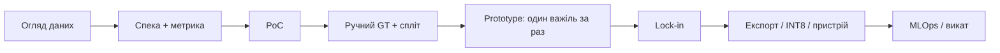
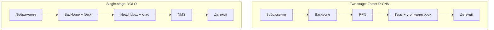
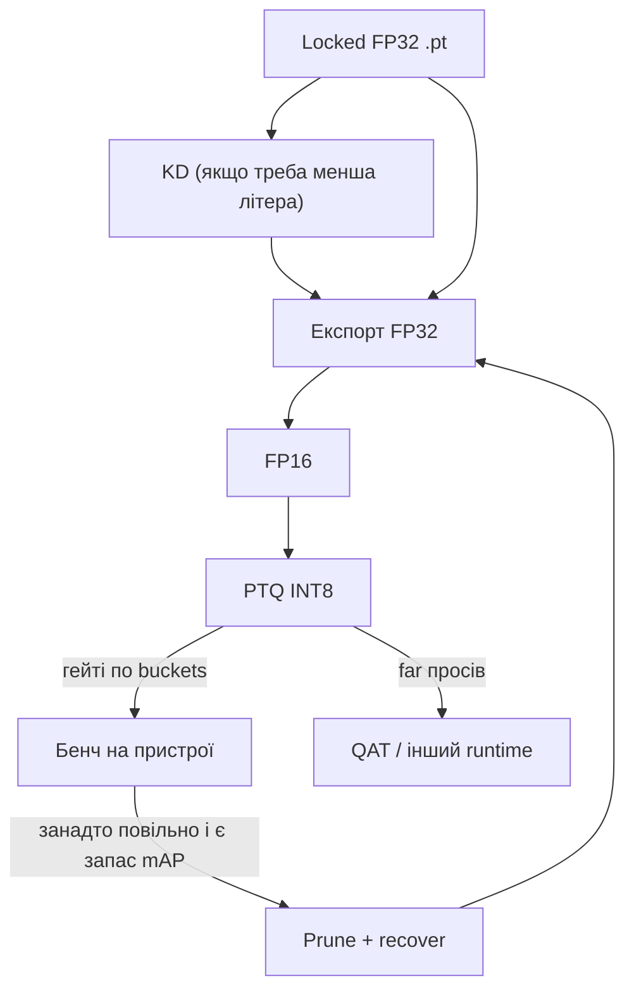

# Object Detection: практичний гайд від метрик до edge-деплою

Alisa Chupakhina

## Зміст

1. [Карта проєкту: PoC, Prototype, lock-in](#1-карта-проєкту-poc-prototype-lock-in)
2. [Дані: огляд сирих даних](#2-дані-огляд-сирих-даних)
3. [Спека задачі, формат даних і розмітка](#3-спека-задачі-формат-даних-і-розмітка)
4. [Метрики оцінки детекції](#4-метрики-оцінки-детекції)
5. [Дані: обсяг, тайлінг, автолейбл](#5-дані-обсяг-тайлінг-автолейбл)
6. [Задача: детекція, сегментація і трекінг](#6-задача-детекція-сегментація-і-трекінг)
7. [Архітектури і вибір моделі](#7-архітектури-і-вибір-моделі)
8. [Fine-tuning: freeze, епохи, літера](#8-fine-tuning-freeze-епохи-літера)
9. [Тренування YOLO: гіперпараметри і логи](#9-тренування-yolo-гіперпараметри-і-логи)
10. [Робастність, аналіз помилок, OOD і калібрування](#10-робастність-аналіз-помилок-ood-і-калібрування)
11. [Трекінг та відео](#11-трекінг-та-відео)
12. [Пристрої та деплой](#12-пристрої-та-деплой)
13. [Оптимізація моделі: квант, дистиляція, TTA, ансамблі](#13-оптимізація-моделі-квант-дистиляція-tta-ансамблі)
14. [MLOps, MLflow і викат](#14-mlops-mlflow-і-викат)
15. [Глосарій](#15-глосарій)

---

## 1. Карта проєкту: PoC, Prototype, lock-in

Два етапи з **різними цілями**. Не порівнювати їх метрики, якщо GT різний (автолейбл vs ручний).

Порядок робіт:



### PoC — чи задача взагалі береться

|| Типовий вибір |
|---|---|
| Мета | Feasibility за дні/тижні |
| Модель | Pretrained YOLO **s** (або **n** на дуже слабкому чипі) |
| Розмітка | Автолейбл / weak supervision допустимі |
| Train | Короткий staged (кілька епох freeze + кілька full), imgsz 640 як старт |
| Eval | In-train val + маленький smoke holdout — орієнтир, не контракт |
| Інфра | git + `outputs/` + markdown |

Популярний дефолт Ultralytics — десятки–сотні епох з `patience` одразу. Короткий staged на кшталт **2 freeze + 5 full** відхиляється від цього навмисно: дешеве **ранжування** клітинок (pack / imgsz), не стеля якості. На короткому розкладі дві конфігурації ще розділяються; після lock-in pack — уже повний fine-tune з `patience` (розділ [8](#8-fine-tuning-freeze-епохи-літера)).

### Prototype — зафіксувати рецепт

|| Типовий вибір |
|---|---|
| Мета | Lock-in ablation: **один фактор за раз** |
| Розмітка | Ручний GT. Рішення — по **окремому** eval holdout |
| Раунд 1 | `imgsz` (640 / 768 / 1024 / 1280) на фіксованому pack |
| Раунд 2 | Як з GT роблять train pack: тайли vs full frame, temporal stride, порожні тайли (hard negatives), баланс джерел/кліпів |
| Раунд 3 | Протокол freeze, родина, літера (n/s/m), довжина |
| Winner аблації | Одна метрика, обрана **до** свіпу |
| Інфра | yaml + таблиці; MLflow коли >15 прогонів або >1 людина |

Популярний порядок свіпу — дані/модель при дефолтному imgsz 640 (COCO). Тут **imgsz першим**: на UHD далекий обʼєкт — десятки пікселів, 640 уже ріже far-групу, а pack (тайли vs full frame) має сенс лише після залоченого входу. Далі pack, потім літера — один важіль за раз.

Популярний winner у статтях — **mAP@0.5:0.95** (COCO). Для задачі «чи знайшли обʼєкт» (присутність важливіша за тісний бокс) winner — **mAP@0.5** по size buckets; 0.5:0.95 лишається колонкою в таблиці, не вирішальним голосом. Mean по buckets, а не один загальний mAP: інакше 90% близьких маскують провал далеких.

**Дві різні політики метрик** (не плутати):

| Коли | Що вирішує | Роль FA/min і precision |
|---|---|---|
| Аблація рецепту (imgsz, pack, літера) | **mAP@0.5** по buckets, зафіксований до свіпу | Діагностика: чи модель сипле сміттям |
| Викат у прод / Staging→Production | Той самий mAP@0.5 **і** стеля FA/min (і Det), якщо оператор у контурі | Операційний гейт, не заміна mAP на етапі порівняння моделей |

**Один важіль на експеримент.** Змінили imgsz — pack і lr як були.

Після lock-in ваг — оптимізація (розділ [13](#13-оптимізація-моделі-квант-дистиляція-tta-ансамблі)), не новий свіп архітектури «заодно».

ML-проєкт частіше повертається до даних, ніж звичайний SDLC. CRISP-ML(Q) явно додає **monitoring** після деплою: far-група, drift розміру боксів.

### Практичний зразок

Не лочити INT8 і найновішу літеру YOLO на автолейблах (популярний «швидкий прод» саме так і робить — ламає порівняння, бо GT ще не той). PoC: open-vocabulary чернетка + короткий 2+5 на s, imgsz 640 — feasibility, не популярні 100 епох. Prototype: ручний GT, holdout з інших кліпів, раунд imgsz → pack → моделі (чому imgsz першим — вище). Winner — mean mAP@0.5 ближня/дальня, не COCO 0.5:0.95. PoC mAP і prototype mAP не ставити в одну таблицю «прогресу».

---

## 2. Дані: огляд сирих даних

Перший крок — відкрити кадри, не рахувати mAP і не вибирати літеру YOLO. Без гістограми розмірів незрозуміло, які бакети потрібні. Спека класу (розділ [3](#3-спека-задачі-формат-даних-і-розмітка)) фіксує, *що* міряти; метрика (розділ [4](#4-метрики-оцінки-детекції)) — *як* міряти. Обидва — після того, як видно дані. Сімʼя моделі (розділ [7](#7-архітектури-і-вибір-моделі)) — після того, як відомо, якого розміру обʼєкти і скільки їх.

### Огляд сирих даних

На вибірці кліпів / сесій, до масового лейблу:

| Що зняти | Навіщо |
|---|---|
| Ширина/площа бокса в px (хоча б на 10–20 кадрах на кліп) | Чи взагалі bbox, чи density; які кліпи «далекі» |
| Частка порожніх кадрів | Негативи vs «нічого не зняли» |
| Кадрів і боксів на кліп | Один кліп не має тримати більшість GT |
| Дублікати й сусідні кадри | Інакше val = train зі зсувом у 1/30 с |
| Різні висоти / час доби | Інакше модель учиться одній сцені |

Рій обʼєктів у 3 px — інколи counting/density, не детекція (розділ [6](#6-задача-детекція-сегментація-і-трекінг)). Спека імен класів — наступний розділ; тут достатньо побачити, *що на екрані*.

### Практичний зразок

Кліпи з повітря: гістограма ширини бокса по кліпах → видно ближні (>50 px) і дальні (<20 px) групи → рішення про тайлінг і imgsz приймається в розділі [5](#5-дані-обсяг-тайлінг-автолейбл). Один кліп не має тримати 70% боксів — ліміт кадрів на кліп перед масовим лейблом.

---

## 3. Спека задачі, формат даних і розмітка

### Спека класу (до першого бокса)

Письмова таблиця **до** першого бокса. Одне імʼя (`vehicle`) без таблиці = два розмічальники малюють різну задачу.

| Питання | Навіщо фіксувати |
|---|---|
| Що входить / не входить (з фото-прикладами) | Інакше GT — дві різні задачі |
| Один клас чи кілька (і що робити з пікапом / причепом) | Matching і loss ідуть по іменах у `names` |
| Порожній кадр | **Валідний негатив**: `.txt` існує і порожній, не «забули розмітити» |
| Що дорожче: пропуск (FN) чи сміття (FP) | Далі порог confidence і Det vs P / FA/min |

### Формат YOLO і розклад папок

Нормовані координати в **частках ширини/висоти кадру** (0–1), центр + розмір:

```text
class  cx  cy  w  h
0  0.512  0.331  0.040  0.028
```

Порожній `.txt` = немає обʼєктів. Імʼя файла = stem кадра (`000123.jpg` ↔ `000123.txt`).

| Простір | Що це | Де живе |
|---|---|---|
| YOLO txt | `cx cy w h` ∈ [0,1], **центр** відносно кадру | лейбли на диску |
| xyxy пікселі | `x1 y1 x2 y2` (лівий-верх → правий-низ) | eval, NMS, малювання |
| xywh пікселі | `x y w h` — інколи top-left, інколи center; дивитись API | CVAT / OpenCV / частина експортів |
| Letterbox | кадр/тайл вписаний у `imgsz` з полями, без розтягу | вхід мережі |

xyxy → YOLO txt (W, H — ширина/висота **цього** кадру чи тайлу):

```text
cx = ((x1 + x2) / 2) / W
cy = ((y1 + y2) / 2) / H
w  = (x2 - x1) / W
h  = (y2 - y1) / H
```

Decode предикта: зняти pad і scale letterbox **тією самою** формулою, що для GT. Інакше IoU на eval бреше, бокси «їздять». Не писати YOLO-txt у пікселях і не плутати top-left xywh з center-normalized.

`data.yaml` для Ultralytics:

```yaml
path: /data/datasets/train_v2
train: images/train
val: images/val
nc: 1
names: {0: vehicle}
```

Типовий розклад:

```text
dataset/
  images/train/  images/val/
  labels/train/  labels/val/    # поруч, ті самі stems
  data.yaml
```

Holdout eval часто **окремий** yaml на інших кліпах, не підпапка `val` з тих самих відео.

Скрипт після експорту: усі coords у (0,1), w/h > 0, кожен jpg має txt (можливо порожній), немає txt без jpg.

### Спліт (до тренування)

Витік: сусідні кадри одного проїзду в train і val. Спліт **по відео / сесії / локації**, не по кадрах. Ідеально — різні місця в val.

Інші витоки: дублікати з кількох джерел; mean/std нормалізації на train+test разом; метадані, яких не буде на inference.

### Розмітка bbox у CVAT

```bash
git clone https://github.com/opencv/cvat
cd cvat
docker compose up -d
docker exec -it cvat_server bash -c 'python3 ~/manage.py createsuperuser'
```

`localhost:8080`. Project (schema) → Task (кадри/відео) → Job (шматок для розмічальника).

**Frame step** на відео: обʼєкт між сусідніми лейблами зміщується ~на половину довжини в px, інакше мережа вчить дублікати.

Інструмент детекції — **Rectangle**. Polygon/SAM — маски. Cuboid — рідко потрібен на надирі.

Keyframe / Track: інтерполяція між ручними кадрами. TrackerMIL веде рамку, поки не зірветься. Це розмітка, не прод-трекінг.

Гарячі клавіші: `F`/`D` кадр; `N` нова фігура; `Del` (`Fn+Delete` на Mac); `O` Outside; `K` keyframe; `Ctrl+B` Propagate; `M` Merge. **Propagate** копіює незалежний бокс на N кадрів — для статики; для руху — Track. Зник і зʼявився: Outside, не інтерполяція крізь порожнечу.

AI-чернетка — автолейбл з розділу [5](#5-дані-обсяг-тайлінг-автолейбл). Nuclio/`nuctl` для serverless у CVAT. Оновлення коду = повторний `nuctl deploy`. `docker stop` контейнера, щоб звільнити VRAM.

Експорт: YOLO txt для Ultralytics, COCO json для Detectron2.

Типові проблеми: disagreement на оклюзії → guideline з фото; пропуск дрібних → чернетка + ревʼю far; зрив треку → правити keyframe одразу.

Чекліст: огляд даних (розділ [2](#2-дані-огляд-сирих-даних)) → schema → task/frame step → чернетка → треки → review → експорт → валідація txt → `data.yaml` → train.

### Платформи розмітки

| Інструмент | Коли |
|---|---|
| CVAT | Self-hosted, відео-треки, дані в периметрі |
| Roboflow | Швидкий PoC без DevOps |
| Labelbox / Scale | Велика команда або аутсорс |
| Label Studio | Нестандартна схема |
| **FiftyOne** | Після eval: FP/FN, дублікати, діри по кліпах — не розмітка з нуля |

DVC / MLflow — розділ [14](#14-mlops-mlflow-і-викат).

### Практичний зразок

Один клас з повітря: таблиця «легковик/фургон/вантажівка/автобус так; мото, причіп, пішохід ні». Rectangle + tracks. Frame step з швидкості в px. Keep/drop і пороги автолейбла — розділ [5](#5-дані-обсяг-тайлінг-автолейбл). Порожні txt лишити. Спліт по кліпах, не по кадрах. `data.yaml` з `nc: 1` і окремий eval yaml на held-out кліпах.

---

## 4. Метрики оцінки детекції

**IoU (Intersection over Union)** — площа перетину двох боксів, поділена на площу обʼєднання. IoU = 0.5: коробка перекриває обʼєкт більше ніж наполовину. IoU = 0.9: майже калька розмітки; зсув на кілька пікселів у дрібному обʼєкті вже провал. Той самий IoU стоїть і в eval (чи предикт = TP), і всередині NMS (чи два предикти — дублікати).

**Precision** — з усіх коробок моделі яка частка справді ціль. Низька precision = оператор тоне в порожніх рамках.

**Recall (detection rate, Det)** — з усіх обʼєктів у розмітці яку частку знайшли. Низький recall = пропуски. Для продукту «чи знайшли ціль» це ближче до задачі, ніж тісний бокс.

**Precision/Recall trade-off** — наслідок **порогу confidence**. Підняти поріг → precision росте, recall падає. Опустити — навпаки. Немає порогу, який максимізує обидві одночасно. AP/mAP усереднює по **всіх** порогах; у проді все одно стоїть один.

### Matching: один предикт ↔ один GT

Поки предикти не зіставлені з GT, немає TP/FP/FN. Типове правило (COCO / Ultralytics `val`):

1. Для кожного класу окремо: кандидати з IoU ≥ порогу (для mAP@0.5 — 0.5) з GT того ж класу.
2. Жадібно або за угорським алгоритмом: **один предикт — максимум один GT**, один GT — максимум один предикт. Зайві предикти = FP, незіставлені GT = FN.
3. Порядок зазвичай від високого confidence: спочатку найвпевненіші забирають GT.

Без цього кроку «дві рамки на одну машину» можна помилково порахувати як два TP.

### Confusion matrix

У класифікації є true negatives. У детекції **немає** природного TN: фон не є скінченним списком місць. Detection-матриця (Ultralytics `val`) будується після matching:

- Діагональ — TP (клас X передбачений як X).
- Поза діагоналлю, не background — плутанина класів.
- Рядок/стовпець **background** замінює TN.

Конвенція таблиць нижче: **рядок = предикт, стовпець = GT** (`Predicted \ Actual`). Плот `confusion_matrix.png` інколи малює True по одній осі й Predicted по іншій — дивитись підписи осей.

**Один клас** (ілюстративні числа, IoU TP = 0.5):

| Predicted \ Actual | object (GT) | background |
|---|---|---|
| **object** | TP = 120 | FP = 30 |
| **background** | FN = 380 | — (не визначено) |

- **Precision** = 120 / 150 ≈ **80%**
- **Recall** = 120 / 500 ≈ **24%**

Патерн «precision ок, recall провал» — типові дрібні/далекі: дивитись imgsz/тайли, confidence, GT.

**Кілька класів:**

| Predicted \ Actual | car | truck | bus | background |
|---|---|---|---|---|
| **car** | 850 | 40 | 5 | 120 |
| **truck** | 30 | 210 | 8 | 25 |
| **bus** | 3 | 12 | 95 | 8 |
| **background** | 90 | 35 | 10 | — |

Car ↔ truck (40+30) — фургон згори схожий на легковик. Часто проблема в **межі класів на цьому датасеті** — guideline (розділ [3](#3-спека-задачі-формат-даних-і-розмітка)) або обʼєднати класи, якщо продукту різниця не потрібна.

**Мультиклас на практиці:**

| Прийом | Коли |
|---|---|
| Злити класи | Продукт не розрізняє, а матриця систематично плутає |
| Oversample кадрів з рідкісним класом | Клас майже не трапляється в pack |
| `cls` weight / Focal | Рідкісний тоне в частому; Focal ще й фон vs обʼєкт |
| Окремий поріг confidence на клас | Різна ціна FP; mAP усереднює класи порівну |

**Дисбаланс класів у датасеті.** Якщо один клас займає 5% боксів — мережа ігнорує його заради majority. Рецепти: `copy_paste` рідкісного класу в pack; weighted sampler (більший sample weight на рідкий клас); `cls` weight у loss; Focal Loss (знижує вагу простих прикладів). Перевіряти після кожного рецепту по-класово (AP per class), не лише mean mAP.

**AP** — площа під PR-кривою по порогах confidence. **mAP** — середнє AP по класах (один клас → mAP = AP).

**mAP@0.5** — влучання при IoU ≥ 0.5: обʼєкт знайшли, бокс може бути грубим.

**mAP@0.5:0.95** — середнє по IoU 0.50…0.95: карає неточну геометрію.

Це різні питання. Налаштування можуть підняти 0.5 і опустити 0.5:0.95. Обидві колонки в таблиці; **winner аблації** — за метрикою з розділу [1](#1-карта-проєкту-poc-prototype-lock-in).

Один загальний mAP бреше, якщо 90% обʼєктів близькі. Eval **розбивати по групах розміру** (close / far або COCO small/medium/large) — за площею бокса або проксі-даллю.

### COCO evaluation protocol

Ultralytics `val` реалізує COCO-формат. Ключові деталі:

**101-point interpolation:** AP рахується по 101 точці recall [0.00, 0.01, …, 1.00] і усереднюється. Стара 11-point (VOC) менш гладка і дає вищий AP при тій самій кривій.

**IoU thresholds:** mAP@0.5 — один поріг. mAP@0.5:0.95 — середнє по 10 порогах [0.50, 0.55, …, 0.95].

**Area thresholds:** AP^S (small, <32² px), AP^M (medium, 32²–96²), AP^L (large, >96²). Для aerial: обʼєкт ~20 px на 640-input = COCO small; після тайлу той самий обʼєкт може стати medium.

**maxDets=100:** COCO відбирає топ-100 боксів на зображення перед matching. Щільна сцена з >100 авто на кадр — частина GT ніколи не отримає TP. На UHD aerial з парковками міняти `max_det` або тайлити.

**Confidence не фіксується:** AP будується по всій PR-кривій (всі confidence). Тому mAP не залежить від conf — але в проді conf впливає на Det/P. mAP і поріг conf — незалежні рішення.

**Операційні метрики при фіксованому confidence:**

| Що | Сенс | Коли |
|---|---|---|
| **Det** | TP/(TP+FN), не карає зайві рамки | Пропуск дорожчий за сміття |
| **P** | TP/(TP+FP) | Оператор тоне в FP |
| **FA/min** | Зайві рамки на хвилину відео | Навантаження на людину |
| **TTFF** | Секунди до першого правильного бокса | «Як швидко помітили» |

### Як вибрати confidence в проді

mAP не замінює поріг. Процедура:

1. Зафіксувати IoU matching (зазвичай 0.5) і holdout.
2. Побудувати PR-криву / F1 vs confidence (крок 0.05).
3. Обрати робочу точку: макс. F1, або мінімальний P (напр. ≥0.9) при максимальному Det, або стеля FA/min.
4. Залочити цей `conf` у yaml інференсу. Далі Det/P/FA рахувати **на ньому**, не на дефолті 0.25, якщо прод інший.

Калібрування score (наскільки 0.8 означає «80% TP») — розділ [10](#10-робастність-аналіз-помилок-ood-і-калібрування). Для порога за F1 калибрування не обовʼязкове; для «показувати оператору ймовірність» — так.

### Практичний зразок

Однокласова детекція транспорту з повітря: **winner аблації = mAP@0.5** по buckets, не популярний COCO 0.5:0.95 — продукт питає присутність. Eval — ближня і дальня групи. Робоча точка — F1 на **far-holdout**: провал саме далеких, загальний F1 тягнуть близькі. Не підганяти поріг під десяток far-боксів — перевірити, що Det на близьких не впав. maxDets=100 перевірити, якщо кадр може містити >100 авто (парковка в UHD).

---

## 5. Дані: обсяг, тайлінг, автолейбл

### Скільки даних

Популярні таблиці «s = 500 зображень» змішують обсяг і літеру. Літеру ще не вибрали. Тут — скільки **кадрів/боксів** збирати, поки модель не зафіксована.

| Термін | Обсяг |
|---|---|
| Zero-shot | 0 (open-vocabulary / автолейбл як чернетка) |
| Few-shot | одиниці–десятки на клас |
| Fine-tune малий сет | сотні–тисячі зображень |
| Повноцінний | десятки тисяч+ |

Домен далеко від COCO (надир, thermal) — тисячі–десятки тисяч, навіть якщо літера буде s. З нуля — масштаб COCO, майже ніколи. Один кліп = 70% боксів → ліміт кадрів на кліп, інакше «датасет» = одна дорога. Стикування обсягу з літерою n/s/m — після вибору сімʼї (розділ [8](#8-fine-tuning-freeze-епохи-літера)).

### Дрібні обʼєкти і тайлінг

Це властивість **кадру**, не гіперпараметр train. Детектор далі стисне вхід у 8/16/32 (розділ [7](#7-архітектури-і-вибір-моделі)): 20×20 на UHD після /32 — менше пікселя ознак.

| Група | Орієнтир | Стратегія |
|---|---|---|
| Близькі | >5% кадру | Звичайний детектор |
| Середні | 1–5% | Пізніше: P2 / помірний тайлінг |
| Дрібні / далекі | <1% | Тайлінг майже обовʼязковий |

Ту саму нарізку — в **eval** і в проді.

Тайлінг: різати UHD **до** мережі, overlap 10–20%, зшити xyxy, NMS по **кадру** (розділ [7](#7-архітектури-і-вибір-моделі)). Популярна обгортка — SAHI / адаптивний тайлінг (друга мережа підказує, де різати). Фіксована сітка простіша за другу модель — коли важлива одна точка відмови на борті. SAHI лишається зручним на сервері. Кроп тайлу на кадрі і letterbox `imgsz` — різні речі.

Train / val / prod — **той самий** розмір тайлу й overlap.

Skip кліпа — не «30 px = шум», а коли **після** обраної сітки медіана бокса все ще ≈ розмір шуму сенсора / менше пікселя на карті P3. Інакше 30 px — валідна far-група: тягнути сіткою й imgsz, не викидати.

### Автолейбл

Чернетка боксів **до** ручного GT. Lock-in на автолейблах не роблять: інша спека і систематичний шум (розділ [10](#10-робастність-аналіз-помилок-ood-і-калібрування)).

**Keep / drop (два «класи» на відсічення).** Продукт може бути однокласовий (`vehicle`), а вчитель — ні. Популярно гнати COCO-YOLO і брати `car`. Відхилення: прогнати **keep-список** (те, що стане GT) і **drop-список** (мото, людина, причіп, інколи truck на етапі проби розміру). Drop-бокси **не пишуть** у txt; вони лише гасять keep, якщо IoU ≥ 0.5 (велосипед, який учитель назвав `car`). Open-vocabulary (YOLO-World і подібні) робить те саме промптами, не COCO-id.

**Confidence.** Популярний прод-поріг 0.25–0.5. Автолейбл ставлять **нижче** заради recall: типові 0.10–0.25; на дрібній сітці ще нижче (орієнтир 0.20 на full frame, `max(0.05, 0.20 / n_tiles)` на нарізці), потім NMS. Зайве потім зріже ревʼю; пропущені далекі з високим порогом не повернуться.

Інше з практики: більший `imgsz` на автолейблі, ніж на грубій пробі кліпа; порожній кадр лишає порожній txt; не трекати між `frame_step` кадрами. Порівняти авто vs ручний підмножини: високий mean IoU при низькій precision = зайві рамки, не «треба ще автолейблів».

### Практичний зразок

Кліпи з повітря: гістограма ширини бокса по кліпах → сітка (ближній 1–2 тайли, дальній дрібніший), overlap на швах. Не гнати 3840×2160 у мережу. Автолейбл: keep car/van/truck/bus, drop motorcycle/bicycle/person/trailer, conf нижчий за прод, imgsz вищий за пробу. Один кліп не тримає 70% боксів. Lock-in — ручний GT, не ці txt.

---

## 6. Задача: детекція, сегментація і трекінг

Перший крок після огляду даних — чи взагалі потрібен bbox. Тип задачі визначає архітектуру, метрики і pipeline.

### Карта задач

| Завдання | Що продукт питає | Метод |
|---|---|---|
| **Класифікація** | Є/нема обʼєкта в кадрі, де саме — не важливо | ResNet, EfficientNet (немає рамок) |
| **Детекція (bbox)** | Де і скільки кожного; координати кожного | YOLO, DETR |
| **Семантична сегментація** | Точна форма кожного пікселя, але без різниці між двома авто одного класу | DeepLab, SegFormer |
| **Instance segmentation** | Маска + унікальний ID кожного обʼєкта | Mask R-CNN, YOLO-seg |
| **Panoptic segmentation** | Semantic + instance разом | PanopticFPN |
| **Трекінг** | Той самий ID між кадрами | детектор + трекер (розділ [11](#11-трекінг-та-відео)) |
| **Counting / density** | Скільки обʼєктів у регіоні при сильному перекриванні | CSRNet, density map |
| **Anomaly detection** | «Щось не те», без GT боксів | AE, self-supervised |

### Коли НЕ bbox

**Рій у 3 px.** Якщо після обраного тайлу медіана бокса — менше пікселя на карті P3, координата бокса = шум. Тоді: counting/density estimator або вищий imgsz, якщо фізично виправданий.

**Пошкодження поверхні.** Немає GT-боксів, лише «ок / не ок» на знімку → anomaly detection (reconstruction AE, FastFlow). Bbox тут вимагає розмітки, якої зазвичай нема.

**Медична патологія з weak supervision.** Є лише мітка класу на зображення, без bbox → CAM (Class Activation Map) або GradCAM для локалізації. Bbox потребує дорогого per-instance GT.

**Форма ділянки важлива.** Площа поля / пошкодження даху в aerial → instance segmentation, не bbox. Bbox описує прямокутник; якщо контур нерівний і продукт платить за площу — маска.

**Щільний натовп або дрон-рій.** Перекривання >50% між сусідніми обʼєктами → density map точніша, ніж NMS по боксах.

### Instance segmentation vs детекція

YOLO-seg додає голову масок поверх bbox-голови. Маски корисні коли:
- Продукт рахує **площу** (урожай, пошкодження, лісовий полог).
- Потрібний точний контур для UI overlay або геопривʼязки.
- Мультиклас із сильним перекриттям, де bbox не розрізняє.

При єдиному класі «транспорт» з повітря маски рідко потрібні: bbox описує «є авто і де» достатньо, а YOLO-seg додає latency і розмір артефакту.

### Практичний зразок

Aerial vehicle: продукт питає «скільки і де» → bbox детекція. Якщо додається «яка площа зайнята» → YOLO-seg або постобробка bbox (площа прямокутника як проксі). Якщо авто 3 px → перевірити тайл, не переходити в density без аналізу EDA (розділ [2](#2-дані-огляд-сирих-даних)). Трекінг — поверх детектора, не замість (розділ [11](#11-трекінг-та-відео)).

---

## 7. Архітектури і вибір моделі

### Родини детекторів

1. **Two-stage (R-CNN → Faster / Cascade R-CNN)** — RPN пропонує області, другий крок класифікує й уточнює. Точніше й повільніше.
2. **Single-stage anchor-based (SSD, YOLO v1–v5)** — один прохід, зміщення відносно якорів.
3. **RetinaNet** — Focal Loss проти дисбалансу фон/обʼєкт.
4. **Anchor-free (CenterNet, FCOS, YOLOv8+)** — центр і розміри без якорів.
5. **EfficientDet** — compound scaling + BiFPN; на edge часто програє YOLO за реальною latency.
6. **DETR / RT-DETR** — transformer, set prediction, **без NMS** (bipartite matching на train).



**Anchor-based:** якорі фіксованих пропорцій, регресія зміщень; якорі підбирають під датасет (k-means). **Anchor-free:** центр і w/h напряму, не потрібен ручний підбір якорів.

**Backbone → Neck → Head.** Backbone: краї→форми, кілька карт (P3 дрібний масштаб, P5 грубий). Neck (FPN/PANet): змішує семантику глибоких карт з деталями неглибоких. Head: bbox+клас на кожному рівні. У YAML Ultralytics neck лежить у секції `head`.

У готовому YOLO backbone уже вибраний (C2f/C3k2 тощо). Міняти на ResNet «бо ImageNet» для детекції з повітря майже ніколи не варто: вирішує піраміда і stride. ResNet/MobileNet/EfficientNet/ViT — профіль і обмеження edge:

| Backbone | Профіль | Ризик для детекції |
|---|---|---|
| ResNet | Стабільний, skip-connections вирішують vanishing gradient | Часто завеликий для real-time edge |
| MobileNet | Легкий, depthwise | Нижча стеля; depthwise нерівно на чипах |
| EfficientNet | Compound scaling | Swish/SE погано квантизуються |
| ViT / гібриди | Глобальний контекст | Багато даних; ONNX/edge складний |

### NMS та вибір стратегії

NMS — невідʼємна частина inference pipeline для anchor-based і anchor-free детекторів. Вибір NMS-стратегії є таким самим архітектурним рішенням, як вибір anchor-based vs anchor-free.

**Класичний NMS.** Якщо дві коробки сильно перекриваються, лишаємо впевненішу.

1. Сортувати бокси за confidence.
2. Взяти найвпевненіший, прибрати інші того ж класу з IoU вище порогу.
3. Повторити для наступного.

Поріг IoU 0.45–0.5 («більше ніж наполовину = той самий обʼєкт»). Дефолт Ultralytics `iou=0.7` мʼякший: менше зʼїдає сусідів, більше дублів. На щільній парковці — підбирати на holdout, не лишати «як у туторіалі».

**Soft-NMS.** Confidence сусіда знижується пропорційно IoU, а не обнуляється. Популярно на **густих** aerial (VisDrone, парковки). Якщо обʼєкти просторово рідкі — failure mode не «два сусіди», а вкладений/обрізаний бокс; Soft-NMS тут не той важіль.

**NMS-free (DETR і похідні).** Bipartite matching на train, на inference NMS немає. Усуває ручний підбір IoU-порогу NMS; плюс: густі сцени. Мінус: малі датасети, дрібні обʼєкти, квант attention на частині чипів.

| Стратегія | Коли |
|---|---|
| Hard NMS (дефолт) | Рідкий трафік, IoU між сусідами низький |
| Soft-NMS | Щільна парковка, aerial: рядки авто з IoU > 0.5 між сусідами |
| NMS-free (DETR) | Сервер GPU, великий датасет, NMS тюнінг — bottleneck |

**Вкладені бокси.** Класичний NMS лишає обидва, якщо IoU помірний при різній площі. «Лишити більший» — стандарт (людина в авто). «Лишити менший» — якщо guideline каже «силова одиниця без причепу»: внутрішній бокс = GT, зовнішній = FP. Правило залежить від спеки (розділ [3](#3-спека-задачі-формат-даних-і-розмітка)), не від NMS як алгоритму.

Після тайлінгу NMS ганяти по **всьому кадру** в координатах повного кадру, не всередині тайлу.

### YOLO як сімейство

Чотири осі: розмір обʼєктів, hardware, latency, ліцензія (Ultralytics AGPL-3.0 за замовчуванням).

| Версія | Коли | Застереження |
|---|---|---|
| YOLOv5 | Легасі | Відстає на small-object/aerial (VisDrone) |
| YOLOv8 | Найбільше small-object форків | l/x на малому сеті можуть бути нестабільні |
| YOLOv11 | Дефолт «з коробки»: C2PSA, менше параметрів | Менше форків, ніж у v8 |
| YOLOv12 | Area Attention | Окрема гілка, не шлях до v26 |
| YOLO26 | NMS-free, як v11 у backbone | Мало нішевого досвіду |

Популярно брати «найновіший YOLO». Відхилення: **залочити лінію з відомим експортом**, не PoC на v12/v26. Немає кастомних форків — **v11**. Є час порівняти small-object літературу — **v8 і v11 на тому самому pack**.

Attention (C2PSA) підсвічує позиції на карті, не малює bbox. Decoupled head: окремі гілки клас і бокс.

**Loss детекційного head (YOLO v8+).** Три компоненти: `box` / `cls` / `dfl`.

| Loss | За що відповідає | Примітка |
|---|---|---|
| **BCE/CE** (cls) | Клас обʼєкта | Focal Loss знижує вагу «легких» фонових прикладів |
| **CIoU** (box) | Геометрія рамки: IoU + штраф за зміщення центру і аспект | Тягне mAP@0.5:0.95, не mAP@0.5 |
| **DFL** | Розподіл вірогідності країв bbox (Distribution Focal Loss) | DFL ≠ Focal Loss: DFL про краї, Focal про дисбаланс фон/обʼєкт |

Anchor-based v5: окремий **objectness** score (є обʼєкт чи ні), score = objectness × class. Anchor-free v8+: objectness злито у cls. Популярно роздувати `cls` на мультикласі; для одного класу — не потрібно, фон і так домінує.

Регуляризація: `weight_decay` (L2) в оптимізаторі. Bias/variance trade-off: велика модель з малим датасетом без регуляризації — overfitting (train/val gap >15%, розділ [8](#8-fine-tuning-freeze-епохи-літера)).

v8→v11: C2f→C3k2, зʼявляється C2PSA. YOLO26 продовжує v11 (C3k2+C2PSA), не v12; новизна — head без NMS і без DFL.

Small-object форки: шар **P2**, GAM/SE, Soft-NMS. Якщо тайли вже роблять обʼєкт великим у кадрі мережі, P2 дублює те, що зробив кроп; спочатку imgsz+сітка, P2 — якщо після цього far усе ще <~16 px на вході.

**Літери n/s/m/l/x** — ширина й глибина. COCO-орієнтир (YOLOv12, T4, TensorRT FP16, batch=1):

| | Параметри | FLOPs | mAP | Latency | FPS |
|---|---|---|---|---|---|
| N | 2.6M | 6.5G | 40.6 | 1.64 мс | ~610 |
| S | 9.3M | 21.4G | 48.0 | 2.61 мс | ~383 |
| M | 20.2M | 67.5G | 52.5 | 4.86 мс | ~206 |
| L | 26.4M | 88.9G | 53.7 | 6.77 мс | ~148 |
| X | 59.1M | 199.0G | 55.2 | 11.79 мс | ~85 |

N тайлів ≈ FPS/N. Міряти на цільовому залізі.

Порядок вибору літери: (1) VRAM пристрою, (2) latency-бюджет кадру з урахуванням тайлів, (3) обсяг з розділу [5](#5-дані-обсяг-тайлінг-автолейбл) і freeze з розділу [8](#8-fine-tuning-freeze-епохи-літера), (4) густина дрібних — +1 літера, якщо (1)–(2) дозволяють.

**imgsz vs літера vs edge.** Far-група вмирає від **входу** (1280→640), не від ширини мережі. Тоді різати **літеру** (l→s) дешевше, ніж різати imgsz; s@1280 часто бʼє l@640 на дрібних.

`.pt` = архітектура + pretrained; `.yaml` = з нуля. `freeze=N` — розділ [8](#8-fine-tuning-freeze-епохи-літера).

### DETR

CNN backbone → encoder → decoder з N object queries → N боксів, matching лише на train. Плюс: густі сцени без NMS. Мінус: малі датасети, дрібні обʼєкти, квант attention на Hailo/частині TensorRT. Борт — зазвичай YOLO; сервер GPU і ламається NMS — RT-DETR.

Коли не YOLO: IR (спочатку контраст, не кастомна мережа); Faster R-CNN для offline max recall; SSD/RetinaNet рідко.

### Як обирати (один чекліст)

1. Latency/compute на inference — hard constraint **раніше** за mAP.
2. Обсяг даних (розділ [5](#5-дані-обсяг-тайлінг-автолейбл)) — малий сет → s + freeze, не x з нуля.
3. Складність сцени / густина / домен (RGB vs IR).
4. Команда вміє експортувати цей граф.
5. Ліцензія.

Baseline — найменша адекватна літера тієї ж родини. Якщо s ≥ m на цьому сеті: learning curve 25–100% даних і train/val gap. Крива m ще росте → збирати дані. Обидві сплощились на тих самих кадрах → стеля в GT, не в літері.

### Практичний зразок

Надир, near-edge, сотні–тисячі кадрів: **YOLO11s baseline**. Другий прогін **v8s** на тому самому pack, якщо є час. Не DETR (мало даних і дрібні). Ліцензію до lock-in. Не міняти backbone на ResNet-50. Якщо далекі зникають — imgsz / P2 / тайли, не EfficientNet усередині YOLO. На щільній парковці — Soft-NMS на holdout. Після тайлів — NMS у координатах повного кадру.

---

## 8. Fine-tuning: freeze, епохи, літера

Після сімʼї та літери (розділ [7](#7-архітектури-і-вибір-моделі)). Скільки кадрів уже відомо з розділу [5](#5-дані-обсяг-тайлінг-автолейбл); тут — *як* учити pretrained ваги на цьому обсязі.

Популярний дефолт — `freeze=0`, десятки–сотні епох з `patience`. Відхилення на малому сеті: спочатку freeze backbone, потім нижчий lr на всіх шарах. Інакше середні pretrained-фільтри перетренуються в шум.

| Стратегія | Коли |
|---|---|
| Frozen backbone | Сотні кадрів, домен не надто далеко від COCO |
| Staged freeze → unfreeze з нижчим lr | Середній обсяг |
| Full fine-tuning | Тисячі+, домен не екстремальний |
| Discriminative LR | Тонкий тюнінг (різний lr по групах шарів) |

`freeze=N` у Ultralytics — перші N шарів (індекси як у YAML: `for i, m in enumerate(model.model.model)`).

```python
model = YOLO("yolo11s.pt")
model.train(data="data.yaml", freeze=10, epochs=50, lr0=0.01)
model.train(data="data.yaml", freeze=0, epochs=100, lr0=0.001)
```

Орієнтир **обсяг vs літера** (не стеля якості). Домен далеко від COCO — збирати тисячі (розділ [5](#5-дані-обсяг-тайлінг-автолейбл)).

| Літера | Full fine-tuning | Frozen backbone |
|---|---|---|
| n | ~200–300 зображень | ~50–100 |
| s | ~500 | ~100–200 |
| m | ~1000–1500 | ~200–300 |
| l | ~2000+ | ~300–500 |
| x | 5000+; менше — ризик деградації vs l | ~500–1000 |

| Сценарій | Епохи (стеля, далі `patience`) |
|---|---|
| Малий сет, pretrained | 50–150 |
| Великий свій домен | 150–300 |
| З нуля | 300+ |
| **Порівняння клітинок аблації** | короткий staged (напр. 2+5) — не стеля якості |

### Learning curves і діагностика

**train loss ↓, val loss ↑** — overfitting. Рецепти по черзі: аугментація (розділ [9](#9-тренування-yolo-гіперпараметри-і-логи)), менша літера, weight_decay, більше даних.

**Обидві loss↓, val plateau** — або стеля в GT (розмітка не дозволяє кращого), або домен між train і val відрізняється. Дивитись: більше даних того самого домену vs помилка в спліті.

**Обидві loss↓ разом** — нормальний прогрес. Мережа може продовжити рости з більшими даними.

**Train/val mAP gap >15%** — стабільний overfitting: спочатку аугментації і freeze, потім зменшити розмір моделі.

**Loss не падає з 1-ї епохи** — lr надто великий або `data.yaml` не той (помилковий шлях до лейблів).

**Patience у Ultralytics** зупиняє train якщо `metrics/mAP50(B)` (in-train val) не виросла N епох. Winner аблації — holdout, не ця цифра.

Learning curve аблації (25–50–75–100% pack): якщо крива s ще росте → стеля в даних, не в літері. Якщо обидві (s і m) сплощились на тих самих кадрах → проблема в GT.

Рідкісний клас: Focal / class weight / oversample, довше тренування. knobs lr/aug/логи — розділ [9](#9-тренування-yolo-гіперпараметри-і-логи).

### Практичний зразок

Літера вже s. 2+5 — порівняти imgsz/pack, не стеля. Після lock-in pack — freeze→unfreeze з `patience`. Не порівнювати mAP автолейблів з mAP ручного GT. Якщо val loss зростає з 30-ї епохи — зменшити `lr0` вдвічі або зупинити на early-stop checkpoint.

---

## 9. Тренування YOLO: гіперпараметри і логи

### Learning rate і оптимізатор

- `lr0` — старт; `lrf` — фінал як частка від lr0; `cos_lr` — cosine; `warmup_epochs` — розгін (після розморозки head градієнти шумні).
- Короткий fine-tune, невеликий сет: **AdamW** (у Ultralytics дивитись дефолтний `lr0` для обраного оптимізатора: SGD часто ~0.01, Adam нижчий).
- Довгий прогін на великому сеті: SGD + momentum 0.9–0.937, weight_decay 5e-4.
- Не міняти оптимізатор у тому ж раунді, що imgsz або pack.

Loss weights `box` / `cls` / `dfl` — розділ [7](#7-архітектури-і-вибір-моделі). Популярно крутити `cls` угору на мультикласі. Один клас: не роздувати `cls`. CIoU/DFL тягнуть **геометрію** рамки (ближче до mAP@0.5:0.95). Winner @0.5 від цього не «автоматично узгоджується»: грубе влучання живе і на грубішому боксі.

### Аугментації

Імітують **реальну** зйомку. Геометрія кадру застосовується до **боксів тією самою матрицею**, що до пікселів (Ultralytics робить це сам). Mosaic склеює 4 кадри — бокси переїжджають у нову мозаїку; на дуже дрібних mixup розмиває сигнал.

| Параметр | Навіщо |
|---|---|
| `hsv_*` | Освітлення / погода |
| `degrees` / `scale` | Горизонт, висота |
| `fliplr` | Зазвичай ок; `flipud` — лише якщо прод перевертає кадр |
| `mosaic` | Популярно для дрібних; на неперервному відео однієї траєкторії часто вимикають (ламає геометрію дороги) |
| `mixup` | Регуляризація; обережно на tiny objects |
| `copy_paste` | Рідкісні ракурси |
| `label_smoothing` | Шумна розмітка |
| `close_mosaic` | Останні N епох без mosaic — доточити локалізацію |

### batch, imgsz, BatchNorm і інші knobs

`imgsz` кратний 32 (пʼять stride-2). Популярний дефолт Ultralytics/COCO — **640**. 1280 — коли після тайлу обʼєкт усе ще дрібний (~4× compute); 320 — швидкий edge, far зазвичай вмирає. Кроп тайлу на кадрі і letterbox `imgsz` — різні речі.

**BatchNorm і малий batch.** BatchNorm рахує mean/std по batch dimension для кожного каналу. При batch=1–4 статистики шумні — модель осцилює, збіжність нестабільна.

| Ситуація | Рішення |
|---|---|
| VRAM обмежений, треба великий imgsz | Gradient accumulation (`batch=4, accumulate=4` → effective batch=16) |
| Multi-GPU | SyncBN (синхронізує статистику між GPU) |
| Inference (batch=1) | BN заморожено: `model.eval()` — running mean/std, не batch |

У Ultralytics: `batch=-1` авто-визначає максимальний batch під VRAM. На imgsz 1280 batch часто падає до 4–8 — gradient accumulation зберігає стабільність BN.

```python
from ultralytics import YOLO

model = YOLO("yolo11s.pt")
model.train(
    data="data.yaml",
    epochs=100,
    patience=20,
    imgsz=1280,  # не дефолт 640: обʼєкти ~20–40 px на UHD
    batch=8,
    seed=0,
    workers=8,
    cache=False,   # True — якщо pack влазить у RAM
    amp=True,      # mixed precision на CUDA
    close_mosaic=10,
    pretrained=True,
    project="runs/detect",
    name="r1_imgsz1280",
    exist_ok=False,
)
```

`iou` у `train()` — поріг NMS/val у циклі тренера, не IoU-loss.

Тюнінг: дефолти → одна група за раз (aug під домен, потім lr, потім loss) → порівняння на фіксованому holdout по buckets. `model.tune()` не знає aerial-домену.

### Як читати тренування

Три шари: tqdm (процес живий), рядок епохи / `results.csv`, eval holdout JSON.

```
17/20  9.63G  box_loss  cls_loss  dfl_loss  Instances  Size
17/20  9.63G  1.182     0.858     1.006     8          1280:   7%  1/14  5.7s/it
```

`metrics/mAP50(B)` у CSV — **in-train val**, не eval раунду. Winner — окремий holdout. `Instances=0` кілька батчів — шлях до лейблів. OOM — `batch` або `imgsz`. Env `TQDM_DISABLE=1` / `YOLO_VERBOSE=False` **до** імпорту Ultralytics. Свіп: бар вимкнений, лог у файл, `python -u`. Відтворюваність: yaml + seed + git sha.

### Практичний зразок

Раунд 1, фіксований pack: лише imgsz 640/768/1024/1280. Далекі авто ~20–40 px на UHD — популярний 640 часто мало. На неперервному відео з однієї траєкторії mosaic=0, різноманіття дає `frame_step`; mixup мінімум, flipud ні. 2+5 — лише ранжування клітинок. На imgsz 1280 з batch=8 — перевірити effective batch (gradient accumulation якщо <16). Не обирати 1280 «бо box_loss на барі нижчий».

---

## 10. Робастність, аналіз помилок, OOD і калібрування

**Domain shift.** Train влітку з однієї висоти; прод — зима, інша висота. Аугментації під очікуваний прод, не дефолтний зоопарк.

**Label noise.** Випадковий кілька % — мережі терплять. Систематичний (автолейбл завжди роздуває бокс) — правити підмножину. Авто vs manual на IoU≥0.5: високий mean IoU при **низькій** precision = зайві бокси, не «треба більше автолейблів».

**Синтетика.** Популярний перший важіль, коли реального відео мало (GTA, AirSim, domain randomization). Для однокласової aerial з уже зібраними кліпами рідко перший важіль: sim-to-real на надирі дорожчий за ручний GT на тих самих кадрах.

**Val добре, прод погано:** (1) leakage спліту, (2) drift розміру/освітлення, (3) інший preprocess, (4) edge cases поза val, (5) середній mAP живий, far мертва.

### Аналіз помилок після eval

Не зупинятись на таблиці mAP.

1. Зберегти предикти на holdout (`conf` як у проді).
2. Розібрати **FP** і **FN** окремо: дах/тінь/причіп vs пропуск далеких.
3. Розрізати по кліпу і по площі бокса.
4. FiftyOne або превʼю сітка: 20 випадкових FP, 20 FN.
5. Якщо FP і FN на тих самих неоднозначних сценах у s і m — стеля в guideline.

### OOD і дрейф розподілу

**Covariate shift:** вхідний розподіл змінився (нова камера, сезон, висота), але задача та сама. **Concept drift:** змінилось визначення таргету (нова спека, новий тип авто в fleet).

**Сигнали моніторингу:**

| Сигнал | Як вимірювати |
|---|---|
| Гістограма ширини/площі bbox | Медіана зміщується → shift висоти або масштабу |
| Confidence distribution | Модель стала менш впевненою → drift |
| Частка порожніх кадрів | Значно зросла → сцена змінилась |
| Det rate на зразковому кліпі | Drop → drift або деградація моделі |
| Pixel mean/std | Зміна освітлення, сезону |

**Реакція на drift:**
1. Зберегти N кадрів дрейфу → аналіз FP/FN (ті самі кроки, що у eval).
2. Leakage → повторний спліт по кліпах.
3. Зміна домену (сезон, нова висота) → долити кадри нового домену і fine-tune, не повний retrain.
4. Нова спека → новий ручний GT, не автолейбл поверх старого.

**OOD-score.** Ентропія предиктів клас-голови або max-softmax confidence: якщо модель невпевнена по всіх класах — кадр може бути OOD. Не замінює ручний перегляд — лише тріаж (пріоритетизувати кадри для анотування).

Моніторинг у прод — розділ [14](#14-mlops-mlflow-і-викат).

### Калібрування confidence

Score 0.8 ≠ «80% що це TP». Reliability diagram: у біні [0.7, 0.8] яка частка TP після matching. Якщо модель надто впевнена (крива під діагоналлю) — temperature scaling (`σ(z/T)`) або Platt на **holdout**, не на train. T>1 згладжує score; порядок детекцій за z зберігається, тому поріг за F1 можна ставити і на сирому score. Калибрування потрібне, коли оператору показують «ймовірність», не щоб обрати F1-точку.

### Практичний зразок

Holdout — інші кліпи. Автолейбл лише PoC і чернетка CVAT. Після кожного раунду — превʼю FP far-групи (дах, тінь, причіп). Гістограма площі боксів val vs прод до зміни архітектури. Якщо після деплою Det на far знизився на 10%+ за тиждень без змін моделі — перевірити pixel distribution нових кадрів.

---

## 11. Трекінг та відео

Детектор дає бокси на кожному кадрі незалежно. **Трекер** — додає постійний ID обʼєкту між кадрами і вирішує оклюзію.

Мотивація: підрахунок унікальних транспортних засобів (не «скільки в кадрі»), траєкторія, TTFF на конкретний обʼєкт, зменшення flickering.

### Підходи до трекінгу

| Метод | Що робить | Коли |
|---|---|---|
| **SORT** (IoU tracker) | Kalman filter для прогнозу bbox + IoU matching | Проста сцена, немає оклюзії |
| **ByteTrack** | Асоціює і low-confidence detections (не кидає «невпевнені») | Dense aerial, тимчасові пропуски |
| **DeepSORT** | IoU + ReID embedding (appearance) | Перехрещення траєкторій, де IoU не вистачає |
| **BoT-SORT / StrongSORT** | ByteTrack + camera motion compensation + ReID | Комплексна сцена |

Популярно брати SORT «бо простий». Відхилення на aerial dense: SORT кидає трек при IoU < порогу (обʼєкт ненадовго зник за іншим). ByteTrack тримає low-conf детекції як кандидати і відновлює трек — покращує MOTA на VisDrone до +5–8%.

ReID модель (DeepSORT) — окрема мережа (MobileNet backbone, embedding ~128d) для appearance matching. На надирних кадрах, де авто схожі текстурно і кут вигляду постійний, ReID часто не кращий за ByteTrack без ReID, але додає latency і складність.

### Pipeline трекінгу

```
Відео → детектор (кожен K кадр) → [бокси + scores]
                              ↓
                    Трекер (ByteTrack / SORT)
                              ↓
              [бокси + track_id + вік треку]
                              ↓
              Бізнес-логіка (підрахунок, алерт, TTFF)
```

### Метрики трекінгу

| Метрика | Що вимірює |
|---|---|
| **MOTA** | Multi-Object Tracking Accuracy: комбінація FN, FP, ID switches (ідеально MOTA = 1) |
| **MOTP** | Точність локалізації (IoU) по TP |
| **IDF1** | F1 по ID асоціації — важливо для re-id |
| **HOTA** | Гармонія detection і association accuracy — нова рекомендація TrackEval |

Не плутати val детектора (незалежні кадри) і val трекера (послідовність). Добрий детектор ≠ добрий трекер: SORT на частих оклюзіях дасть MOTA < прийнятного при доброму mAP@0.5.

Holdout для трекера — відео з **анотованими треками** (frame_id + track_id + bbox). MOT Challenge формат: один рядок на detection. FiftyOne або py-motmetrics для MOTA/IDF1.

### Video-specific inference

| Проблема | Рішення |
|---|---|
| **Flickering** (бокс зʼявляється і зникає без причини) | Мін. тривалість треку (N кадрів), confidence smoothing |
| **Frame skip** (не кожен кадр детектується) | Трекер прогнозує позицію; детектор кожен K-й кадр |
| **Висока latency** | Keyframe detection + трек між keyframes |
| **Temporal inconsistency** | Sticky bbox: оновлювати тільки якщо Δ > порогу |
| **ID switch після оклюзії** | ByteTrack: re-associate low-conf box після виходу з-за оклюзії |

Frame step на відео (розділ [3](#3-спека-задачі-формат-даних-і-розмітка)) і inference stride трекера — різні речі. Train `frame_step` контролює унікальність GT; inference stride — компроміс latency/якість треку.

**Батч inference на відео.** Якщо бюджет latency дозволяє — batch кілька тайлів одного кадру разом (batch dimension), не по одному. При тайлінгу 4×4 = 16 тайлів: batch=16 дає ~8–12× throughput vs batch=1 на GPU.

### Практичний зразок

Aerial vehicle, підрахунок унікальних: детектор кожен 3–5 кадр (stride під бюджет латентності), ByteTrack для dense парковок і часткових оклюзій. ReID лише якщо продукт вимагає re-identification після тривалої оклюзії (>5 с). Метрика: HOTA і MOTA на holdout кліпі з анотованими ID. Не оцінювати трекер на тих самих кліпах, що детектор: ID drift не видно на одному кліпі.

---

## 12. Пристрої та деплой

Розділ [13](#13-оптимізація-моделі-квант-дистиляція-tta-ансамблі) стискає граф. Тут — **куди** його кладуть і **чого чекати** по швидкості та якості. Чип повинен бути відомий **до** свіпу форматів.

mAP після експорту знімається на робочій станції; **ship-FPS** — лише на цільовому чипі. `s/it` з Mac і dummy-нулі в Colab у таблицю викату не пишуть.

Популярно «один INT8 на всі борти». Відхилення на дрібних: той самий YOLO @ 1280 на Pi (OpenVINO INT8) може пройти far-гейт, а TFLite full-int на телефоні — ні; тоді Android тримає FP32 і шукає FPS делегатом GPU/NPU.

### Протокол валідації на пристрої

1. Зібрати **нативний** артефакт під чип (не `.pt`): OpenVINO `.xml`+`.bin`, TFLite, ONNX→TRT engine.
2. Той самий `imgsz`, letterbox **без stretch**, той самий `conf` / NMS, що eval.
3. Відео або тайли з прод-розподілу, не чорний кадр. Dummy-тензор занижує p50.
4. **Warmup** (десятки інференсів) викинути з p50; далі ≥100 тайлів. Записати cold / p50 / p95 мс на **тайл**, tile FPS, MB файла.
5. Кадр з N тайлами ≈ N × p50 плюс зшивка і NMS по кадру — не плутати tile FPS з FPS відео.
6. Якість: повний holdout або порівняння боксів з пристрою з GT (той самий IoU matching).
7. Мок GPU у хмарі ≠ борт: TensorRT `.engine` збирають **на тому SoC**, що в проді.

NNAPI / «NPU on» у логах без зміни p50 = fallback на CPU. Окремий рядок у таблиці.

### Edge: що на чому крутиться

| Клас пристрою | Типовий runtime | Артефакт | Швидкість | Якість |
|---|---|---|---|---|
| **Ноутбук / Mac** | OpenVINO / TFLite CPU | контроль | smoke: сотні мс INT8 | holdout; **не** ship-FPS |
| **Raspberry Pi / ARM CPU** | OpenVINO INT8 | `.xml`+`.bin` | десятки–сотні мс/тайл — міряти на платі | INT8 часто тримає far краще за TFLite full-int |
| **Android** | TFLite + **делегат** | `.tflite` | CPU @ 1280 FP32: секунди/тайл. GPU-делегат ~10× CPU | FP32 паритет зі станцією; INT8 на far часто гейт |
| **Jetson / dGPU** | TensorRT FP16 (іноді INT8) | ONNX → `.engine` | десятки мс/тайл | перезібрати engine на борті |
| **iOS** | Core ML / ANE | `.mlpackage` | окремий експорт, не TFLite | перевірити decode окремо |
| **Hailo / інший NPU** | Vendor SDK | свій blob | лише після компіляції | attention (C2PSA, DETR) перевірити **до** вибору архітектури |

**Делегат** — хто виконує граф на пристрої. Той самий `.tflite`: CPU vs GPU — інший p50 при тій самій якості. NNAPI/NPU може віддати частину графа на CPU (fallback). Дивитись логи делегата, не назву прапорця.

**Мобільні NPU:**

| Вендор | Типовий шлях |
|---|---|
| Qualcomm | TFLite GPU (OpenCL/Vulkan) або QNN / LiteRT NPU |
| MediaTek | Neuron delegate або LiteRT MediaTek runtime; NNAPI на середньому SoC часто ≈ CPU |
| Samsung Exynos | LiteRT samsung_runtime або GPU |
| Google Tensor | LiteRT google_tensor_runtime |

### Чого чекати: швидкість vs якість

| Очікування | Реалістично |
|---|---|
| INT8 завжди швидший і «майже той самий mAP» | На CPU/NPU — так по latency; на дрібних far INT8 TFLite може впасти, OpenVINO INT8 — пройти |
| Телефон ≈ Jetson | Ні: CPU-телефон @ 1280 FP32 — секунди/тайл; TRT FP16 — десятки мс |
| Mac p50 ≈ Pi | Ні; інший ISA, термос, тактова |
| NNAPI = NPU | Часто граф частково на CPU |
| Overlay = eval | UI може малювати низький conf і вкладені бокси, яких matching на GT уже немає |

### Хмара (стандарт CV, не edge-борт)

Детекція UHD/тайлів — **GPU-сервіс або черга воркерів**, не синхронна Lambda з JPEG.

| Де | Навіщо | Обмеження |
|---|---|---|
| **AWS Lambda** | Дрібні зображення, класифікатор, препроцес | Немає GPU; ліміт часу; UHD YOLO @ 1280 не сюди |
| **AWS Fargate / ECS на CPU** | Батч, довгі джоби | Зазвичай без GPU; OpenVINO CPU ок |
| **EC2 / GCE з GPU, SageMaker / Vertex, Cloud Run + GPU** | Онлайн-інференс і батч відео | Нормальний дім для YOLO |
| **SQS / Pub/Sub + GPU worker** | Асинхронні ролики | Оператор не чекає p50 тайла в HTTP |

### Практичний зразок

Locked s @ 1280, надир: **Pi** — OpenVINO INT8 (гейт far пройшов на станції, FPS — на платі). **Android** — TFLite FP32, поки INT8 валить far; GPU-делегат — перший важіль FPS, не «інша літера». **Jetson** — TRT FP16, engine на борті, не T4 з Colab. Хмара: GPU endpoint або черга, не Lambda. Canary — частка **пристроїв** (розділ [14](#14-mlops-mlflow-і-викат)).

---

## 13. Оптимізація моделі: квант, дистиляція, TTA, ансамблі

Окремий етап **після** lock-in: є FP32 `.pt` з відомим mAP по buckets і відомим цільовим чипом (розділ [12](#12-пристрої-та-деплой)). Оптимізація стискає граф і міряє його на чипі. Вона не лікує погану розмітку і не замінює раунд imgsz.



### Розрядність: FP32, FP16, INT8

| Формат | Що це | Навіщо |
|---|---|---|
| **FP32** | float 32 біти; дефолт PyTorch train | Референс якості |
| **FP16** / **FP32 mixed** | 16 біт на більшість тензорів | ~2× менший файл, на GPU часто той самий mAP |
| **INT8** | ціле −128…127 плюс scale і zero-point на тензор | 4× менше за FP32, на CPU/NPU реальне прискорення |

INT8 не вміє «майже нуль»: значення нижче півкроку шкали стають 0. Дрібні обʼєкти живуть у слабких активаціях P3 — саме вони кліпують першими. Тому калибр (нижче) має містити **той самий розподіл розмірів, що прод**, не лише близькі кадри.

**AMP** (розділ [9](#9-тренування-yolo-гіперпараметри-і-логи)) — mixed precision **на train**, це не експорт FP16.

### Знання distillation (KD)

**Дистиляція:** великий teacher (YOLO-l) вчить малого student (YOLO-s) через soft predictions. Student не навчається лише з GT — він підтягується до розподілу передбачень teacher.

Чому KD ефективніший за prune на tiny-objects: prune обрізає канали P3 першими (якщо вони «слабкі» за L2-нормою); KD передає градієнти від teacher саме через ці канали і змушує student зберігати їх.

| Тип KD | Що передається | Складність |
|---|---|---|
| **Output KD** (response-based) | Soft logits teacher (temperature scaling) | Простий: KL між soft-label |
| **Feature KD** | Проміжні карти P3/P4 | +проекція каналів student→teacher |
| **Relation KD** | Попарні відношення між прикладами | Складний, рідко в детекції |

Feature KD на P3/P4 помітно підіймає far-групу; output-only KD дає менший ефект на tiny. KD потребує teacher у памʼяті під час fine-tune student — подвійний VRAM.

```python
# Схема output KD
teacher_logits = teacher(imgs).detach()
student_logits = student(imgs)
T = 3.0
kd_loss = F.kl_div(
    F.log_softmax(student_logits / T, dim=-1),
    F.softmax(teacher_logits / T, dim=-1),
    reduction="batchmean",
) * T**2
loss = alpha * task_loss + (1 - alpha) * kd_loss
```

Якщо teacher mAP < 0.5 на far-групі — KD передає шум, не сигнал. Спочатку залочити teacher з хорошим mAP. Прагматичний порядок: PTQ/FP16 → KD (якщо треба) → prune + recover + PTQ.

### Експорт: з `.pt` у граф

`.pt` — Python + PyTorch. Телефон і Pi не крутять цей стек. **Експорт** переписує мережу в статичний граф.

1. Заморозити вхід: `imgsz`, batch (часто 1), layout NCHW або NHWC.
2. Прогнати dummy-картинку крізь модель, записати ops.
3. Зберегти файл рантайму. Decode+NMS можуть лишитись у графі або в коді додатку.

**Parity**: на одних і тих самих кадрах IoU предиктів експорту vs `.pt` (типово ≥0.9 mean IoU при matching 0.5). Якщо mAP після експорту впав сильно — ламається op (немає SiLU/attention) або інший letterbox, не «квант».

### Рантайми

| Рантайм | Що це | Куди |
|---|---|---|
| **ONNX** | Обмінний граф | Перевірка поза PyTorch; вхід у TRT / OpenVINO |
| **TensorRT** | Компілятор NVIDIA: шар fusion, FP16/INT8 | Jetson, dGPU |
| **OpenVINO** | Компілятор Intel: `.xml`+`.bin` | CPU (Pi, NUC); INT8 інколи тримає дрібні краще за TFLite |
| **TFLite** | Граф для Android/iOS; **делегат** вибирає залізо | CPU (повільно на великому imgsz), GPU, NNAPI/NPU |
| **Hailo / інший NPU SDK** | Свій компілятор | CNN ок; attention перевірити **до** вибору архітектури |

### Production-шлях (процес)

1. **Експорт FP32** у нативний формат чипа (і ONNX як контроль). Eval по buckets + parity.
2. **FP16** там, де рантайм має (TRT, OpenVINO, GPU-делегат). Майже без втрати mAP.
3. **PTQ INT8** (нижче). Гейт по buckets, не середній mAP.
4. **Бенч на цільовому пристрої** — не `s/it` з ноутбука.
5. **Prune** — лише якщо кроки 3–4 не вкладаються в latency **і** є запас якості.

Перед canary/shadow (детально — розділ [14](#14-mlops-mlflow-і-викат)): INT8 vs FP32 спочатку на close/far mAP@0.5 і FA/min при тому самому conf на holdout. Far просів — не котити.

### PTQ — Post-Training Quantization

1. Взяти вже експортований FP32 граф.
2. **Калибрувальна вибірка** — N зображень (100–300). Прогін без backward: рантайм збирає min/max активацій.
3. Для кожного тензора порахувати scale / zero-point, перевести ваги в INT8.
4. Eval на **holdout**, не на калибрі.

Калибр має бути з train-домену, але з **ближніми і далекими**. Калибр лише з великих боксів → far = 0 у INT8.

### QAT — Quantization-Aware Training

Під час train у граф вставляють **fake-quant**: float-обчислення, але значення кліпують як INT8. Мережа вчиться жити на грубій шкалі.

Короткий recovery fine-tune на малій вибірці після проваленого PTQ — **не** QAT. Якщо PTQ не пройшов far — спочатку більший/мішаний калибр і інший runtime, не «5 епох поверх INT8».

### Prune — прорідження

| Тип | Що робить | Швидкість на GPU/NPU |
|---|---|---|
| **Unstructured** | Нулі в довільних позиціях | Щільний runtime нулі все одно множить — FPS часто = 0 |
| **Structured** | Ріже канали/фільтри, тензор вужчий | Реальне прискорення; на aerial першими зникають канали дрібного масштабу |

Після prune — короткий recover-train, потім **знову** експорт і PTQ. Eval по buckets. 40% one-shot на малому pack зазвичай вбиває far швидше, ніж встигає recover.

### Test-Time Augmentation (TTA)

При inference — кілька аугментованих версій одного кадру, агрегація через WBF або NMS.

| Аугментація | Типова | Обережно |
|---|---|---|
| Flip LR | Завжди | `flipud` тільки якщо прод теж перевертає |
| Мультимасштаб (0.83×, 1×, 1.25× imgsz) | На сервері | 3× latency |
| Rotation | Рідко | Потрібна зворотня трансформація bbox |

Після аугментацій — WBF або NMS у трансформованих координатах (зворотня трансформація перед злиттям).

TTA ≠ edge: на борті один прохід. TTA — офлайн батч або стадія фінального eval holdout перед lock-in. Виграш: зазвичай +1–3% mAP@0.5 при 2–3× вартості.

### Ансамблі та WBF

**Ensemble:** кілька моделей (різні літери, різний seed, різний train pack) → злиття предиктів.

**NMS-злиття** прибирає «гірший» бокс із перекриваючихся. **WBF (Weighted Boxes Fusion)** усереднює координати і ваги боксів кластера — зберігає геометрію краще, важливо для far-group, де бокси шумні.

```python
from ensemble_boxes import weighted_boxes_fusion

boxes, scores, labels = weighted_boxes_fusion(
    [model1_boxes, model2_boxes],    # [[x1,y1,x2,y2] в [0,1]]
    [model1_scores, model2_scores],
    [model1_labels, model2_labels],
    iou_thr=0.55,
    skip_box_thr=0.01,
)
```

Ансамбль у проді: N× latency і розмір артефакту. Виправданий на офлайн обробці або де є бюджет GPU. На борті — ні. Типовий production-компроміс: один locked model + TTA або KD.

Ансамбль оцінювати на тому самому holdout по buckets. Переможець — якщо far-group mAP виросла без деградації close і FA/min не вийшов за гейт.

### Бенч на пристрої

| Метрика | Сенс |
|---|---|
| **cold** | Перший інференс (компіляція делегата, кеш) |
| **p50 / p95** | Медіана і хвіст latency на тайлі, після прогріву |
| **tile FPS** | 1000 / p50_ms; кадр з N тайлами ≈ у N разів повільніше плюс NMS |
| **artifact MB** | Що кладуть на борт |

### Практичний зразок

Locked s, imgsz 1280: KD teacher=l→student=s якщо потрібна менша літера зі збереженням far. Далі: експорт FP32 (ONNX контроль + OpenVINO або TFLite під чип) → parity vs `.pt` → FP16 → PTQ з калибром close+far. TFLite INT8 @ 1280 часто валить far — тримати FP16 TFLite або OpenVINO INT8. TTA на фінальному holdout (2 масштаби + flip), не в прод inference. p50 з Mac у таблицю викату не пишуть.

---

## 14. MLOps, MLflow і викат

Спочатку скрипт і метрика на диску, потім трекер прогонів, потім реєстр ваг, потім живий викат. Інструмент не замінює holdout.

| Стадія | Достатньо |
|---|---|
| PoC, 1 людина, <15 прогонів | git + yaml + markdown |
| Десятки клітинок або >1 людина | **MLflow** (або W&B) |
| Pack / ваги на гігабайти | **DVC** поруч, не замість трекера |
| Ваги на борт | Model Registry + CI артефакту |
| Живий трафік | shadow → canary / A/B |
| Ретрейн | drift-моніторинг (розмір боксів, far-група) |

Повний train не в PR. CI: парсер txt, IoU-юніт, smoke 2–3 кадри. Feature store для чистого детектора не потрібен, доки на борт не підуть не-піксельні входи.

### MLflow: що це

Три шари одного продукту:

1. **Tracking** — кожен прогін = run: параметри, метрики, файли (artifacts), git sha.
2. **UI** (`mlflow ui`) — таблиця run-ів, порівняння кривих, відкрити yaml / `best.pt`.
3. **Model Registry** — іменована модель з версіями й аліасами Staging / Production.

W&B робить те саме в хмарі (зручніше шерити). MLflow типово self-hosted, файли лишаються в периметрі.

**DVC** версіонує великі файли (pack, `.pt`) у git-показниках. На гігабайтних pack DVC — джерело правди, у run пишуть **hash датасету**, не копію всіх jpeg.

### Коли вмикати MLflow

| Сигнал | Дія |
|---|---|
| 5 прогонів PoC на одній машині | Не треба: yaml + `summary.md` |
| Свіп imgsz × pack | Tracking з першого раунду Prototype |
| Другий тренер, «покажи той run» | Tracking + спільний tracking URI |
| Lock-in ваг для борту | Registry: версія + аліас |
| Порівняти INT8 vs FP32 через місяць | Run ids у таблиці викату |

Ultralytics сам пише в MLflow **in-train val**, якщо інтеграцію ввімкнено. Winner аблації — **окремий holdout**. Його треба логувати руками.

### Як: мінімальний контур

```bash
pip install mlflow
mlflow ui --port 5000
```

```python
import mlflow

mlflow.set_tracking_uri("http://127.0.0.1:5000")
mlflow.set_experiment("detect-prototype")

with mlflow.start_run(run_name="r1_imgsz1280"):
    mlflow.log_params({
        "imgsz": 1280,
        "letter": "s",
        "freeze": 10,
        "seed": 0,
        "dataset_hash": "strided_clip_balanced",
        "conf_eval": 0.25,
    })
    # holdout, не in-train val
    mlflow.log_metrics({
        "map50_close": 0.81,
        "map50_far": 0.64,
        "map50_mean": 0.72,
        "fa_per_min_close": 8.0,
    })
    mlflow.log_artifact("data.yaml")
    mlflow.log_artifact("checkpoints/best.pt")
```

Після lock-in: у UI **Register model** → версія 1 → аліас `staging`. На борт іде файл з Registry (або DVC-шлях), не випадковий чекпоінт з `runs/detect/`.

Логувати завжди: hash/імʼя pack, літера, imgsz, lr0, freeze, seed, git sha; **close/far mAP@0.5**; FA/min і P при залоченому `conf`. Не логувати один середній mAP без buckets.

### Викат: shadow, canary, A/B

Офлайн holdout ≠ живий потік (інша висота, освітлення, decode). Метрику, `conf` і розмір вибірки фіксують **до** старту.

| Режим | Що відбувається | Коли |
|---|---|---|
| **Shadow** | Нова модель рахує паралельно, на оператора не впливає | Перший крок після Registry Staging |
| **Canary** | Частка **пристроїв** (або бортів), не 50/50 кадрів одного відео | Парк edge; кадри одного кліпа корельовані |
| **A/B** | Дві групи пристроїв, статистичний тест | Після shadow, коли far-holdout не гірший |

Популярний веб-A/B — 50/50 сесій і peek p-value. Відхилення: `statsmodels` power, n і правило зупинки заздалегідь (або SPRT), не peek p-value щодня. CUPED — зменшити дисперсію, якщо є коваріата до тесту (напр. FA/min старої моделі на тому ж борту).

Staging→Production у Registry: той самий mAP по buckets **і** стеля FA/min. Падіння лише far — блок, навіть якщо mean живий.

### Практичний зразок

Раунди Prototype — yaml + `summary.md`. Як зʼявився другий тренер або >15 клітинок — MLflow Tracking, holdout close/far руками, pack hash з DVC. Lock-in `.pt` → Registry `staging`. INT8 vs FP32: спочатку shadow на close/far mAP@0.5 і FA/min при тому самому conf; far просів — не canary. На парку телефонів — canary 5% пристроїв, не кожен другий кадр стріму.

---

## 15. Глосарій

| | |
|---|---|
| IoU | Перетин / обʼєднання боксів |
| NMS | Лишити впевненіший з пари, що перекривається |
| Soft-NMS | Знизити confidence сусіда пропорційно IoU, не обнулити |
| WBF | Weighted Boxes Fusion: усереднення координат і ваг з кластера |
| AP / mAP | Площа під PR / середнє по класах |
| mAP@0.5 | Влучання при IoU ≥ 0.5 |
| mAP@0.5:0.95 | Середнє по IoU 0.50…0.95 |
| Det / P / F1 | Recall / precision / 2PR/(P+R) після matching, при фіксованому conf |
| FA/min | Зайві рамки на хвилину |
| Matching | Один предикт ↔ один GT; зайве = FP |
| AMP | Mixed precision на CUDA під час train |
| close_mosaic | Останні N епох без mosaic |
| TTFF | Час до першого правильного бокса |
| DFL | Distribution Focal Loss (краї bbox), не Focal Loss |
| CIoU | IoU-loss з центром і аспектом |
| FPN | Піраміда ознак |
| imgsz | Letterbox входу, кратний 32 |
| YOLO txt | `class cx cy w h` ∈ [0,1]; порожній файл = негатив |
| SAHI | Тайлінг на inference |
| Автолейбл | Чернетка боксів; keep/drop гасить FP, не lock-in GT |
| PoC | Feasibility, не контракт якості |
| PTQ | Квант після train: калибр задає scale/zero-point |
| QAT | Fake-quant **під час** train; короткий FT на сотнях кадрів — не QAT |
| KD | Knowledge Distillation: teacher soft-labels вчать student |
| TTA | Test-Time Augmentation: кілька версій кадру → агрегація |
| Ensemble / WBF | Кілька моделей → злиття WBF або NMS |
| Калибр | Вибірка для PTQ; має повторювати розподіл розмірів прод |
| Делегат | Хто крутить TFLite: CPU / GPU / NNAPI (NNAPI ≠ обовʼязково NPU) |
| Tile FPS | 1000/p50_ms на **тайл**; кадр з N тайлами повільніший у ~N разів |
| Lambda / Fargate | AWS: короткі CPU-функції / контейнери без GPU; не дім для UHD YOLO |
| Parity | Збіг боксів експорту з teacher `.pt` |
| ONNX / TensorRT / OpenVINO / TFLite | Обмінний граф / NVIDIA / Intel / мобільний |
| FP32 / FP16 / INT8 | Розрядність |
| MLflow Tracking | Параметри, метрики, артефакти одного run |
| Model Registry | Версії ваг + Staging/Production |
| DVC | Версії великих файлів; hash у MLflow, не замість метрик |
| Shadow / canary | Паралельний рахунок без впливу / частка пристроїв |
| CUPED / SPRT | Дисперсія / sequential A/B |
| SORT / ByteTrack | IoU-трекер / ByteTrack з low-conf detection |
| DeepSORT | IoU + ReID embedding для appearance matching |
| MOTA / MOTP / HOTA | Multi-object tracking metrics |
| IDF1 | F1 по ID асоціації |
| Covariate shift | Зміна вхідного розподілу без зміни задачі |
| Concept drift | Зміна відображення вхід→мітка |
| OOD | Out-of-distribution: вхід поза train-доменом |
| Semantic segmentation | Піксель → клас, без різниці між двома об'єктами одного класу |
| Instance segmentation | Маска + ID кожного об'єкта |
| Density map | Карта щільності для counting рою |
| Residual / skip connection | x + F(x): gradient flows через додавання, вирішує vanishing gradient |
| Gradient accumulation | Накопичення градієнтів кількох batch → effective larger batch |

---
